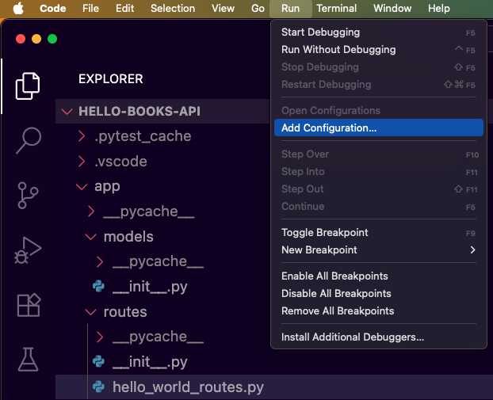
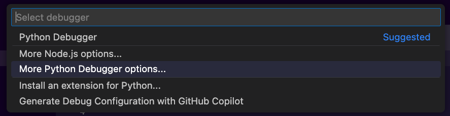
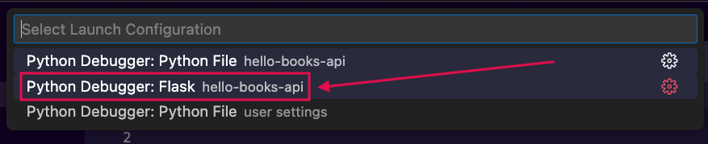
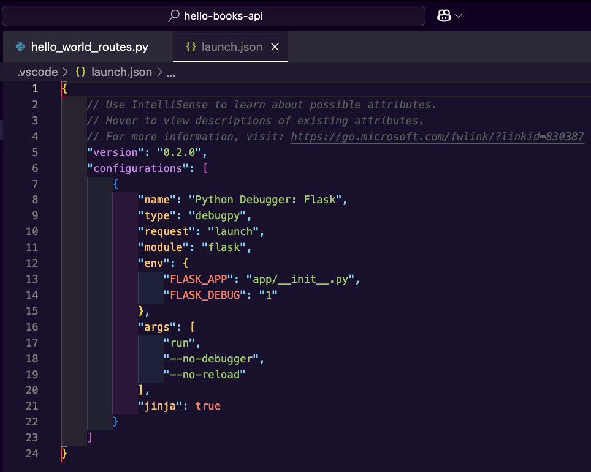
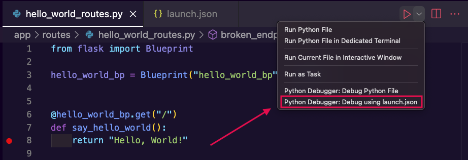
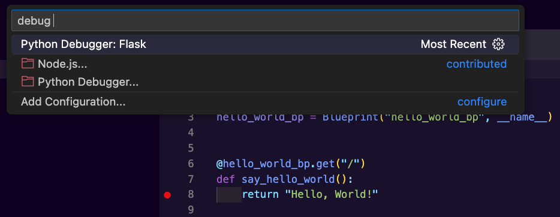
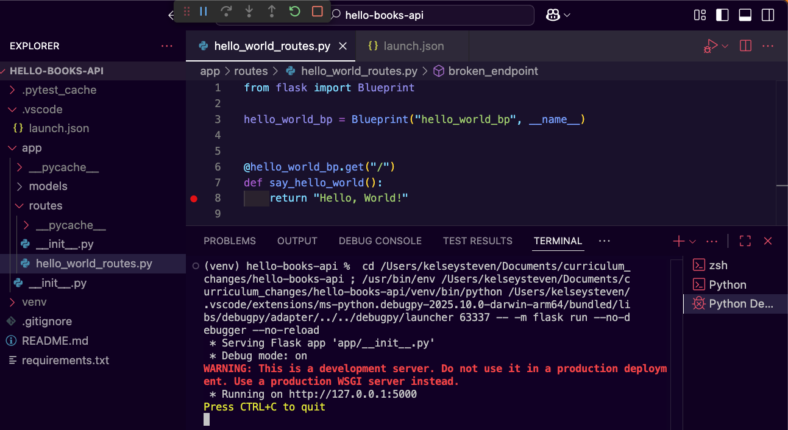

# Debugging a Flask Application

To set breakpoints and debug a Flask app without tests we need to:
1. Create a debug launch configuration for a Flask application in VS Code
2. Run the app using the new launch configuration
3. Add breakpoints
4. Use Postman to execute the endpoints where we've added our breakpoints

This guide will cover the first 2 steps to get us up and running!

## Debugging Flask Requires Additional Configuration

Let's think back to when we started using tests to debug our code. A common place we ran into trouble was if we tried to debug our tests directly using the Run and Debug panel. Because of the typical way our tests import our project code, doing so usually resulted in an error—an `ImportError`. In fact, we would have seen the same import error if we had tried to run our test file in the terminal using a command like `python tests/test_file.py`. To properly run our tests, we didn't run the `python` command, we ran `pytest`.

When debugging, this meant that we couldn't use the Play button—even though it appears in several places in VS Code—to start debugging our tests. Instead, we needed VS Code to start the debugger on our tests in a similar way to how `pytest` starts our tests in the terminal. To do this, we debugged our tests through the Test Explorer panel.

We find ourselves in a similar situation if we try to debug a Flask application. When we run our Flask application, we don't use a command like `python app/__init__.py`. Instead, we start our Flask application with the `flask` command (sometimes with additional arguments).

So in a similar fashion to how we needed to figure out the VS Code debugging equivalent of running `pytest`, we now need to figure out the VS Code debugging equivalent of running `flask`.

- To do so, we'll have VS Code help us generate a `launch.json` file that instructs VS Code to start up our Flask application in debug mode.

## Create a Debug Launch Configuration

1. To create a new launch configuration in VS Code, press the "Run" menu at the top of the screen and choose the option "Add Configuration".
    
    _Fig. VS Code's UI showing the `Run` menu with the `Add Configuration` option highlighted. ([Full size image](assets/debug_flask_without_tests/add_config_1_vscode_run_add_configuration.png))_

2. In the new menu that appears, select "More Python Debugger options...".
    
    _Fig. VS Code's UI showing a dropdown from the code window that has the option "More Python Debugger options..." highlighted. ([Full size image](assets/debug_flask_without_tests/add_config_2_more_python_options.png))_

3. A new menu will appear, and we want to press the option: "Python Debugger: Flask hello-books-api".
    
    _Fig. VS Code's UI showing a dropdown from the code window with the option "Python Debugger: Flask hello-books-api" highlighted. ([Full size image](assets/debug_flask_without_tests/add_config_3_python_debugger_flask.png))_

4. After step 3, we will be shown a new file with the `launch.json` that VS Code generated for us. We can safely close this file once it is created.
    
    _Fig. The generated `launch.json` file. ([Full size image](assets/debug_flask_without_tests/add_config_4_generated_flask_debug_configuration.png))_

    The full text of the `launch.json` file we generated is below:
    ```py
    {
        // Use IntelliSense to learn about possible attributes.
        // Hover to view descriptions of existing attributes.
        // For more information, visit: https://go.microsoft.com/fwlink/?linkid=830387
        "version": "0.2.0",
        "configurations": [
            {
                "name": "Python Debugger: Flask",
                "type": "debugpy",
                "request": "launch",
                "module": "flask",
                "env": {
                    "FLASK_APP": "app/__init__.py",
                    "FLASK_DEBUG": "1"
                },
                "args": [
                    "run",
                    "--no-debugger",
                    "--no-reload"
                ],
                "jinja": true
            }
        ]
    }
    ```

## Run the App Using the Launch Configuration

Now that we have a `launch.json` file that tells VS Code how to start our application, we need to tell VS Code to use that configuration when we want to debug.

1. Press the arrow next to the triangular "Run" button at the top right of the code window to show a menu of options for running the code. Select the option "Python Debugger: Debug using launch.json".
    
    _Fig. A code window's "Run Python File" menu open with the option "Python Debugger: Debug using launch.json" highlighted. ([Full size image](assets/debug_flask_without_tests/run_app_1_run_and_debug_options.png))_

2. In the drop down that appears, click "Python Debugger: Flask".
    
    _Fig. VS Code UI showing a drop down menu with the option "Python Debugger: Flask" highlighted. ([Full size image](assets/debug_flask_without_tests/run_app_2_choose_python_debugger_flask.png))_

At this point VS Code should start running the application in debug mode in a terminal. 

_Fig. VS Code with the debug UI at the top of the window and the Flask application running in a terminal. ([Full size image](assets/debug_flask_without_tests/run_app_3_flask_app_running_in_debug_with_breakpoint.png))_

From here we can set breakpoints in our route functions, then use Postman to send requests to trigger the endpoints we want to debug!

A great way to think about where to place a breakpoint is to consider where we might like to place a `print()` statement, then place a breakpoint there instead.

We must also remember that it's not enough to just start the debugger, even after setting breakpoints. In order for the debugger to be able to stop at a breakpoint, we need to trigger the code with the breakpoint to actually run. When Flask is started under the debugger, all it does is wait for incoming requests, the same as when we run `flask` from the terminal. This is why we need to use Postman to send a request. The incoming request will cause the related endpoint function to run, allowing any breakpoints we set in that endpoint (or other code called from that endpoint) to be triggered.

## Summary

While we will often prefer to debug our Flask applications by using our tests to exercise our code, there are additional concerns around writing Flask tests that mean we're not yet ready to tackle writing Flask tests. In the meantime, if we run into problems with our Flask application that we're finding challenging to investigate with non-debugger approaches (such as visually inspecting our code, reviewing the logs, or rubber ducking), it's possible to set up VS Code to be able to debug our Flask application.

To debug our Flask application with VS Code, we
1. Create a Launch Configuration to tell VS Code how to start our Flask application.
2. Start the debugger using the Flask Launch Configuration.
3. Place breakpoints in our code at points of interest.
4. Send requests to the Flask application using Postman that will cause the code with the breakpoints to run.