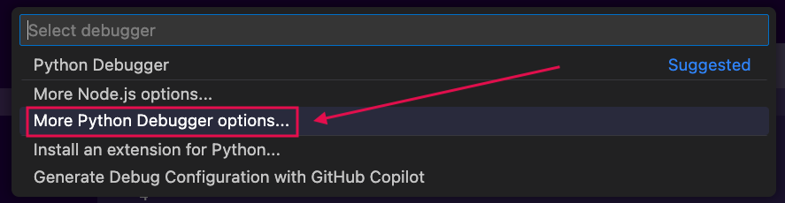
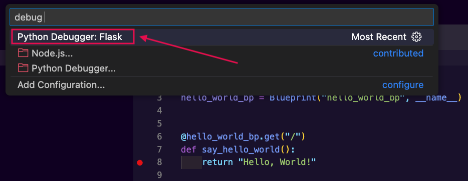

# Debugging a Flask Application

To set breakpoints and debug a Flask app without tests we need to:
1. Create a debug launch configuration for a Flask application in VS Code
2. Run the app using the new launch configuration
3. Add breakpoints
4. Use postman to hit the endpoints where we've added our breakpoints

This guide will cover the first 2 steps to get us up and running!

## Create a Debug Launch Configuration

We need a way to tell VS Code to launch our Flask app in debug mode rather than trying to run a routes file as a standalone Python file. 
- To do so, we'll have VS Code help us generate a `launch.json` file that instructs VS Code to start up our app in debug mode.

1. To create a new launch configuration in VS Code, press the "Run" menu at the top of the screen and choose the option "Add Configuration".
    
    _Fig. VS Code's UI showing the `Run` menu with the `Add Configuration` option highlighted. ([Full size image](assets/debug_flask_without_tests/add_config_1_vscode_run_add_configuration.png))_

2. In the new menu that appears, select "More Python Debugger options...".
    
    _Fig. VS Code's UI showing a dropdown from the code window that has the option "More Python Debugger options..." highlighted. ([Full size image](assets/debug_flask_without_tests/add_config_2_more_python_options.png))_

3. A new menu will appear, and we want to press the option: "Python Debugger: Flask hello-books-api".
    
    _Fig. VS Code's UI showing a dropdown from the code window with the option "Python Debugger: Flask hello-books-api" highlighted. ([Full size image](assets/debug_flask_without_tests/add_config_3_python_debugger_flask.png))_

4. After step 3, we will be shown a new file with the launch.json that VS Code generated for us. We can safely close this file once it is created.
    
    _Fig. The generated launch.json file. ([Full size image](assets/debug_flask_without_tests/add_config_4_generated_flask_debug_configuration.png))_

    The full text of the launch.json file we generated is below:
    ```py
    {
        // Use IntelliSense to learn about possible attributes.
        // Hover to view descriptions of existing attributes.
        // For more information, visit: https://go.microsoft.com/fwlink/?linkid=830387
        "version": "0.2.0",
        "configurations": [
            {
                "name": "Python Debugger: Flask",
                "type": "debugpy",
                "request": "launch",
                "module": "flask",
                "env": {
                    "FLASK_APP": "app/__init__.py",
                    "FLASK_DEBUG": "1"
                },
                "args": [
                    "run",
                    "--no-debugger",
                    "--no-reload"
                ],
                "jinja": true
            }
        ]
    }
    ```

## Run the App Using the Launch Configuration

Now that we have a `launch.json` file that tells VS Code how to start our application, we need to tell VS Code to use that configuration when we want to debug.

1. Press the arrow next to the triangular "Run" button at the top right of the code window to show a menu of options for running the code. Select the option "Python Debugger: Debug using launch.json".
    
    _Fig. A code window's "Run Python File" menu open with the option "Python Debugger: Debug using launch.json" highlighted. ([Full size image](assets/debug_flask_without_tests/run_app_1_run_and_debug_options.png))_

2. In the drop down that appears, click "Python Debugger: Flask".
    
    _Fig. VS Code UI showing a drop down menu with the option "Python Debugger: Flask" highlighted. ([Full size image](assets/debug_flask_without_tests/run_app_2_choose_python_debugger_flask.png))_

At this point VS Code should start running the application in debug mode in a terminal. 

_Fig. VS Code with the debug UI at the top of the window and the Flask application running in a terminal. ([Full size image](assets/debug_flask_without_tests/run_app_3_flask_app_running_in_debug_with_breakpoint.png))_

From here we can set breakpoints in our route functions then use Postman to send requests to trigger the endpoints we want to debug!