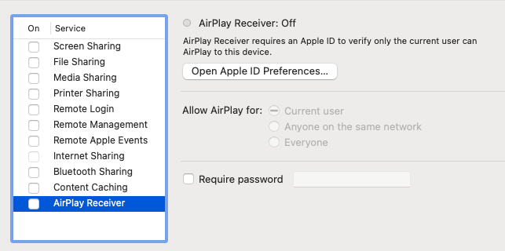

# Flask Setup

<!-- FLASK UPDATE -->
<!-- <iframe src="https://adaacademy.hosted.panopto.com/Panopto/Pages/Embed.aspx?pid=f6e8d4bc-f9d7-4630-94b9-ad10005ccdd8&autoplay=false&offerviewer=true&showtitle=true&showbrand=false&start=0&interactivity=all" height="405" width="720" style="border: 1px solid #464646;" allowfullscreen allow="autoplay"></iframe> -->

## Goals

The goal of this lesson is to introduce the setup steps for a Flask project, and pair each setup step with any commands or instructions that must be run.

We will:

1. Clone our repo
1. Manage our dependencies
1. Create the Flask project directory structure
1. Write code to implement the Flask server start-up
1. Run, stop, and restart a Flask server
1. Read the server logs

## Branches

| Starting Branch | Ending Branch|
|--|--|
|`01a-intro-to-flask` |`01b-flask-setup`|

## Flask Projects are Python Projects

As we start writing APIs, we should remember that Flask projects are themselves Python projects. Like any other Python project, we need to manage the packages our project depends on—its dependencies. Like other Python projects, we handle this by creating a `venv` in which to install the packages described in the `requirements.txt` file. Let's briefly review the steps we take to perform this setup.

### Virtual Environment

We have been using virtual environments for a bit now, starting with our prior project work. We will present a brief review here, but we can always return to the previous material to refresh our memories about why we use virtual environments.

At the very beginning of a Python project, we will either:

1. Clone the project repo onto our machine, which creates a project folder
1. Create a new, empty project folder

Once we `cd` into the project folder, we can create a virtual environment. To make a conventional virtual environment named `venv`, we can use the following command:

```
$ python3 -m venv venv
```

We can activate and deactivate this virtual environment with these commands:

```bash
### Activate ###
$ source venv/bin/activate
(venv) $
(venv) $ # should see (venv) now

### Deactivate ###
(venv) $ deactivate
$
$ # should stop seeing (venv)
```

### `requirements.txt`

Python projects conventionally record all of their project dependencies in a file named `requirements.txt`.

These files list the exact packages and their version numbers to download and install into this environment.

Here is a sample `requirements.txt` for a Flask project:

```
alembic==1.13.1
blinker==1.7.0
click==8.1.7
Flask==3.0.2
Flask-Migrate==4.0.5
Flask-SQLAlchemy==3.1.1
greenlet==3.0.3
iniconfig==2.0.0
itsdangerous==2.1.2
Jinja2==3.1.3
Mako==1.3.2
MarkupSafe==2.1.5
packaging==23.2
pluggy==1.4.0
psycopg2-binary==2.9.9
pytest==8.0.0
python-dotenv==1.0.1
SQLAlchemy==2.0.25
typing_extensions==4.9.0
Werkzeug==3.0.1
```

At the beginning of the project, or after any updates to this file, we install all dependencies with:

```bash
(venv) $ pip install -r requirements.txt
```

If we've introduced a new dependency into this project, we should update our `requirements.txt` file. This way, our team members can also learn which exact packages are required now.

To update the `requirements.txt` file, we use this command:

```bash
(venv) $ pip freeze > requirements.txt
```

### !callout-info

## No need to manually edit the requirements.txt file

Because we can use the above command to ask `pip` to update our `requirements.txt` file, we generally do not need to open up the file and edit it directly.

</br>

Exceptions to this rule can occur when configuration issues arise.

</br>

One such common configuration issue may be needing to change the version of `psycopg2-binary` as described below in the section on common installation failures and debugging.

### !end-callout

### !callout-info

### Sometimes Requirements Fail to Install

System configurations vary, and sometimes the requirements installation step may fail. We should feel confident to use a search engine to research particular errors that we encounter, and to reach out for additional assistance as needed. We can expand the section below for some commonly-reported commands that have helped others in the past.

### !end-callout

<details>
   <summary>Expand for common installation failures and debugging</summary>


   ### !callout-warning

   ### Common Debugging: Upgrade `pip`

   A common installation error may be solved by executing `$ pip install --upgrade pip`. Afterwards, attempt `$ pip install -r requirements.txt` again. 

   ### !end-callout

   ### !callout-warning

   ### Common Debugging: Upgrade `setuptools`

   A common installation error may be solved by executing `$ pip install --upgrade setuptools`. Afterwards, attempt `$ pip install -r requirements.txt` again.

   ### !end-callout

   ### !callout-warning

   ## Common Debugging: Install Xcode Command Line Tools

   A common installation error may be solved by executing `$ xcode-select --install`. Afterwards, attempt `$ pip install -r requirements.txt` again.

   ### !end-callout


   ### !callout-warning

   ## M1 Macs & SQL Alchemy

   Some M1 Macs have trouble installing SQLAlchemy dependencies when running `pip3 install -r requirements.txt`. If you encounter an error referencing `psycopg2`, you can try following [these instructions](./m1-mac-psycopg2-fix.resource.md)

   ### !end-callout

</details>

## Project Structure

When we work on Flask projects, there could be anywhere from one file, to hundreds of files and folders.

The place we put our code that defines endpoints will **depend on the project**.

### !callout-warning

## Every Project Structure is Different

Flask does not enforce one specific file and folder structure. We'll have to go exploring to figure out where to put our code for each project.

### !end-callout

This curriculum provides a suggested project structure and location:

```
.
├── app
│   ├── models
│   │   └── __init__.py
│   ├── __init__.py
│   └── routes
│       └── __init__.py
├── README.md
└── requirements.txt
```

### Routes

The `app/routes` directory will be responsible for holding our routes. We should organize our routes so that all the routes corresponding to a particular model will be written in a single file. For example, all the endpoints related to the `Book` model would be written in a file called `book_routes.py`.

### Models

The `app/models` directory will be responsible for holding our data models. Data models will be discussed further in the curriculum.

### The `app/__init__.py` File

Inside each `app` folder, there will be a file named `__init__.py`. This is the same file we have used to mark a folder as a package! While we often leave this file blank, a common Flask pattern is to define the start-up logic for the Flask server in this file.

The start-up logic is responsible for locating and applying any app configuration, and getting the server ready to receive requests.

To get started, we will include the following code in `__init__.py`. This is the starting, boilerplate code to start a Flask application. Follow your curiosity if you would like to learn more about [`create_app`](https://flask.palletsprojects.com/en/3.0.x/patterns/appfactories/)

```python
from flask import Flask

def create_app():
    app = Flask(__name__)

    return app
```

### !callout-danger

## Changing Configurations is Rare

Developers don't need to fuss with configurations that often. Usually, when setting up a project, we will refer to a previous working project to make sure the new one is configured appropriately.

<br />

We should try to become familiar with the kinds of settings we might want to configure in our app. Overall it's more important to know _where_ configuration _changes_ are made, rather than being able to write fresh configurations from scratch.

### !end-callout

## Running, Stopping, and Restarting the Server

Building an API means that we're building a web server. A web server needs to be _running_ in order to be accessible to clients. Running a web server makes it available to respond to HTTP requests at a particular _address_ and _port_.

### !callout-secondary

## Address and Port Are Like Street Address and Apartment

Any service listening for network requests listens at a particular _address_ and a particular _port_. The _address_ can be thought of as like a street address, while the _port_ is more like an apartment number. If we send a letter to our friend Kerry, who lives in an apartment building, we need both the street address of the building itself, as well as their apartment number in the building. If we send a letter to the wrong building, Kerry won't receive it. If we send the letter to the wrong apartment number, Kerry still won't receive it (their neighbors are jerks and won't drop it off at their door).

<br />

Likewise, if we send a network request to the wrong address, then it won't reach the proper machine. If we send it to the wrong port, it still won't reach the web server. We need to know the address and port to make sure our request reaches the web server.

### !end-callout

### Running the Server

When a server starts running, it performs its startup routine, which often includes reading configuration files, changing settings, and connecting to any required resources.

To run a Flask server, we run this command:

```bash
(venv) $ flask run
```

To run a Flask server in Debug mode so that we don't need to restart the server after each change, we run this command:

```bash
(venv) flask run --debug
```

### !callout-info

## Default Flask Server URL is `localhost:5000`

By default, running Flask servers will be available on `localhost:5000`. `localhost` acts as the address and `5000` is the port. They are separated by a colon. Our clients will send HTTP requests to `http://localhost:5000`.

<br />

`localhost` is a special name used to refer to the local computer itself. We may also see the local computer referred to as `127.0.0.1`, which is called an _IP address_. `localhost` and `127.0.0.1` mean the same thing: the local computer itself!

### !end-callout

Once we start running a server, the current Terminal tab begins to _tail_ the server logs. The server will log status updates about the server's operations.

In order for us to run terminal commands like `git`, we'll need to open an additional Terminal window or tab, or stop the server.

### Stopping the Server

When we stop a server, the server runs its shut down operations. Once complete, it will no longer be available to handle requests until we start it again.

To stop a Flask server:

1. Return to the Terminal tab or window that is running the server
1. Press `ctrl` + `c`

<br />

<details style="max-width: 700px; margin: auto;">

   <summary>
      Sometimes the server gets stuck. What do we do in that case?
   </summary>

If something goes wrong when shutting down the server, or if the Terminal where the server was running is somehow closed without stopping the server, the server may not release the address and port where it was running. If that happens, a new server will not be able to run using that address and port, and will fail to start. This may be reported with an error message resembling: 

```bash
Address already in use
Port 5000 is in use by another program. Either identify and stop that program, or start the server with a different port.
On macOS, try disabling the 'AirPlay Receiver' service from System Preferences -> Sharing.
```

If we know that we have not started the Flask server then we should check that the AirPlay Receiver is disabled like the Terminal output suggests. If it is enabled, we should disable it so that our computer can use port 5000 for running the Flask server. 



_Fig. Screenshot of System Preferences showing the AirPlay Receiver is disabled._

#### One Debugging Strategy

To locate another server using port 5000, which Flask wants to use, we can run `lsof -i:5000`. This will produce output similar to

```
COMMAND   PID  USER   FD   TYPE             DEVICE SIZE/OFF NODE NAME
Python  31756  user    3u  IPv4 0x92416cca3d5db1fb      0t0  TCP localhost:commplex-main (LISTEN)
```

We can use the number labelled as `PID` (Process Identifier) to terminate the other running server with the command `kill -9 31756`, where we would replace `31756` with the `PID` value we got from running `lsof`.

</details>

### "Restarting" the Server

"Restarting the server" usually means stopping and starting the server again.

## Reading the Server Logs

We can use the server logs to debug our server code. After we run `flask run` from the terminal to start the server, any error messages that our server needs to communicate will be printed in that terminal window.

These are the logs immediately after a `GET` request to `localhost:5000/i-didnt-define-this-endpoint-in-my-server-code`, which produced a `404` response.


_Fig. Screenshot of Terminal which includes Flask server startup messages and the output from two web requests._

Note that all `GET` requests at this stage will produce a `404` response because we have not defined any endpoints. If we want to try this out ourselves, we should start our server with `flask run` and then use our browser or Postman to make a GET request to `http://localhost:5000/i-didnt-define-this-endpoint-in-my-server-code`. After sending the request, we can look at our Terminal and see that we get a `404` response. 

## Dev Workflow

Our dev workflow for Flask development may now look like this:

1. `cd` into a project root folder
1. Activate a virtual environment
1. Check git status
1. Start the server
1. Cycle frequently between:
   1. Writing code
   1. Checking git statuses and making git commits
   1. Debugging with Postman, server logs, VS Code, and more
1. Stop the server
1. Deactivate the virtual environment

## Check for Understanding

<!-- Question 1 -->
<!-- prettier-ignore-start -->
### !challenge
* type: ordering
* id: Lg4wGD
* title: Flask Setup
##### !question

Arrange the options below so that they match these terms in this order:

1. Command to create a virtual environment
1. Command to install the project's dependencies
1. Command to start running the Flask server

##### !end-question
##### !answer

1. `$ python3 -m venv venv`
1. `$ pip install -r requirements.txt`
1. `$ flask run`

##### !end-answer
### !end-challenge
<!-- prettier-ignore-end -->

<!-- Question 2 -->
<!-- prettier-ignore-start -->
### !challenge
* type: ordering
* id: kzm8zw
* title: Flask Setup
##### !question

Arrange the options below so that they match these terms in this order:

1. The location where clients should send HTTP requests, for a default Flask server
1. The location where the server logs print
1. The location for Python code that defines routes and configuration

##### !end-question
##### !answer

1. `localhost:5000`
1. Terminal
1. It depends on the project

##### !end-answer
### !end-challenge
<!-- prettier-ignore-end -->