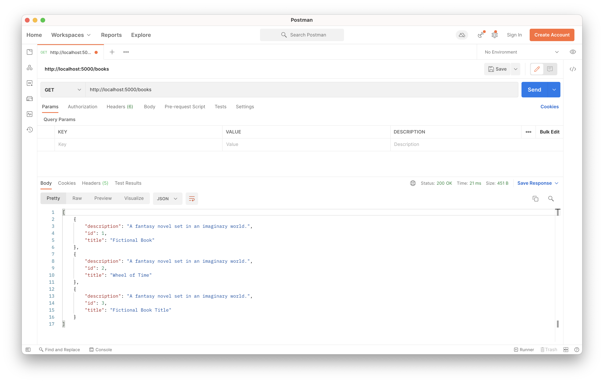

# Read All Books Endpoint

<iframe src="https://adaacademy.hosted.panopto.com/Panopto/Pages/Embed.aspx?pid=a2eab4ad-e56b-4d32-8f1b-ae690173abc5&autoplay=false&offerviewer=true&showtitle=true&showbrand=true&captions=true&interactivity=all" height="405" width="720" style="border: 1px solid #464646;" allowfullscreen allow="autoplay"></iframe>

## Goals

Our goal for this lesson is to learn how define routes that read data.

In this lesson we will build our Hello Books API to fulfill the following feature:

1. As a client, I want to send a request to get all existing books, so that I can see a list of books, with their `id`, `title`, and `description` of the book.

## Branches

| Starting Branch | Ending Branch|
|--|--|
|`01c-hello-world` |`01d-read-all-books`|

## Getting All Books Endpoint: Preparation

Let's consider how to implement this feature:

> As a client, I want to send a request to get all existing books, so that I can see a list of books, with their `id`, `title`, and `description` of the book.

### Data

Soon we will create and manipulate data in a SQL database. We will then learn how to create an manipulate this data through a connection with our API built in Flask. Until then, we will hard code data in our app using data structures we have already learned about.

Let's represent our data as a list of Book instances. The Book class should have the attributes `id`, `title`, and `description`.

We need to make a `Book` class, and then instantiate multiple instances.

Let's write this code in `routes.py`. 

Give it a try, then review our code below.

```python
#routes.py

class Book:
    def __init__(self, id, title, description):
        self.id = id
        self.title = title
        self.description = description

books = [
    Book(1, "Fictional Book Title", "A fantasy novel set in an imaginary world."),
    Book(2, "Fictional Book Title", "A fantasy novel set in an imaginary world."),
    Book(3, "Fictional Book Title", "A fantasy novel set in an imaginary world.")
] 
```

| <div style="min-width:290px;"> Piece of Code </div>   | Notes                                                                                                                                                                                                                                                                                                       |
| ----------------------------------------------------- | ----------------------------------------------------------------------------------------------------------------------------------------------------------------------------------------------------------------------------------------------------------------------------------------------------------- 
| `class Book ...`   | Book class to represent hardcoded book data |
| `books = [...]`   | List of instances of the Book class that serve that as hardcoded data |


### Planning HTTP Requests, Responses, and Logic

Let's think about the typical HTTP verb and endpoint used for requests that retrieve all records of a particular resource. 

Recall that for requests that read records, it is typical to use a `GET` request to the `/books` path. 

| HTTP Method | Endpoint |
| ----------- | -------- |
| `GET`       | `/books` |

`GET` requests do not include a request body, so no additional planning around the request body is needed.

The response we want to send back is a list of JSON objects (dictionaries) with `id`, `title`, and `description`.

The most appropriate successful response status code is `200 OK`.

| Response Status | Response Body                                                                                              |
| --------------- | ---------------------------------------------------------------------------------------------------------- |
| `200 OK`        | `[{"id": 1, "title": "Fictional Book Title", "description": "A fantasy novel set in an imaginary world"}, {"id": 2, "title": "Fictional Book Title", "description": "A fantasy novel set in an imaginary world"}, {"id": 3, "title": "Fictional Book Title", "description": "A fantasy novel set in an imaginary world"}]` |

Now that we have an idea of what our endpoint should look like, we can turn our attention to how to implement it.

Our endpoint will need to:

1. Retrieve all of the books data.
1. Format the list of Book instances into the appropriate JSON data structure (list of dictionaries, where each dictionary has `id`, `title`, and `description`)
1. Send back a response

### Dependencies

To make this feature, we'll work with the following objects, types, and functions:

- `Blueprint`
- `jsonify`

#### Revisiting `Blueprint` from Flask

We will continue to use `Blueprint` in our `routes.py` file. We will use Blueprints to create a group of related routes (endpoints). In our example, we'll create a group of related `books` routes. `Blueprint` provides an optional parameter `url_prefix`. By setting the `url_prefix` value to `"/books"`, all endpoints that use the `books_bp` Blueprint will start with `\books`. 

In `routes.py`, let's add this line:

```python
#routes.py
...

books_bp = Blueprint("books", __name__, url_prefix="/books")
```

| <div style="min-width:290px;"> Piece of Code </div>   | Notes                                                                                                                                                                                                                                                                                                       |
| ----------------------------------------------------- | ----------------------------------------------------------------------------------------------------------------------------------------------------------------------------------------------------------------------------------------------------------------------------------------------------------- 
| `books_bp = Blueprint("books", __name__, url_prefix="/books")`        | Our `Blueprint` instance. We'll use it to group routes that start with `/books`. `"books"` is the debugging name for this `Blueprint`. `__name__` provides information the blueprint uses for certain aspects of routing. We should use this blueprint for all of our RESTful routes that start with `/books`! 

### Registering a Blueprint

Now that we have defined our `books_bp` blueprint, Flask requires us to "register the blueprint" with our `app`.

Let's return to the code in `app/__init__.py`. Inside our `create_app` let's add two lines to register our `books_bp` Blueprint inside the `create_app` function:

```python
def create_app():
    app = Flask(__name__)

    from .routes import books_bp
    app.register_blueprint(books_bp)

    return app
```

Again, these lines make it so that our `Blueprint` is recognized by our Flask `app`. We need to do this step each time we make a new `Blueprint`.

Note that we can add new routes to an existing `Blueprint` without further changes to our `app`. Once a `Blueprint` has been registered, all routes added to that `Blueprint` will be recognized.

### Working with `jsonify` from Flask

We need to import something named `jsonify` from `flask`.

```python
#routes.py

from flask import Blueprint, jsonify
```

| <div style="min-width:290px;"> Piece of Code </div>   | Notes                                                                                                                                                                                                                                                                                                       |
| ----------------------------------------------------- | ----------------------------------------------------------------------------------------------------------------------------------------------------------------------------------------------------------------------------------------------------------------------------------------------------------- 
| `from flask import Blueprint, jsonify` | We need to import our dependencies. Python supports comma-separated importing.

`jsonify` is a Flask utility function that turns its argument into JSON. We'll use `jsonify` as a way to turn a list of book dictionaries into a `Response` object.

For additional details about `jsonify`, we can refer to:

- [Flask's definition of `jsonify`](https://flask.palletsprojects.com/en/1.1.x/api/#flask.json.jsonify)

## Getting All Books Endpoint: Code

Let's create a route function `handle_books` in `routes.py` to include support for retrieving all our data.

```python
#routes.py

from flask import Blueprint, jsonify

class Book:
    def __init__(self, id, title, description):
        self.id = id
        self.title = title
        self.description = description

books = [
    Book(1, "Fictional Book Title", "A fantasy novel set in an imaginary world."),
    Book(2, "Fictional Book Title", "A fantasy novel set in an imaginary world."),
    Book(3, "Fictional Book Title", "A fantasy novel set in an imaginary world.")
] 

books_bp = Blueprint("books", __name__, url_prefix="/books")

@books_bp.route("", methods=["GET"])
def handle_books():
    books_response = []
    for book in books:
        books_response.append({
            "id": book.id,
            "title": book.title,
            "description": book.description
        })
    return jsonify(books_response)
```


| <div style="min-width:290px;"> Piece of Code </div>   | Notes                                                                                                                                                                                                                                                                                                       |
| ----------------------------------------------------- | ----------------------------------------------------------------------------------------------------------------------------------------------------------------------------------------------------------------------------------------------------------------------------------------------------------- 
| `@books_bp.route("", methods=["GET"])`               | A decorator that uses the `books_bp` Blueprint to define an endpoint and accepted HTTP method. The following function will execute whenever a matching HTTP request is received.                                                                                                                            |
| `def handle_books():`                                 | This function will execute whenever a request that matches the decorator is received. The name of this function doesn't affect how requests are routed to this method. Common choices for a function name could include matching the route path, or using any other good, descriptive Python function name. |
| `books = ...`                                       | We store the list of `Book` instances in the variable `books` |
| `for book in books:`                                | We iterate over all books in `books` so we can collect their data and format it into a response                                                                                                                                                          |
| `books_response.append( ... )`                      | We will use the `books_response` list to hold book dictionaries                                                                                                                                                                                          |
| `{ "id": book["id"], ... }`                            | This is the format of dictionary we want to send back. We'll insert the values based on the `book` we're iterating on.                                                                                                    |
| `jsonify(books_response)`                           | `books_response` contains a list of book dictionaries. To turn it into a `Response` object, we pass it into `jsonify()`. This will be our common practice when returning a list of something. When we are returning strings or dictionaries, we can use `make_response`, which we will learn about later. |
| `return ...`                                        | We must return our response. By default, a response with no specified status code returns `200 OK`                                                                                                                                                       |

### !callout-info

## `Blueprint`s and Routes are Sensitive to `/`

Be sure to specify that this endpoint is `""`. When combined with the `book_bp`'s `url_prefix`, `"/books"`, we see this endpoint is a `GET` to `/books`. URIs are sensitive to the use of `/` and Flask will throw an error if we define this route as `"/"` but try to access it as `/books`. A URI ending in `/` is different from a URI that _doesn't_ end in `/`, so we should use `""`.

<br/>

<details>

<summary>Is there a way to declare "/" as a valid route path?</summary>

For a little more flexibility, we _could_ choose to use `"/"` as the route path and include the keyword argument `strict_slashes=False`. This tells the route to treat a URI the same whether or not it ends in `/`. Accepting either variation can make using our API a little easier for our clients.

</details>

### !end-callout

### Manually Testing with Postman

Let's test this request:

- Set the method to `GET`
- Keep the request URL at `localhost:5000/books`



### !callout-info

## Remember to Debug with All of the Tools!

Remember to use all debugging tools:

- Postman
- VS Code
- Peers, classmates, and rubber ducks

### !end-callout

<!-- prettier-ignore-start -->
### !challenge
* type: tasklist
* id: f6e59db1-edbc-40e1-af4e-f8b326899df9
* title: Create and Read, Getting All Books Endpoint
##### !question

Think about the "Getting All Books Endpoint."

Check off all the topics that we've briefly touched on so far.

##### !end-question
##### !options

* Planned the HTTP response, request, and logic for this endpoint
* Created hardcoded book data `books`
* Briefly considered `Blueprint`
* Briefly considered `jsonify`
* Registered a new `Blueprint` with `app`
* Defined a new `Blueprint` named `books_bp`, which has a `url_prefix` of `"/books"`
* Created a new endpoint that catches requests going to `""` (assumed `"/books"`) with the HTTP method `GET`
* Iterated through `books`
* Created a list of Book dictionaries in `books_response`
* Used `jsonify` with `jsonify(books_response)`
* Returned this JSON list with the status code `200 OK`
* Tested this request in Postman

##### !end-options
### !end-challenge
<!-- prettier-ignore-end -->
