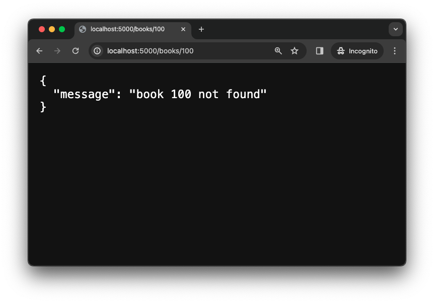
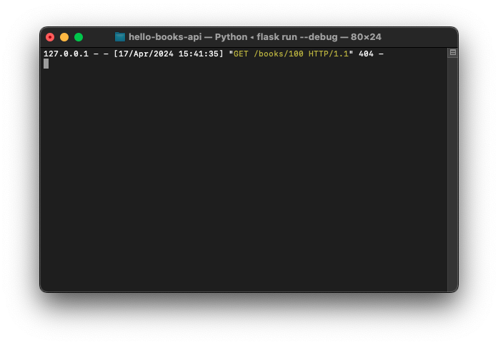

# Error Handling

<!-- FLASK UPDATE -->
<!--
<iframe src="https://adaacademy.hosted.panopto.com/Panopto/Pages/Embed.aspx?pid=2fdeb749-36d1-43a2-9b9d-ae670124405e&autoplay=false&offerviewer=true&showtitle=true&showbrand=true&captions=true&interactivity=all" height="405" width="720" style="border: 1px solid #464646;" allowfullscreen allow="autoplay"></iframe>
-->

## Goals

Our goal for this lesson is to learn how to handle errors for the `GET`&nbsp;`/books/<book_id>` route.

In this lesson we will extend our Hello Books API to handle the following error cases for the RESTful route `GET` `/books/<book_id>`:

1. If no `book` record matches the `book_id`, the server will return a `404` response code with a message indicating that there are no `book`s with `book_id`.
1. If `book_id` is not of type `int`, the server will return a `400` response code with a message indicating `book_id` is invalid.

## Branches

| Starting Branch     | Ending Branch |
| ------------------- | ------------- |
| `02a-read-one-book` | `02b-404`     |

<details>
   <summary>Expand to see the features <code>Hello Books API</code> should have before this lesson</summary>

- The `GET` `/books` route should be defined
- The `GET` `/books/<book_id>` route should be defined

</details>
<br>

## Handling a non-existing book

Let's examine the error we receive for a `GET` request to `/books/100`, a non-existing book, in our browser.

  
*Fig. Error displayed by Flask in Debug mode when accessing non-existing book. ([Original Image](../assets/api-2-read-error/404_view_function_did_not_return_a_valid_response.png))*

### !callout-info

## Error Details Appear Only in Debug Mode

If your browser displays a generic error message like `Internal Server Error` instead of the detailed error message shown above, stop your Flask server with `⌃C` (`Ctrl+C`), then restart it in debug mode with the command

<br />

`flask run --debug`

### !end-callout

We received an error message that should resemble the following.

> TypeError: The view function for 'books_bp.get_one_book' did not return a valid response. The function either returned None or ended without a return statement.

Reviewing the error message, we can see that the error is a `TypeError`. This alone doesn't tell us much, but the next part of the error message is more informative. The error message states that the view function for `books_bp.get_one_book` did not return a valid response. Specifically, it either returned `None` or ended without a return statement (in which case, Python still behaves as though the function returned `None`).

This is really helpful information! From the error message, we know that we should take a look at the `get_one_book` function that we registered on the `books_bp` blueprint. Here's our code:

```python
@books_bp.get("/<book_id>")
def get_one_book(book_id):
    book_id = int(book_id)
    for book in books:
        if book.id == book_id:
            return {
                "id": book.id,
                "title": book.title,
                "description": book.description,
            }
```

There is a single explicit `return` in this function, but we only reach it if the condition `book.id == book_id` is `True`. That is, we need to find a book with a matching ID in order for the `return` to execute. If we never find a book with a matching ID, the loop will complete without returning anything. As we know, in Python, a function that completes without an explicit `return` statement behaves like it returned `None`.

### Handling a non-existing book: Preparation

To handle this scenario, we should return a response with a response body indicating that the book with `book_id` was not found and a `404` response code, which is the standard code to indicate that a resource was not found.

<!-- prettier-ignore-start -->
| Endpoint Detail | Notes |
| ------- | ------- |
| Request | `GET /books/100` |
| Response Status | `404 Not Found` |
| Response Body | `{"message" : "book 100 not found"}` |
<!-- prettier-ignore-end -->

### Handling a non-existing book: Code

When we return a dictionary value to be converted to JSON, Flask will automatically set the response code to `200`. Flask provides a few ways to set a different response code. For basic cases, Flask lets us return a tuple containing a response body dictionary and a response code.

So to return a `404` response if the loop completes without returning, we can add a `return` statement after the loop like this:

```python
    return {"message":f"book {book_id} not found"}, 404
```

<!-- prettier-ignore-start -->
| Piece of Code | Notes |
| ------------- | ----- |
| `return ..., ...` | The comma means that this is returning a `tuple` of two values. Remember that it's not parentheses that make a `tuple` literal, but rather a comma. |
| `{"message":`&ZeroWidthSpace;`f"book {book_id} not found"}` | The first value in the `tuple`, `{"message":f"book {book_id} not found"}`, is the dictionary that will become the `JSON` response body. |
| `404` | The second value in the `tuple`, `404`, is the response code. |
<!-- prettier-ignore-end -->

<details>
    <summary>Expand to see the complete <code>get_one_book(book_id)</code> function</summary>

```python
@books_bp.get("/<book_id>")
def get_one_book(book_id):
    book_id = int(book_id)
    for book in books:
        if book.id == book_id:
            return {
                "id": book.id,
                "title": book.title,
                "description": book.description,
            }

    return {"message":f"book {book_id} not found"}, 404
```

</details>

<br>

We should verify that the we receive the correct response body and code for a non-existing book. We can do this by making the request in our browser and viewing the server logs.

  
*Fig. Not found message returned in response to a request for a book that doesn't exist.*

  
*Fig. Server log showing that the request for a book that doesn't exist results in a 404 status.*

## Handling an invalid `book_id`

Let's examine the error we get to a `GET` request to `/books/hello-world`, an invalid `book_id`, in our browser.

  
*Fig. Error displayed by Flask in Debug mode when accessing an a book id that doesn't "look" like a book id. ([Original Image](../assets/api-2-read-error/400-invalid-book-error.png))*

### !callout-info

## Flask treats `hello-world` as the `book_id`

Remember that the value of `book_id` comes from a route parameter. Route parameters are parts of URLs, which are strings, even if portions might appear numeric. Flask matches the value of route parameters as a string, and so takes everything after `books/` as the value for `book_id`.

<br />

Flask only sees `book_id` as a parameter to be filled in, and doesn't restrict how it is filled in with any human-intuitive reading of the parameter name. Keeping this in mind, we can write code to handle this scenario.

### !end-callout

We received an error message that should resemble the following.

> ValueError: invalid literal for int() with base 10: 'hello-world'

The error message doesn't provide a possible diagnosis, as it did in the first case. But even better, it is able to point us to our line of code where the error occurred. We see this in the final stack frame of the Traceback, which lists line 21 of `book_routes.py` as the source of the error (your own message might differ slightly). This is the line in `get_one_book` where we try to convert the matched `book_id` value to an `int`.

We provided the string value `hello-world` as the `book_id` in the URL, and Flask matched this string to the `book_id` route parameter. So this line attempted to convert the string `'hello-world'` to an `int`, which is not possible. Python raises a `ValueError` when we try to convert a string that doesn't represent an integer to an `int`.

### !callout-info

## Sometimes the Line Number Doesn't Tell Us Everything

In the first error we examined, the `TypeError`, we didn't spend time looking at the Traceback for a line number, even though the details provided one. For an exploration of why this was the case, expand the following section.

<br />

<details>
    <summary>Click to review a discussion of the <code>TypeError</code> Traceback</summary>

<br />

The final stack frame reports the error occurring in `app.py` on line 1164. We have no file named `app.py` in our project. Looking carefully at the full path of the file, we see that it's a file located in our `venv`! In other words, this error is in a file that is part of the Flask library that we installed.

<br />

Does this mean the error is in Flask itself? Probably not. Flask is a large project used by many people. It is well tested. While it _can_ contain errors, it's more likely that the error is in the code that _we_ wrote that Flask is running. Remember, we use the `Blueprint` methods to tell Flask to run our code when particular requests arrive. Flask ran our endpoint, but then performed some checks on the result. That's when it detected the issue and raised the error.

<br />

It's a common pattern for libraries to run some piece of code that we provide. If our code doesn't meet the library's expectations, the library will raise an error. The error will be raised in the library's code, but the issue is in our code. Flask did a good job of trying to point us to the actual cause through its error message, but this isn't always the case with all libraries.

<br />

So when debugging an error, the Traceback can be a helpful guide, but it's not always the final word on where the issue is. If the error is reported in library code, it's more likely that there is an issue with our own code, and we'll need to try to figure out what code in our project is related to the issue, and then look through that code to find the problem.

</details>

### !end-callout

### Handling an invalid `book_id`: Preparation

To handle this scenario, we should return a response with a response body indicating that the book with `book_id` is invalid and a `400` response code.

<!-- prettier-ignore-start -->
| Endpoint Detail | Notes |
| ------- | ------- |
| Request | `GET /books/hello-world` |
| Response Status | `400 Bad Request` |
| Response Body | `{"message" : "book hello-world invalid"}` |
<!-- prettier-ignore-end -->

### Handling an invalid `book_id`: Code

We can surround the code `book_id = int(book_id)` with a `try/except` that returns a `400` response code in the `except` clause when `int(book_id)` throws an error.

```python
try:
    book_id = int(book_id)
except:
    return {"message":f"book {book_id} invalid"}, 400
```

<!-- prettier-ignore-start -->
| Piece of Code | Notes |
| ------------- | ----- |
| `try:`<br />&emsp;&emsp;`...`<br />`except:`<br />&emsp;&emsp;`...` | Run the code in the `try` block, jumping to the `except` block if an `Error` occurs |
| `book_id = int(book_id)` | For valid values of `book_id`, this code will convert the `book_id` to an `int`. `book_id` is initially a string since it it a route parameter. If `book_id` cannot be interpreted as an `int`, then `int()` raises a `ValueError` |
| `return {"message":`&ZeroWidthSpace;`f"book {book_id} invalid"}, 400` | Runs when the `int()` call fails, by raising a `ValueError`. This code results in a `JSON` response body with the `message`, and a status code of `400` (Bad Request). As before, we return a `tuple` whose first value is a dictionary that Flask will convert to the `JSON` response body, and whose second is the response status code. |
<!-- prettier-ignore-end -->

<details>
    <summary>Expand to see the complete <code>get_one_book(book_id)</code> function</summary>

```python
@books_bp.get("/<book_id>")
def get_one_book(book_id):
    try:
        book_id = int(book_id)
    except:
        return {"message":f"book {book_id} invalid"}, 400

    for book in books:
        if book.id == book_id:
            return {
                "id": book.id,
                "title": book.title,
                "description": book.description,
            }

    return {"message":f"book {book_id} not found"}, 404
```

</details>

### !callout-info

## Error Handlers Can Be Specific

Here, the only error we expect to occur is a possible `ValueError` when trying to convert `book_id` to an `int`. We could—and generally _should_—be as specific as possible with our error block so that the reader knows what errors we expect to occur and how we handle them. To do this, we list the type of the error in the `except` statement.

```python
    try:
        book_id = int(book_id)
    except ValueError:
        return {"message":f"book {book_id} invalid"}, 400
```

<br />

If some other truly unexpected error were to occur in our `try` block, it would not be caught by this `except` block. As a result, it would continue to propagate up the call stack, potentially causing a crash. While this may sound extreme, it's usually better for code to crash than to continue running in an unknown state. Here, we only know how to fix a `ValueError`, so really, we should only catch that error.

### !end-callout

Let's verify that the we now receive the correct response body and code for an invalid `book_id`. We can do this by making the request in our browser and viewing the server logs.

<br>

  
*Fig. Invalid ID message returned in response to a request for a book with a non-numeric ID.*

  
*Fig. Server log showing that the request for an invalid book ID results in a 400 status.*

## Refactor with Helper function

Our `GET` `/books/<book_id>` endpoint now correctly handles `404` and `400` level responses. We may notice that our `handle_book(book_id)` route function is getting a bit long. The more code we add, the less clear it becomes that this route is really just trying to find a single book and return its details. Wouldn't it be great if we had a function that could find a single book (with all the error handling that entails)? Then our route function could just call that function, then return the formatted book details.

While such a function doesn't exist in our project yet, we're coders! We can make it happen!

Let's pull out the lookup and related error handling logic into a helper function `validate_book(book_id)` that we will call from `get_one_book(book_id)`. We'll write it so that it returns the book if it finds it, and terminates the request with an appropriate error response if it doesn't. We'll use some new Flask-provided functions to help us with this. Let's take a look!

```python
from flask import Blueprint, abort, make_response  # additional imports

...  # the rest of our code

def validate_book(book_id):
    try:
        book_id = int(book_id)
    except:
        response = {"message": f"book {book_id} invalid"}
        abort(make_response(response, 400))

    for book in books:
        if book.id == book_id:
            return book

    response = {"message": f"book {book_id} not found"}
    abort(make_response(response, 404))
```

<!-- prettier-ignore-start -->
| <div style="min-width:10em;">New Piece of Code</div> | Notes |
| ----------------- | ----- |
|`from flask import Blueprint, abort, make_response`| Bring in the `abort` and `make_response` functions from Flask. |
| `response = {"message": f"book {book_id} invalid"}` | store the dictionary that will represent our invalid ID response body. This could have been done as part of the next line, but this is a little less noisy. |
| `abort(...)` | The [`abort`](https://flask.palletsprojects.com/en/3.0.x/api/#flask.abort) function is provided by Flask. By raising an `HTTPException`, it causes the current request to be terminated at the location of the `abort` call. Because of its signature, we can't pass it the response body and status as two separate pieces of data, as we had been returning from our route. Instead, we must give it an actual Flask [`Response`](https://flask.palletsprojects.com/en/3.0.x/api/#flask.Response) instance that has those values already set. |
| `make_response(...)` | The [`make_response`](https://flask.palletsprojects.com/en/3.0.x/api/#flask.make_response) function is provided by Flask. It builds a Flask `Response` object. We could call the `Response` constructor directly, but `make_response` tends to be a little easier. We use the result of this call as the argument to the `abort` function, providing details about what response should be sent to the client when the request is terminated. |
| `response, 400` | The arguments to `make_response`. These are our response body dictionary and response status code. As with a route, by giving `make_response` a dictionary, it will assume that we want a `JSON` response, using the dictionary values for that purpose. |
| `for book in books:`... | Iterate through the `books` and return the `book_id` if it is in the list. |
| `abort(make_response(`&ZeroWidthSpace;`response, 404))` | If the loop completes without returning, the book ID was not found. `abort`, and return a `404` response. |
<!-- prettier-ignore-end -->

With the `validate_book` function in place, we can update our `get_one_book` function to use it.

```python
@books_bp.get("/<book_id>")
def get_one_book(book_id):
    book = validate_book(book_id)

    return {
        "id": book.id,
        "title": book.title,
        "description": book.description,
    }
```
<!-- prettier-ignore-start -->
| <div style="min-width:10em;">New Piece of Code</div> | Notes |
| ----------------- | ----- |
| `book = validate_book(`&ZeroWidthSpace;`book_id)` | Use our helper function to look up the `book_id`. It returns the `Book` matching the specified ID. If it fails to find a valid book, for whatever reason, it will raise an Error that Flask will eventually handle. This means we only need to worry about the successful case here in our route. |
| `return { ... }` | Return the dictionary that will be used as the `JSON` response body for the request. We know that `book` will be a valid `Book` instance, because if it weren't, `validate_book` would have raised an Error instead of returning a value. |
<!-- prettier-ignore-end -->

By moving the lookup logic and its error handling into a separate function, we've made our route function much more focused. It's now clear that the purpose of this function is to return a single book's details. The error handling is still present, but it's been moved to a separate function where it can be more easily understood and maintained.

There's even more we could do to improve this function, but we'll leave that for another time. For now, we've handled several possible errors in our route, and done so while keeping the main responsibility of the route clear and focused.

## Check for Understanding

<!-- prettier-ignore-start -->
### !challenge

* type: checkbox
* id: 7bbc9131-cd92-4eb5-b712-55471daf1cd4
* title: Error Handling

##### !question

When working with libraries, if we receive a traceback that points to a file in the library, what steps should we take?

##### !end-question

##### !options

a| Read the error message to see whether it has information about the issue in our own code.
b| Assume the error is in the library and report it to the library maintainers.
c| Use knowledge about what our code would have been doing when the error occurred to find the issue in our own code.
d| Use breakpoints to debug into the library code and fix the issue locally.

##### !end-options

##### !answer

a|
c|

##### !end-answer

##### !hint

Remember that external libraries are often large, complex pieces of software that tend to be well-tested. It's most likely that the error is somewhere in our own code, and the library is just reporting it.

##### !end-hint

##### !explanation
- Reading the error is often a good source of information to determine whether the issue is in our own code. Different libraries will be better or worse at providing possible causes of the error, but the error message itself is a good place to start our investigation.
- Library code that we install from the internet is usually well-tested and used by many people. While we can't ignore the possibility that there is a bug in the library, it's more likely that the issue is in our own code.
- Libraries often provide ways to register pieces of our own code to run while the library code is handling various supporting work. For example, in Flask we register route functions to run, while Flask is left to figure out which route a request is asking for. If we encounter an error when accessing a particular route, we should look at our code to investigate the issue. This is especially true if there is a problem with a return value from our code, which the library won't be able to check until our code has completed running. This would cause any error to appear as though it were in the library code.
- Library code is code like any other, and we can use our debugger to step through it. However, the complexity of most public library code makes this a difficult and time-consuming task. It's usually better to focus on our own code, and only look at library code if we have a clear reason to believe the issue is there. If we _did_ find an issue in library code, we should report it to the library maintainers so that it can be fixed for everyone, not just in our own local copy.

##### !end-explanation

### !end-challenge
<!-- prettier-ignore-end -->
