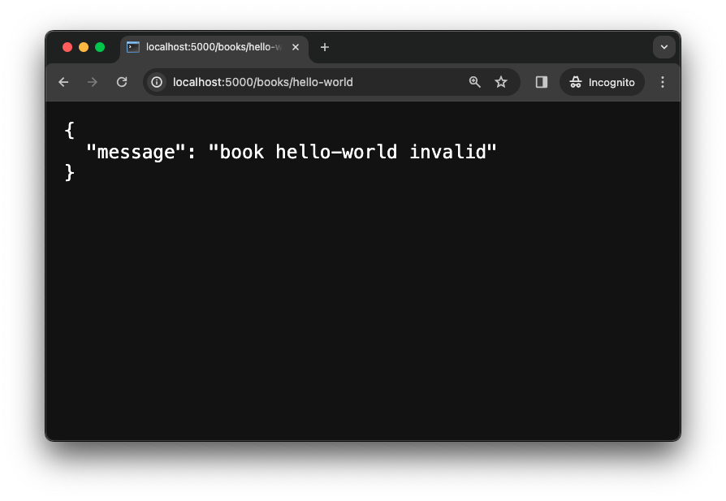

# Error Handling

<!-- FLASK UPDATE -->
<!--
<iframe src="https://adaacademy.hosted.panopto.com/Panopto/Pages/Embed.aspx?pid=2fdeb749-36d1-43a2-9b9d-ae670124405e&autoplay=false&offerviewer=true&showtitle=true&showbrand=true&captions=true&interactivity=all" height="405" width="720" style="border: 1px solid #464646;" allowfullscreen allow="autoplay"></iframe>
-->

## Goals

Our goal for this lesson is to learn how to handle errors for the `GET`&nbsp;`/books/<book_id>` route.

In this lesson we will extend our Hello Books API to handle the following error cases for the RESTful route `GET` `/books/<book_id>`:

1. If no `book` record matches the `book_id`, the server will return a `404` response code with a message indicating that there are no `book`s with `book_id`.
1. If `book_id` is not of type `int`, the server will return a `400` response code with a message indicating `book_id` is invalid.

## Branches

| Starting Branch     | Ending Branch |
| ------------------- | ------------- |
| `02a-read-one-book` | `02b-404`     |

<details>
   <summary>Expand to see the features <code>Hello Books API</code> should have before this lesson</summary>

- The `GET` `/books` route should be defined
- The `GET` `/books/<book_id>` route should be defined

</details>
<br>

## Handling a non-existing book

Let's examine the error we receive for a `GET` request to `/books/100`, a non-existing book, in our browser.

  
*Fig. Error displayed by Flask in Debug mode when accessing non-existing book. ([Original Image](../assets/api-2-read-error/404_view_function_did_not_return_a_valid_response.png))*

### !callout-info

## Error Details Appear Only in Debug Mode

If your browser displays a generic error message like `Internal Server Error` instead of the detailed error message shown above, stop your Flask server with `⌃C` (`Ctrl+C`), then restart it in debug mode with the command

<br />

`flask run --debug`

### !end-callout

We receive an error message that should resemble the following.

> TypeError: The view function for 'books_bp.get_one_book' did not return a valid response. The function either returned None or ended without a return statement.

Reviewing the error message, we can see that the error is a `TypeError`. This alone doesn't tell us much, but the next part of the error message is more informative. The error message states that the view function for `books_bp.get_one_book` did not return a valid response. Specifically, it either returned `None` or ended without a return statement (in which case, Python still behaves as though the function returned `None`).

This is really helpful information! From the error message, we know that we should take a look at the `get_one_book` function that we registered on the `books_bp` blueprint. Here's our code:

```python
@books_bp.get("/<book_id>")
def get_one_book(book_id):
    book_id = int(book_id)
    for book in books:
        if book.id == book_id:
            return {
                "id": book.id,
                "title": book.title,
                "description": book.description,
            }
```

There is a single explicit `return` in this function, but we only reach it if the condition `book.id == book_id` is `True`. That is, we need to find a book with a matching ID in order for the `return` to execute. If we never find a book with a matching ID, the loop will complete without returning anything. As we know, in Python, a function that completes without an explicit `return` statement behaves like it returned `None`.

### Handling a non-existing book: Preparation

To handle this scenario, we should return a response with a response body indicating that the book with `book_id` was not found and a `404` response code, which is the standard code to indicate that a resource was not found.

<!-- prettier-ignore-start -->
| Endpoint Detail | Notes |
| ------- | ------- |
| Request | `GET /books/100` |
| Response Status | `404 Not Found` |
| Response Body | `{"message" : "book 100 not found"}` |
<!-- prettier-ignore-end -->

### Handling a non-existing book: Code

When we return a dictionary value to be converted to JSON, Flask will automatically set the response code to `200`. Flask provides a few ways to set a different response code. For basic cases, Flask lets us return a tuple containing a response body dictionary and a response code.

So to return a `404` response if the loop completes without returning, we can add a `return` statement after the loop like this:

```python
    return {"message":f"book {book_id} not found"}, 404
```

<!-- prettier-ignore-start -->
| Piece of Code | Notes |
| ------------- | ----- |
| `return ..., ...` | The comma means that this is returning a `tuple` of two values. Remember that it's not parentheses that make a `tuple` literal, but rather a comma. |
| `{"message":`&ZeroWidthSpace;`f"book {book_id} not found"}` | The first value in the `tuple`, `{"message":f"book {book_id} not found"}`, is the dictionary that will become the `JSON` response body. |
| `404` | The second value in the `tuple`, `404`, is the response code. |
<!-- prettier-ignore-end -->

<details>
    <summary>Expand to see the complete <code>get_one_book(book_id)</code> function</summary>

```python
@books_bp.get("/<book_id>")
def get_one_book(book_id):
    book_id = int(book_id)
    for book in books:
        if book.id == book_id:
            return {
                "id": book.id,
                "title": book.title,
                "description": book.description,
            }

    return {"message":f"book {book_id} not found"}, 404
```

</details>

<br>

We should verify that the we receive the correct response body and code for a non-existing book. We can do this by making the request in our browser and viewing the server logs.

  
*Fig. Not found message returned in response to a request for a book that doesn't exist.*

  
*Fig. Server log showing that the request for a book that doesn't exist results in a 404 status.*

## Handling an invalid `book_id`

Let's examine the error we get to a `GET` request to `/books/hello-world`, an invalid `book_id`, in our browser.

  
*Fig. Error displayed by Flask in Debug mode when accessing an a book id that doesn't "look" like a book id. ([Original Image](../assets/api-2-read-error/400-invalid-book-error.png))*


### Handling an invalid `book_id`: Preparation

To handle this scenario, we should return a response with a response body indicating that the book with `book_id` is invalid and a `400` response code.

| Request                    | Response Status | Response Body                              |
| -------------------------- | --------------- | ------------------------------------------ |
| `GET` `/books/hello-world` | `400` `Invalid` | `{"message" : "book hello-world invalid"}` |

### Handling an invalid `book_id`: Code

We can replace the code `book_id = int(book_id)` with a `try/except` that returns a `400` response code in the `except` clause if `int(book_id)` throws an error.

```python
try:
    book_id = int(book_id)
except:
    return {"message":f"book {book_id} invalid"}, 400
```

<!-- prettier-ignore-start -->
| Piece of Code | Notes |
| ------------- | ----- |
| `try: / book_id = int(book_id)` | For valid values of `book_id`, this code will convert the `book_id` to an `int`. `book_id` is initially a string since it it a route parameter. |
| `except: / return {"message":f"book {book_id} invalid"}, 400` | For invalid values of `book_id`, this code will return the json response body `{"message":f"book {book_id} invalid"}` and response code `400`. |
<!-- prettier-ignore-end -->

<details>
    <summary>Expand to see the complete <code>handle_book(book_id)</code> function</summary>

```python
@books_bp.route("/<book_id>", methods=["GET"])
def handle_book(book_id):
    try:
        book_id = int(book_id)
    except:
        return {"message":f"book {book_id} invalid"}, 400

    for book in books:
        if book.id == book_id:
            return {
                "id": book.id,
                "title": book.title,
                "description": book.description,
            }

    return {"message":f"book {book_id} not found"}, 404
```

</details>

We should verify that the we receive the correct response body and code for an invalid `book_id`. We can do this by making the request in our browser and viewing the server logs.

<br>




## Refactor with Helper function

Our `GET` `/books/<book_id>` endpoint now correctly handles `404` and `400` level responses. We may notice that our `handle_book(book_id)` route function is getting a bit long.

Let's pull out the error handling logic into a helper function `validate_book(book_id)` that we will call in `handle_book(book_id)`.

```python
from flask import Blueprint, jsonify, abort, make_response

...

def validate_book(book_id):
    try:
        book_id = int(book_id)
    except:
        abort(make_response({"message":f"book {book_id} invalid"}, 400))

    for book in books:
        if book.id == book_id:
            return book

    abort(make_response({"message":f"book {book_id} not found"}, 404))
```

<details>
    <summary>Expand for updated <code>handle_book(book_id)</code> code</summary>

```python
@books_bp.route("/<book_id>", methods=["GET"])
def handle_book(book_id):
    book = validate_book(book_id)

    return {
        "id": book.id,
        "title": book.title,
        "description": book.description,
    }
```

</details>
<br>

<!-- prettier-ignore-start -->
| New Piece of Code | Notes |
| ----------------- | ----- |
|`from flask import Blueprint, jsonify, abort, make_response`|Add `abort` and `make_response` to the import list. These functions are defined in the next row of this table.|
| `abort(make_response({"message":f"book {book_id} invalid"}, 400))` | [`abort`](https://flask.palletsprojects.com/en/1.1.x/api/#flask.abort) raises an `HTTPException`. We use [`make_response`](https://flask.palletsprojects.com/en/2.0.x/api/#flask.make_response) to return a Flask [`Response`](https://flask.palletsprojects.com/en/1.1.x/api/#response-objects) object and override the default behavior of `abort` to return `html`. Follow your curiosity and the documentation links to learn more about `abort`. |
| `for book in books:`... | Iterate through the `books` and return the `book_id` if it is in the list. |
| `abort(make_response({"message":f"book {book_id} not found"}, 404))` | If the loop completes without returning, abort and return a `404` response. |
<!-- prettier-ignore-end -->

<!-- prettier-ignore-start -->
### !challenge
* type: tasklist
* id: 03fd0024-7138-44b8-ac7e-a01298cd1dfe
* title: Handling Errors
##### !question

Think about the "Getting a Single Book Endpoint."

Check off all code that we implemented in this Lesson.

##### !end-question
##### !options

* Handled a non-existing `book`
* Handled an invalid `book_id`
* Refactored our code to use a helper function

##### !end-options
### !end-challenge
<!-- prettier-ignore-end -->
