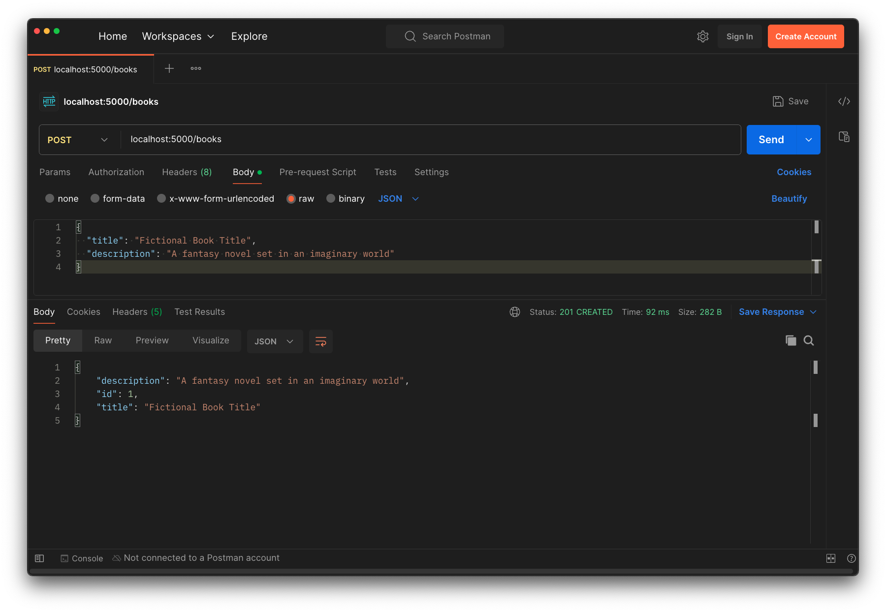

# Create

<!-- FLASK UPDATE -->
<!-- <iframe src="https://adaacademy.hosted.panopto.com/Panopto/Pages/Embed.aspx?pid=b0546829-5d82-43d0-be51-adb90189026d&autoplay=false&offerviewer=true&showtitle=true&showbrand=false&captions=true&interactivity=all" height="405" width="720" style="border: 1px solid #464646;" allowfullscreen allow="autoplay"></iframe> -->

## Goals

Our goal for this lesson is to implement a route that creates a new data record using the `Book` model.

We will add to our Hello Books API to fulfill the following feature:

1. As a client, I want to send a request with new valid book data and get a success response, so that I know the API saved the book data.

## Branches

| Starting Branch | Ending Branch|
|--|--|
|`03a-models-setup` |`03b-create`|

<details>
   <summary>Expand to see the model and database features <code>Hello Books API</code> should have before this lesson</summary>

* A `hello_books_development` database
* A `book` table defined
* A `Book` model defined

The model and table should have the following columns:

* `id`
* `title`
* `description`

</details>
<br>

## Creating a Book Endpoint: Preparation

Let's consider how to accomplish this feature:

> As a client, I want to send a request with new valid book data and get a success response, so that I know the API saved the book data.

### Planning HTTP Requests, Responses, and Logic

Recall that for requests that create records, it's typical to use the `POST` verb to receive requests sent to an endpoint which is the plural form of the resource to create. So we pick the following HTTP method and endpoint.

| HTTP Method | Endpoint |
| ----------- | -------- |
| `POST`      | `/books` |

The request body will consist of a JSON document with all the fields required to create the resource. For our `Book` model, an example request body would be:

```json
{
  "title": "Fictional Book Title",
  "description": "A fantasy novel set in an imaginary world"
}
```

Finally, the most appropriate successful response status code is `201 Created`, indicating the resource had been successfully created. The response body could take several forms, ranging from an empty body, up to a JSON document representing the created resource (useful for communicating back the `id` that was assigned), or anything in between. We will choose to return a JSON document with the same format we used for our hardcoded objects, a dictionary with the keys:
- id
- title
- description

<table>
  <tr>
    <th>Response Status</th>
    <th>Example Response Body</th>
  </tr>
  <tr>
    <td><code>201 Created</code></td>
    <td><pre style="margin:0px;"><code>{
    "id": 1,
    "title": "Fictional Book Title",
    "description": "A fantasy novel set in an imaginary world"
}</code></pre>
    </td>
  </tr>
</table>

Now that we have an idea of what our endpoint should look like, we can turn our attention to how to implement it.

Our endpoint will need to:

1. Read the new book data from the HTTP request
2. Create a new `Book` model with the new book data stored inside of it
3. Save the new `Book` into the database
4. Send back a response

### Dependencies

To make this feature, we'll work with a utility object named `request` provided by Flask.


#### Working with `request` from Flask

Our code will begin by importing `request` from `flask`.

```python
from flask import request
```

Flask, the framework, provides all sorts of tools to us. One of those tools is the `request` object. The imported `request` object represents the current HTTP request. For now, we should focus on a few useful patterns for using `request`, but for future reference, we can get more details about the `request` object by referring to:

- [Flask's definition of the `request` object](https://flask.palletsprojects.com/en/3.0.x/api/#flask.request)
- [Flask's resource on the Request Context](https://flask.palletsprojects.com/en/3.0.x/reqcontext/), which outlines technical details of how `request` exists, and how to use it

## Creating a Book Endpoint: Code

Let's look at some example code for our create feature.

### Creating an Endpoint

Let's define the `POST /books` route by adding the following code to our `book_routes.py` file:

```python
from flask import Blueprint, abort, make_response, request
from app.models.book import Book
from ..db import db

books_bp = Blueprint("books_bp", __name__, url_prefix="/books")

@books_bp.post("")
def create_book():
    request_body = request.get_json()
    title = request_body["title"]
    description = request_body["description"]

    new_book = Book(title=title, description=description)
    db.session.add(new_book)
    db.session.commit()

    response = {
        "id": new_book.id,
        "title": new_book.title,
        "description": new_book.description,
    }
    return response, 201
```

| <div style="min-width:290px;"> Piece of Code </div> | Notes|
| --------------------------------------------------- | ---- |
| `from flask import Blueprint, abort, make_response, request` | We need to import our Flask dependencies. Python supports comma-separated importing.|
| `from ... import Book`, `from ..db import db` | We need to import the necessary modules to create our `Book` model and access our database|
| `@books_bp.post("")` | A decorator that uses the `books_bp` Blueprint to define an endpoint that accepts a POST method. The following function will execute whenever a matching HTTP request is received.|
| `def create_book():` | This function will execute whenever a request that matches the decorator is received. The name of this function doesn't affect how requests are routed to this method. Common choices for a function name could include matching the route path, or using any other clear, descriptive Python function name. |
| `request_body = ...` | We create a local variable `request_body`, which will hold the body contents of the HTTP request in a Python data structure (likely dictionaries, lists, and strings)|
| `... request.get_json()` | We use the `request` object to get information about the HTTP request. We want to get the request's JSON body, so we use `request.get_json()`. This method "Pythonifies" the JSON HTTP request body by converting it to a Python dictionary.|
| `title = request_body["title"]` | We access the `request_body` values, which were loaded from our call to `request.get_json()`, to get the data for a new `Book` instance|
| `new_book = Book( ... )` | We create an instance of `Book` using the data we read from `request_body`. We assign this new instance to the `new_book` variable.|
| `title=title, description=description` | We use keyword arguments matching our model attributes and use our variables holding data from the `request_body` to create a `Book` instance|
| `db.session.add(new_book)` | `db.session` is the database's way of collecting changes that need to be made. Here, we are saying we want the database to add `new_book`.|
| `db.session.commit()` | Here, we are saying we want the database to save and commit the collected changes. We've only made one change here (adding the new Book), but a session can track multiple changes on both newly added and existing model records all at once. |
| `return ..., ...` | For each endpoint, we must _return_ something Flask can use for a response. The comma means that this is returning a `tuple` of two values. |
| `response` | The first element of the tuple is the dictionary that will become the `JSON` response body. |
| `201` | The second value in the `tuple`, `201`, is the response code. When a second value isn't specified, `200` is always the default value. |

### !callout-info

## Missing error handling in the create route

Folks may have noticed that our new function can crash if any keys the code tries to access (here, `"title"` and `"description"`) are missing! If you'd like the practice, feel free to add logic to handle the exceptions that could be raised for now. We will address error handling for creating models later in the Building an API series.

### !end-callout

### Blueprints

For this project, **Hello Books**, we are using `Blueprints` to create a group of related routes (endpoints).

When we set up our initial book routes (which are currently commented out), we registered them on a Blueprint using the Blueprint route decorator functions. Then we had to remember to register the entire Blueprint with the `app`, so that the `app` would know about the endpoints grouped under the Blueprint.

Since we have already registered `book_bp` in `app/__init__.py` inside our `create_app` function, as we add additional routes to our Blueprint, `app` will be able to see them without needing to go back and updating the `create_app` function again. But if we create any additional Blueprints, then we'll need to be sure to register them with the `app` the same way we did with `book_bp`.

### Manually Testing with Postman

Unlike our GET routes, we can't directly test a POST route using the browser. This is because when we type an address into the browser's address bar, it always makes a GET request to that address. This was exactly what we needed to check that our get book routes were working, but won't help us try out our create book route. 

Instead, we'll use Postman to send a POST request that includes the necessary data in the request body. To do so, in Postman, we:

- Set the method to `POST`
- Set the request URL to `localhost:5000/books`
- Select the request `Body` tab, using the `raw` option with `JSON` selected in the list that appears, then add in a sample request body such as:

```json
{
  "title": "Fictional Book Title",
  "description": "A fantasy novel set in an imaginary world"
}
```


_Fig. A successful POST request to create a book, sent using Postman. ([Full size image](../assets/api-3-database-models-read/create-postman-output.png))_

We have many tools to juggle while building and testing our endpoints, and it can take time to get a feel for how to use them all together in a development workflow. Be patient wwith yourself!

### Manually Testing with `psql`

Manually sending a request to our create route with Postman confirms that our route sends back a `Book` record, but does it guarantee that the Book is actually stored in our database? No, it doesn't! 

To be sure that our records are created and exist in the local database, for now we can use `psql`! To do so, we would start up `psql`, connect to our `hello-books-development` database, and run an appropriate query to get the records from the `book` table.

Let's try it out on our own! We can refer back to the Intro to SQL lessons if we need a reminder about how to write a query like this. Later in this series we will look at ways to automate our testing so that we don't need to rely on manually checking each scenario when we make changes.

### Debugging

For the theoretical developer writing the code in this lesson, everything worked on the first try. They used Postman to send a request and they got back the appropriate response. But everything working correctly on the first try is much more the exception than the rule.

If we try to exercise a route and it _doesn't_ work, first of all, we shouldn't feel bad about it. Running into issues is common and expected. But the next thing we should do is remember that our routes are code just like any other code, and we can debug them. Because we're working with a database, we may also need to check whether the expected data exists as a result of our endpoints.

We haven't looked at how the VS Code debugger can be used to step through our route code (though this is possible!), but we do already have several other tools that can help us zero in on the cause of a problem:


- Using the response that appears in Postman
- Using the server logs (displayed in the terminal while Flask is running) to check status codes, error details, and `print`ed output
- Using `psql` to check the local database

## Check for Understanding

<!-- prettier-ignore-start -->
### !challenge
* type: multiple-choice
* id: 4de3Ri
* title: Create
##### !question

Assume that we have a `Note` model that contains only `id` and `message` attributes. 

Which entry below describes a route that follows best practices for creating a Note resource?

##### !end-question
##### !options

a| ```python
@notes_bp.post("")
def create_note():
    request_body = request.get_json()
    message = request_body["message"]

    new_note = Note(message=message)
    db.session.add(new_note)
    db.session.commit()

    return {
        "id": new_note.id,
        "message": new_note.message
    }
```
b| ```python
@notes_bp.post("")
def create_note():
    request_body = request.get_json()
    message = request_body["message"]

    new_note = Note(message=message)
    db.session.add(new_note)
    db.session.commit()

    response = {
        "id": new_note.id,
        "message": new_note.message
    }
    return response, 201
```
c| ```python
@notes_bp.put("")
def create_note():
    request_body = request.get_json()
    message = request_body["message"]

    new_note = Note(message=message)
    db.session.add(new_note)
    db.session.commit()

    response = {
        "id": new_note.id,
        "message": new_note.message
    }
    return response, 201
```
d| ```python
@notes_bp.post("")
def create_note():
    request_body = request.get_json()
    message = request_body["message"]

    new_note = Note(message=message)

    response = {
        "id": new_note.id,
        "message": new_note.message
    }
    return response, 201
```

##### !end-options
##### !answer

b|

##### !end-answer
##### !explanation

This is the only option that uses `POST` for the HTTP verb, ensures that `new_note` is added and committed to the database, and sends back `201 Created` as our response status code along with our new `Note` record.

##### !end-explanation
### !end-challenge
<!-- prettier-ignore-end -->