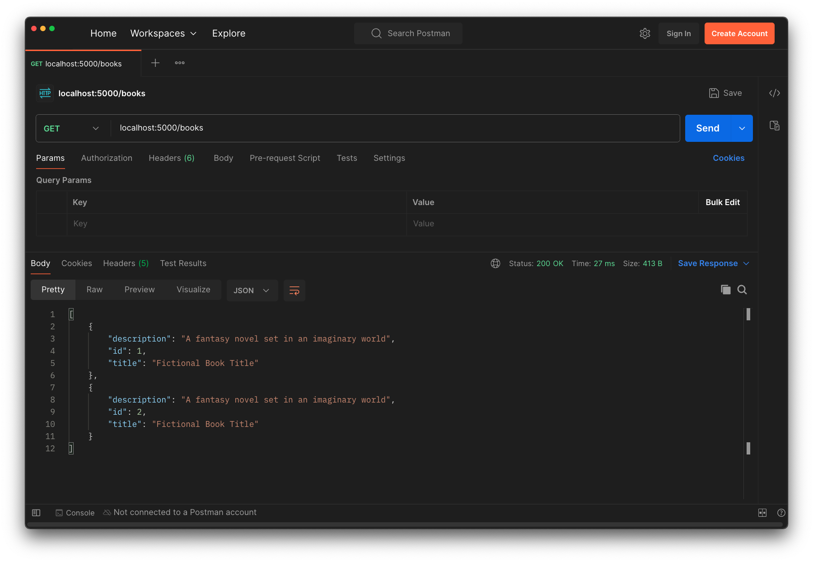

# Read All Books

<!-- FLASK UPDATE -->
<!-- <iframe src="https://adaacademy.hosted.panopto.com/Panopto/Pages/Embed.aspx?pid=13c1312c-7230-4631-9687-adba0000a65e&autoplay=false&offerviewer=true&showtitle=true&showbrand=false&captions=true&interactivity=all" height="405" width="720" style="border: 1px solid #464646;" allowfullscreen allow="autoplay"></iframe> -->

## Goals

Our goal for this lesson are to:
- Practice defining routes that read model records
- Access a database record from the back-end layer

We will update our Hello Books API to fulfill these features:

1. As a client, I want to send a request to get all existing books, so that I can see a list of books, with their `id`, `title`, and `description` of the book.

We will refactor the endpoint we designed in our previous lesson [01) Building an API - Read All Books Endpoint](../api-1-setup-read/read-all-books.md) to make use of the data in our postgres database.

## Branches

| Starting Branch | Ending Branch|
|--|--|
|`03b-create` |`03c-read-all-books`|

## Planning HTTP Requests, Responses, and Logic Review

Let's review the planning work we did for creating the "Read All Books" endpoint in Part 1 of this series. We want to use the appropriate HTTP verb and endpoint for requests that retrieve all records of a particular resource. 

Recall that for requests that read records, a RESTful API should use a `GET` request to the `/books` path. 

| HTTP Method | Endpoint |
| ----------- | -------- |
| `GET`       | `/books` |

`GET` requests do not include a request body, so no additional planning around the request body is needed.

The response we want to send back is a list of JSON objects (dictionaries) with the keys:
* `id` 
* `title`
* `description`.

The most appropriate successful response status code is `200 OK`.

<table>
  <tr>
    <th>Response Status</th>
    <th>Example Response Body</th>
  </tr>
  <tr>
    <td><code>200 OK</code></td>
    <td><pre style="margin:0px;"><code>[
    {
        "id": 1, 
        "title": "Fictional Book", 
        "description": "A fantasy novel set in an imaginary world."
    }, {
        "id": 2, 
        "title": "Wheel of Time", 
        "description": "A fantasy novel set in an imaginary world."
    }, {
        "id": 3, 
        "title": "Fictional Book Title", 
        "description": "A fantasy novel set in an imaginary world."
    }
]</code></pre>
    </td>
  </tr>
</table>

Now that we have an idea of what our endpoint should look like, we can turn our attention to how to implement it.

Our endpoint will need to:

1. Retrieve all of the books data.
2. Format the list of Book instances into the appropriate JSON data structure (list of dictionaries, where each dictionary has `id`, `title`, and `description`)
3. Send back a response containing our JSON data and HTTP status code

## Working with `select` from the `SQLAlchemy` object

When we want to retrieve records from a database using the `psql` interface, we connect to a specific database and issue a `SELECT` statement. If we wanted to fetch all `Book` entries from our `hello-books-development` database, we might write a SQL statement like:

```sql
SELECT * FROM books;
```

SQLAlchemy provides us a similar pattern. The instance of `SQLAlchemy` that we created in `db.py` and stored in the `db` variable, acts as our connection to the `hello-books-development` database. Our `db` object has a method `select` that we can use to build a query to select records from a database: 

```python
query = db.select(Book)
```

This method returns a `Select` object, not the database models themselves. We can request the models to be sorted in a particular order by calling `order_by` on the `Select` object generated by `db.select(Book)`. `order_by` will also create a `Select` object that we can keep building on or execute to retrieve the model objects:

```python
query = db.select(Book).order_by(Book.id)
```

### !callout-info

## Foreshadowing: Our queries can get more complex

Just like with SQL's `WHERE` clauses, we are able to add on to the `select` object that `db.select(Book)` creates to build more complex queries. For now we are using the statement above to select everything in the `books` table and order the records by `id`, but later in the Building an API series we will see more complex use cases!

### !end-callout

Once we have built up a query that selects the desired records, we need one more piece of code to tell SQLAlchemy to execute the query statement and retrieve the models. SQLALchemy can either return:
* `scalars`, which are database records converted into our model objects
* [`Row` objects](https://docs.sqlalchemy.org/en/20/core/connections.html#sqlalchemy.engine.Row), which are a Tuple-like representation of database records 

We want the conveniences of the model class we defined and will continue to build on, so we want SQLAlchemy to immediately give us a `scalar` result. To do this, we use the `db.session` object and call its `scalars` method, passing our `query` as a parameter:

```python
books = db.session.scalars(query)
```

There are a lot of ways to issue `SELECT` statements with SQLAlchemy. For more information, we can check out [SQLAlchemy's guide to `SELECT` statements](https://docs.sqlalchemy.org/en/20/orm/queryguide/select.html#writing-select-statements-for-orm-mapped-classes)

## Getting All Books Endpoint: Code

Let's update our `GET` route function in `book_routes.py` to include support for retrieving our database models.

To access all the books in our database we use the syntax in the previous section: `db.select(Book)` and `db.session.scalars(query)`.

Consider how you could refactor the `GET` `/books` route to make use of these statements.

<br/>

<details>
    <summary>Give it a try, then click here to see the changed code in `book_routes.py`.</summary>

```python
@books_bp.get("")
def get_all_books():
    query = db.select(Book).order_by(Book.id)
    books = db.session.scalars(query)
    # We could also write the line above as:
    # books = db.session.execute(query).scalars()

    books_response = []
    for book in books:
        books_response.append(
            {
                "id": book.id,
                "title": book.title,
                "description": book.description
            }
        )
    return books_response
```

</details>

| <div style="min-width:250px;"> Piece of Code </div> | Notes |
| --------------------------------------------------- | ----- |
| `@books_bp.get("")`                                 | Unchanged from our previous hardcoded route. This decorator indicates that the function below it is a `GET` route that is registered with the `Blueprint` object named `books_bp`. |
| `query = ...`                                       | We store the `Select` object which represents our query for all `Book` instances in the variable `query` |
| `... = db.select(Book) ...`                         | This syntax tells the `SQLAlchemy` object `db` to select all entries for the model `Book`. This method returns a `Select` object that represents the query we are building. |
| `....order_by(Book.id)`                             | This is an example of building up a query by adding onto a `Select` object. The code tells SQLAlchemy to order the results of our initial `Select` statement created by `db.select(Book)` based on the `Book`'s `id` attribute. The `order_by` function will return a new `Select` object that is stored in the variable `query` |
| `books = ...`                                       | We store the list of `Book` instances in the variable `books` |
| `... = db.session.scalars(query)`                   | This syntax tells the `db.session` object to execute the query we have built up in the `query` variable and return the result as `scalars` (our `Book` model objects). This method returns a list of instances of `Book`. |
| `for book in books:`                                | We iterate over each book in `books` so we can collect their data and format it into a response |
| `books_response.append( ... )`                      | We will use the `books_response` list to hold book dictionaries |
| `{ "id": book.id, ... }`                            | This is the format of dictionary we want to send back. We'll insert the values based on the `book` we're iterating on |
| `return ...`                                        | We must return our response. By default, a response with no specified status code returns `200 OK` |

## Manually Testing the Get All Books Endpoint

We will continue to add to our testing toolbox through this series, but let's remind ourselves of what we have at our disposal. As we test our endpoint, remember to use all the tools available, especially if we get stuck:

- Postman
- Server logs
- `psql` interface
- VS Code
- Peers, classmates, and rubber ducks

### Manually Testing with Postman

Let's test this request in Postman:

1. Check the database in `psql` to ensure that we have records in the `books` table to retrieve
2. In Postman:
   1. Set the request method to `GET`
   2. Keep the request URL at `localhost:5000/books`


_Fig. Screenshot of using Postman to send a `GET` request to fetch all `Book` records. ([Full size image](../assets/api-3-database-models-read/read-all-books_get-books-postman.png))_

### !callout-info

## Postman's Response Depends on our Local Database

Since the Get All Books endpoint will return whichever books we have in our local database, folks may see a different response from the screenshot. This is expected! Feel free to create as many books as you'd like to test your endpoints with.

### !end-callout

## Check for Understanding

<!-- prettier-ignore-start -->
### !challenge
* type: multiple-choice
* id: 9Lz3nt
* title: Read All Books
##### !question

Assume that we have a `Note` model that contains only `id` and `message` attributes.

Which combination of HTTP Verb, endpoint, response body, and response status code is most appropriate for a successful response from a RESTful endpoint that retrieves all `Note` records?

##### !end-question
##### !options

a| HTTP Verb: `GET`
<br/>
   Endpoint: “/notes/get” 
<br/>
   Response Body:
   ```python
    [{
        “id”: 1, 
        “message”: “Hello World”
    }, {
        “id”: 2, 
        “message”: “Welcome, learners!”
    }] 
   ```
   Response Status Code: `200 OK`
b| HTTP Verb: `POST`
<br/>
   Endpoint: `“/notes”`
<br/>
   Response Body:
   ```python
    [{
        “id”: 1, 
        “message”: “Hello World”
    }, {
        “id”: 2, 
        “message”: “Welcome, learners!”
    }] 
   ```
   Response Status Code: `201 CREATED`
c| HTTP Verb: `GET`
<br/>
   Endpoint: `“/notes”`
<br/>
   Response Body:
   ```python
    [{
        “id”: 1, 
        “message”: “Hello World”
    }, {
        “id”: 2, 
        “message”: “Welcome, learners!”
    }] 
   ```
   Response Status Code: `200 OK`
d| HTTP Verb: `GET`
<br/>
   Endpoint: `“/notes”`
<br/>
   Response Body:
   ```python
    {
        “id”: 1, 
        “message”: “Hello World”
    }
   ```
   Response Status Code: `200 OK`

##### !end-options
##### !answer

c|

##### !end-answer
##### !explanation

This is the only answer that uses:
- the `GET` verb to access a resource, 
- the resource name as the endpoint `"/notes"`
- a list of dictionaries as the response, even if there is only 1 result
- a response status code of `200 OK`

##### !end-explanation
### !end-challenge
<!-- prettier-ignore-end -->

<!-- prettier-ignore-start -->
### !challenge
* type: multiple-choice
* id: 448d8bbc-a7df-4dc5-889c-d93b3c4062be
* title: Read All Books
##### !question

Assume that we have a `Note` model that contains only `id` and `message` attributes.

What kind of object does the following method return?

```python
db.select(Note)
```

##### !end-question
##### !options

a| `Note` model objects representing all `note` database table rows
b| A `Select` object representing our current query 
c| `Row` objects representing all `note` database table rows

##### !end-options
##### !answer

b|

##### !end-answer
##### !explanation

The `select` method will return a `Select` object which represents a query. To get model objects that represent our table rows, we need to execute the query with a statement like:
```
db.session.scalars(query)
```

##### !end-explanation
### !end-challenge
<!-- prettier-ignore-end -->

