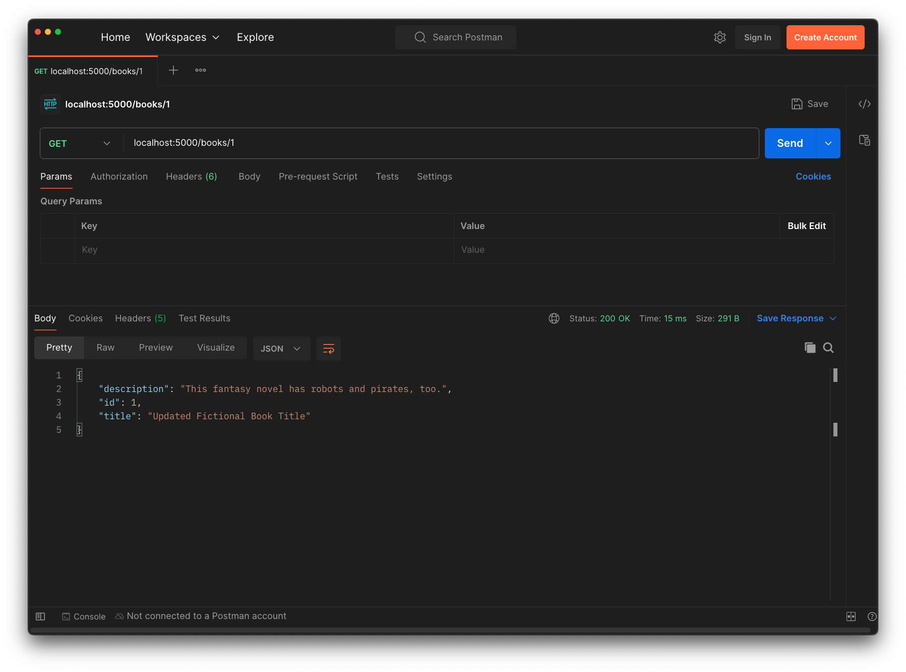
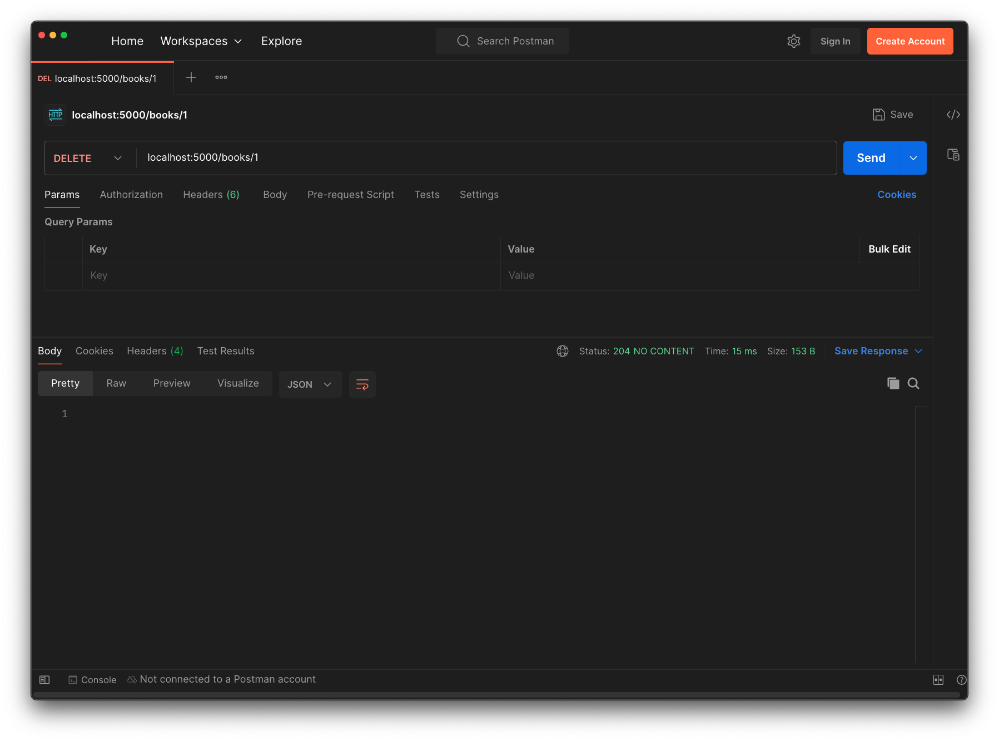
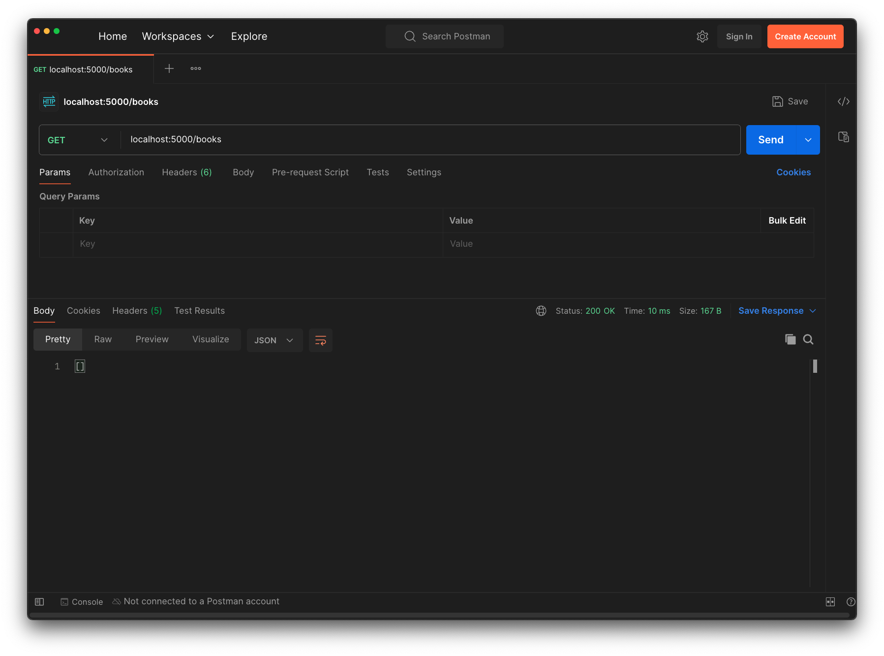

# Delete

<!-- FLASK UPDATE -->
<!-- <iframe src="https://adaacademy.hosted.panopto.com/Panopto/Pages/Embed.aspx?pid=7e1090b2-bf2f-472e-94ba-ae69016261e6&autoplay=false&offerviewer=true&showtitle=true&showbrand=true&captions=true&interactivity=all" height="405" width="720" style="border: 1px solid #464646;" allowfullscreen allow="autoplay"></iframe> -->

## Goals
Our goal for this lesson is to:
- Practice defining routes that delete data in an API

We will build our Hello Books API to fulfill the following feature:

1. As a client, I want to send a request to delete one existing book and get a success response, so that I know the API deleted the book data.

## Branches

| Starting Branch | Ending Branch|
|--|--|
|`04b-update` |`04c-delete`|

## Deleting a Book Endpoint: Planning HTTP Requests, Responses, and Logic

We should think about the RESTful HTTP verb and endpoint used for requests that delete a particular model record.

For this feature, we should make a `DELETE` request to the `/books` path, and we'll need to include the `id` of the record to delete as part of the endpoint.

| HTTP Method | Endpoint   | Example |
| ----------- | ---------- |---------- |
| `DELETE`    | `/books/<book_id>` |`/books/1` |

`DELETE` requests do not generally include a request body, so no additional planning around the request body is needed.

This assumes that there is a `book` table with at least the following row:

| <div style="min-width:40px;">`id`</div> | `title`                | `description`                               |
| ---- | ------------------------------ | ------------------------------------------------- |
| `1`  | `Updated Fictional Book Title` | `This fantasy novel has robots and pirates, too.` |

When the record is successfully updated, we should return an appropriate response. In this case, we'll use the same response as we did in the `update_book` endpoint: we will send back an empty body with the status code `204 No Content`. Some APIs return the the record that was just deleted as the response body, but for our example, we'd like to avoid combining record access and deletion in this endpoint. 

| <div style="min-width:200px;"> Response Status </div> | Response Body |
| --------------- | --------------|
| `204 No Content` | Our successful response to a `DELETE` request will not have a response body |

Now that we have an idea of what our endpoint should look like, we can turn our attention to how to implement it.

Our endpoint will need to:

1. Read the `book_id` in the request path
2. Retrieve the `Book` instance with the matching `book_id` from the database
3. Tell the database to delete this instance of `Book`
4. Save this change in the database
5. Send back a response

## Deleting a Book Endpoint: Code

This endpoint uses the same path as our existing route for reading and updating a `Book` record, `"/<book_id>"`. Let's create another route function to handle the delete feature.

```python
@books_bp.delete("/<book_id>")
def delete_book(book_id):
    book = validate_book(book_id)
    db.session.delete(book)
    db.session.commit()

    return Response(status=204, mimetype="application/json")
```

| <div style="min-width:250px;"> Piece of Code </div> | Notes |
| --------------------------------------------------- | ----- |
| `@books_bp.delete(...)` | This decorator indicates that the function below it is a `DELETE` route |
| `book = validate_book(book_id)` | The delete feature will also use the `validate_book` helper method for error handling |
| `db.session.delete(book)` | We can use SQLAlchemy's functions to tell the database to prepare to delete our `book` with `db.session.delete(book)` |
| `db.session.commit()` | We use this function to actually apply our database changes |
| `return Response(...)` | We can use the `Response` constructor to manually create a `Response` object when we need detailed control over the contents and attributes of the endpoint's response. |
| `(status=204, ...)` | As we did in the `update_book` endpoint, when calling the `Response` constructor, we use the keyword argument `status` to pass a status code of `204` for our endpoint's response. |
| `(..., mimetype="application/json")` | As we did in the `update_book` endpoint, we need to set the `mimetype` for our response to `"application/json"` so that the response type does not default to `HTML`. We do this to ensure our API has a consistent response type across our endpoints. |

### Manually Testing in Postman

After writing this code, we can use Postman to test our delete functionality.

First, let's make a `GET` request to `/books/1` to confirm that a book with ID 1 exists.


_Fig. `GET` request to `/books/1` and a response of `200` with book data ([Full size image](../assets/api-4-read-update-delete/api-4_delete_get-one-book.png))_

Then, let's make our `DELETE` request to `/books/1` and check the response.


_Fig. `DELETE` request to `/books/1` and a response of `204 No Content` ([Full size image](../assets/api-4-read-update-delete/api-4_delete_delete-request.png))_

Afterwards, let's even make a `GET` request to `/books`. We see that there are no more books that exist! Our book was successfully deleted.


_Fig. `GET` request to `/books` and a response of `200 OK` with an empty list ([Full size image](../assets/api-4-read-update-delete/api-4_delete_get-books-empty.png))_

We should also verify that the error handling from the `validate_book` helper function behaves as expected for invalid `book_id`s and non-existing `book`s.

### Manually Testing with `psql`

We can also check if our book was deleted from the database using `psql`.

Let's try it out on our own!

## Check for Understanding

<!-- prettier-ignore-start -->
### !challenge
* type: multiple-choice
* id: wYm5yT
* title: Delete
##### !question

Assume that we have a `Note` model that contains only `id` and `message` attributes.

Which of the options below represents a route which follows best practices for deleting a single `Note` resource?

##### !end-question
##### !options

a| ```python
@notes_bp.delete("/<note_id>")
def delete_note(note_id):
    note = validate_note(note_id)
    db.session.delete(note)
    db.session.commit()

    return {
        "id": note.id,
        "message": note.message
    }
```
b| ```python
@notes_bp.put("/<note_id>")
def delete_note(note_id):
    note = validate_note(note_id)
    db.session.delete(note)
    db.session.commit()

    return Response(status=204, mimetype="application/json")
```
c| ```python
@notes_bp.delete("/<note_id>")
def delete_note(note_id):
    note = validate_note(note_id)
    db.session.delete(note)
    db.session.commit()

    return Response(status=204)
```
d| ```python
@notes_bp.delete("/<note_id>")
def delete_note(note_id):
    note = validate_note(note_id)
    db.session.delete(note)
    db.session.commit()

    return Response(status=204, mimetype="application/json")

```
e| ```python
@notes_bp.delete("/<note_id>")
def delete_note(note_id):
    note = validate_note(note_id)
    db.session.delete(note)

    return Response(status=204, mimetype="application/json")
```

##### !end-options
##### !answer

d|

##### !end-answer
##### !explanation

This is the only answer that fulfills the following best practices:
1. Uses `delete` in the route decorator 
2. Ensures the deletion transaction is committed 
3. Returns a response with an empty body and status code of `204 No Content`
4. Sends a response back using the `"application/json"` response type

##### !end-explanation
### !end-challenge
<!-- prettier-ignore-end -->
