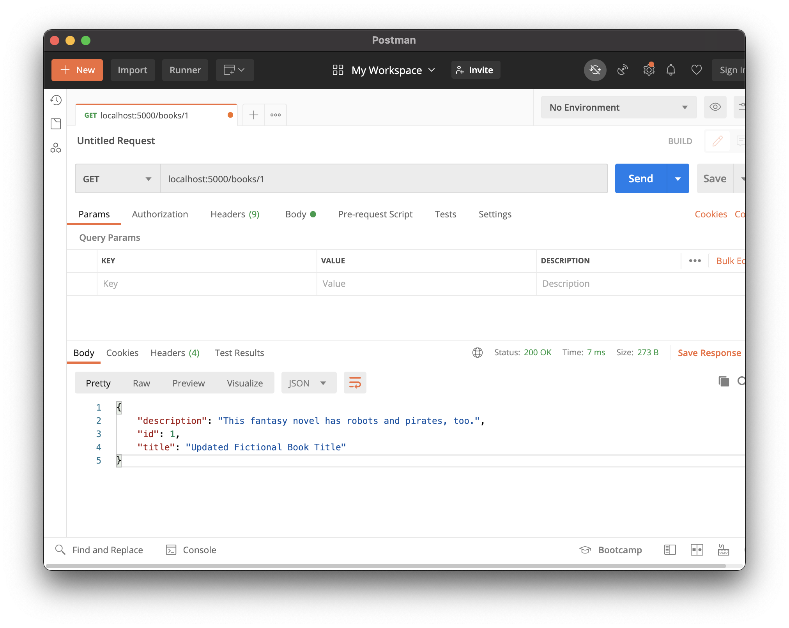
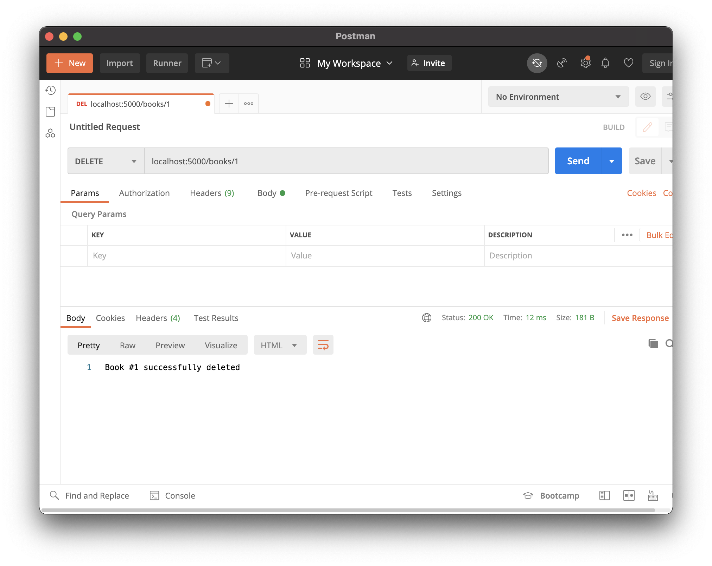
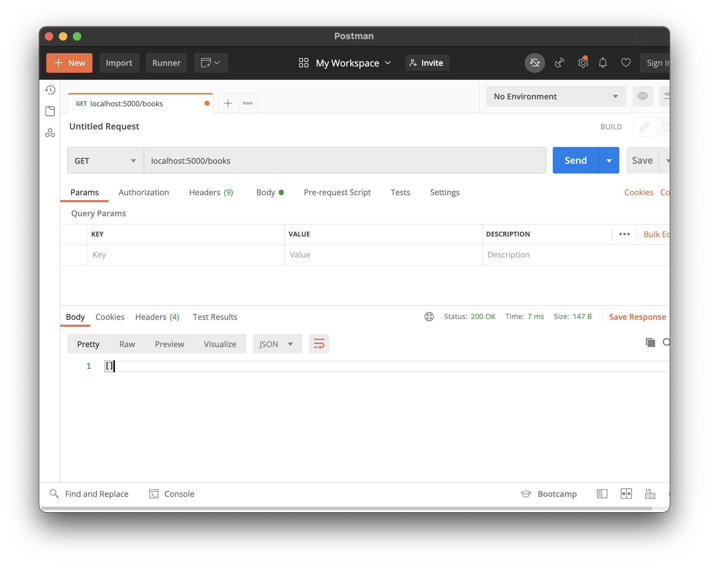

# Delete

## Goals
Our goals for this lesson are to:
- Practice defining routes that delete data in an API

We will build our Hello Books API to fulfill the following feature:

1. As a client, I want to send a request to delete one existing book and get a success response, so that I know the API deleted the book data.

## Branches

| Starting Branch | Ending Branch|
|--|--|
|`04b-update` |`04c-delete`|

## Deleting a Book Endpoint: Planning HTTP Requests, Responses, and Logic

We should think about the RESTful HTTP verb and endpoint used for requests that delete a particular model record.

For this feature, we should make a `DELETE` request to the `/books` path, and we'll need to include the `id` of the record to delete as part of the endpoint.

| HTTP Method | Endpoint   | Example |
| ----------- | ---------- |---------- |
| `DELETE`    | `/books/<book_id>` |`/books/1` |

`DELETE` requests do not generally include a request body, so no additional planning around the request body is needed.

This assumes that there is a `book` table with at least the following row:

| <div style="min-width:40px;">`id`</div> | `title`                | `description`                               |
| ---- | ------------------------------ | ------------------------------------------------- |
| `1`  | `Updated Fictional Book Title` | `This fantasy novel has robots and pirates, too.` |

When the record is successfully updated, we should return the appropriate status code, which is `200 OK`. Some APIs return the the record that was just deleted as the response body, but for simplicity, we will return a brief status message.

| Response Status | Response Body                  |
| --------------- | ------------------------------ |
| `200 OK`        | `Book #1 successfully deleted` |

Now that we have an idea of what our endpoint should look like, we can turn our attention to how to implement it.

Our endpoint will need to:

1. Read the `book_id` in the request path
1. Retrieve the `Book` instance with the matching `book_id` from the database
1. Tell the database to delete this instance of `Book`
1. Save this change in the database
1. Send back a response

## Deleting a Book Endpoint: Code

This endpoint uses the same path as our existing route for reading and updating a `Book` record, `"/<book_id>"`. Let's create another route function to handle the delete feature.

```python
@books_bp.route("/<book_id>", methods=["DELETE"])
def delete_book(book_id):
    book = validate_book(book_id)

    db.session.delete(book)
    db.session.commit()

    return make_response(f"Book #{book.id} successfully deleted")
```

| <div style="min-width:250px;"> Piece of Code </div> | Notes                                                                                                                                                 |
| --------------------------------------------------- | ----------------------------------------------------------------------------------------------------------------------------------------------------- |
| `methods=["DELETE"]`                  | This endpoint must accept `DELETE` requests                                                                                          |
| `book = validate_book(book_id)`                    | The delete feature will also use the `validate_book` helper method for error handling                                                            |
| `db.session.delete(book)`                           | We can use SQLAlchemy's functions to tell the database to prepare to delete our `book` with `db.session.delete(book)`                                                                 |
| `db.session.commit()`                               | We use this function to actually apply our database changes                                                                                           |
| `return make_response(...)`                              | This is one of many ways to return an HTTP response. Since we didn't supply a status code, Flask will default to `200 OK`.                                                                                                   |
| `f"Book #{book.id} successfully deleted"`           | We can still access `book.id` because the variable itself is still in scope in our app, even if the `book` _was_ successfully deleted in the database. The object stored in memory and referenced by `book` does not automatically update in response to changes in the database. |

### Manually Testing in Postman

After writing this code, we can use Postman to test our delete functionality.

First, let's make a `GET` request to `/books/1` to confirm that a book with ID 1 exists.



Then, let's make our `DELETE` request to `/books/1` and check the response.



Afterwards, let's even make a `GET` request to `/books`. We see that there are no more books that exist! Our book was successfully deleted.



We should also verify the error handling from the `validate_error` helper function behaves as expected for invalid `book_id` and non-existing `book`s.

### Manually Testing with `psql`

We can also check if our book was deleted from the database using `psql`.

Let's try it out on our own!

<!-- prettier-ignore-start -->
### !challenge
* type: tasklist
* id: wYm5yT
* title: Update and Delete, Deleting a Book Endpoint
##### !question

Think about the "Deleting a Book Endpoint."

Check off all the topics that we've briefly touched on so far.

##### !end-question
##### !options

* Planned the HTTP response, request, and logic for this endpoint
* Refactored our `"/books/<book_id>"` endpoint to accept `DELETE` requests
* Used `validate_book(book_id)` to get an instance of `Book` matching `book_id` and handle errors
* Refactored our code to conditionally check the request's method
* Deleted the `book` from the database
* Committed these changes in the database
* Returned a response
* Tested this request in Postman
* Verified invalid `book_id`s and non-existing `book`s are handled

##### !end-options
### !end-challenge
<!-- prettier-ignore-end -->
