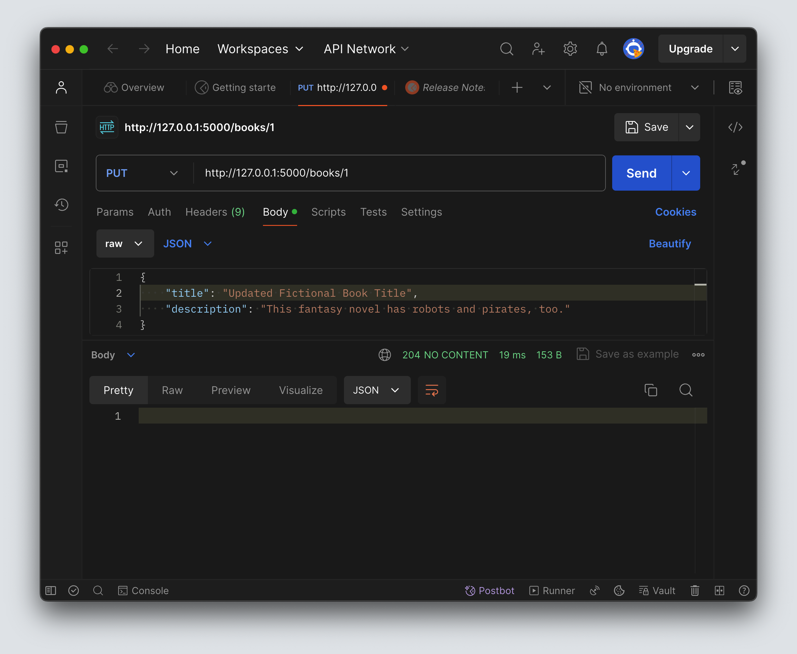

# Update

<!-- FLASK UPDATE -->
<!-- <iframe src="https://adaacademy.hosted.panopto.com/Panopto/Pages/Embed.aspx?pid=9594d398-a406-4a5a-9a9a-ae6901622f0f&autoplay=false&offerviewer=true&showtitle=true&showbrand=true&captions=true&interactivity=all" height="405" width="720" style="border: 1px solid #464646;" allowfullscreen allow="autoplay"></iframe> -->

## Goals
Our goals for this lesson are to:
- Practice defining routes that modify data in an API
- Modify a database record from the back-end layer

We will build our Hello Books API to fulfill the following feature:

1. As a client, I want to send a request with valid book data to update one existing book and get a success response, so that I know the API updated the book data.

## Branches

| Starting Branch | Ending Branch|
|--|--|
|`04a-read-one-book` |`04b-udpate`|

## Updating a Book Endpoint: Planning HTTP Requests, Responses, and Logic

As we did for our create and read endpoints, we should think about the RESTful HTTP verb and endpoint used to replace the data for a particular model record.

For this feature, we should make a `PUT` request to the `/books` path. We also need to include the `id` of the record to replace as part of the endpoint, as we did when _reading_ a particular record.

| HTTP Method | Endpoint   | Example
| ----------- | ---------- | ---------- |
| `PUT`       | `/books/<book_id>` | `/books/1`

We are replacing the data associated with the specified record. As a result, the request body will consist of a JSON document with all the same fields as were required to create the resource in the first place. For our `Book` model, an example request body would be:

```json
{
  "title": "Updated Fictional Book Title",
  "description": "This fantasy novel has robots and pirates, too."
}
```

This assumes that there is a `book` table with at least the following row:

| <div style="min-width:40px;">`id`</div> | `title`                | `description`                               |
| ---- | ---------------------- | ------------------------------------------- |
| `1`  | `Fictional Book Title` | `A fantasy novel set in an imaginary world` |

When the record is successfully updated, we should return the appropriate status code, which is `204 NO CONTENT`. The `204` is a successful status response code that is used when a request has succeeded and there is no response body. The full response for this route will be `204` status code accompanied by an empty response body.

| Response Status | Response Body                  |
| --------------- | ------------------------------ |
| <div style="min-width:200px;"> Response Status </div> | Our successful response to a `PUT` request will not have a response body |

Now that we have an idea of what our endpoint should look like, we can turn our attention to how to implement it.

Our endpoint will need to:

1. Read the `book_id` in the request path
2. Retrieve the `Book` instance with the matching `book_id` from the database
3. Read the new, updated book data from the HTTP request
4. Update the instance of `Book` with the new data
5. Save the updated `Book` in the database
6. Send back a created response

## Updating a Book Endpoint: Code

This endpoint uses the same path as our existing route for reading a `Book` record, `"/<book_id>"`. We could refactor and expand on this same function. However, just as we did with `create` and `read` for the `/books` route, we'll create a seperate route function fo the update functionality. In this route we will also need to create a response.

### Creating a Response Object

Unlike returing a tuple or using `make_response`, we will directly instantiate a Response object. This is necessary because we need the level of control the `Response` constructor offers us. While constructing the Response we will need to set the mimetype. Without doing so Flask would default to an HTML response and would introduce different response types between the endpoints of our API


```python
@books_bp.put("/<book_id>")
def update_book(book_id):
    book = validate_book(book_id)
    request_body = request.get_json()

    book.title = request_body["title"]
    book.description = request_body["description"]
    db.session.commit()

    return Response(status=204, mimetype="application/json")
```

| <div style="min-width:250px;"> Piece of Code </div> | Notes                                                                                                                                      |
| --------------------------------------------------- | ------------------------------------------------------------------------------------------------------------------------------------------ |
| `@books_bp.put`                            | This route's matching methods now need to handle `PUT` requests                                                              |
| `book = validate_book(book_id)`                    | The update feature can also use the `validate_book` helper method for error handling                                                                     |
| `... = request.get_json()`                          | This endpoint relies on reading the HTTP request body. We'll use `request.get_json()` to parse the JSON body into a Python dictionary. |
| `request_body`                                         | A local variable to hold the body of the HTTP request.                                                                                                 |
| `book.title = form_data["title"]`                   | We'll use our OOP skills to update `book`'s `title` attribute                                                                              |
| `book.description = ...`                            | We'll use our OOP skills to update `book`'s `description` attribute                                                                        |
| `db.session.commit()`                               | Every time a SQLAlchemy model has been updated, and we want to commit the change to the database, we'll execute `db.session.commit()`.     |
| `return Response(...)` | By using the `Response` constructor, we can manually create a `Response` object when we need detailed control over the contents and attributes of the endpoint's response. |
| `(status=204, ...)` | The `Response` constructor allows us to use the keyword argument `status` to set a status code of `204` for our endpoint's response. |
| `(..., mimetype="application/json")` | Since we construct our own response object we need to set the `mimetype` for our response to `"application/json"`. This is so that the response type does not default to `HTML` and ensures our API has a consistent response type across our endpoints. |
### Manually Testing with Postman

We can use Postman to check our update functionality.

It may help to first make a request to `GET /books/1` before updating it.


Then, make a request to `PUT /books/1` with our proper JSON request body.



We can send another request to `GET /books/1` to confirm the updates worked.


We should also verify the error handling from the `validate_error` helper function behaves as expected for invalid `book_id` and non-existing `book`s.

### Manually Testing with `psql`

We can also check if our book was updated in the database using `psql`, just as we did when creating new records!

Let's try it out on our own! We can refer back to the Intro to SQL lessons if we need a reminder about how to write a query like this.

<!-- prettier-ignore-start -->
### !challenge
* type: tasklist
* id: pe3GBP
* title: Update and Delete, Updating a Book Endpoint
##### !question

Think about the "Updating a Book Endpoint."

Check off all the topics that we've briefly touched on so far.

##### !end-question
##### !options

* Planned the HTTP response, request, and logic for this endpoint
* Refactored our `"/books/<book_id>"` endpoint to accept `PUT` requests
* Used `validate_book(book_id)` to get an instance of `Book` matching `book_id` and handle errors
* Refactored our code to conditionally check the request's method
* Read the HTTP request body using `request.get_json()`
* Updated the instance of `Book` in the database
* Returned a response
* Tested this request in Postman
* Verified invalid `book_id`s and non-existing `book`s are handled

##### !end-options
### !end-challenge

### !challenge

* type: multiple-choice
* id: be152c53-2f78-40e1-8c6c-9b3f8q086c17
* title: Hello World Routes

##### !question

Which status code should be used if a response is returned with an empty response body?

##### !end-question

##### !options

a| 201
b| 203
c| 200
d| 204

##### !end-options

##### !answer

d|

##### !end-answer

##### !explanation

`204 NO CONTENT` is used when we want to send a response with that has an empty response body.

##### !end-explanation

### !end-challenge
<!-- prettier-ignore-end -->