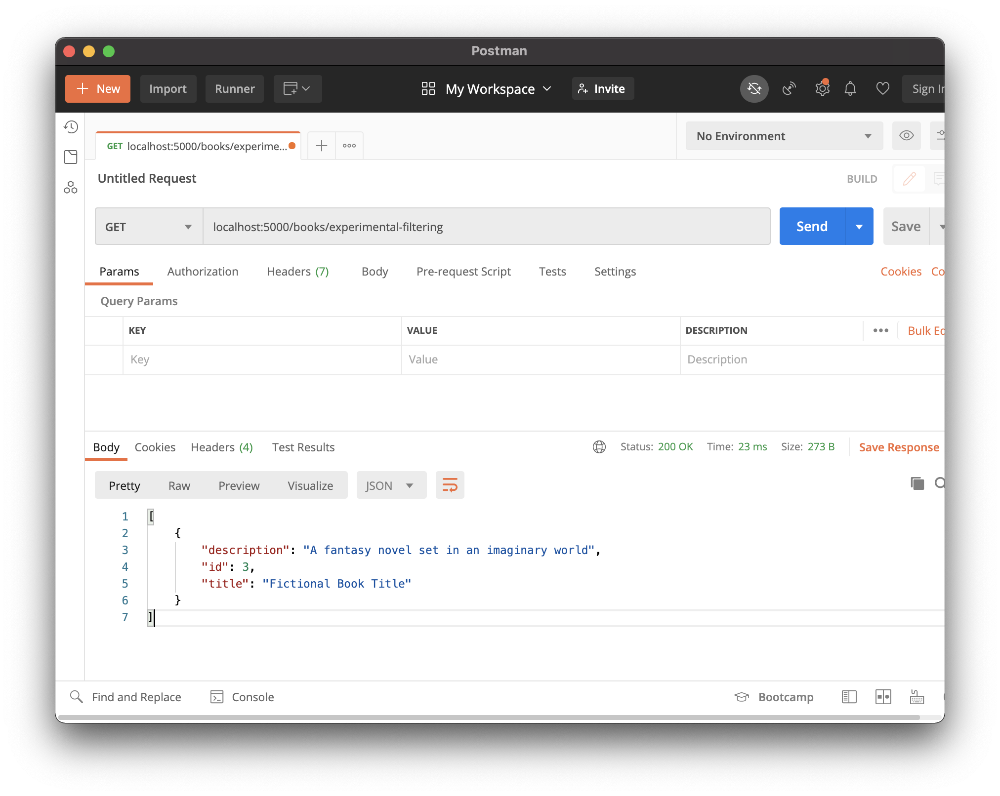

# filter_by and limit

## Goals

Our goal for this lesson is to:

- Explore more query functionality made available by Flask-SQLAlchemy

## Branches

This lesson is exploratory and does not alter the `hello-book-api` repo.

## Queries

[There's more to explore with querying](https://flask-sqlalchemy.palletsprojects.com/en/2.x/queries/#querying-records)! Let's touch on two topics.

### Filter By

We can use the method `filter_by` in order to filter our search query. We can give keyword arguments to describe the attribute and value on which we're filtering. Consider this example that filters `Book`s by title.

```python
Book.query.filter_by(title="Fictional Book Title")
```

### !callout-info

### Way More to Explore

There's way more to explore in filtering than is covered in this curriculum, so drive your own learning!

### !end-callout

### !callout-info

### Pro-Tip: Experiment in Flask With Experimental Endpoints

Take the time to experiment in your Flask API! Consider making a small experimental endpoint that will never be committed to Git.



### !end-callout

### Limits

We can limit the number of results in our queries by using `limit`. Consider this example that gets the first 100 `Book` records.

```python
Book.query.limit(100).all()
```

## Check for Understanding

<!-- Question Takeaway -->
<!-- prettier-ignore-start -->
### !challenge
* type: paragraph
* id: Nn1Bb2
* title: 404s and More Queries
##### !question

What was your biggest takeaway from this lesson? Feel free to answer in 1-2 sentences, draw a picture and describe it, or write a poem, an analogy, or a story.

##### !end-question
##### !placeholder

My biggest takeaway from this lesson is...

##### !end-placeholder
### !end-challenge
<!-- prettier-ignore-end -->
