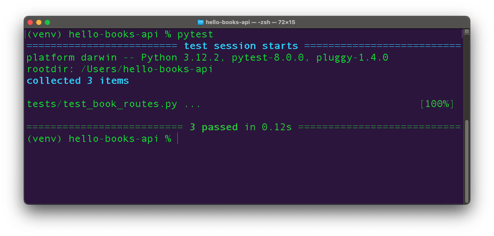

# POST /books Test

## Goals

Our goals for this lesson are to:
- Use fixtures to create test data
- Write tests that use test data

## Branches

| Starting Branch | Ending Branch|
|--|--|
|`06d-read-one-books-test` |`06e-post-books-test`|


# Syntax

We'll wrap up our foray into API unit testing with a test for our POST route `create_book()`. Since we are testing out creating and storing a record, rather than accessing an existing record, the test doesn't need any fixtures which create data. However, like our previous tests, the `create_book()` test will require the client fixture to make our request. Let's read through this test we can use in our file `tests/test_book_routes.py`.

```python
def test_create_one_book(client):
    # Act
    response = client.post("/books", json={
        "title": "New Book",
        "description": "The Best!"
    })
    response_body = response.get_json()

    # Assert
    assert response.status_code == 201
    assert response_body == {
        "id": 1,
        "title": "New Book",
        "description": "The Best!"
    }
```

| <div style="min-width:250px;"> Piece of Code </div> | Notes|
|--|--|
|`def test_create_one_book(client):` | Continuing our best pytest practices, this test should start with the name `test_`, and it should describe the nature of this test.|
|`client.post("/books", json=...`|Sends an `POST` request to `/books` with the JSON request body passed in as the `json` keyword argument| 
| `response_body = response.get_json()`| Get the JSON response body with `response.get_json()`|
|`assert response.status_code == 201`|Check for the expected status code|
|`assert response_body == {...}}`| Check for the expected key/value pairs in the response body|

As always, we should run `pytest` and ensure that the `POST` test passes and no other tests have been affected by our changes.

  
_Fig. Test output reporting 3 tests in `tests/test_book_routes.py` passed. ([Full size image](../assets/api-6-testing/api-6-testing_post_test_success.png))_

## Check for Understanding

<!-- prettier-ignore-start -->
### !challenge
* type: multiple-choice
* id: d27c63d0-8dd3-4c09-ab95-e23e9d128aea
* title: POST /books Test
##### !question

Which of the statements below is true about why the test above, `test_create_one_book`, only needs the `client` fixture dependency? Select one option below.

##### !end-question
##### !options

a| The `client` fixture also creates data used by the test `test_create_one_book`.
b| `test_create_one_book` doesn't need the `client` fixture.
c| `test_create_one_book` doesn't need to retrieve a pre-existing record, so it does not need a fixture that saves Book records.
d| The `client` fixture needs to used for every test using the `pytest` framework.

##### !end-options
##### !answer

c|

##### !end-answer
##### !hint

What does the client fixture do for us? When do we need fixtures which create data and why?

##### !end-hint
##### !explanation

1. False: The `client` fixture does not create any `Book` records
2. False: The `client` fixture allows us to make requests to our API, so we must include it as a dependency.
3. True: We only need a fixture which creates a `Book` record before the test runs if the test depends on there being data in the database.
4. False: We only need to use the `client` fixture for tests where we need the ability to make requests against our API's routes.

##### !end-explanation
### !end-challenge
<!-- prettier-ignore-end -->