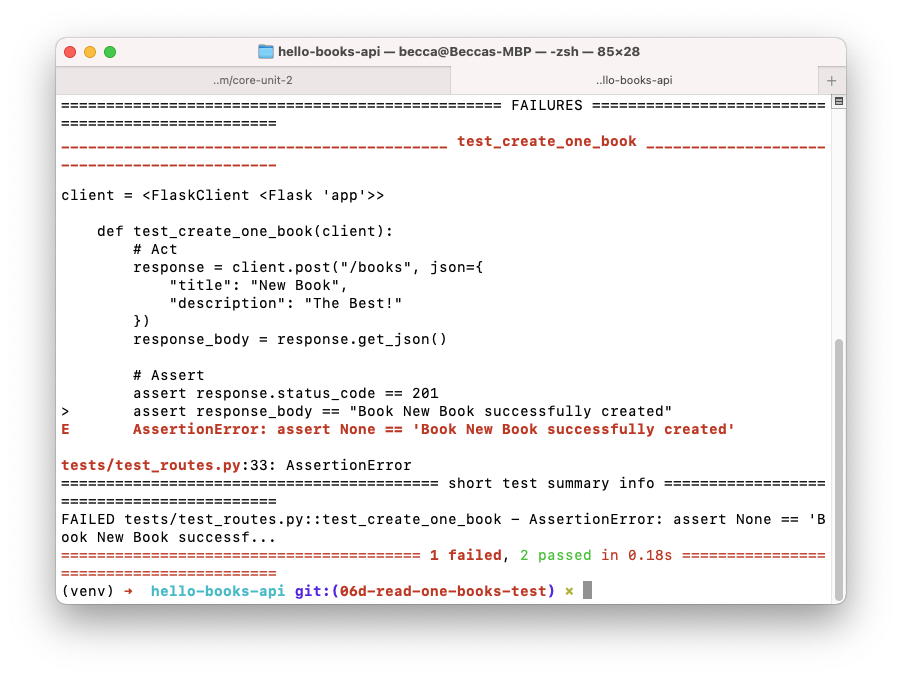

# POST /books Test

## Goals

Our goals for this lesson are to:
- Use fixtures to create test data
- Write tests that use test data

## Branches

| Starting Branch | Ending Branch|
|--|--|
|`06d-read-one-book-test` |`06e-post-books-test`|


# Syntax

Let's read through this test we can use in our tests/test_routes.py.

```python
def test_create_one_book(client):
    # Act
    response = client.post("/books", json={
        "title": "New Book",
        "description": "The Best!"
    })
    response_body = response.get_json()

    # Assert
    assert response.status_code == 201
    assert response_body == "Book New Book successfully created"
```

| <div style="min-width:250px;"> Piece of Code </div> | Notes|
|--|--|
|`def test_create_one_book(client):` | Continuing our best pytest practices, this test should start with the name `test_`, and it should describe the nature of this test.|
|`client.post("/books", json=...`|Sends an `POST` request to `/books` with the JSON request body passed in as the `json` keyword argument| 
| `response_body = response.get_json()`| Get the JSON response body with `response.get_json()`|
|`assert response.status_code == 201`|Check for the expected status code|
|`assert response_body == "Book New Book successfully created"`|Check for the expected response body|

## Run and Debug Test

When we run are test using `pytest` we will see a failure:



Reading the test failure output indicates tat `response.get_json()` returns `None` whereas we expect it to return `"Book New Book successfully created"`.

To investigate this error we may start by looking at the [`get_json` documentation](https://flask.palletsprojects.com/en/2.0.x/api/?highlight=get_json#flask.Response.get_json) and will note this piece:

```
"If the mimetype does not indicate JSON (application/json, see is_json), this returns `None`."
```

Futher investigation might lead us to the [`get_data` method](https://flask.palletsprojects.com/en/2.0.x/api/?highlight=get_json#flask.Response.get_data) and we will find that if we use `response_body = response.get_data(as_text=True)` our test will pass.

Alternatively, we can `jsonify` the response body in our `POST` `/books` route:

```python
return make_response(jsonify(f"Book {new_book.title} successfully created"), 201)
```

Note that `POST` test passes with this change:


We will prefer this second solution because it adds consistency to our routes. We consistently return `JSON` in our response bodies, and thus can consistently use the method `get_json` in our tests. 

We should also make this change to `jsonify` our response body in the `PUT` `/books/<book_id>` and `DELETE` `/books/<book_id>` routes. This adds predictability to our RESTful routes. 

We may also consider refactoring these routes to return a dictionary consistent with the responses typically expected for this RESTful routes. We will save this work for a later lesson.

<!-- prettier-ignore-start -->
### !challenge
* type: tasklist
* id: d27c63d0-8dd3-4c09-ab95-e23e9d128aea
* title: Create One Book Test
##### !question

Think about the test for `POST` `/books`

Check off all the topics that we've touched on so far.

##### !end-question
##### !options

* Examined the `test_create_one_book` syntax
* Considered using `get_data(as_text=True)`
* Refactored our `POST` `\books`route to use `jsonify`
* Refactored our `PUT` `\books` route to use `jsonify`
* Refactored our `DELETE` `\books` route to use `jsonify`

##### !end-options
### !end-challenge
<!-- prettier-ignore-end -->