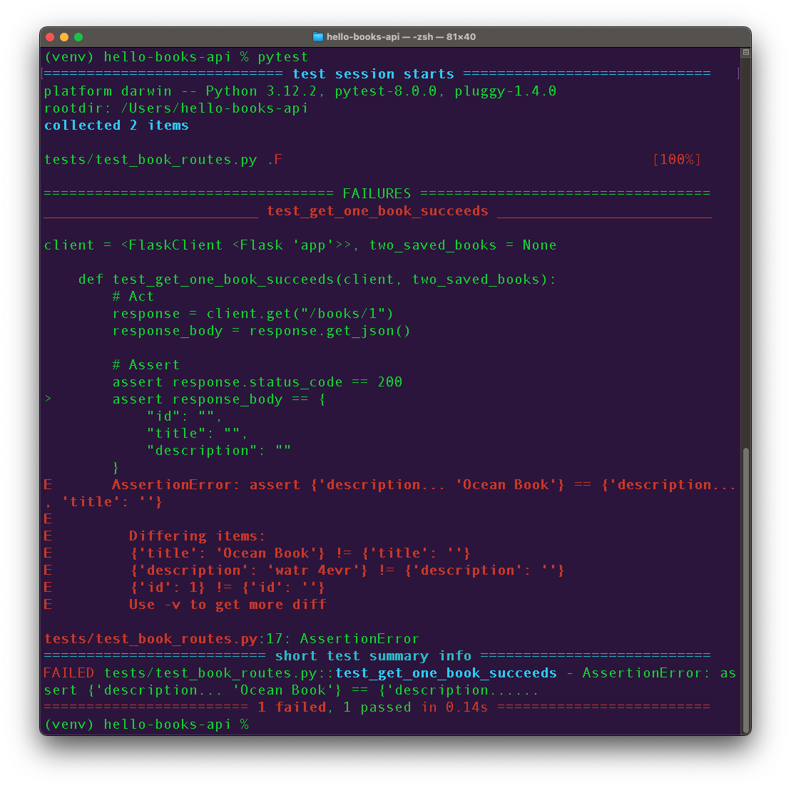
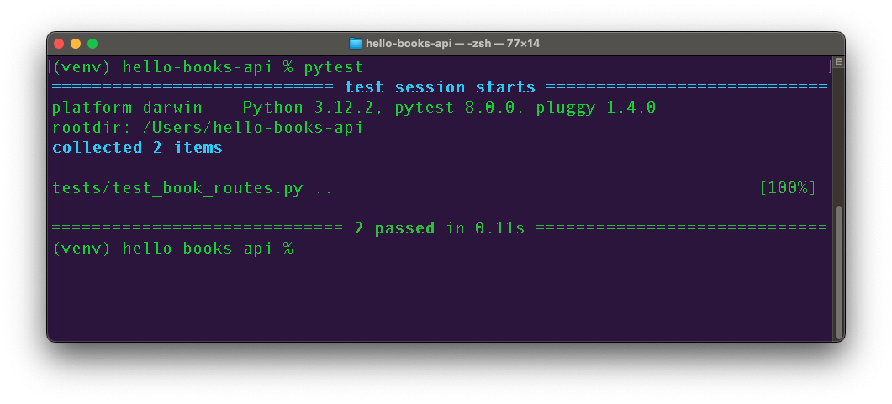

## Tests That Need Test Data

Let's consider a second test in `tests/test_routes.py`.

When we make a `GET` request to `/books/1`, we expect a response of `200`, with a JSON response body.

The JSON response body should include the keys `"id"`, `"title"`, and `"description"`.

```python
def test_get_one_book(client):
    # Act
    response = client.get("/books/1")
    response_body = response.get_json()

    # Assert
    assert response.status_code == 200
    assert response_body == {
        "id": "",
        "title": "",
        "description": ""
    }
```

However, this test isn't complete yet...

If we run this test right now, we actually get a 404!


Why would we get a `404` response?

<br />

<details style="max-width: 700px; margin: auto;">
    <summary>
        Expand this section to follow a debugging interlude!
    </summary>

Why would we get a `404` response?

Let's follow these debugging steps:

<!--
    These bullets aren't numbered lists because
    Galvanize Learn doesn't keep their formatting,
    even if we manually number them.
 -->

- First, let's confirm we understand what the test is doing:

```python
def test_get_one_book(client):
    response = client.get("/books/1")
```

Our test made a `GET` request to `/books/1`. A `GET` to `/books/1` matches the `/books/<book_id>` route with the `GET` method. This is mapped to our `handle_book()` function.

- Let's revisit our `handle_book()` function:

```python
@books_bp.route("/<book_id>", methods=["GET", "PUT", "DELETE"])
def handle_book(book_id):
    book = Book.query.get(book_id)
    if book == None:
        return Response("", status=404)
    # ... rest of our route
```

Our `handle_book()` function returns a `404` response if `book` is `None`.

- Let's consider why `book` might have a value of `None`.
  1.  What is the line of code that most recently affected `book`?
  1.  `book` is assigned a value in the line before, `book = Book.query.get(book_id)`.
  1.  `Book.query.get(book_id)` must have returned `None`.

Why would `Book.query.get(book_id)` return `None`? What could cause it to behave that way?

- What do we know about how `Book.query.get(book_id)` works?
  1.  The responsibility of this method is to return an instance of `Book` that has the primary key of `book_id`.
  1.  This method returns `None` when no `Book` with that id was found!

Our debugging questions can continue along this line of thought:

1. Why is there no book that was found?
1. Where is the test looking for books?
1. Is the test (and the `app` object made in `create_app()`) set to look at the correct database?
1. Are our environment variables accessed and set correctly?
1. Are there any books in the test database?

This final question is harder to confirm than might be expected! In the Test Setup lesson, we very briefly looked at the `app` fixture. But the full significance of the `db.create_all()` and `db.drop_all()` lines within the fixture may not have been apparent.

At the start of _each_ test, `db.create_all()` will rebuild the entire test database, creating all the tables needed for our models. Crucially, these tables begin _empty_!

Then at the end of _each_ test, `db.drop_all()` deletes _all_ the tables from the database. This prevents any test data created during one test from contaminating later tests. But this also means that if a test is not actively running, the test database will appear to be _completely_ empty! We won't even see empty tables. There will be _no_ tables!

Using our ability to debug tests with breakpoints though VS Code, it _is_ possible to pause during the middle of a test, which would give us a chance to connect to the test database and check on its state. This can be very helpful for more complicated tests!

But for the time being, we need only apply the knowledge that `db.create_all()` recreates the test database tables in an empty state at the start of each test.

This means that when we try to get the `Book` with a primary key of `1`, no `Book` is found. `Book.query.get(book_id)` returns `None`, resulting in the `404 Not Found` response status code and the failure of our test!

</details>

To address our test failure, we'll look at one way to populate the test database.

## Adding Test Data with Fixtures

We could write code directly in our test to create data as part of our "Arrange" section. We could write helper functions if this data needs to be shared with other tests.

Or by using fixtures instead, we get data reusability and we explicitly list the data dependencies our test has!

Let's review some of the characteristics of fixtures, and consider how we can use them to add test data:

| <div style="min-width:100px;">Question</div> | Answer                                                                                                                                                                                                                   |
| -------------------------------------------- | ------------------------------------------------------------------------------------------------------------------------------------------------------------------------------------------------------------------------ |
| What are fixtures?                           | Each pytest fixture we define describes something we want to happen before a test. We could define a fixture that creates test data.                                                                                     |
| Where do fixtures go?                        | Fixtures can be defined in any file (such as `tests/test_routes.py`), but we will define most of our fixtures inside of `tests/conftest.py`. This automatically allows them to be used in multiple test files if needed. |
| Who uses them?                               | Each test states which fixtures they want to use. Each test can use multiple fixtures!                                                                                                                                   |

### Example Fixture: Creating Two Books

A lot of our tests need at least one book defined in our database. Inside `tests/conftest.py`, we can make a fixture that saves two books to the database:

```python
from app.models.book import Book
# ...

@pytest.fixture
def two_saved_books(app):
    # Arrange
    ocean_book = Book(title="Ocean Book",
                      description="watr 4evr")
    mountain_book = Book(title="Mountain Book",
                         description="i luv 2 climb rocks")

    db.session.add_all([ocean_book, mountain_book])
    # Alternatively, we could do
    # db.session.add(ocean_book)
    # db.session.add(mountain_book)
    db.session.commit()
```

| <div style="min-width:250px;"> Piece of Code </div> | Notes                                                                                                                              |
| --------------------------------------------------- | ---------------------------------------------------------------------------------------------------------------------------------- |
| `from app.models.book import Book`                  | We will make instances of the `Book` class (model), so we need to import `Book` into this file                                     |
| `@pytest.fixture`                                   | Each fixture starts with this decorator                                                                                            |
| `def two_saved_books( ... ):`                       | We can name our fixtures whatever we want. `two_saved_books` is a reasonable name that will help remind us what this fixture does. |
| `app`                                               | This fixture needs to request the use of the `app` fixture, defined previously, so we know the test database has been initialized. |
| `ocean_book = ...`                                  | We can make our first `Book` instance...                                                                                           |
| `mountain_book = ...`                               | ... and our second `Book` instance                                                                                                 |
| `db.session.add_all([ ... , ... ])`                 | We can use the `add_all()` function to add a list of instances                                                                     |
| `db.session.commit()`                               | This line commits and saves our books to the database                                                                              |

#### Requesting Fixtures in Tests

To actually use this fixture in a test, we need to request it by name.

```python
def test_get_one_book(client, two_saved_books):
    # Act
    response = client.get("/books/1")
    # ...
```

We must add the `two_saved_books` fixture to our test's parameters. We can comma-separate as many fixtures as this single test needs.

#### Completing Our Test

We've set up tests, we've created a test fixture, and we've made sure our tests used the test fixture. But our test still fails!

We get this test failure:

```
E       AssertionError: assert {'description... 'Ocean Book'} == {'description..., 'title': ''}
E         Differing items:
E         {'title': 'Ocean Book'} != {'title': ''}
E         {'id': 1} != {'id': ''}
E         {'description': 'watr 4evr'} != {'description': ''}
E         Use -v to get the full diff
```



The output shows that the data coming back from our API looks reasonable, but that the value we are comparing to in our test has empty strings for each dictionary value.

We can conclude that we need to update our test itself, finally! Let's fill in the expected test dictionary values back in `tests/test_routes.py`. It should be consistent with whatever data we put in our fixture.

```python
def test_get_one_book(client, two_saved_books):
    # Act
    response = client.get("/books/1")
    response_body = response.get_json()

    # Assert
    assert response.status_code == 200
    assert response_body == {
        "id": 1,
        "title": "Ocean Book",
        "description": "watr 4evr"
    }
```

### !callout-success

## We Passed the Test!

Success! We passed this test. Congratulations! 🎉

### !end-callout



## Check for Understanding

<!-- Question Takeaway -->
<!-- prettier-ignore-start -->
### !challenge
* type: paragraph
* id: 6e07e81e-006c-4bb0-a798-c3990b1b65df
* title: Using Tests
##### !question

What was your biggest takeaway from this lesson? Feel free to answer in 1-2 sentences, draw a picture and describe it, or write a poem, an analogy, or a story.

##### !end-question
##### !placeholder

My biggest takeaway from this lesson is...

##### !end-placeholder
### !end-challenge
<!-- prettier-ignore-end -->
