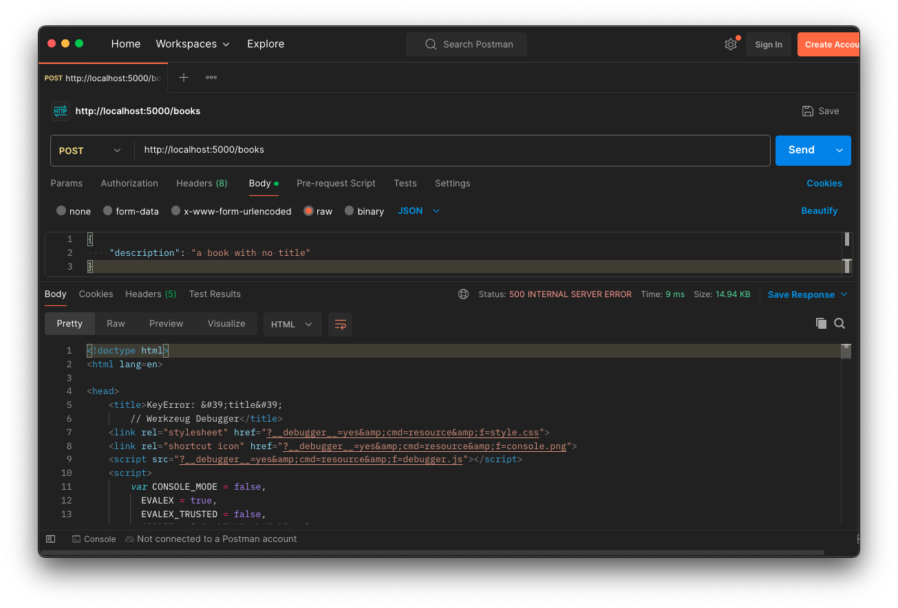

# Extracting Helper Functions Pt. 1

## Goals
Our goals for this lesson are to: 
- Define class method syntax
- Create a class method named `from_dict` in `book.py` 
- Refactor the code for creating a `Book` model in the `create_book` route to use `from_dict`

To do this we will:
- Plan our refactor by 
  - identifying what code we will refactor  
  - identifying dependencies on the code being refactored
  - ensuring we have strong test coverage
- Execute our refactor by 
  - writing new, reusable, helper functions
  - replacing the existing code with our new functions
  - frequently running our tests as we work to ensure our code's behavior remains the same

## Branches

| Starting Branch | Ending Branch|
|--|--|
|`06e-post-books-test` |`07a-from-dict-refactor`|

<details>
   <summary>Expand to see the features <code>Hello Books API</code> should have before this lesson</summary>

- A `hello_books_development` database
- A `book` table defined
- A `Book` model defined

Endpoints defined for these RESTful routes:
- `GET` to `/books`
- `POST` to `/books`
- `GET` to `/books/<book_id>`
- `PUT` to `/books/<book_id>`
- `DELETE` to `/books/<book_id>`

The `Book` model and table should have the following columns:
- `id`
- `title`
- `description`

Our test suite should have 3 tests: 
- `test_get_all_books_with_no_records`
- `test_get_one_book`
- `test_create_one_book`

</details>
</br>

| Vocab | Definition | Synonyms | How to Use in a Sentence |
|--|--|--|--|
| Convenience Initializer | A function that is not the default initializer for a class that allows us to take actions and perform some extra logic when creating an instance of a class | Secondary Constructor | "The network gives us data back as a list, so we created a convenience initializer that takes in a list and returns an instance of our class." |
| Class Method | A function that is part of the class definition that only has access to class-level variables. It must be prefixed with the decorator `@classmethod` and takes `cls` as its first parameter. Class methods can be called by referencing the class name followed by the function name (Ex.  `<Class_Name>.<function_name>()`) | Class Function | "We created a class method that returns a new instance with all the attributes set to 0" |

## Planning the Refactor

### Identifying Code to Refactor

Our first step in refactoring is taking a critical look at our code to identify what we want to refactor. It's possible that we might notice things we'd like to refactor as we work on other parts of our codebase. As we continue our coding journey, we'll have more experience to draw from and will more easily be able to identify areas that could be improved.

To help us organize our thoughts, we might look through our code:
- Function by function, in the order they happen to appear in a file
- By feature, looking at all the code that relates to a particular feature
- Considering the data lifecycle, looking at code in the order data is created, read, updated, and deleted

Going function by function is a bit arbitrary, since functions can be added to a file in any order, but as our project code is still relatively small, it's as good a place as any to start. In larger projects, we might find it more helpful to think through a particular feature, or the lifecycle of a particular piece of data, to help us organize our thinking.

As we look through our functions, we should keep an eye out for several kinds of code that might be good candidates for refactoring:
- Code that is repeated in multiple places
- Code that "knows" more than it needs to about another part of the codebase
- Code that is difficult to understand
- Code that is difficult to test

## Reasons to Refactor

It's not always cut and dried what will make for a good refactor. Many refactoring decisions are made with an eye towards the future. How we weigh refactoring decisions often comes from experience working on longer-lived projects and seeing what went well and what didn't. As we have the opportunity to work on more projects, we should keep an eye out for what makes code easier to work with and maintain. Notice any patterns used across the code base, and ask about why they're being used. That will help us build our own intuition about how to refactor code to address some of the common issues we see.

### Repeated Code

Repeated code is a problem because it makes our code harder to maintain. If we need to change the behavior of the code, we have to change it in multiple places. If we forget to change it in one place, we can introduce bugs from the inconsistency.

When we see repeated code, we should ask ourselves if there's a way to write the code once and use it in multiple places. Most commonly, we'll extract the repeated code into a function and call that function from the places where the code was repeated.

### Code That "Knows" Too Much

Code that "knows" too much is code that has to be changed in response to another part of the codebase changing. This is a problem because it makes our code brittle. If we change one part of the codebase, we have to remember to change another part of the codebase, and we can introduce bugs if we forget to make the change in both places.

When we see code that "knows" too much, we should ask ourselves if there's a way to make the code more flexible. Most commonly, we'll extract the code that "knows" too much into a function and pass in the information it needs as arguments.

Notice this is more or less another way to phrase thinking about the Separation of Concerns, or the Single Responsibility Principle.

### Code That Is Difficult to Understand

Code that is difficult to understand is a problem because it makes our code harder to work with. If we need to change the behavior of the code, we have to understand it first. If we misunderstand the code, we can introduce bugs when we try to make changes.

When we see code that is difficult to understand, we should ask ourselves if there's a way to make the code clearer. Most commonly, we'll extract the code that is difficult to understand into a function and give that function a clear name that describes what the code does. This helps separate the "what" from the "how" of the code. While it's still true that to make changes within the extracted function we'll need to understand the code, we can at least understand the code in isolation, and we can test the code in isolation.

### Code That Is Difficult to Test

Code that is difficult to test is a problem because it makes our code harder to maintain. If we need to change the behavior of the code, we have to test it first. If we can't test the code, we can't be sure that our changes won't introduce bugs.

When we see code that is difficult to test, we should ask ourselves if there's a way to make the code easier to test. Most commonly, we'll extract the code that is difficult to test into a function or class that we can call directly from a test. Sometimes, we'll need to change how data or other logic required by the code is managed to make the code easier to test.

### General Maintainability

General maintainability tends to be the driving force behind most of our refactoring decisions.

We want our code to be easy to work with, easy to understand, easy to test, and easy to change. We want to be able to make changes to our codebase quickly and confidently. We want to be able to add new features to our codebase without breaking existing features. We want to be able to fix bugs in our codebase without introducing new bugs. We want to be able to refactor our codebase without breaking existing features. We want to be able to delete code from our codebase without breaking existing features. We want to be able to move code from one part of our codebase to another part of our codebase without breaking existing features.

In short, we want to be able to work on our codebase without being afraid of breaking existing features.

## Refactors in Our Codebase

Let's look through our code, keeping an eye out for some of the common reasons we might want to refactor. Most of the code that isn't focused on starting up the application in is `book_routes.py`, so let's start there.

The first function is `create_book`. This function creates a new `Book` instance by
1. getting a dictionary representing the request body
2. extracting values for the `title` and `description` keys from the dictionary
3. passing those values by name to the `Book` constructor

After storing the new `Book` instance in the database, the function returns a response consisting of a dictionary with string keys, whose values are filled with data from the saved `Book` instance. 

At this point, we might not see much to refactor, so let's keep looking.

The next function is `get_all_books`. This function retrieves all the `Book` instances from the database, applying a number of optional filters, then creates a list of dictionaries, each representing a `Book` instance. The function returns the list of dictionaries as the response body.

This code is definitely more complicated than the `create_book` function. Maybe there's some way we can simplify all that filtering code? It would be great if it could be reused for any other model types that we add to the project! For the moment, let's put a pin in that idea, since there's another possible refactor in this function that we can tackle a little more directly.

`get_all_books` needs to return a collection of `Book` models as a list of dictionaries. Each `Book` model is used to build a dictionary in the response. We can see that the code to build a dictionary from a `Book` model is repeated in the `create_book` function. Taking a quick glance at the next function, `get_one_book`, we can see that it also builds a dictionary from a `Book` model.

Our routes currently have code in three different places that builds a dictionary from a `Book` model. This repetition makes it a great candidate for refactoring! It's also potentially a good candidate for refactoring because it's code that "knows" too much. Why does the route logic need to know how to build a dictionary from a `Book` model? Why does the route logic need to know the names of all the fields in the `Book` model, and all the key names in the dictionary? If the `Book` model knew how to build a dictionary from itself, the route logic wouldn't need to know any of that! All the route would need to know is how to ask a `Book` instance to build a dictionary from itself.

Alright, we've identified the logic that builds a dictionary from a `Book` model as a good candidate for refactoring. But we also just saw another chunk of code related to `Book` models and dictionaries. The `create_book` function takes a dictionary and uses it to create a `Book` model. While not repeated, this logic is similar in functionality to the logic that builds a dictionary from a `Book` model. It's effectively the inverse operation. From that perspective, it's also code that "knows" too much. The route logic wouldn't need to know how to create a `Book` model from a dictionary if the `Book` model knew how to create itself from a dictionary!

That makes two good candidates for refactoring:
1. the logic that builds a dictionary from a `Book` model, and
2. the logic that creates a `Book` model from a dictionary

Though we identified the logic that builds a dictionary from a `Book` model as a refactoring candidate first, we'll start by refactoring the logic that creates a `Book` model from a dictionary. Without getting into too much detail here, starting with the dictionary-to-model logic will let us write tests that both reflect our desired behavior and actually pass at the end of this lesson. If we started with the model-to-dictionary logic, then writing tests that pass would require us to write tests that don't reflect our desired behavior.

If we were doing this in a real project, we would probably do all of this more or less together, avoiding the issue of having an arbitrary checkpoint (the end of a lesson). But since we need to start *somewhere*, we'll start with the case that won't force us to compromise our tests: the dictionary-to-model logic.

## The Code That Knew Too Much

While code repetition usually provides a pretty clear reason for why we would perform a refactor, there are many other reasons we might want to refactor our code!

A common reason is improving our code organization. We often want functions that operate directly on a particular class to be bundled with that class's code. This makes it easier to find and navigate logic related to that class. By moving the logic within the class itself, we also reduce the amount of code that "knows" about the implementation details of the class.

There are many kinds of functions we package with classes, but let's focus on initializers for a moment. All classes have some kind of initializer, whether it's the default initializer the language provides, or one we write ourselves. **Convenience Initializers** are functions other than the default initializer that let us perform some extra logic or set up defaults to create an instance of a class. Tying it back to `Hello Books`, if we know that we'll frequently have a dictionary and want to create a `Book` from its contents, we might want a convenience initializer bundled with the `Book` class to handle the task.

## Class Methods

We've worked with instance methods, so we know we can write functions that are packaged with a class. But instance methods are called on a specific instance of a class that _already exists_ and we're looking at how to write a function that _creates_ a `Book`. How do we associate a method with a class when that method won't have an instance to be called on?

What we need in this case is a class method! To create a class method we need to do 2 things:
- use a new function decorator, `@classmethod` 
- accept `cls` as the first parameter to our function

As an example, if we wanted to write a class method named `create_from_list` that takes in a list as input, its function signature might look like:

```python
class Point:
    @classmethod
    def create_from_list(cls, list_data):
       ...
``` 

### What is `cls`?

The `cls` parameter is a reference to the class definition itself, and it operates similarly to `self` for instance methods.

When we write an instance function, we accept `self` as the first parameter so that when the function is executing, it has a way to access the attributes of a particular instance, and can call other methods on that instance.

When we accept `cls` as a parameter, it acts as a reference to the class itself, granting us the ability to use other class methods, and to see and modify class variables—pieces of data held by the class itself and shared by all instances of the class.

### !callout-info

## `cls` is a convention, not a keyword

Just as with `self` for instance methods, `cls` is a convention, not a keyword. We could use any name we like for the parameter, but `cls` is a common choice. It's short for "class" and makes it clear that the parameter is a reference to the class itself.

<br>

If we forget to include `cls` as the first parameter to a `@classmethod`, Python will still attempt to pass the class as the first parameter, whatever we've named it. This usually results in a `TypeError` reporting a mismatch in the number of supplied positional arguments, since Python is attempting to pass in one more argument than the function is expecting (the class), just as with instance methods that forget to include a parameter for `self` (the instance).

### !end-callout

 Since `cls` is a reference to the class, inside a class method we can use `cls` in place of the name of the class. Take a look at the code below; both of the functions will have the same effect of creating a new `Point` instance.

```python
class Point:
   @classmethod
   def create_instance_using_cls(cls):
      return cls()

   @classmethod
   def create_instance_using_class_name(cls):
      return Point()
```

## Planning the Refactor

So far we've set the stage - we know what we want to refactor, why we're doing it, and we have some new tools for writing the code. Let's get into it! 

### Identifying Dependencies

We identified the code we want to refactor, but do we have the safety net we need to refactor confidently? To know that, we need to first identify our dependencies, then ensure we have strong test coverage around those scenarios.

To identify dependencies, we should look at the code base and ask "Where is the code I'm refactoring being called?" We should keep track of all the locations we find. If we're refactoring code inside a class, we also want to ask "Does any other code extend or inherit this class?"


<!-- prettier-ignore-start -->
### !challenge
* type: paragraph
* id: d418f12b
* title: Extracting Helper Functions Pt. 1
* 
##### !question
Take a few minutes to look over `hello_book`'s routes and model files, and make a list of the dependencies you notice that are related to creating a new `Book` instance. When you're done, check out the explanation to see what dependencies we found. 
##### !end-question

##### !placeholder
The dependencies I found are...
##### !end-placeholder

##### !explanation
We searched the project for locations where we create a `Book` model. Doing a case-sensitive search for `Book(`, or right-clicking on the `Book` class name and selecting "Find Usages" in VS Code, can be useful ways of locating candidate dependencies quickly, though they may not catch every use of the class.

<br>

We found code that was building a `Book` instance in the `create_book` route, as well as in the `two_saved_books` fixture in `conftest.py`.
##### !end-explanation

### !end-challenge
<!-- prettier-ignore-end -->

We're planning to refactor code that creates a `Book` model, so we can begin by looking for places that call the `Book` constructor.

If we look through the `Hello Books` project, one place we find code that creates `Book` instances is `conftest.py`. However, here we're choosing to pass the default constructor specific values for testing. We should avoid changing these uses of `Book`. 

The only other place we create a `Book` is in the `create_book` route. There we're getting the values from a dictionary. Since `create_book` is the only function that will be affected by our changes, we've completed identifying our dependencies and can move forward by examining our test suite.

<br>

<details>
   <summary>Expand for a reminder of the current <code>create_book</code> route implementation. </summary>

```python
@books_bp.post("")
def create_book():
    request_body = request.get_json()
    title = request_body["title"]
    description = request_body["description"]

    new_book = Book(title=title, description=description)
    db.session.add(new_book)
    db.session.commit()

    response = {
        "id": new_book.id,
        "title": new_book.title,
        "description": new_book.description,
    }
    return response, 201
```

</details>

### Check for Tests

Let's take a look in `test_book_routes.py` and see what our test cases look like for `create_book`.

```python
def test_create_one_book(client):
    # Act
    response = client.post("/books", json={
        "title": "New Book",
        "description": "The Best!"
    })
    response_body = response.get_json()

    # Assert
    assert response.status_code == 201
    assert response_body == {
        "id": 1,
        "title": "New Book",
        "description": "The Best!"
    }
```

We have a solid nominal case, but we're missing tests for edge cases. Take some time to think about what edge cases would be useful, and try writing the tests. When you're done, check out the cases we added below.

<br>

<details>
   <summary>New test cases for <code>create_book</code></summary>

```python
import pytest
...

def test_create_one_book_no_title(client):
    # Arrange
    test_data = {"description": "The Best!"}

    # Act & Assert
    with pytest.raises(KeyError, match='title'):
        response = client.post("/books", json=test_data)

def test_create_one_book_no_description(client):
    # Arrange
    test_data = {"title": "New Book"}

    # Act & Assert
    with pytest.raises(KeyError, match = 'description'):
        response = client.post("/books", json=test_data)

def test_create_one_book_with_extra_keys(client):
    # Arrange
    test_data = {
        "extra": "some stuff",
        "title": "New Book",
        "description": "The Best!",
        "another": "last value"
    }

    # Act
    response = client.post("/books", json=test_data)
    response_body = response.get_json()

    # Assert
    assert response.status_code == 201
    assert response_body == {
        "id": 1,
        "title": "New Book",
        "description": "The Best!"
    }
```

</details>

We added three additional tests to cover edge cases for `create_book`. The first two look for cases where the request body is missing either the `title` or `description` keys. The third test checks for extra keys in the request body. The first two cases should fail to create a `Book`, while the third case should still create a `Book` successfully, ignoring the extra keys.

But what's going on with how we are checking for failure? Let's use Postman to send a request to create a book with no title and see what happens.

  
*Fig. Sending a request to create a book with no title results in a 500 Internal Server Error response. ([Full size image](../assets/api-7-refactoring/api-7-refactoring_extracting-helper-functions-from-dict_create-with-no-title.png))*

Notice that the title of the error output is `KeyError: 'title'`. Flask has caught the `KeyError` resulting from trying to access a key that doesn't exist in the dictionary, and has returned a 500 Internal Server Error response. But if we run the tests as shown above (which are expecting a `KeyError` to occur), they succeed.

We should be writing our route tests so that they confirm the behavior we want a caller to see, but here, we had to write our tests to watch for a `KeyError` because the Flask test client "leaks" that internal error to us! In order to write tests that confirm the behavior we want, we need to change how we handle the error in the route.

Remember that we don't usually respond a 500 Internal Server Error response when the client sends a request with missing data. Instead, we send back a 400 Bad Request response, indicating that the client has sent a request that the server can't process.

Rather than letting the `KeyError` propagate up to Flask, we should catch it and return a 400 Bad Request response with a message that tells the client what went wrong. Try to make that change in the `create_book` route, then take a look at our updated implementation below.

<br>

<details>
   <summary>Expand to see our changes to the <code>create_book</code> route implementation that will turn a <code>KeyError</code> into a Bad Request response.</summary>

```python
@books_bp.post("")
def create_book():
    request_body = request.get_json()

    try:
        title = request_body["title"]
        description = request_body["description"]

        new_book = Book(title=title, description=description)

    except KeyError as error:
        response = {"message": f"Invalid request: missing {error.args[0]}"}
        abort(make_response(response, 400))

    db.session.add(new_book)
    db.session.commit()

    response = {
        "id": new_book.id,
        "title": new_book.title,
        "description": new_book.description,
    }
    return response, 201
```
</details>

Now our code handles the `KeyError` when reading from `request_body` by generating a response that tells the client what went wrong, and sets the response status code to 400 Bad Request.

Running our tests, we'll see the two tests that were expecting a `KeyError` to fail, since we're now returning a 400 Bad Request response. The other tests should still pass.

Let's fix the failing tests by updating the expected response status codes and messages. Try updating the tests yourself, then take a look at our updated tests below.

<br>

<details>
   <summary>Updated test cases for <code>create_book</code> that check for a 400 Bad Response</summary>

```python
def test_create_one_book_no_title(client):
    # Arrange
    test_data = {"description": "The Best!"}

    # Act
    response = client.post("/books", json=test_data)
    response_body = response.get_json()

    # Assert
    assert response.status_code == 400
    assert response_body == {'message': 'Invalid request: missing title'}

def test_create_one_book_no_description(client):
    # Arrange
    test_data = {"title": "New Book"}

    # Act
    response = client.post("/books", json=test_data)
    response_body = response.get_json()

    # Assert
    assert response.status_code == 400
    assert response_body == {'message': 'Invalid request: missing description'}
```
</details>

Our route is now responding with a 400 Bad Request response when the client sends a request with missing data, and our tests are confirming that behavior.

We now have tests that validate the route behavior for several nominal and edge cases. We're ready to start refactoring!

## Executing the Refactor

As it stands we know:
- Our existing tests are pretty solid.
- We're writing a function to initialize a `Book` model from a dictionary.
  - Since it creates the instance "from a dict", let's call the method `from_dict`.
- `from_dict` will take in a dictionary and return a new `Book` instance.
- `from_dict` will be a class method that we invoke from the `Book` class (for example, `Book.from_dict(<some_dictionary>)`).

We'll start the implementation as we often do, by... 

### Writing Failing Tests!

When we're following Test Driven Development (TDD), our first step is to write tests for `from_dict` that will fail until we write our new function. We'll create a new file `test_book_model.py` and add tests to cover nominal and edge cases for the `from_dict` function. The `test_book_model.py` file will be placed in the same directory as `test_book_routes.py`.

Let's pause to think through what cases we might test for the `from_dict` function and what data we need to arrange and check those cases. When you're ready, check out our `test_book_model.py` code below.

<br>

<details>
   <summary>Tests for <code>from_dict</code> in <code>test_book_model.py</code></summary>

```python
from app.models.book import Book
import pytest

def test_from_dict_returns_book():
    # Arrange
    book_data = {
        "title": "New Book",
        "description": "The Best!"
    }

    # Act
    new_book = Book.from_dict(book_data)

    # Assert
    assert new_book.title == "New Book"
    assert new_book.description == "The Best!"

def test_from_dict_with_no_title():
    # Arrange
    book_data = {
        "description": "The Best!"
    }

    # Act & Assert
    with pytest.raises(KeyError, match = 'title'):
        new_book = Book.from_dict(book_data)

def test_from_dict_with_no_description():
    # Arrange
    book_data = {
        "title": "New Book"
    }

    # Act & Assert
    with pytest.raises(KeyError, match = 'description'):
        new_book = Book.from_dict(book_data)

def test_from_dict_with_extra_keys():
    # Arrange
    book_data = {
        "extra": "some stuff",
        "title": "New Book",
        "description": "The Best!",
        "another": "last value"
    }

    # Act
    new_book = Book.from_dict(book_data)

    # Assert
    assert new_book.title == "New Book"
    assert new_book.description == "The Best!"
```

</details>

Notice some of the decisions we made in our tests:
- We're testing that `from_dict` returns a `Book` instance with the correct attributes when given a dictionary with the correct keys.
- We're testing that `from_dict` raises a `KeyError` when given a dictionary with missing keys.
- We're testing that `from_dict` ignores extra keys in the dictionary.

These aren't the only behaviors we could have decided on, but they'll meet our initial needs of making sure we have the data we need to create a `Book`. How we communicated that keys are missing was up to us, but since Python raises a `KeyError` when we try to access a key that doesn't exist in a dictionary, we decided to raise a `KeyError` in our tests as well. This will also work well with the existing error logic in the `create_book` route. It would also have been valid to make a different decision about how to handle extra keys. Ignoring them is a common choice, but we could also have restricted the endpoint to only allow valid keys

After running our test suite, we should see all the new tests failing, but everything else passing. We have achieved the Red phase of Red-Green-Refactor! Next stop, Green!

### Write the `from_dict` function

Our next step is to write out our pseudocode. We'll leave that as an exercise for you to try out and move on to writing our function definition. 

For Python to recognize our new function as a class method, we'll need to use the new syntax discussed above, the `@classmethod` decorator and the conventional `cls` parameter:

```python  
    # indented under the Book class definition
    @classmethod
    def from_dict(cls, book_data):
       pass
```

Our tests in `test_book_model.py` for `from_dict` should still be failing at this point. If they are, we can start changing any pseudocode we've planned into Python code. Try out writing the function, then take a look at our implementation below.

<br>

<details>
   <summary>Complete <code>from_dict</code> function example</summary>

```python
    # indented under the Book class definition
    @classmethod
    def from_dict(cls, book_data):
        new_book = Book(title=book_data["title"],
                        description=book_data["description"])
        return new_book
```

</details>

At this point, we should see all our tests passing!

### Replace the Code in `book_routes.py`

Let's use our new `from_dict` function in the `create_book` route.

First, let's remove the code in `create_book` we intend to replace and see those tests fail. Once we see the tests failing, we can put in the line that calls `Book`'s new class method. If we run our tests one last time, we should see green tests all the way! 

Try out replacing the code yourself, then take a look at our updated `create_book` below. 

<br>

<details>
   <summary>Updated <code>create_book</code> function example</summary>

```python
@books_bp.post("")
def create_book():
    request_body = request.get_json()

    try:
        new_book = Book.from_dict(request_body)

    except KeyError as error:
        response = {"message": f"Invalid request: missing {error.args[0]}"}
        abort(make_response(response, 400))

    db.session.add(new_book)
    db.session.commit()

    response = {
        "id": new_book.id,
        "title": new_book.title,
        "description": new_book.description,
    }
    return response, 201
```

</details>

## Check for Understanding

<!-- >>>>>>>>>>>>>>>>>>>>>> BEGIN CHALLENGE >>>>>>>>>>>>>>>>>>>>>> -->
<!-- prettier-ignore-start -->
### !challenge

* type: multiple-choice
* id: ae1f9426-8959-421d-b04f-8de6d806887c
* title: Extracting Helper Functions Pt. 1

##### !question

Which of the following is NOT a reason to refactor code?

##### !end-question

##### !options

a| The code is difficult to understand
b| The code is difficult to test
c| The code is repetitive
d| The code is highly optimized
e| The code "knows" too much

##### !end-options

##### !answer

d|

##### !end-answer

##### !explanation

Usually, we wouldn't refactor code that is already highly optimized. Optimization is a trade-off between readability and performance, and we wouldn't want to sacrifice performance for readability unless we had a good reason to do so. If the highly optimized code were mixed in with other code in a function, we might refactor it into it's own function, but this would usually be done when the code was being optimized.

##### !end-explanation

### !end-challenge
<!-- prettier-ignore-end -->
<!-- ======================= END CHALLENGE ======================= -->

<!-- >>>>>>>>>>>>>>>>>>>>>> BEGIN CHALLENGE >>>>>>>>>>>>>>>>>>>>>> -->
<!-- prettier-ignore-start -->
### !challenge

* type: multiple-choice
* id: 65e4789c-ebf6-4fa7-b4e9-4d41af5f5814
* title: Extracting Helper Functions Pt. 1

##### !question

What is the purpose of a class method in Python?

##### !end-question

##### !options

a| To create an instance method that operates on a specific instance of a class
b| To create a function that is not associated with any class
c| To create a method that operates on the class itself and not on instances of the class
d| To create a method that can only be called from outside the class

##### !end-options

##### !answer

c|

##### !end-answer

##### !explanation

Class methods are associated with a particular class, but not with any specific instance of that class. They operate on the class itself. One thing they're often used for is to provide additional ways to create instances of the class beyond the default initializer, but they can also be used for other purposes.

##### !end-explanation

### !end-challenge
<!-- prettier-ignore-end -->
<!-- ======================= END CHALLENGE ======================= -->
