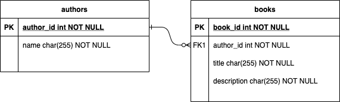

# One-to-Many: Authors

## Goals

Our goals for this lesson are to:
* Connect two tables in a one-to-many relationship with SQLAlchemy
* Utilize documentation and problem solving to learn how to implement new features

We will:
* Create an `Author` model
* Connect the `Author` model to the `Book` model
    * One-to-many relationship: An author can have many books.

### !callout-info

### Independent Research

This lesson asks us to do more independent research than the previous **Building an API** topics.

### !end-callout

## Branches

| Starting Branch | Ending Branch|
|--|--|
|`07c-validate-book-refactor` |`08a-author-model`|

<details>
   <summary>Expand to see the features <code>Hello Books API</code> should have before this lesson</summary>

- A `hello_books_development` database
- A `book` table defined
- A `Book` model defined that contains the instance method `to_dict` and class method `from_dict`

Endpoints defined for these RESTful routes:
- `GET` to `/books`
- `POST` to `/books`
- `GET` to `/books/<book_id>`
- `PUT` to `/books/<book_id>`
- `DELETE` to `/books/<book_id>`

`route_utilities.py` should contain:
- The function `validate_model()` that can retrieve a model of any type

The `Book` model and table should have the following columns:
- `id`
- `title`
- `description`

</details>
</br>

## Author Model, Blueprint, and Routes

Our first step to building the one-to-many relationship between `book`s and `author`s is to define an `Author` model in a new file `author.py` inside the `models` folder. 

An `author` should have the following attributes with the specified types: 
  * `id`, integer, primary key
  * `name`, string.

It would also benefit us in the future if we implement `to_dict` and `from_dict` methods, as we did for the `Book` model.

<br />

<details>
  <summary>Give this a try on your own, then expand to see our solution.</summary>

``` python
#app/models/author.py
from sqlalchemy.orm import Mapped, mapped_column
from ..db import db

class Author(db.Model):
    id: Mapped[int] = mapped_column(primary_key=True, autoincrement=True)
    name: Mapped[str]

    def to_dict(self):
        author_as_dict = {
            "id": self.id,
            "name": self.name
        }
        
        return author_as_dict
    
    @classmethod
    def from_dict(cls, author_data):
        new_author = cls(name=author_data["name"])
        return new_author
```
</details>
</br>

Next, we will create a new file for the `Author` routes named `author_routes.py` inside our `routes` folder. In our new file we will declare a Blueprint named `bp` that groups the endpoints for our `Author` model. Refer back to [01) Building an API - Hello World Routes](../api-1-setup-read/hello-world-routes.md) on how to define a blueprint and register it in `create_app`.

The last thing we'll do is create the following endpoints for our `Author` model:
- `GET ` to `/authors`
- `POST` to `/authors`

Refer back to [03) Building an API - Read All Books](../api-3-database-models-read/read-all-books.md) for how to define the `GET` endpoint and the `POST` endpoint.

</br>


<details>
  <summary>Give this a try on your own, then expand to see our updated <code>__init__.py</code> and <code>author_routes.py</code>.</summary>

```python
#app/__init__.py
from flask import Flask
from .db import db, migrate
from .models import book, author
from .routes.book_routes import bp as books_bp
from .routes.author_routes import bp as authors_bp
import os

def create_app(config=None):
    app = Flask(__name__)

    app.config['SQLALCHEMY_TRACK_MODIFICATIONS'] = False
    app.config['SQLALCHEMY_DATABASE_URI'] = os.environ.get('SQLALCHEMY_DATABASE_URI')

    if config:
        # Merge `config` into the app's configuration
        # to override the app's default settings for testing
        app.config.update(config)

    db.init_app(app)
    migrate.init_app(app, db)

    # Register Blueprints here
    app.register_blueprint(books_bp)
    app.register_blueprint(authors_bp)

    return app
```

```python
# app/routes/author_routes.py
from flask import Blueprint, request, make_response, abort
from app.models.author import Author
from ..db import db

bp = Blueprint("authors_bp", __name__, url_prefix="/authors")

@bp.post("")
def create_author():
    request_body = request.get_json()

    try:
        new_author = Author.from_dict(request_body)
        
    except KeyError as error:
        response = {"message": f"Invalid request: missing {error.args[0]}"}
        abort(make_response(response, 400))
    
    db.session.add(new_author)
    db.session.commit()

    return make_response(new_author.to_dict(), 201)

@bp.get("")
def get_all_authors():
    query = db.select(Author)

    name_param = request.args.get("name")
    if name_param:
        query = query.where(Author.name.ilike(f"%{name_param}%"))

    authors = db.session.scalars(query.order_by(Author.id))
    authors_response = [author.to_dict() for author in authors]

    return authors_response
```

</details>

### !callout-info

## Write tests as you go

We should be writing new tests as we're creating new models and route functions. Writing tests for the `Author` model and routes is not covered here, but we can follow the same steps we took for the `Book` model tests to practice creating our own tests for the Author model. 

<br/>

Try out writing tests on your own, then check out the test suite we put together in GitHub on the branch for this lesson, `08a-author-model`.

### !end-callout

## Visualizing and Implementing the Relationship

Let's visualize the relationship between `book`s and `author`s. Just like we did when we built relationships in SQL, we will use an **entity relationship diagram** to visualize the relationship between `book`s and `author`s.

  

_Fig. ERD describing a one-to-many relationship between authors and books_

We can see that a `book` is connected to the `author` table by the author's `id` as a foreign key. This foreign key is defined as `author_id` in the `book` table. While we could call it whatever we wish, naming it `author_id` follows a standard convention for naming foreign keys.

How do we define this foreign key in our Flask models? Refer to the [SQLAlchemy documentation](https://docs.sqlalchemy.org/en/20/orm/basic_relationships.html#one-to-man), try it out, then check out our solution below. There are several ways we _could_ implement a one-to-many relationship in our models. Follow your curiosity if you are interested in some of the other possible approaches.

<br>

<details>
  <summary>Updated <code>Author</code> model</summary>

```python
# app/models/author.py
from sqlalchemy.orm import Mapped, mapped_column, relationship
from ..db import db

class Author(db.Model):
    id: Mapped[int] = mapped_column(primary_key=True, autoincrement=True)
    name: Mapped[str]
    books: Mapped[list["Book"]] = relationship(back_populates="author")

    def to_dict(self):
        author_as_dict = {
            "id": self.id,
            "name": self.name
        }
        
        return author_as_dict
    
    @classmethod
    def from_dict(cls, author_data):
        new_author = cls(name=author_data["name"])
        return new_author
```

</details>

<br/>

<details>
  <summary>Updated <code>Book</code> model</summary>

```python
# app/models/book.py
from sqlalchemy.orm import Mapped, mapped_column, relationship
from sqlalchemy import ForeignKey
from typing import Optional
from ..db import db

class Book(db.Model):
    id: Mapped[int] = mapped_column(primary_key=True, autoincrement=True)
    title: Mapped[str]
    description: Mapped[str]
    author_id: Mapped[Optional[int]] = mapped_column(ForeignKey("author.id"))
    author: Mapped[Optional["Author"]] = relationship(back_populates="books")

    def to_dict(self):
        book_as_dict = {}
        book_as_dict["id"] = self.id
        book_as_dict["title"] = self.title
        book_as_dict["description"] = self.description

        return book_as_dict
    
    @classmethod
    def from_dict(cls, book_data):
        new_book = cls(title=book_data["title"],
                       description=book_data["description"])

        return new_book
```
</details>
</br>

### !callout-info

## Fixing type errors in VSCode

Our new code will compile and run, but sometimes our tools can get a little confused about syntax and underline something that really doesn't need to change. In this case, we may see `Pylance` in VSCode add underlines after we've created the relationship between our models. If we would like to remove those warning underlines, we can add the following code to the models:

```py
# in app/models/book.py
from typing import TYPE_CHECKING
if TYPE_CHECKING:
  from .author import Author

# in app/models/author.py
from typing import TYPE_CHECKING
if TYPE_CHECKING:
  from .book import Book
```

If you'd like to know more about `Pylance` or type checking in Python, feel free to follow your curiosity!

### !end-callout

Now we have our `author_id` in the `Book` model, but what is the new `books` attribute in `Author`? And what purpose does `back_populates` serve? Refer to the [SQLAlchemy documentation](https://docs.sqlalchemy.org/en/14/orm/basic_relationships.html#one-to-many) or your favorite search engine to find an answer.

### Don't Forget to Generate Migrations

Great! We have a new model, `Author`, and we have made changes to the `Book` model. It sounds like it is time for another migration! We can refer back to [03) Building an API - Models Setup](../api-3-database-models-read/models-setup.md) to review the terminal commands for migrations.

### !callout-danger

## Troubleshooting Migration Errors

The tools that detect model changes are not perfect. When we make changes to existing models, sometimes the state of our data combined with the model changes can make migrating difficult. 
</br>
</br>
As we gain more experience working with migrations, we will learn how to troubleshoot those difficulties. We recommend [this blog post on resolving database schema conflicts in Flask](https://blog.miguelgrinberg.com/post/resolving-database-schema-conflicts). 
</br>
</br>
If all else fails, it is okay to delete the migrations directory and the database, and start again.

### !end-callout

<!-- prettier-ignore-start -->
### !challenge
* type: checkbox
* id: 3199d93c-25f6-4e29-819b-99fbe4b0b1e1
* title: One-to-Many: Authors
##### !question

What pieces of syntax are necessary in the `Book` class to create an optional one-to-many relationship between the `Author` and `Book` models? 

##### !end-question
##### !options

a| `from sqlalchemy import ForeignKey`
b| `from typing import Optional`
c| `from sqlalchemy.orm import relationship`
d| `author_id: Mapped[Optional[int]] = mapped_column(ForeignKey("author.id"))`
e| `author: Mapped[Optional["Author"]] = relationship(back_populates="books")`

##### !end-options
##### !answer

a|
b|
d|

##### !end-answer
##### !hint

What is the difference between `author` and `author_id` in the `Book` class?
What is the difference between a `ForeignKey` and a `relationship` in SQLAlchemy?

##### !end-hint
##### !explanation

The `author` property of the `Book` model is just there for our convenience. It is the `author_id` property using `ForeignKey` that creates the one-to-many relationship. We need to import and use `Optional` if we want to be allowed to create a `Book` that does not have an author set yet.

##### !end-explanation
### !end-challenge
<!-- prettier-ignore-end -->

