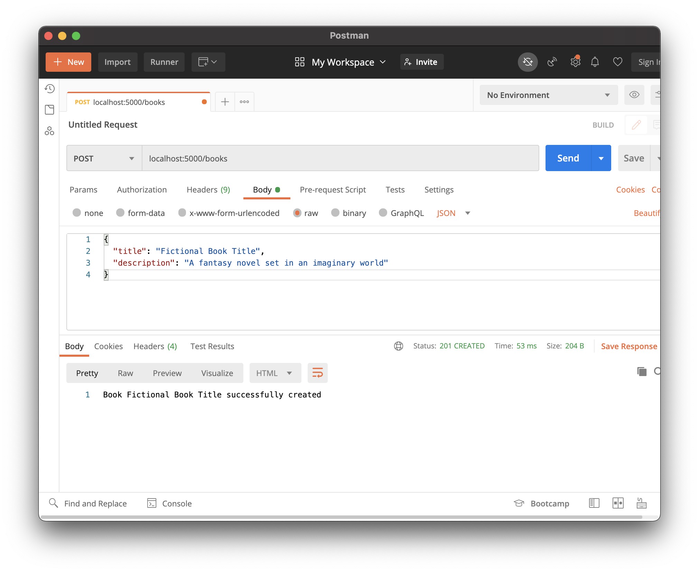

# Create and Read

## Goals

- Practice defining routes that query
- Define ORMs as a tool used to access databases
- Access a database record from the back-end layer

## Format

This lesson is a walk-through and syntax explanation for how to build several features inside a Flask API. We **highly recommend** reading or watching through this first fully, before repeating on your own machine.

This lesson has a large amount of new information. It may be better to think about this lesson as a resource to be familiar with, rather than commit all new knowledge to memory at once.

### !callout-danger

## Read-through First, Repeat Second

We **highly suggest** reading or watching through this lesson fully, before repeating on your own machine.

### !end-callout

### !callout-danger

## Prioritize Familiarity

It may be better to think about this lesson as a resource to be familiar with, rather than commit all new knowledge to memory at once.

### !end-callout

## Hello Books API

### Before This Lesson

This lesson uses the [Hello Books API](https://github.com/AdaGold/hello-books-api). Before beginning this lesson, the Hello Books API should have:

- A `hello_books_development` database
- A `book` table defined
- A `Book` model defined

The model and table should have the following columns:

- `id`
- `title`
- `description`

### This Lesson's Work

We want to build our Hello Books API to fulfill these features:

1. As a client, I want to send a request with new valid book data and get a success response, so that I know the API saved the book data.
1. As a client, I want to send a request to get all existing books, so that I can see a list of books, with their `id`, `title`, and `description` of the book.
1. As a client, I want to send a request to get one existing book, so that I can see the `id`, `title`, and `description` of the book.

## Creating a Book Endpoint: Preparation

Let's consider how to accomplish this feature:

> As a client, I want to send a request with new valid book data and get a success response, so that I know the API saved the book data.

### Predict HTTP Requests, Responses, and Logic

Let's consider the endpoint to create a book:

| HTTP Method | Endpoint |
| ----------- | -------- |
| `POST`      | `/books` |

Request body:

```json
{
  "title": "Fictional Book Title",
  "description": "A fantasy novel set in an imaginary world"
}
```

And the response we'll want to send back is:

| Response Status | Response Body                                    |
| --------------- | ------------------------------------------------ |
| `201 Created`   | `Book Fictional Book Title successfully created` |

During this method, we will need to:

1. Read the new book data from the HTTP request
1. Create a new `Book` model with the new book data stored inside of it
1. Save the new `Book` into the db
1. Send back a response

### Dependencies

To make this feature, we'll work with the following packages:

- `request`
- `Blueprint`
- `Response`

#### Working with `request` from Flask

Notice that our code begins with importing something named `request` from `flask`.

```python
from flask import request
```

Flask, the framework, will provide all sorts of things to us. One of those things is the `request` object. After we import `request`, we will use this object, `request`, to represent the HTTP request. For now, we should focus on seeing patterns for how to use `request`, but for future reference, we should consider:

- [Flask's definition of the `request` object](https://flask.palletsprojects.com/en/1.1.x/api/#flask.request)
- [Flask's resource on the Request Context](https://flask.palletsprojects.com/en/1.1.x/reqcontext/), which will outline technical details of how `request` exists, and how to use it

#### Revisiting `Blueprint` from Flask

We will import `Blueprint` into our `routes.py` file. We will use Blueprints to create a group of related routes (endpoints). In our example, we'll create a group of related `books` routes.

Flask will often use the word "view" to symbolize that Flask has the potential of sending HTML views, even though we will send back JSON. For future reference, consider the following documentation:

- [Flask's definition of `Blueprint`](https://flask.palletsprojects.com/en/1.1.x/api/#flask.Blueprint)
- [Flask's tutorial on using `Blueprint`](https://flask.palletsprojects.com/en/1.1.x/tutorial/views/)

## Working with the `Response` Class from Flask

We've imported `Response` from Flask as well.

`Response` is a Flask class that represents HTTP responses. To make a response, we can make an instance of the `Response` class.

Here are some reference documents for the `Response` class:

- [Flask's definition of `Response`](https://flask.palletsprojects.com/en/1.1.x/api/#response-objects)
- [Flask's quickstart guide on creating responses](https://flask.palletsprojects.com/en/1.1.x/quickstart/#about-responses), which notably does _not_ feature the `Response` class

## Creating a Book Endpoint: Code

Let's look at this example code for our create feature.

### Registering a Blueprint

First, we will define a `Blueprint` (details in the upcoming code) to register routes. We will name this Blueprint `books_bp`.

Flask requires developers to do something called "register the blueprint" to our `app`.

Consider the code inside `app/__init__.py`. Inside our `create_app` function, after our model definitions, let's add this code:

```python
def create_app():
    app = Flask(__name__)

    # ... existing code that did
    # app config...
    # db initialization...
    # migrate initialization...
    # import models...
    # create the models...

    from .routes import books_bp
    app.register_blueprint(books_bp)

    # ... return app
```

Again, these lines make it so that our `Blueprint` is recognized by our Flask `app`. We only need to do this step every time we make a new `Blueprint`.

### Creating an Endpoint

Observe this example code inside our `routes.py` file.

```python
from app import db
from app.models.book import Book
from flask import request, Blueprint, Response

books_bp = Blueprint("books_bp", __name__, url_prefix="/books")


@books_bp.route("", methods=["POST"])
def books():
    request_body = request.get_json()
    new_book = Book(title=request_body["title"],
                    description=request_body["description"])

    db.session.add(new_book)
    db.session.commit()

    return Response(f"Book {new_book.title} successfully created", status=201)
```

| <div style="min-width:250px;"> Piece of Code </div> | Notes                                                                                                                                                                                                                  |
| --------------------------------------------------- | ---------------------------------------------------------------------------------------------------------------------------------------------------------------------------------------------------------------------- |
| `from app import db`, `from ... import Book`        | We need to import the necessary modules for our `Book` model                                                                                                                                                           |
| `from flask import request, Blueprint, Response`    | We need to import our dependencies. Python supports comma-separated importing.                                                                                                                                         |
| `books_bp = Blueprint("books_bp", __name__, ...)`   | Our `Blueprint` instance. We'll use it to group routes that start with `/books`. `"books_bp"` is the debugging name for this `Blueprint`. `__name__` is this Blueprint's parent package.                               |
| `url_prefix="/books"`                               | A keyword argument. This `url_prefix` will assume that `/books` will be at the beginning of _every_ endpoint that uses this Blueprint. We should use this blueprint for all of our RESTful routes start with `/books`! |
| `@books_bp.route("", methods=["POST"])`             | A decorator that uses the `books_bp` Blueprint to define an endpoint and accepted HTTP method. The following function will execute whenever a matching HTTP request is received.                                       |
| `def books():`                                      | This function will execute whenever a request that matches the decorator is received. The name of this function can be made with any decision.                                                                         |
| `request_body = ...`                                | We create a local variable `request_body`, which will hold the HTTP response body in a Python data structure (likely dictionaries, lists, and strings)                                                                 |
| `... request.get_json()`                            | We use the `request` object to get information about the HTTP request. We want to get the request's JSON body, so we use `request.get_json()`. This method "Pythonifies" the JSON HTTP request body.                   |
| `new_book = Book( ... )`                            | We create an instance of `Book` using the data in `request_body`. We assign `new_book` to this instance.                                                                                                               |
| `title=request_body["title"], ...`                  | We use keyword arguments and access the `request_body` values to create the `Book` instance                                                                                                                            |
| `db.session.add(new_book)`                          | `db.session` is the db's way of collecting changes that need to be made. Here, we are saying we want the db to add `new_book`.                                                                                         |
| `db.session.commit()`                               | Here, we are saying we want the db to save and commit the collected changes.                                                                                                                                           |
| `return`                                            | For each endpoint, we must _return_ the HTTP response                                                                                                                                                                  |
| `Response(...)`                                     | We instantiate a `Response` object so we can `return` it                                                                                                                                                               |
| `f"Book {new_book.title} successfully created"`     | The first parameter to `Response` is the HTTP response body. Until we have more specifics requirements, let's send back a string for now.                                                                              |
| `status=201`                                        | We can define the status code of the `Response` by setting the kwarg `status` to a digit.                                                                                                                              |

### !callout-info

## `Blueprint`s and Routes are Sensitive to `/`

Be sure to specify that this endpoint is `""`. When combined with the `book_bp`'s `url_prefix`, `"/books"`, we see this endpoint is a `POST` to `"/books"`. Flask will throw an error if we define this route as `"/"`. We should use `""`.

### !end-callout

### !callout-info

## Many Ways to Make a Response

There are dozens of ways to make an HTTP response in Flask. Look forward to seeing and researching many of them!

### !end-callout

### Manually Testing with Postman

Our entire development process throughout this should use Postman heavily, rapidly, and constantly. Configure your Postman in the following ways:

- Set the method to `POST`
- Set the request URL to `localhost:5000/books`
- Configure an HTTP response body to `raw` and `JSON`, and add in the sample request body



Lastly, don't forget to exercise patience! It takes patience to discover how to debug with so many tools, windows, and screens.

### Manually Testing with `psql`

We could also check that our Book was saved in the database using `psql`!

### Debugging

Recall that our tools for debugging include:

- Using the response that appears in Postman
- Using the server logs

<!-- prettier-ignore-start -->
### !challenge
* type: checkbox
* id: 4de3Ri
* title: Create and Read, Creating a Book Endpoint
##### !question

Think about the "Creating a Book Endpoint."

Check off all the topics that we've briefly touched on so far.

##### !end-question
##### !options

* Predicted the HTTP response, request, and logic for this endpoint
* Briefly considered `request`
* Briefly considered `Blueprint`
* Briefly considered `Response`
* Registered a new `Blueprint` with `app`
* Defined a new `Blueprint` named `books_bp`, which has a `url_prefix` of `"/books"`
* Created a new endpoint that catches requests going to `""` (assumed `"/books"`) with the HTTP method `POST`
* Read the HTTP request body using `request.get_json()`
* Created a new instance of `Book`
* Saved the instance of `Book` in the database
* Returned an instance of `Response` with the status code `201 Created`
* Tested this request in Postman

##### !end-options
##### !answer

* Predicted the HTTP response, request, and logic for this endpoint
* Briefly considered `request`
* Briefly considered `Blueprint`
* Briefly considered `Response`
* Registered a new `Blueprint` with `app`
* Defined a new `Blueprint` named `books_bp`, which has a `url_prefix` of `"/books"`
* Created a new endpoint that catches requests going to `""` (assumed `"/books"`) with the HTTP method `POST`
* Read the HTTP request body using `request.get_json()`
* Created a new instance of `Book`
* Saved the instance of `Book` in the database
* Returned an instance of `Response` with the status code `201 Created`
* Tested this request in Postman

##### !end-answer
### !end-challenge
<!-- prettier-ignore-end -->

## Getting All Books Endpoint: Preparation

Let's consider how to implement this feature:

> As a client, I want to send a request to get all existing books, so that I can see a list of books, with their `id`, `title`, and `description` of the book.

### Predict HTTP Requests, Responses, and Logic

Let's consider the endpoint to create a book:

| HTTP Method | Endpoint |
| ----------- | -------- |
| `GET`       | `/books` |

No request body.

The response we want to send back is a list of JSON objects (dictionaries) with `id`, `title`, and `description`:

| Response Status | Response Body                                                                                              |
| --------------- | ---------------------------------------------------------------------------------------------------------- |
| `200 OK`        | `[{"id": 1, "title": "Fictional Book Title", "description": "A fantasy novel set in an imaginary world"}]` |

During this method, we will need to:

1. Retrieve all of the books from the db
1. Format the books data into the appropriate structure (list of dictionaries, where each dictionary has `id`, `title`, and `description`)
1. Send back a response

### Working with `jsonify` from Flask

We need to import something named `jsonify` from `flask`.

```python
from flask import jsonify
```

`jsonify` is a Flask utility function that turns its argument into JSON. We'll use `jsonify` as a way to turn a list of book dictionaries into valid JSON.

For future reference, we should consider:

- [Flask's definition of `jsonify`](https://flask.palletsprojects.com/en/1.1.x/api/#flask.json.jsonify)

### Working with `query` from SQLAlchemy's `Model`

Each Model class has a `query` attribute. This `query` object has the functions that will retrieve the model data from the db. This is the object that will do the hard work of querying the db!

There are a lot of ways to use the `query` object. For future reference, we should consider:

- [SQLAlchemy's quickstart guide to querying records](https://flask-sqlalchemy.palletsprojects.com/en/2.x/queries/#querying-records)
- [SQLAlchemy's definition of `Model`](https://flask-sqlalchemy.palletsprojects.com/en/2.x/api/#flask_sqlalchemy.Model) (which includes `query`)

## Getting All Books Endpoint: Code

Consider this code for our endpoint to get all books:

```python
from app import db
from app.models.book import Book
from flask import request, Blueprint, Response, jsonify

books_bp = Blueprint("books_bp", __name__, url_prefix="/books")

@books_bp.route("", methods=["GET", "POST"])
def books():
    if request.method == "GET":
        books = Book.query.all()
        books_response = []
        for book in books:
            books_response.append({
                "id": book.id,
                "title": book.title,
                "description": book.description
            })
        return jsonify(books_response)
    elif request.method == "POST":
        # ... Indent all of the Create Book functionality into this elif
        # request_body = request.get_json()
```

| <div style="min-width:250px;"> Piece of Code </div> | Notes                                                                                                                  |
| --------------------------------------------------- | ---------------------------------------------------------------------------------------------------------------------- |
| `from flask import ..., jsonify`                    | Add in `jsonify` as a dependency                                                                                       |
| `@books_bp.route("", methods=["GET", "POST"])`      | Add in `"GET"` into this list of accepted HTTP methods                                                                 |
| `if request.method == "GET":`                       | Separate this functionality from the Create feature by checking the `request`'s HTTP method                            |
| `... = Book.query.all()`                            | This SQLAlchemy syntax tells `Book` to `query` for `all()` books. This method returns a _list_ of instances of `Book`. |
| `books = ...`                                       | We set the list of `Book` instances into the variable `books`                                                          |
| `for book in books:`                                | We to iterate over all books in `books` so we can collect their data and format it into a response                     |
| `books_response.append( ... )`                      | We will use the `books_response` list to hold book dictionaries                                                        |
| `{ "id": book.id, ... }`                            | This is the format of dictionary we want to send back. We'll insert the values based on the `book` we're iterating on  |
| `jsonify(books_response)`                           | `books_response` contains a list of book dictionaries. To turn it into JSON, we pass it into `jsonify()`               |
| `return ...`                                        | We must return our response. By default, a response with no specified status code returns `200 OK`                     |

### Manually Testing with Postman

Let's test this request:

- Set the method to `GET`
- Keep the request URL at `localhost:5000/books`


### !callout-info

## Remember to Debug with All of the Tools!

Remember to use all debugging tools:

- Postman
- Server logs
- VS Code
- Peers, classmates, and rubber ducks

### !end-callout

<!-- prettier-ignore-start -->
### !challenge
* type: checkbox
* id: 9Lz3nt
* title: Create and Read, Getting All Books Endpoint
##### !question

Think about the "Getting All Books Endpoint."

Check off all the topics that we've briefly touched on so far.

##### !end-question
##### !options

* Predicted the HTTP response, request, and logic for this endpoint
* Briefly considered `jsonify`
* Briefly considered `query`
* Updated this endpoint to match `GET` requests, too
* Refactored this endpoint to check `request.method`
* Got a list of `Book` instances using `Book.query.all()`
* Iterated through `books`
* Created a list of Book dictionaries in `books_response`
* Used `jsonify` with `jsonify(books_response)`
* Returned this JSON list with the status code `200 OK`
* Tested this request in Postman

##### !end-options
##### !answer

* Predicted the HTTP response, request, and logic for this endpoint
* Briefly considered `jsonify`
* Briefly considered `query`
* Updated this endpoint to match `GET` requests, too
* Refactored this endpoint to check `request.method`
* Got a list of `Book` instances using `Book.query.all()`
* Iterated through `books`
* Created a list of Book dictionaries in `books_response`
* Used `jsonify` with `jsonify(books_response)`
* Returned this JSON list with the status code `200 OK`
* Tested this request in Postman

##### !end-answer
### !end-challenge
<!-- prettier-ignore-end -->

## Getting a Single Book Endpoint: Preparation

Let's consider how to implement this feature:

> As a client, I want to send a request to get one existing book, so that I can see the `id`, `title`, and `description` of the book.

### Predict HTTP Requests, Responses, and Logic

Let's consider the endpoint to create a book:

| HTTP Method | Endpoint   |
| ----------- | ---------- |
| `GET`       | `/books/1` |

No request body.

We want to send back a single JSON object (dictionary) with `id`, `title`, and `description`:

| Response Status | Response Body                                                                                            |
| --------------- | -------------------------------------------------------------------------------------------------------- |
| `200 OK`        | `{"id": 1, "title": "Fictional Book Title", "description": "A fantasy novel set in an imaginary world"}` |

During this method, we will need to:

1. Read the `book_id` in the request path
1. Retrieve the book with the matching `book_id` from the db
1. Format the book data into the appropriate structure (a single dictionary with `id`, `title`, and `description`)
1. Send back a response

## Getting a Single Book Endpoint: Code

Let's create an entirely new route.

This route has a **route parameter**. The route `/books/1` should give us the details for the book with `id` 1. `/books/2` should give us details for book with `id` 2, `/books/3000` should give us details for book 3000, and so on.

Our new route will need to account for this.

```python
# No new import statements...

# No modifications to the other route...

@books_bp.route("/<book_id>", methods=["GET"])
def book(book_id):
    book = Book.query.get(book_id)

    return {
        "id": book.id,
        "title": book.title,
        "description": book.description
    }
```

| <div style="min-width:250px;"> Piece of Code </div> | Notes                                                                                                                                                                                                                                                                                    |
| --------------------------------------------------- | ---------------------------------------------------------------------------------------------------------------------------------------------------------------------------------------------------------------------------------------------------------------------------------------- |
| `@books_bp.route("...", methods=["GET"])`           | We are setting up a new route, so we must use the `Blueprint` decorator to define it                                                                                                                                                                                                     |
| `"/<book_id>"`                                      | This is the `Blueprint` syntax to indicate _route parameters_. `<book_id>` shows that we are looking for a variable value (could be `1`, `2`, or `3000`). We'll use this value in the function as the variable `book_id`. The name of the route parameter can be made with any decision. |
| `def book(book_id):`                                | This `book` function is called whenever the HTTP request matches the decorator. The name of this function can be made with any decision. We must now configure a parameter to this method, `book_id`. This parameter name must match the route parameter in the decorator.               |
| `Book.query.get(...)`                               | This is the SQLAlchemy syntax to query for one `Book` resource. This method returns an instance of `Book`.                                                                                                                                                                               |
| `Book.query.get(book_id)`                           | We must pass in the primary key of a book here. The primary key of the book we're looking for is in the route parameter, `book_id`.                                                                                                                                                      |
| `{ "id": book_id, ... }`                            | We can create a dictionary literal for our HTTP response.                                                                                                                                                                                                                                |
| `return`                                            | As always, we must return a response. Flask will default to returning status `200 OK`.                                                                                                                                                                                                   |

### !callout-info

## Why Didn't We Use `jsonify()` on the Dictionary?

For reasons that are less important to memorize, Flask will automatically convert a dictionary into an HTTP response body.

### !end-callout

<!-- prettier-ignore-start -->
### !challenge
* type: checkbox
* id: ECXaUI
* title: Create and Read, Getting a Single Book Endpoint
##### !question

Think about the "Getting a Single Book Endpoint."

Check off all the topics that we've briefly touched on so far.

##### !end-question
##### !options

* Predicted the HTTP response, request, and logic for this endpoint
* Considered route parameters, and how we need the book ID in the route
* Created a new endpoint that matches on `GET` requests to `"/<book_id>"`
* Defined this endpoint with the function signature `def book(book_id):`
* Used `Book.query.get(book_id)` to get an instance of `Book` matching `book_id`
* Returned a dictionary literal as our response

##### !end-options
##### !answer

* Predicted the HTTP response, request, and logic for this endpoint
* Considered route parameters, and how we need the book ID in the route
* Created a new endpoint that matches on `GET` requests to `"/<book_id>"`
* Defined this endpoint with the function signature `def book(book_id):`
* Used `Book.query.get(book_id)` to get an instance of `Book` matching `book_id`
* Returned a dictionary literal as our response

##### !end-answer
### !end-challenge
<!-- prettier-ignore-end -->

### !callout-warning

## What About Error Handling?

There are many cases that weren't covered in this lesson, even though they are relevant to creating and reading `Book`s. For example, what happens if we make a `GET` request to `/books/this-book-doesnt-exist`? We are intentionally not covering these cases at the moment, to limit this lesson. However, hypothesize and research how to handle erroneous HTTP requests. Follow your curiosity!

### !end-callout
