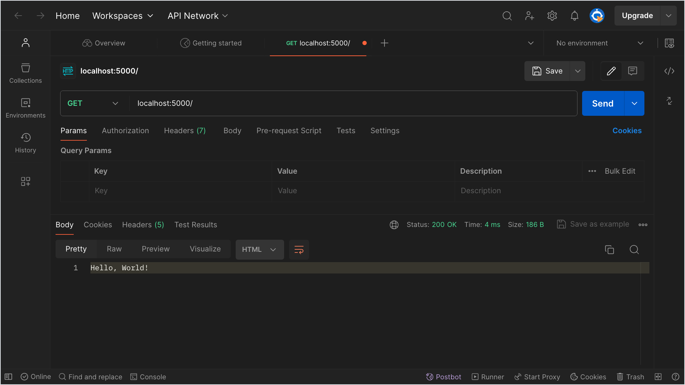

# Flask Hello Books

## Format

This lesson will be in the format of a walkthrough. It will use the Hello Books API project repo.

We will:

1. Clone our repo
1. Manage our dependencies
1. Define our first blueprint
1. Define our first endpoint, `/hello-world`
1. Witness the response of our first endpoint
1. Define our second endpoint, `/hello/JSON`
1. Witness the response of our second endpoint
1. Debug a third, broken endpoint

We **highly recommend** reading or watching through this lesson first fully, before repeating on your own machine.

This lesson has a large amount of new information. It may be better to think about this lesson as a resource to be familiar with, rather than commit all new knowledge to memory at once.

### !callout-danger

## Read-through First, Repeat Second

We **highly suggest** reading or watching through this lesson fully, before repeating on your own machine.

### !end-callout

### !callout-danger

## Prioritize Familiarity

It may be better to think about this lesson as a resource to be familiar with, rather than commit all new knowledge to memory at once.

### !end-callout

## Introduction: Hello Books Repo

We will use the repo Hello Books.

First, this repo will act as our Flask Hello World. We'll create some basic, experimental features to test that we can run Flask successfully.

Afterwards, we'll use the same Hello Books repo to demonstrate building a book library API.

### Refer to the Repo for Reference

The original Hello Books repo is owned, written, and maintained by the Ada instructors. Use this repo as a reference for instructor-led code. We recommend:

1. Cloning this repo directly when you want to see and play with the instructor examples
1. Renaming this project folder to `instructor-hello-books-api` to make it clear it's the instructor version
1. Deleting this folder or removing the changes using git whenever you are done experimenting

### Fork and Clone the Repo for Personal Experimentation

If you are interested in personal exploration of the project, fork this repo to your own account. This will let you have full control over the repo, and you can create and push commits over time.

## Clone and Explore

Clone the repo, `cd` into it, and open this project into your favorite text editor. We should see the following structure.

```
.
├── README.md
├── app
│   ├── __init__.py
│   └── routes.py
├── app.py
└── requirements.txt
```

The `app` directory will contain the bulk of our application code.

`app/routes.py` is the file we'll use the most in this lesson. It will be where we define our endpoints.

`app/__init__.py` is a file that contains a lot of configuration steps for our app.

## Manage Dependencies

Now, we need to create a virtual environment, activate it, and then install the dependencies in `requirements.txt`.

We can follow these steps in the Terminal:

```bash
$ python3 -m venv venv
$ source venv/bin/activate
(venv) $ pip install -r requirements.txt
```

## Defining Endpoints with Blueprint

Our code will import and use something named `Blueprint` from `flask`. In `routes.py`, let's add this import line.

```python
from flask import Blueprint
```

`Blueprint` is a Flask class that provides a pattern for grouping related routes. Flask will often use the word "view" to symbolize that Flask has the potential of sending HTML views, even though we will send back JSON.

We will use Blueprints to create a group of related routes (endpoints). At the moment, we'll create an example Blueprint to get us started on Flask development as quickly as possible.

For now, let's focus on how the rest of the code uses `Blueprint`, but for future reference, we should consider:

- [Flask's definition of `Blueprint`](https://flask.palletsprojects.com/en/1.1.x/api/#flask.Blueprint)
- [Flask's tutorial on using `Blueprint`](https://flask.palletsprojects.com/en/1.1.x/tutorial/views/)

### Creating a Blueprint in `routes.py`

In `routes.py`, type in the following code:

```python
from flask import Blueprint

hello_world_bp = Blueprint("hello_world_bp", __name__)
```

| <div style="min-width:200px;"> Piece of Code </div> | Notes                                                                                                                                                                                                     |
| --------------------------------------------------- | --------------------------------------------------------------------------------------------------------------------------------------------------------------------------------------------------------- |
| `hello_world_bp`                                    | The name for a local variable that will hold our Blueprint instance. Whenever we need to use this Blueprint to define a route, we'll use `hello_world_bp`.                                                |
| `Blueprint( ... )`                                  | The syntax for instantiating a `Blueprint`                                                                                                                                                                |
| `"hello_world_bp"`                                  | The first argument is a string that will be used to name this `Blueprint` for debugging purposes. It's conventional to use the same name as the local variable holding the instance (`"hello_world_bp"`). |
| `__name__`                                          | The second argument is the name of the Blueprint package. This is almost always `__name__`.                                                                                                               |

### Registering a Blueprint

Every time we instantiate a new `Blueprint`, Flask requires us to register it with `app`. This is a fancy way to say that we need to configure the app to recognize and use `hello_world_bp`.

_Where_ we register the `Blueprint` depends on the project. For the Hello Books project specifically, the place to do this is in `app/__init__.py`, inside the `create_app()` function.

```python
from flask import Flask


def create_app(test_config=None):
    app = Flask(__name__)

    from .routes import hello_world_bp
    app.register_blueprint(hello_world_bp)

    return app
```

| <div style="min-width:200px;"> Piece of Code </div> | Notes                                                                                                  |
| --------------------------------------------------- | ------------------------------------------------------------------------------------------------------ |
| `from .routes import hello_world_bp`                | We are importing `hello_world_bp` into this module so we may use it in the next line.                  |
| `app.register_blueprint(hello_world_bp)`            | We use `app`'s pre-defined function `register_blueprint()` to register the `hello_world_bp` Blueprint. |

If we needed to create and register more `Blueprint`s, we could follow this pattern and duplicate this code until we needed a better solution.

### Defining an Endpoint

Now that we have registered a Blueprint, which will help us organize our routes, we can create an endpoint in `app/routes.py`.

Recall that the responsibility of an endpoint is to:

1. Match the HTTP verb and request URL of an HTTP request
2. Form an HTTP response to send back to the client

Consider this explanation of syntax for a generic endpoint. An example of a specific endpoint is located later in the lesson.

```python
@blueprint_name.route("/endpoint/path/here", methods=["GET"])
def endpoint_name():
    my_beautiful_response_body = "Hello, World!"
    return my_beautiful_response_body
```

| <div style="min-width:250px;"> Piece of Code </div> | Notes                                                                                                                                          |
| --------------------------------------------------- | ---------------------------------------------------------------------------------------------------------------------------------------------- |
| `@blueprint_name.route(...)`                        | This is a decorator for the endpoint. We use the defined Blueprint, and it's method `.route()`                                                 |
| `"/endpoint/path/here"`                             | The request URL that must match                                                                                                                |
| `methods=["GET"]`                                   | A list of HTTP methods that must match                                                                                                         |
| `def endpoint_name():`                              | This function will execute whenever a request that matches the decorator is received. The name of this function can be made with any decision. |
| `my_beautiful_response_body = "Hello, World!"`      | We must define a response body to return. Here, we're using a local variable `my_beautiful_response_body` to hold a value                      |
| `return my_beautiful_response_body`                 | For each endpoint, we must _return_ the HTTP response.                                                                                         |

## Endpoint #1: `/hello-world`

Consider an endpoint definition that would:

- Use the Blueprint `hello_world_bp`
- Match the route `"/hello-world"`
- Match the HTTP method `["GET"]`
- Give a response `200 OK` with the HTTP body `"Hello, World!"`

We may come up with something such as:

```python
from flask import Blueprint

hello_world_bp = Blueprint("hello_world_bp", __name__)


@hello_world_bp.route("/hello-world", methods=["GET"])
def hello_world():
    return "Hello, World!"
```

### Manually Testing the Hello World Endpoint

_While the Flask server is running_, we can use Postman to send a `GET` request to `localhost:5000/hello-world`.

Hopefully, we see our HTTP response `200 OK` and `"Hello, World!"`!



Instead of using Postman, we can alternatively use our browser to make a `GET` request to `localhost:5000/hello-world`.


## Check the Server Logs

Sending an HTTP request should come up as new details in the server logs.

```
(venv) hello_books_api $ flask run
 * Environment: development
 * Debug mode: on
 * Running on http://127.0.0.1:5000/ (Press CTRL+C to quit)
 * Restarting with stat
 * Debugger is active!
 * Debugger PIN: 231-804-583
127.0.0.1 - - [28/Mar/2021 17:08:19] "GET /hello-world HTTP/1.1" 200 -
```

### !callout-success

## Congratulations on Your First Endpoint!

Congratulations, you made your first endpoint in a Flask API! Congratulations to you and everyone around you! 🎉

### !end-callout

## Endpoint #2: `/hello/JSON`

Consider the code for a _second_ endpoint that would:

- Use the Blueprint `hello_world_bp`
- Match the route `"/hello/JSON"`
- Match the HTTP method `["GET"]`
- Give a response `200 OK`
- The HTTP response body should be the following JSON-like dictionary. Fill in the response body with your own details.

```json
{
  "name": "Ada Lovelace",
  "message": "Hello!",
  "hobbies": ["Fishing", "Swimming", "Watching Reality Shows"]
}
```

Your code could look similar to this:

```python
@hello_world_bp.route("/hello/JSON", methods=["GET"])
def hello_json():
    return {
        "name": "Ada Lovelace",
        "message": "Hello!",
        "hobbies": ["Fishing", "Swimming", "Watching Reality Shows"]
    }
```

### Manually Testing

Confirm that you can send a request and get a response back with Postman.


Confirm that you can send a request and get a response back in the browser. This screenshot showcases a browser using a Google Chrome browser extension for viewing JSON.


Confirm that you can also see server log output.


### !callout-success

## Congratulations on Your Second Endpoint!

Congratulations on defining your _second_ endpoint! 🎉

### !end-callout

## Endpoint #3: Debugging a Broken Endpoint

Place this third endpoint into `routes.py`. It is intentionally broken.

```python
@hello_world_bp.route("/broken-endpoint-with-broken-server-code")
def broken_endpoint():
    response_body = {
        "name": "Ada Lovelace",
        "message": "Hello!",
        "hobbies": ["Fishing", "Swimming", "Watching Reality Shows"]
    }
    new_hobby = "Surfing"
    response_body["hobbies"] + new_hobby
    return response_body
```

When we make a `GET` request to `/broken-endpoint-with-broken-server-code`, we will get a `500 Internal Server Error` response.


### Use Your Debugging Strategies

Use a combination of Postman, the browser, server logs, the Internet, and your peers. Fix this endpoint so it no longer sends back a `500` response, and instead sends back a `200` response.

Flask's error responses show up nicely formatted in the browser.


### Fix the Endpoint

The error `TypeError: can only concatenate list (not "str") to list` should help us refactor our code to get a `200 OK`.


### !callout-success

## Congratulations on Debugging Your Third Endpoint!

You've built and run a pretty substantial web server now, that accepts three different kinds of HTTP requests and gives back three different kinds of HTTP responses! 🎉

### !end-callout

## Check for Understanding

<!-- Question Takeaway -->
<!-- prettier-ignore-start -->
### !challenge
* type: paragraph
* id: irDB8Z
* title: Flask Hello World
##### !question

What was your biggest takeaway from this lesson? Feel free to answer in 1-2 sentences, draw a picture and describe it, or write a poem, an analogy, or a story.

##### !end-question
##### !placeholder

My biggest takeaway from this lesson is...

##### !end-placeholder
### !end-challenge
<!-- prettier-ignore-end -->
