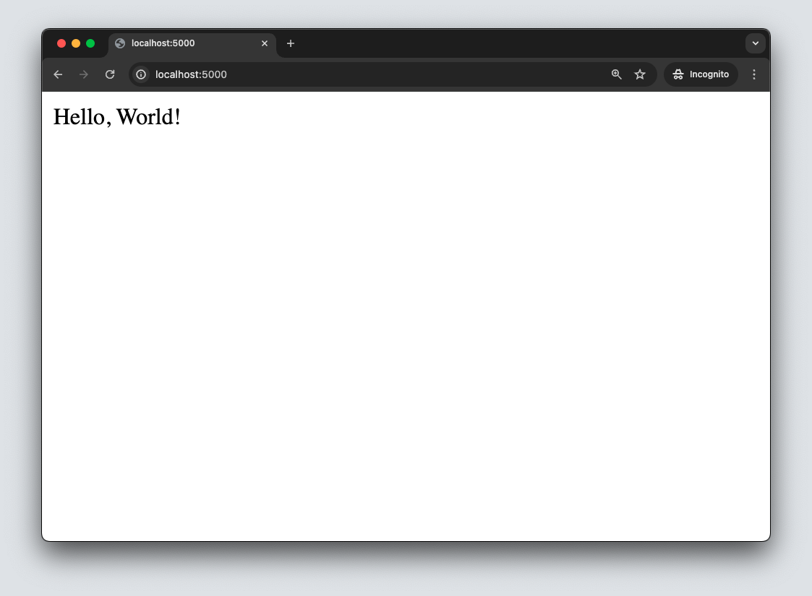

# Flask Hello Books

<iframe src="https://adaacademy.hosted.panopto.com/Panopto/Pages/Embed.aspx?pid=a2d78ec7-648f-41cc-9563-ad11001e7dd5&autoplay=false&offerviewer=true&showtitle=true&showbrand=false&start=0&interactivity=all" height="405" width="720" style="border: 1px solid #464646;" allowfullscreen allow="autoplay"></iframe>

## Format

This lesson will be in the format of a walk-through. It will use the [Hello Books API project repo](https://github.com/AdaGold/hello-books-api).

We will:

1. Clone our repo
1. Manage our dependencies
1. Define our first blueprint
1. Define our first endpoint, `/hello-world`
1. Witness the response of our first endpoint
1. Define our second endpoint, `/hello/JSON`
1. Witness the response of our second endpoint
1. Debug a third, broken endpoint


### !callout-danger

## Prioritize Familiarity

It may be better to think about this lesson as a resource to be familiar with, rather than commit all new knowledge to memory at once.

### !end-callout

## Introduction: Hello Books Repo

We will use the repo [Hello Books API](https://github.com/AdaGold/hello-books-api).

First, this repo will act as our Flask Hello World. We'll create some basic, experimental features to test that we can run Flask successfully.

Afterwards, we'll use the same Hello Books repo to demonstrate building a book library API.

### Refer to the Repo for Reference

The original Hello Books API repo is owned, written, and maintained by the Ada instructors. Use this repo as a reference for instructor-led code. We recommend:

1. Cloning this repo directly when you want to see and play with the instructor examples
1. Renaming this project folder to `instructor-hello-books-api` to make it clear it's the instructor version
1. Deleting this folder or removing any changes you've made using git whenever you are done experimenting. Ensuring you don't leave any of your own changes in this folder will make it possible to get the latest instructor code without introduing conflicts.

### Fork and Clone the Repo for Personal Experimentation

If you are interested in personal exploration of the project, fork this repo to your own account. This will let you have full control over the repo, and you can create and push commits over time.

## Clone and Explore

Clone the repo, `cd` into it, and open this project in your favorite text editor. We should see the following structure.

```
.
├── app
│   ├── __init__.py
│   └── routes.py
├── README.md
└── requirements.txt
```

The `app` directory will contain the bulk of our application code.

`app/routes.py` is the file we'll use the most in this lesson. It will be where we define our endpoints.

`app/__init__.py` is our usual package file that also contains a lot of startup code for our app.

## Manage Dependencies

Now we need to create a virtual environment, activate it, and then install the dependencies from `requirements.txt`.

We can follow these steps in the Terminal:

```bash
$ python3 -m venv venv
$ source venv/bin/activate
(venv) $ pip install -r requirements.txt
```

### !callout-warning

## Sometimes Requirements Fail to Install

System configurations vary, and sometimes the requirements installation step may fail. We should feel confident to use a search engine to research particular errors that we encounter, and to reach out for additional assistance as needed. We can expand the section below for some commonly-reported commands that have helped others in the past.

### !end-callout

<details style="max-width: 700px; margin: auto;">
    <summary>
      Click to show troubleshooting commands
    </summary>

### !callout-warning

## Common Debugging: Need to `$ pip install --upgrade pip`

A common installation error may be solved by executing `$ pip install --upgrade pip`. Afterwards, attempt `$ pip install -r requirements.txt` again. _(Note: Written March 2021.)_

### !end-callout

### !callout-warning

## Common Debugging: Need to `$ pip install --upgrade setuptools`

A common installation error may be solved by executing `$ pip install --upgrade setuptools`. Afterwards, attempt `$ pip install -r requirements.txt` again.

### !end-callout

### !callout-warning

## Common Debugging: Need to `$ brew install openssl`

A common installation error may be solved by executing `$ brew install openssl`. Afterwards, attempt `$ pip install -r requirements.txt` again.

### !end-callout

### !callout-warning

## Common Debugging: Need to `$ xcode-select --install`

A common installation error may be solved by executing `$ xcode-select --install`. Afterwards, attempt `$ pip install -r requirements.txt` again.

### !end-callout

### !callout-warning

## Common Debugging: Need to `$ pip install psycopg2-binary`

A common installation error may be solved by executing `$ pip install psycopg2-binary`. Afterwards, attempt `$ pip install -r requirements.txt` again.

### !end-callout

</details>

## Defining Endpoints with Blueprint

Our code will import and use something named `Blueprint` from `flask`. In `routes.py`, let's add this import line.

```python
from flask import Blueprint
```

`Blueprint` is a Flask class that provides a pattern for grouping related routes (endpoints). Flask will often refer to these routes using the word "view" due to Flask having the potential of sending HTML views. However, we will be sending back JSON.

For now, let's focus on how we can use a `Blueprint` in our own code, but for future reference, we should consider:

- [Flask's definition of `Blueprint`](https://flask.palletsprojects.com/en/1.1.x/api/#flask.Blueprint)
- [Flask's tutorial on using `Blueprint`](https://flask.palletsprojects.com/en/1.1.x/tutorial/views/)

### Creating a Blueprint in `routes.py`

In `routes.py`, type in the following code:

```python
from flask import Blueprint

hello_world_bp = Blueprint("hello_world", __name__)
```

| <div style="min-width:200px;"> Piece of Code </div> | Notes                                                                                                                                                                                                     |
| --------------------------------------------------- | --------------------------------------------------------------------------------------------------------------------------------------------------------------------------------------------------------- |
| `hello_world_bp`                                    | The name for a local variable that will hold our Blueprint instance. Whenever we need to use this Blueprint to define a route, we'll use `hello_world_bp`.                                                |
| `Blueprint( ... )`                                  | The syntax for instantiating a `Blueprint`                                                                                                                                                                |
| `"hello_world"`                                     | The first argument is a string that will be used to identify this `Blueprint` from the Flask server logs (in the terminal). It's conventional to use a name related to the data being served or the functionality being provided. Here we are creating a "hello world" style endpoint, so "hello_world" is fine for our needs. |
| `__name__`                                          | The second argument is almost always the special Python variable `__name__`, which the blueprint uses to figure out certain aspects of routing.                                                                                                                                                                                |

### Registering a Blueprint

Every time we instantiate a new `Blueprint`, Flask requires us to register it with `app`. This is a fancy way to say that we need to tell the `app` that it should use the endpoints from `hello_world_bp` for its routing.

_Where_ we register the `Blueprint` depends on the project. For the Hello Books project specifically, the place to do this is in `app/__init__.py`, inside the `create_app()` function.

```python
from flask import Flask


def create_app(test_config=None):
    app = Flask(__name__)

    from .routes import hello_world_bp
    app.register_blueprint(hello_world_bp)

    return app
```

| <div style="min-width:240px;"> Piece of Code </div> | Notes                                                                                                  |
| --------------------------------------------------- | ------------------------------------------------------------------------------------------------------ |
| `from .routes import hello_world_bp`                | We are importing `hello_world_bp` into this module so we may use it in the next line.                  |
| `app.register_blueprint(hello_world_bp)`            | We use `app`'s pre-defined function `register_blueprint()` to register the `hello_world_bp` Blueprint. |

If we needed to create and register more `Blueprint`s, we could follow this pattern and duplicate this code until we needed a better solution.

### Defining an Endpoint

Now that we have registered a Blueprint, which will help us organize our routes, we can create an endpoint in `app/routes.py`.

Recall that the responsibility of an endpoint is to:

1. Match the HTTP verb and request URL of an HTTP request
2. Form an HTTP response to send back to the client

Consider this explanation of syntax for a generic endpoint. An example of a specific endpoint is located later in the lesson.

```python
@blueprint_name.route("/endpoint/path/here", methods=["GET"])
def endpoint_name():
    my_beautiful_response_body = "Hello, World!"
    return my_beautiful_response_body
```

| <div style="min-width:290px;"> Piece of Code </div> | Notes                                                                                                                                                                                                                                       |
| --------------------------------------------------- | ---------------------------------------------------------------------------------------------------------------------------------------------- |
| `@blueprint_name.route(...)`                        | This decorator transforms the function that follows into an endpoint. We use the `.route()` instance method from our Blueprint instance.                                                                                                    |
| `"/endpoint/path/here", methods=["GET"]`                             |  Together these arguments define what type of request will be routed to this function. The first argument defines the path (or URL) of the request and the second argument defines a list of HTTP methods (or verbs) the request could have.                                                                                     |
| `def endpoint_name():`                              | This function will execute whenever a request that matches the decorator is received. The function can be named whatever feels most appropriate. |
| `my_beautiful_response_body = "Hello, World!"`      | We must define a response body to return. Here, we're using a local variable `my_beautiful_response_body` to hold a value                      |
| `return my_beautiful_response_body`                 | For each endpoint, we must _return_ the HTTP response.                                                                                         |

## Endpoint #1: `/hello-world`

Consider an endpoint definition that would:

- Use the Blueprint `hello_world_bp`
- Match the route `"/hello-world"`
- Match the HTTP method `["GET"]`
- Give a response `200 OK` with the HTTP body `"Hello, World!"`

### !callout-info

## `200 OK` Is the Default Response Status Code

We will see how to set explicit status codes in later lessons. If we don't set the status code ourselves, Flask will use `200 OK` by default.

### !end-callout

We may come up with something such as:

```python
from flask import Blueprint

hello_world_bp = Blueprint("hello_world", __name__)


@hello_world_bp.route("/hello-world", methods=["GET"])
def say_hello_world():
    my_beautiful_response_body = "Hello, World!"
    return my_beautiful_response_body
```

### Manually Testing the Hello World Endpoint

_While the Flask server is running_, we can use Postman to send a `GET` request to `localhost:5000/hello-world`.

Hopefully, we see our HTTP response `200 OK` and `"Hello, World!"`!


Instead of using Postman, we can alternatively use our browser to make a `GET` request to `localhost:5000/hello-world`.



## Check the Server Logs

Each time we send an HTTP request to our server, we should see a new line appear in the server log.

```
(venv) hello_books_api $ flask run
 * Environment: development
 * Debug mode: on
 * Running on http://127.0.0.1:5000/ (Press CTRL+C to quit)
 * Restarting with stat
 * Debugger is active!
 * Debugger PIN: 231-804-583
127.0.0.1 - - [28/Mar/2021 17:08:19] "GET /hello-world HTTP/1.1" 200 -
```

### !callout-success

## Congratulations on Your First Endpoint!

Congratulations, you made your first endpoint in a Flask API! Congratulations to you and everyone around you! 🎉

### !end-callout

## Endpoint #2: `/hello/JSON`

Consider the code for a _second_ endpoint that would:

- Use the Blueprint `hello_world_bp`
- Match the route `"/hello/JSON"`
- Match the HTTP method `["GET"]`
- Give a response `200 OK`
- The HTTP response body should be the following JSON-like dictionary. Fill in the response body with your own details.

```json
{
  "name": "Ada Lovelace",
  "message": "Hello!",
  "hobbies": ["Fishing", "Swimming", "Watching Reality Shows"]
}
```

Your code could look similar to this:

```python
@hello_world_bp.route("/hello/JSON", methods=["GET"])
def say_hello_json():
    return {
        "name": "Ada Lovelace",
        "message": "Hello!",
        "hobbies": ["Fishing", "Swimming", "Watching Reality Shows"]
    }
```

### Manually Testing

We can confirm that we can send a request and get a response back with Postman.


We can also confirm that we can send a request and get a response back in the browser. This screenshot showcases a Google Chrome browser extension for viewing JSON, so it's fine if the result doesn't look the same as this.


Finally, we can confirm that we can also see output in the server log.


### !callout-success

## Congratulations on Your Second Endpoint!

Congratulations on defining your _second_ endpoint! 🎉

### !end-callout

## Endpoint #3: Debugging a Broken Endpoint

Let's place this third endpoint into `routes.py`. It is intentionally broken.

```python
@hello_world_bp.route("/broken-endpoint-with-broken-server-code")
def broken_endpoint():
    response_body = {
        "name": "Ada Lovelace",
        "message": "Hello!",
        "hobbies": ["Fishing", "Swimming", "Watching Reality Shows"]
    }
    new_hobby = "Surfing"
    response_body["hobbies"] + new_hobby
    return response_body
```

When we make a `GET` request to `/broken-endpoint-with-broken-server-code`, we will get a `500 Internal Server Error` response.


### Use Your Debugging Strategies

Use a combination of Postman, the browser, server logs, the Internet, and your peers. Fix this endpoint so it no longer sends back a `500` response, and instead sends back a `200` response.

Flask's error responses show up nicely formatted in the browser.


We should also confirm that we can see the same error output in our server log.

### Fix the Endpoint

The error `TypeError: can only concatenate list (not "str") to list` should help us refactor our code to get a `200 OK`.


### !callout-success

## Congratulations on Debugging Your Third Endpoint!

You've built and run a pretty substantial web server now, that accepts three different kinds of HTTP requests and gives back three different kinds of HTTP responses! 🎉

### !end-callout

## Check for Understanding

<!-- Question Takeaway -->
<!-- prettier-ignore-start -->
### !challenge
* type: paragraph
* id: irDB8Z
* title: Flask Hello World
##### !question

What was your biggest takeaway from this lesson? Feel free to answer in 1-2 sentences, draw a picture and describe it, or write a poem, an analogy, or a story.

##### !end-question
##### !placeholder

My biggest takeaway from this lesson is...

##### !end-placeholder
### !end-challenge
<!-- prettier-ignore-end -->
