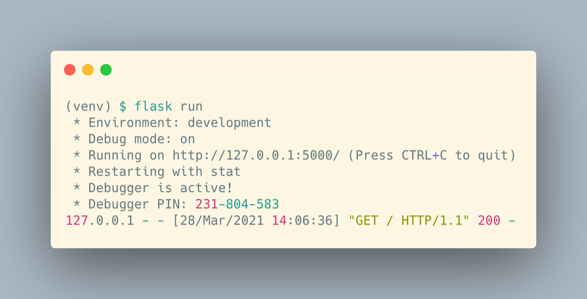
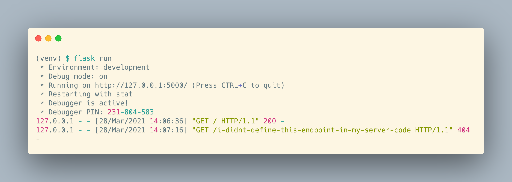
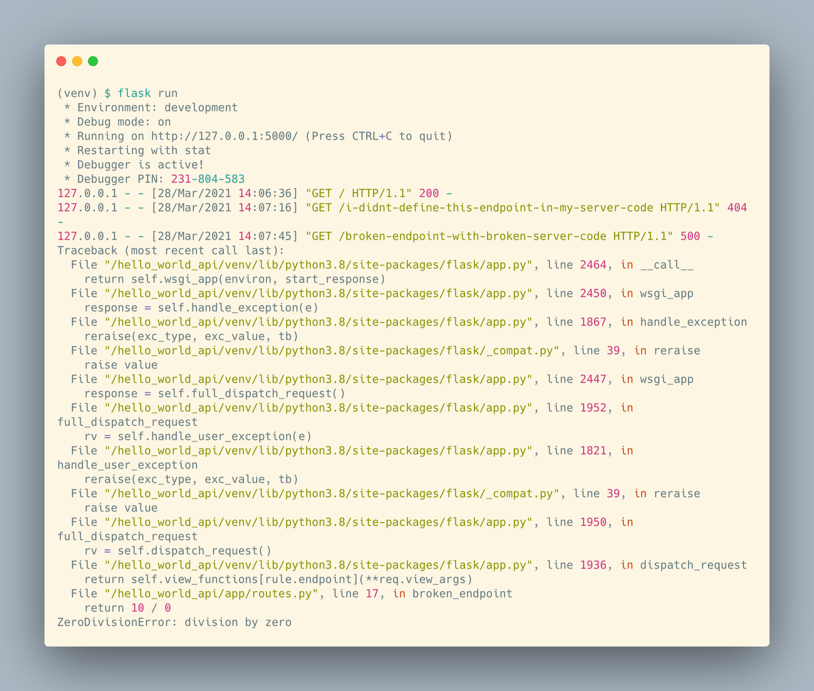

# Flask Setup

<iframe src="https://adaacademy.hosted.panopto.com/Panopto/Pages/Embed.aspx?pid=f6e8d4bc-f9d7-4630-94b9-ad10005ccdd8&autoplay=false&offerviewer=true&showtitle=true&showbrand=false&start=0&interactivity=all" height="405" width="720" style="border: 1px solid #464646;" allowfullscreen allow="autoplay"></iframe>

## Goals

The goal of this lesson is to introduce the setup steps for a Flask project, and pair each setup step with any commands or instructions that must be run.

## Format

This lesson covers:

1. How to install dependencies
   - Inside a virtual environment
   - From `requirements.txt`
1. How to run, stop, and restart a Flask server
1. How to read the server logs
1. Considerations for where different parts of code go

## Install Dependencies

Whenever we work on a Python project, we need to consider how we manage our dependencies, the third party packages used by our project.

`flask` is a package with many of its own dependencies, which can quickly make a mess of our system-wide Python installation!

In reality, no Python project is too small to consider using a virtual environment. But working with a package that brings as many dependencies as does `flask` is reason enough for us to revisit the topic of virtual environments now.

### In a Virtual Environment

We have been using virtual environments for a bit now, starting with our prior project work. We will present a brief review here, but we can always return to the previous material to refresh our memories about why we use virtual environments.

At the very beginning of a Python project, we will either:

1. Clone the project repo onto our machine, which creates a project folder
1. Create a new, empty project folder

Once we `cd` into the project folder, we can create a virtual environment. To make a conventional virtual environment named `venv`, we can use the following command:

```
$ python3 -m venv venv
```

We can activate and deactivate this virutal environment with these commands:

```bash
### Activate ###
$ source venv/bin/activate
(venv) $
(venv) $ # should see (venv) now

### Deactivate ###
(venv) $ deactivate
$
$ # should stop seeing (venv)
```

### From `requirements.txt`

Python projects will conventionally record all of their project dependencies in a file named `requirements.txt`.

These files will list the exact packages and their version numbers to download and install into this environment.

Here is a sample `requirements.txt`:

```
alembic==1.5.4
autopep8==1.5.5
click==7.1.2
Flask==1.1.2
Flask-Migrate==2.6.0
Flask-SQLAlchemy==2.4.4
itsdangerous==1.1.0
Jinja2==2.11.3
Mako==1.1.4
MarkupSafe==1.1.1
psycopg2==2.8.6
pycodestyle==2.6.0
python-dateutil==2.8.1
python-dotenv==0.15.0
python-editor==1.0.4
six==1.15.0
SQLAlchemy==1.3.23
toml==0.10.2
Werkzeug==1.0.1
```

At the beginning of the project, or after any updates to this file, we install all dependencies with:

```bash
(venv) $ pip install -r requirements.txt
```

If we've introduced a new dependency into this project, we should update our `requirements.txt` file. This way, our team members can also learn which exact packages are required now.

To update the `requirements.txt` file, we use this command:

```bash
(venv) $ pip freeze > requirements.txt
```

### !callout-info

## No need to manually edit the requirements.txt file

Because we can use the above command to ask `pip` to update our `requirements.txt` file, there's no need to ever open up the file and edit it directly.

### !end-callout

## Running, Stopping, and Restarting the Server

Building an API means that we're building a web server. A web server needs to be _running_ in order to be accessible to clients. Running a web server makes it available to respond to HTTP requests at a particular _address_ and _port_.

### !callout-secondary

## Address and Port Are Like Street Address and Apartment

Any service listening for network requests listens at a particular _address_ and a particular _port_. The _address_ can be thought of as like a street address, while the _port_ is more like an apartment number. If we send a letter to our friend Kerry, who lives in an apartment building, we need both the street address of the building itself, as well as their apartment number in the building. If we send a letter to the wrong building, Kerry won't receive it. If we send the letter to the wrong apartment number, Kerry still won't receive it (their neighbors are jerks and won't drop it off at their door).

<br />

Likewise, if we send a network request to the wrong address, then it won't reach the proper machine. If we send it to the wrong port, it still won't reach the web server. We need to know the address and port to make sure our request reaches the web server.

### !end-callout

### Running the Server

When a server starts running, it performs its startup routine, which often includes reading configuration files, changing settings, and connecting to any required resources.

To run a Flask server, we run this command:

```bash
(venv) $ flask run
```

### !callout-info

## Default Flask Server URL is `localhost:5000`

By default, running Flask servers will be available on `localhost:5000`. `localhost` acts as the address and `5000` is the port. They are separated by a colon. Our clients will send HTTP requests to `http://localhost:5000`.

<br />

`localhost` is a special name used to refer to the local computer itself. We may also see the local computer referred to as `127.0.0.1`, which is called an _IP address_. `localhost` and `127.0.0.1` mean the same thing: the local computer itself!

### !end-callout

Once we start running a server, the current Terminal tab begins to _tail_ the server logs. The server will log status updates about the server's operations.

In order for us to run terminal commands like `git`, we'll need to open an additional Terminal window or tab, or stop the server.

### Stopping the Server

When we stop a server, the server runs its shut down operations. Once complete, it will no longer be available to handle requests until we start it again.

To stop a Flask server:

1. Return to the Terminal tab or window that is running the server
1. Press `ctrl` + `c`

<br />

<details style="max-width: 700px; margin: auto;">

   <summary>
      Sometimes the server gets stuck. What do we do in that case?
   </summary>

If something goes wrong when shutting down the server, or if the Terminal where the server was running is somehow closed without stopping the server, the server may not release the address and port where it was running. If that happens, a new server will not be able to run using that address and port, and will fail to start. This may be reported with an error message resembling `OSError: [Errno 48] Address already in use`.

#### One Debugging Strategy

To locate another server using port 5000, which Flask wants to use, we can run `lsof -i:5000`. This will produce output similar to

```
COMMAND   PID  USER   FD   TYPE             DEVICE SIZE/OFF NODE NAME
Python  31756  user    3u  IPv4 0x92416cca3d5db1fb      0t0  TCP localhost:commplex-main (LISTEN)
```

We can use the number labelled as `PID` to terminate the other running server with the command `kill -9 31756`, where we would replace `31756` with the `PID` value we got from running `lsof`.

</details>

### "Restarting" the Server

"Restarting the server" usually means stopping and starting the server again.

## Reading the Server Logs

We can use the server logs to debug our server code. After we run `flask run` from the terminal to start the server, any error messages that our server needs to communicate will be printed in that terminal window.

The server logs update in real-time. These are the logs immediately after receiving a `GET` request to `localhost:5000/`, which produced a `200` response.



These are the logs immediately after a `GET` request to `localhost:5000/i-didnt-define-this-endpoint-in-my-server-code`, which produced a `404` response.



These are the logs immediately after a `GET` request to `localhost:5000/broken-endpoint-with-broken-server-code`, which raised an error in our server code.



We can focus on the error message at the bottom here to trace our error:

```bash
  File "/hello_world_api/app/routes.py", line 17, in broken_endpoint
    return 10 / 0
ZeroDivisionError: division by zero
```

In this example, it seems that we have a `ZeroDivisionError` caused in a method named `broken_endpoint`, on line 17, in the file `/hello_world_api/app/routes.py`.

## Where Does Code Go: Endpoints

When we work on Flask projects, there could be anywhere from one file, to hundreds of files and folders.

The place we put our code that defines endpoints will **depend on the project**.

### !callout-warning

## Every Project Structure is Different

Flask does not enforce one specific file and folder structure. We'll have to go exploring to figure out where to put our code for each project.

### !end-callout

This curriculum will provide a suggested project structure and location:

```
.
├── app
│   ├── __init__.py
│   └── routes.py
├── README.md
└── requirements.txt
```

Inside each `app` folder, there will be a file named `routes.py`. The responsibility of this file is to define the endpoints.

## Where Does Code Go: Config

As we develop our Flask projects, we'll need to reconfigure the app to suit our needs better. Configurations to the app can include things like, "Where's the location of our database?," "How do we load different data models, the objects that represent our data?," or "How can we set up template views, called Blueprints?"

The place we put our code that defines any configuration, again, **heavily depends on the project**.

This curriculum will provide a suggested project structure and location:

```
.
├── app
│   ├── __init__.py
│   └── routes.py
├── README.md
└── requirements.txt
```

Inside each `app` folder, there will be a file named `__init__.py`. This is the same file we have used to mark a folder as a package! While we often leave this file blank, a common Flask pattern is to define the start-up logic for the Flask server in this file.

The start-up logic is responsible for locating and applying any app configuration, and getting the server ready to receive requests.

### !callout-info

## Changing Configurations is Rare

Developers don't need to fuss with configurations that often. Usually, when setting up a project, we will refer to a previous working project to make sure the new one is configured appropriately.

<br />

We should try to become familiar with the kinds of settings we might want to configure in our app. Overall it's more important to know _where_ configuration _changes_ are made, rather than being able to write fresh configurations from scratch.

### !end-callout

In a sample Flask application, there may be a file (possibly `app/__init__.py`) that looks like this:

```python
from flask import Flask
from flask_sqlalchemy import SQLAlchemy
from flask_migrate import Migrate

db = SQLAlchemy()
migrate = Migrate()


def create_app():
    app = Flask(__name__)
    app.config["SQLALCHEMY_TRACK_MODIFICATIONS"] = False
    app.config["SQLALCHEMY_DATABASE_URI"] = "... Some Path to Postgres Database ..."

    db.init_app(app)
    migrate.init_app(app, db)

    # import models (data objects) here

    # import routes (blueprints) here

    return app
```

This code:

- Creates a `db` reference and a `migrate` reference, which will be used to work with the database
- Creates a function named `create_app()`
- Creates a `app` reference, which is the instance of our Flask app
- Configures the app's connection to a database
- Initializes our database and migration features

## Dev Workflow

Our modified dev workflow for Flask development may now look like this:

1. `cd` into a project root folder
1. Activate a virtual environment
1. Check git status
1. Start the server
1. Cycle frequently between:
   1. Writing code
   1. Checking git statuses and making git commits
   1. Debugging with Postman, server logs, VS Code, and more
1. Stop the server
1. Deactivate the virtual environment

## Check for Understanding

<!-- Question 1 -->
<!-- prettier-ignore-start -->
### !challenge
* type: ordering
* id: Lg4wGD
* title: Flask Setup
##### !question

Arrange the options below so that they match these terms in this order:

1. Command to create a virtual environment
1. Command to install the project's dependencies
1. Command to start running the Flask server

##### !end-question
##### !answer

1. `$ python3 -m venv venv`
1. `$ pip install -r requirements.txt`
1. `$ flask run`

##### !end-answer
### !end-challenge
<!-- prettier-ignore-end -->

<!-- Question 2 -->
<!-- prettier-ignore-start -->
### !challenge
* type: ordering
* id: kzm8zw
* title: Flask Setup
##### !question

Arrange the options below so that they match these terms in this order:

1. The location where clients should send HTTP requests, for a default Flask server
1. The location where the server logs print
1. The location for Python code that defines routes and configuration

##### !end-question
##### !answer

1. `localhost:5000`
1. Terminal
1. It depends on the project

##### !end-answer
### !end-challenge
<!-- prettier-ignore-end -->
