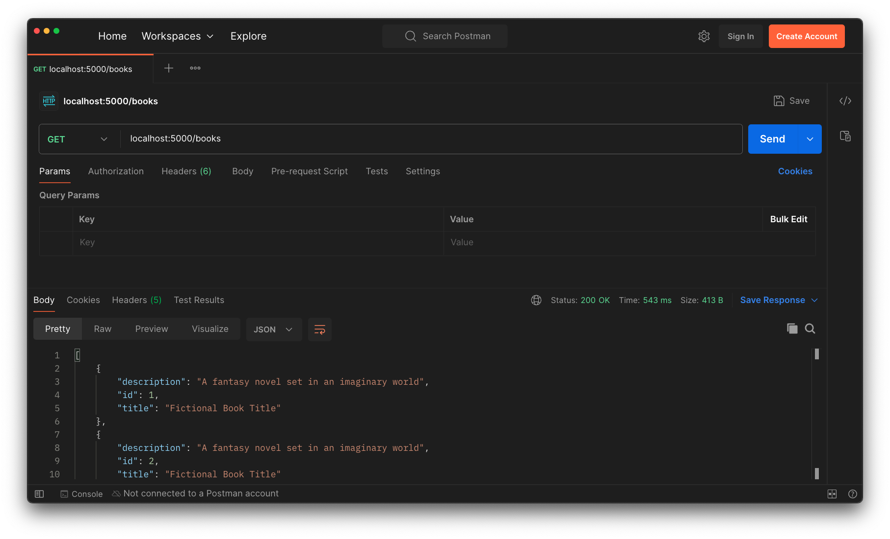

# Read

<iframe src="https://adaacademy.hosted.panopto.com/Panopto/Pages/Embed.aspx?pid=13c1312c-7230-4631-9687-adba0000a65e&autoplay=false&offerviewer=true&showtitle=true&showbrand=false&captions=true&interactivity=all" height="405" width="720" style="border: 1px solid #464646;" allowfullscreen allow="autoplay"></iframe>

## Goals

- Practice defining routes that read model records
- Access a database record from the back-end layer

### This Lesson's Work

We want to build our Hello Books API to fulfill these features:

1. As a client, I want to send a request to get all existing books, so that I can see a list of books, with their `id`, `title`, and `description` of the book.
1. As a client, I want to send a request to get one existing book, so that I can see the `id`, `title`, and `description` of the book.

We will refactor the endpoints we designed in our previous lessons **Building and API - Part 1: Reading All Books and Endpoint and Read One Book Endpoint** to make use of the data in our postgres database.

## Planning HTTP Requests, Responses, and Logic Review

Let's review the planning work we did in the lesson **Building and API - Part 1: Reading All Books and Endpoint**.

Let's think about the typical HTTP verb and endpoint used for requests that retrieve all records of a particular resource. 

Recall that for requests that read records, it is typical to use a `GET` request to the `/books` path. 

| HTTP Method | Endpoint |
| ----------- | -------- |
| `GET`       | `/books` |

`GET` requests do not include a request body, so no additional planning around the request body is needed.

The response we want to send back is a list of JSON objects (dictionaries) with `id`, `title`, and `description`.

The most appropriate successful response status code is `200 OK`.

| Response Status | Response Body                                                                                              |
| --------------- | ---------------------------------------------------------------------------------------------------------- |
| `200 OK`        | `[{"id": 1, "title": "Fictional Book Title", "description": "A fantasy novel set in an imaginary world"}, {"id": 2, "title": "Fictional Book Title", "description": "A fantasy novel set in an imaginary world"}, {"id": 3, "title": "Fictional Book Title", "description": "A fantasy novel set in an imaginary world"}]` |

Now that we have an idea of what our endpoint should look like, we can turn our attention to how to implement it.

Our endpoint will need to:

1. Retrieve all of the books data.
1. Format the list of Book instances into the appropriate JSON data structure (list of dictionaries, where each dictionary has `id`, `title`, and `description`)
1. Send back a response

Recall that `jsonify` is a Flask utility function that turns its argument into JSON. We'll use `jsonify` as a way to turn a list of book dictionaries into a `Response` object.

For additional details about `jsonify`, we can refer to:

- [Flask's definition of `jsonify`](https://flask.palletsprojects.com/en/1.1.x/api/#flask.json.jsonify)

## Working with `query` from SQLAlchemy's `Model`

Each Model class (a class that inherits from `db.Model`) has a `query` attribute. The object returned by the `query` attribute has the functions we will use to retrieve model data from the database. This is the object that will do the hard work of querying the database!

There are a lot of ways to use the `query` object. For future reference, we can refer to:

- [SQLAlchemy's quickstart guide to querying records](https://flask-sqlalchemy.palletsprojects.com/en/2.x/queries/#querying-records)
- [SQLAlchemy's definition of `Model`](https://flask-sqlalchemy.palletsprojects.com/en/2.x/api/#flask_sqlalchemy.Model) (which includes `query`)

## Getting All Books Endpoint: Code

Let's update our route function in `routes.py` to include support for retrieving our models.

To access all the books in our database we use the syntax `Book.query.all()`.

Consider how you could refactor the `GET` `/books` route to make use of this *query*.

<details>
    <summary>Give it a try, then click here to review our code.</summary>

```python
from app import db
from app.models.book import Book
from flask import Blueprint, jsonify, make_response, request

books_bp = Blueprint("books", __name__, url_prefix="/books")

@books_bp.route("", methods=["GET", "POST"])
def handle_books():
    if request.method == "GET":
        books = Book.query.all()
        books_response = []
        for book in books:
            books_response.append({
                "id": book.id,
                "title": book.title,
                "description": book.description
            })
        return jsonify(books_response)
    elif request.method == "POST":
        # ... Indent all of the Create Book functionality into this elif
        # request_body = request.get_json()
```

</details>

| <div style="min-width:250px;"> Piece of Code </div> | Notes                                                                                                                                                                                                                                                    |
| --------------------------------------------------- | -------------------------------------------------------------------------------------------------------------------------------------------------------------------------------------------------------------------------------------------------------- |
| `@books_bp.route("", methods=["GET", "POST"])`      | Add `"GET"` into this list of accepted HTTP methods                                                                                                                                                                                                      |
| `if request.method == "GET":`                       | Separate this functionality from the Create feature by checking the `request`'s HTTP method                                                                                                                                                              |
| `... = Book.query.all()`                            | This SQLAlchemy syntax tells `Book` to `query` for `all()` books. This method returns a _list_ of instances of `Book`.                                                                                                                                   |
| `books = ...`                                       | We store the list of `Book` instances in the variable `books`                                                                                                                                                                                            |
| `for book in books:`                                | We iterate over all books in `books` so we can collect their data and format it into a response                                                                                                                                                          |
| `books_response.append( ... )`                      | We will use the `books_response` list to hold book dictionaries                                                                                                                                                                                          |
| `{ "id": book.id, ... }`                            | This is the format of dictionary we want to send back. We'll insert the values based on the `book` we're iterating on                                                                                                                                    |
| `jsonify(books_response)`                           | `books_response` contains a list of book dictionaries. To turn it into a `Response` object, we pass it into `jsonify()`. This will be our common practice when returning a list of something because the `make_response` function does not handle lists. |
| `return ...`                                        | We must return our response. By default, a response with no specified status code returns `200 OK`                                                                                                                                                       |

### Manually Testing with Postman

Let's test this request:

- Set the method to `GET`
- Keep the request URL at `localhost:5000/books`



### !callout-info

## Remember to Debug with All of the Tools!

Remember to use all debugging tools:

- Postman
- Server logs
- VS Code
- Peers, classmates, and rubber ducks

### !end-callout

<!-- prettier-ignore-start -->
### !challenge
* type: tasklist
* id: 9Lz3nt
* title: Create and Read, Getting All Books Endpoint
##### !question

Think about the "Getting All Books Endpoint."

Check off all the topics that we've briefly touched on so far.

##### !end-question
##### !options

* Planned the HTTP response, request, and logic for this endpoint
* Briefly considered `jsonify`
* Briefly considered `query`
* Updated this endpoint to match `GET` requests, too
* Refactored this endpoint to check `request.method`
* Got a list of `Book` instances using `Book.query.all()`
* Iterated through `books`
* Created a list of Book dictionaries in `books_response`
* Used `jsonify` with `jsonify(books_response)`
* Returned this JSON list with the status code `200 OK`
* Tested this request in Postman

##### !end-options
### !end-challenge
<!-- prettier-ignore-end -->

## Getting a Single Book Endpoint: Preparation

Let's consider how to implement this feature:

> As a client, I want to send a request to get one existing book, so that I can see the `id`, `title`, and `description` of the book.

## Planning HTTP Requests, Responses, and Logic Review

Let's review the planning work we did in the lesson **Requests and Responses in Flask: Reading All Books and Endpoint and Read One Book Endpoint**.

Once more, we should think about the typical HTTP verb and endpoint used for requests that retrieve the data for a particular model record.

For this feature, we should make a `GET` request to the `/books` path, but we need to include the `id` of the record to retrieve as part of the endpoint.

| HTTP Method | Endpoint   |
| ----------- | ---------- |
| `GET`       | `/books/1` |

`GET` requests do not include a request body, so no additional planning around the request body is needed.

We want to send back a single JSON object (dictionary) with `id`, `title`, and `description`:

| Response Status | Response Body                                                                                            |
| --------------- | -------------------------------------------------------------------------------------------------------- |
| `200 OK`        | `{"id": 1, "title": "Fictional Book Title", "description": "A fantasy novel set in an imaginary world"}` |

Now that we have an idea of what our endpoint should look like, we can turn our attention to how to implement it.

Our endpoint will need to:

1. Read the `book_id` in the request path
1. Retrieve the book with the matching `book_id` from the database
1. Format the book data into the appropriate structure (a single dictionary with `id`, `title`, and `description`)
1. Send back a response

Our new route needs to read data from the incoming request path. Our existing route doesn't do this, so we'll need to add an entirely new route to our existing `Blueprint`.

Our new route needs a **route parameter**. The route `/books/1` should give us the details for the book with `id` 1. `/books/2` should give us details for book with `id` 2, `/books/3000` should give us details for book 3000, and so on.

Let's take a look at how our new route will account for this!

## Getting a Single Book Endpoint: Code

To access a single book with `book_id` in our database we use the syntax `Book.query.get(book_id)`.

Consider how you could refactor the `GET` `/books/<book_id>` route to make use of this *query*.

<details>
    <summary>Give it a try, then click here to review our code.</summary>

```python
# No new import statements...

# No modifications to the other route...

@books_bp.route("/<book_id>", methods=["GET"])
def handle_book(book_id):
    book = Book.query.get(book_id)

    return {
        "id": book.id,
        "title": book.title,
        "description": book.description
    }
```

</details>

| <div style="min-width:250px;"> Piece of Code </div> | Notes                                                                                                                                                                                                                                                                                                                                                                              |
| --------------------------------------------------- | ---------------------------------------------------------------------------------------------------------------------------------------------------------------------------------------------------------------------------------------------------------------------------------------------------------------------------------------------------------------------------------- |
| `@books_bp.route("...", methods=["GET"])`           | We are setting up a new route, so we must use the `Blueprint` decorator to define it                                                                                                                                                                                                                                                                                               |
| `"/<book_id>"`                                      | This is the `Blueprint` syntax to indicate _route parameters_. The `<book_id>` placeholder shows that we are looking for a variable value (could be `1`, `2`, or `3000`). We'll use this value in the function as the variable `book_id`, so we should use a good, descriptive name.                                                                                               |
| `def handle_book(book_id):`                                | This `handle_book` function is called whenever the HTTP request matches the decorator. The name of this function should follow the previously discussed guidelines. We must add a parameter to this method, `book_id`. This parameter name must match the route parameter in the decorator. It will receive the part of the request path that lines up with the placeholder in the route. |
| `Book.query.get(...)`                               | This is the SQLAlchemy syntax to query for one `Book` resource. This method returns an instance of `Book`.                                                                                                                                                                                                                                                                         |
| `Book.query.get(book_id)`                           | We must pass in the primary key of a book here. The primary key of the book we're looking for was provided in the route parameter, `book_id`.                                                                                                                                                                                                                                      |
| `{ "id": book.id, ... }`                            | We can create a dictionary literal for our HTTP response.                                                                                                                                                                                                                                                                                                                          |
| `return`                                            | As always, we must return a response. Flask will default to returning status `200 OK`.                                                                                                                                                                                                                                                                                             |

### !callout-warning

## Python Doesn't Know What a `book_id` Is

We named the route parameter `book_id` because we expect it to be an id of a book. But just like regular variable names, Python has no idea what a `book_id` is. All it does is look for whatever part of the URL path follows `/books/` and captures that into the variable `book_id`. A request for `/books/360` would set the value of `book_id` to be `"360"`. A request for `/books/tacocat` would set the value of `book_id` to be `"tacocat"`!

<br />

We should be careful to avoid thinking that Python uses the name of the parameter to do any kind of validation. As usual, the name provides information to us developers, not to Python.

### !end-callout

### !callout-info

## Why Didn't We Call `jsonify()` or `make_response()` on the Dictionary?

For reasons that are less important to memorize, Flask will automatically convert a dictionary into an HTTP response body. If we don't want to remember this exception, we can call `jsonify()` or `make_response()` with the dictionary as an argument to return the result.

### !end-callout

<!-- prettier-ignore-start -->
### !challenge
* type: tasklist
* id: ECXaUI
* title: Create and Read, Getting a Single Book Endpoint
##### !question

Think about the "Getting a Single Book Endpoint."

Check off all the topics that we've briefly touched on so far.

##### !end-question
##### !options

* Planned the HTTP response, request, and logic for this endpoint
* Considered route parameters, and how we need the book ID in the route
* Created a new endpoint that matches on `GET` requests to `"/<book_id>"`
* Defined this endpoint with the function signature `def book(book_id):`
* Used `Book.query.get(book_id)` to get an instance of `Book` matching `book_id`
* Returned a dictionary literal as our response

##### !end-options
### !end-challenge
<!-- prettier-ignore-end -->

### !callout-warning

## What About Error Handling?

There are many cases that weren't covered in this lesson, even though they are relevant to creating and reading `Book`s. For example, what happens if we make a `GET` request to `/books/this-book-doesnt-exist`? We are intentionally not covering these cases at the moment, to limit this lesson. However, hypothesize and research how to handle erroneous HTTP requests. Follow your curiosity!

### !end-callout
