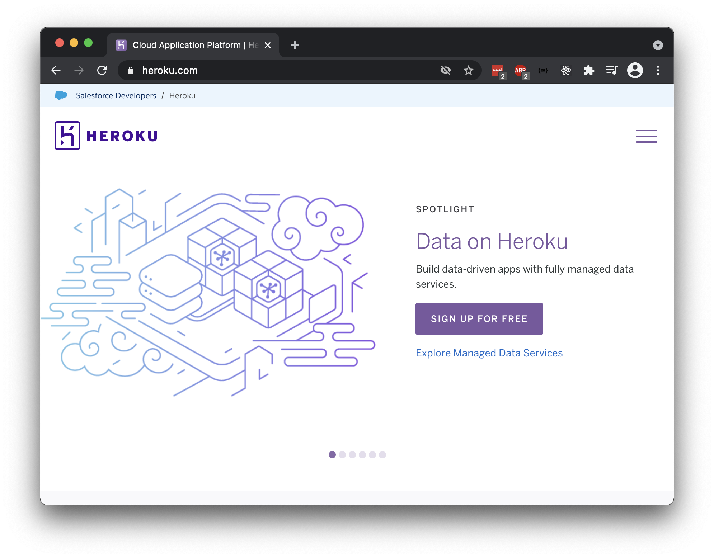
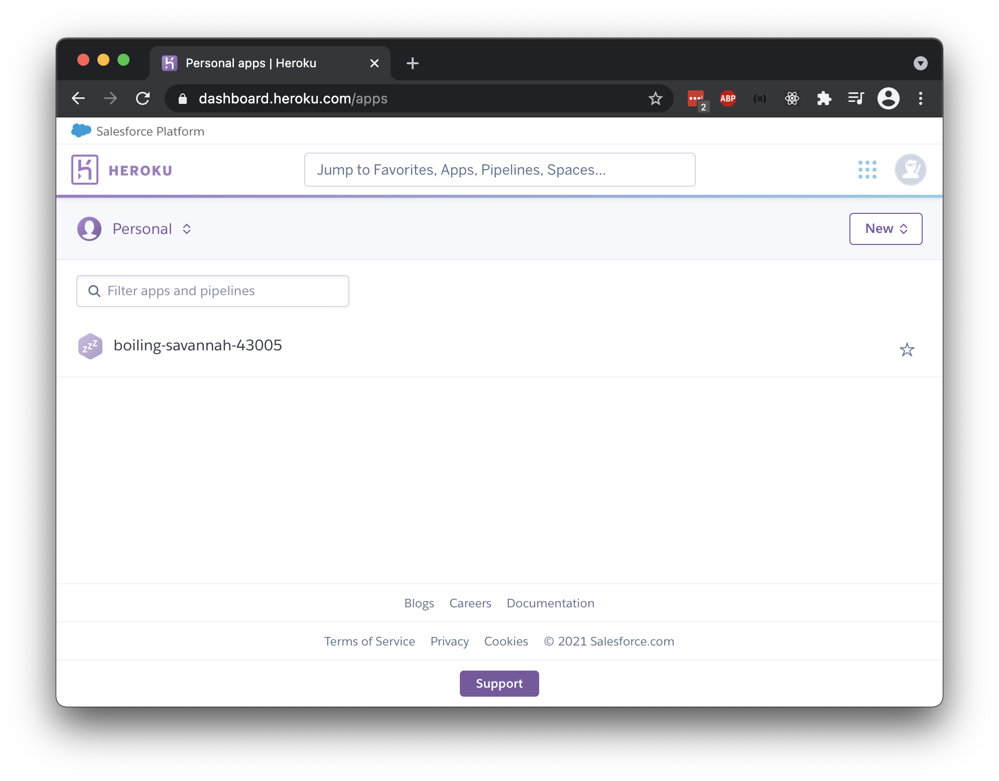
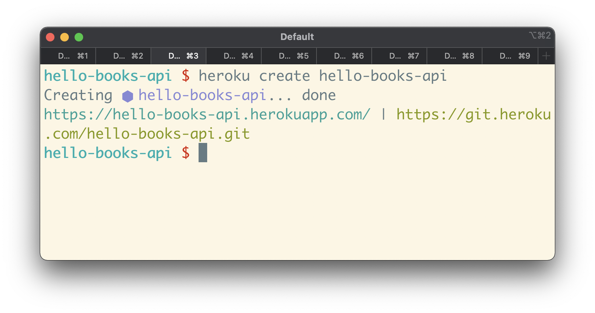
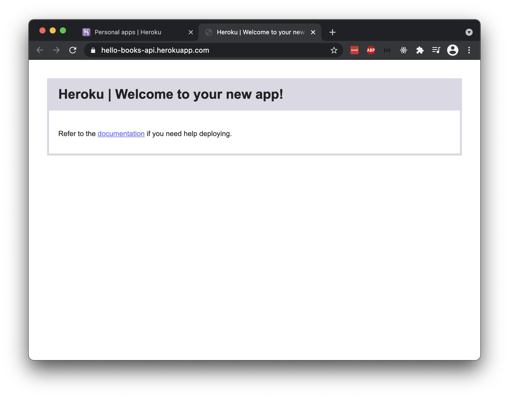
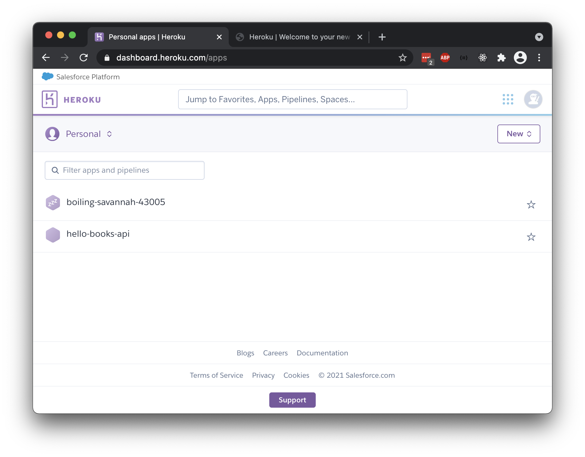
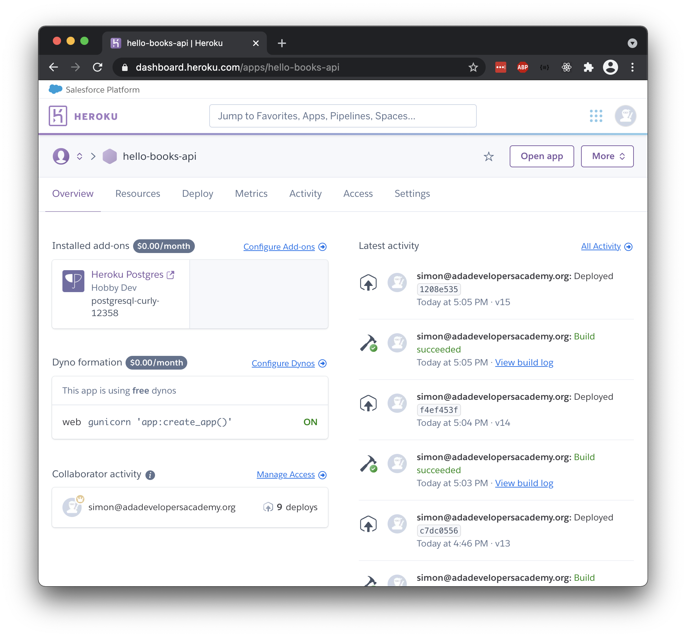
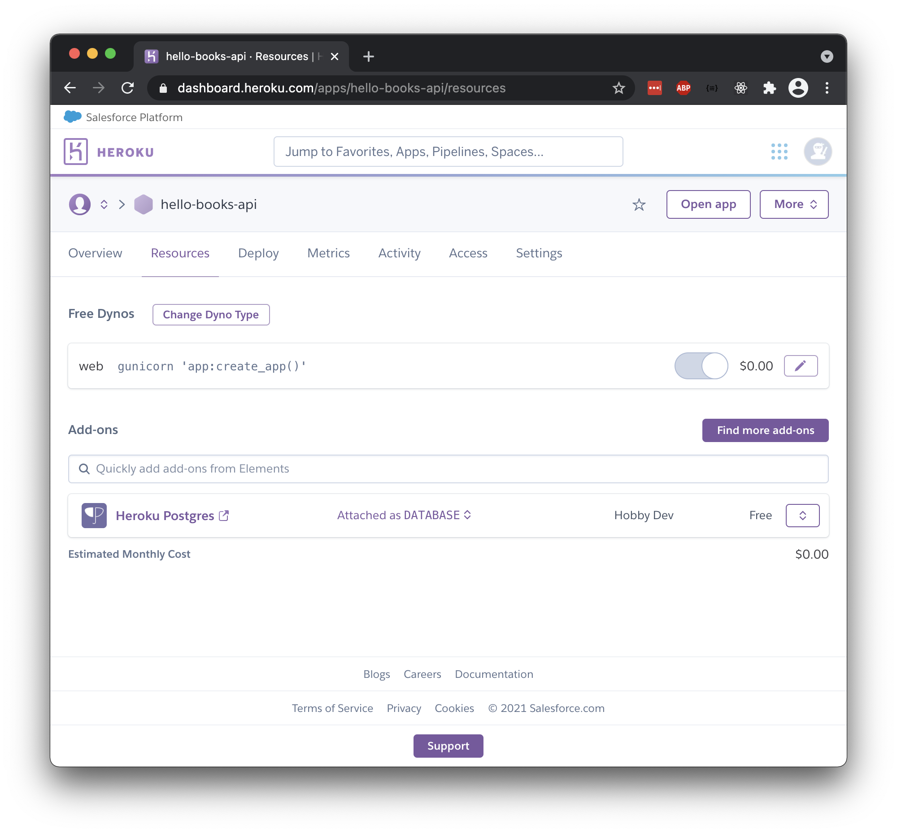

# Deploying to Heroku

## Goal

Our goal is to show the process of deploying a Flask API to Heroku.

### Intro to Heroku

[Heroku](https://www.heroku.com/home) is one Platform as a Service (PaaS). We can use Heroku services to deploy our Flask API. After we successfully deploy, our API will be available to the whole Internet!



We are choosing Heroku as a deployment platform because:

- It is a trusted, popular platform with a large, supportive community
- It has free features that fulfill our needs
  - It supports Python and Flask deployment
  - It supports Postgres databases
- It is appropriate for small, individual projects (as well as large ones)
- It uses Git as part of its development workflow

## Format

This lesson will outline the following steps in order to do an initial deploy to Heroku:

1. Create a Heroku account and get access to the Heroku CLI
1. Configure our Flask project for Heroku
1. Commit our new configurations
1. Create a Heroku app via the CLI
1. Push code to the Heroku remote
1. Create a database in Heroku via the CLI
1. Set the environment variables for Heroku
1. Setup and initialize the database in Heroku via the CLI
1. Verify

Then, we will cover these topics on continuous deployment to Heroku:

1. Updating the Heroku remote in our development workflow
1. General Heroku tools
1. General Heroku debugging strategies

### !callout-danger

## Read-through First, Repeat Second

We **highly suggest** reading or watching through this lesson fully, before repeating on your own machine.

### !end-callout

### !callout-danger

## Prioritize Familiarity

It may be better to think about this lesson as a resource to be familiar with, rather than committing all the new knowledge to memory at once.

### !end-callout

## Create a Heroku Account

Create an account on [Heroku](https://www.heroku.com/home).

After logging into the dashboard, as a new user we should see an empty list of Heroku apps. (This screenshot is from an account which had already created one Heroku app).



### Get the Heroku CLI

The Heroku CLI will allow us to run powerful commands to manage our Heroku apps from our command line! We'll use the CLI to create and manage our deployed projects.

Follow the directions to install [the Heroku CLI](https://devcenter.heroku.com/articles/heroku-cli):

```bash
$ brew tap heroku/brew && brew install heroku
```

This command runs two separate commands. The `&&` joins them into one convenient copy/paste-able unit.

The first command `brew tap heroku/brew` tells Homebrew to add an additional source of software packages (termed a _tap_ in Homebrew-speak). The second command `brew install heroku` uses Homebrew to install the Heroku CLI, which it will be able to find with the tap we just configured.

### Log In to the Heroku CLI

The Heroku CLI needs to authenticate our user account. Follow the directions to [log into the Heroku CLI](https://devcenter.heroku.com/articles/heroku-cli#getting-started):

```bash
$ heroku login
```

We'll be prompted to press any key to go to a web browser to complete our login. The CLI will then log us in automatically.

## Configure Our Flask App for Heroku

Although Heroku will do a lot of the work of hosting, running, and maintaining our API server, we need to add a small amount of configuration to our project.

### Check Dependencies for `gunicorn`

We will use a Python package named [gunicorn](https://pypi.org/project/gunicorn/) to launch our Flask API on Heroku.

`gunicorn` is capable of running Flask apps so that they can handle multiple simultaneous requests, which is very important for production web applications.

We should confirm that the package `gunicorn` is in the project's `requirements.txt` file.

If `gunicorn` does _not_ appear in our `requirement.txt`, we can add it by installing it locally with:

```bash
(venv) $ pip install gunicorn
```

After it has installed, we can update our `requirements.txt` by running:

```bash
(venv) $ pip freeze > requirements.txt
```

Heroku makes use of our `requirements.txt` file to install our app dependencies, so it is very important to ensure that all of our dependencies are properly listed.

If we needed to update our `requirements.txt`, we should be sure to add and commit this change.

### Create a Procfile for Heroku

[`Procfile`](https://devcenter.heroku.com/articles/procfile) is a file specifically used in codebases deployed on Heroku.

We'll use our Procfile to define how to start our Flask web server.

First, create a `Procfile` inside the project root. This file _must be named exactly `Procfile`, **with no file extension**_.

```bash
$ touch Procfile
```

Then, fill the Procfile with this content:

```
web: gunicorn 'app:create_app()'
```

## Commit

Save this file. Then, create a Git commit that contains this change.

## Create a Heroku App

For each project we deploy, we will need to create and manage a Heroku app. Our Heroku app will give us visibility, access, and tools to manage our deployed app.

After `cd`ing to our project root, we can create a Heroku app using the Heroku CLI. From the command line we should pick **either** of these options:

1. We can create a Heroku app with an automatically generated app name using:

```bash
$ heroku create
```

2. We can create our app with the name `your-app-name` using:

```bash
$ heroku create your-app-name
```

Replace `your-app-name` with the desired name of the app.



Note that the app name must be unique across all Heroku apps, not just our own apps. As a result, the name `hello-books-api` is already taken, as it was used in this walk-through! We will need to come up with our own name that has a unique touch, or we can simply use the nameless option to generate a unique name automatically.

### Our New Heroku App

We have officially created a Heroku app that is accessible online! We can follow the link from the `heroku create` output.



Our Heroku app doesn't have access to our Flask API code yet, so we'll see a default Heroku message.

### Verify the New Heroku Remote

Creating a Heroku app will add a new Git remote to our project! A Git remote is a destination to which we can `git push`!

The new Git remote will be named `heroku`. This Git remote points exactly to where Heroku keeps and serves our code!

Confirm that we have a `heroku` remote by running this command:

```bash
$ git remote -v
```

We should see the `heroku` remote listed alongside our `origin` remote.

### Verify in the Dashboard

Creating a Heroku app will associate this app to our Heroku account.

Visit the Heroku dashboard and see your new app listed! We'll visit this dashboard whenever we need details about our Heroku app.



## Push Code to the Heroku Remote

We should send our project codebase to our `heroku` remote.

This command will push our project's Git history to a remote named `heroku`. It will push the default `master` branch on our computer to Heroku's default `main` branch on our new Heroku virtual computer.

```bash
$ git push heroku master:main
```

Every time we want to push our Git history to our Heroku app, we will need to push to the `heroku` remote.

### !callout-info

## Pushing to Heroku Still Ignores Files

Since we are using Git to send our code to Heroku, this means any files listed in our `.gitignore` will _not_ be sent, including our `.env` file. This means our environment variables, which include our connection strings, will not be sent to Heroku! We'll see how to tell our app where to find our database later in this lesson.

### !end-callout

## Create a Database in Heroku

Now that we've created our Heroku app for the first time, we need to tell the app that we're interested in adding a Postgres database to our deployed Heroku app.

This command uses the Heroku CLI to add a Postgres database to the app.

```bash
$ heroku addons:create heroku-postgresql:hobby-dev
```

### Verify in the Dashboard

We can verify that our Heroku app has added a Postgres database by checking the [Heroku dashboard](https://dashboard.heroku.com/).

We can use the Heroku dashboard to view our Heroku app. In the "Overview" tab, in the "Installed add-ons" section, we should see "Heroku Postgres."



Alternatively, in the "Resources" tab, in the "Add-ons" section, we should see "Heroku Postgres."



## Set Environment Variables in Heroku

Our current app sets the `SQLALCHEMY_DATABASE_URI` environment variable using our `.env` file. Our Flask code accesses this environment variable with the code `os.environ.get("SQLALCHEMY_DATABASE_URI")`.

Instead of giving Heroku our `.env` file, we need to add our environment variables to Heroku using the Heroku dashboard.

### Find the Database URL in Heroku

First, let's find the connection string that will connect to our Heroku database, instead of a local database.

When we added the Postgres database add-on above, Heroku created this connection string.

In the Heroku dashboard, in the "Settings" tab, there is a section titled "Config Vars."


Once we locate this section, we should:

1. Click "Reveal Config Vars"
1. Find the automatically generated variable named "DATABASE_URL"
1. Copy the value of this connection string


### Set the Environment Variables in Heroku

Now, let's set the `SQLALCHEMY_DATABASE_URI` variable.

In the "Config Vars" section:

1. Create a new environment variable named `SQLALCHEMY_DATABASE_URI`
1. Set the value of this variable to the connection string we copied


## Setup and Initialize the Database in Heroku

Now that our Flask app is on Heroku and can connect to a database, we need to initialize the database in Heroku once.

We can run the following:

```bash
$ heroku run flask db upgrade
```

This will migrate the empty database in our remote Postgres connection to the latest schema configuration we have generated from our models.

## Verify

Our Flask project is on a Heroku machine, running, and connected to an initialized database. Now is the time to verify whether our API is accessible by web!

### Use the Browser

We can use the browser to make `GET` requests to any endpoint defined in our project, now using our deployed Heroku URI instead of `localhost`.

### !callout-warning

## Routing Configurations May Result in a `404 Not Found`
Recall that Flask routes are very picky about `/` characters. Some browsers will try to put a `/` character at the end of an address automatically. Depending on how our routes are set up, this might result in a route mismatch.

<br />

Our Flask API isn't _intended_ to be used through a web browser. It's meant to be used programmatically. It's convenient if testing through a browser works, but if it doesn't we can move on to test with Postman.

### !end-callout

Instead of `localhost:5000/books`, we can visit `https://your-app-name.herokuapp.com/books`, where `your-app-name` is the name of our Heroku app.


### !callout-info

## No Book Data

Our app has zero books listed when we go to `/books`, even though our app is deployed correctly and connected to our Postgres database correctly.

<br />


<details>

<summary>Why are there no books listed?</summary>

<br />

Recall that our deployed app is connected to a Postgres database that we created a few steps ago! We have not added any book data to our Heroku database. Even if our local database is full of books, our Heroku app's database connection string points at the Heroku database. 

</details>

### !end-callout

As a convenient shortcut, the Heroku CLI gives us this command to automatically open our Heroku app in the browser:

```bash
$ heroku open
```

This command needs to be run inside of our project folder.

### Use Postman

We can use Postman to make and verify all sorts of HTTP requests to our API!

### Use Heroku Logs

During local development on our own machines, when we ran `$ flask run`, the server's logs were output into our terminal. We could see the details about every HTTP request our server received and every HTTP response it returned. We could also see output for any errors.

We can access the server logs of our Heroku app from the Heroku dashboard by finding the "More" menu and selecting "View logs."


It reports the HTTP requests, responses, and errors that our Heroku app encounters.


Alternatively, we can access the server logs using the Heroku CLI and running:

```bash
$ heroku logs
```

If we want to see the logs output in real time, we can run:

```bash
$ heroku logs --tail
```

This option is useful when we are troubleshooting an issue. If we can recreate the error, we'll be able to see the server log information related to the error just as if we were running the application locally.

<!-- Question 1 -->
<!-- prettier-ignore-start -->
### !challenge
* type: checkbox
* id: bDUwQW
* title: Deploying to Heroku
##### !question

Consider the steps for doing the initial deploy to Heroku.

Check off all the topics that we've briefly touched on so far.

##### !end-question
##### !options

* Create a Heroku account and download the Heroku CLI
* Create a Procfile for our Flask project
* Committed the Procfile
* Create a Heroku app
* Push code to the `heroku` remote
* Added the Postgres add-on to our Heroku app using the Heroku CLI
* Set the environment variable for our database in Heroku
* Initialized the database by using `$ heroku run flask db upgrade`

##### !end-options
##### !answer

* Create a Heroku account and download the Heroku CLI
* Create a Procfile for our Flask project
* Committed the Procfile
* Create a Heroku app
* Push code to the `heroku` remote
* Added the Postgres add-on to our Heroku app using the Heroku CLI
* Set the environment variable for our database in Heroku
* Initialized the database by using `$ heroku run flask db upgrade`

##### !end-answer
### !end-challenge
<!-- prettier-ignore-end -->

## Updating the Heroku Remote Workflow

When we practice _continuous deployment_, we must adopt the practice of regularly updating the Git history of our Heroku app.

We can summarize our local development workflow like this:

1. Activate our virtual environment
1. Pull down any new commits from Git
1. Run tests
1. Write code
1. Make Git commits
1. Push our Git history to the `origin` remote, which is our repo on GitHub
1. **Push our Git history to the `heroku` remote**, which is our Heroku app
1. Verify our deployment

## General Deployment Tools

We can continue to use the browser and Postman to create HTTP requests and check their HTTP responses!

### Heroku Tools in the Dashboard

The Heroku dashboard includes:

- Access to the Heroku logs
- Access to the Heroku console (which acts as a terminal on our Heroku machine)
- Management of environment variables
- Management of collaborators on this Heroku app
- History of "Latest Activity," which will show the timeline of recent deployments

### Command-Line Tools

The following are great Heroku CLI commands to keep handy:

| <div style="min-width:200px;">Command</div>              | Explanation                                                                                                                                                         |
| -------------------- | ------------------------------------------------------------------------------------------------------------------------------------------------------------------- |
| `heroku logs --tail` | Starts tailing the Heroku logs in the current terminal window, displaying real-time updates                                                                           |
| `heroku run python3` | Runs the `python3` repl on the Heroku machine running our app                                                                                                       |
| `heroku pg:psql`     | Runs the `psql` CLI on the Heroku machine running our app. We can use this to execute `psql` commands, and check, add, update, or delete the data that our app uses. |

## General Heroku Debugging Strategies

Sometimes, after deployment, our deployed app doesn't behave as expected. This could be a bug, and it could also be our web server catching an exception.

Our deployed apps can encounter problems ranging from:

- Problems with our own Flask code, such as broken syntax or buggy features
- Our database not being connected or initialized properly
- Our Heroku machine not downloading and installing the correct dependencies
- Heroku.com itself being down, or improper use of Heroku tools

In those situations, here is a starting point for debugging and determining what is causing the deployment error:

| <div style="min-width:200px;">Debugging Action</div>                          | Details                                                                                                                                                                                                                                            |
| ----------------------------------------- | -------------------------------------------------------------------------------------------------------------------------------------------------------------------------------------------------------------------------------------------------- |
| Check the logs                            | The logs will show error messages that the web server outputs. These messages could share details such as Python `NameError`s, database connection errors, problems with running the Flask app, problems with downloading the right packages, etc. |
| See if you can recreate it locally        | Attempt to recreate the problem locally, by running `$ flask run` on your own local machine. Error messages may be more detailed on our local machine. Also, concluding that you're **unable to recreate the issue** is valuable in itself!        |
| Check the status of the Git history       | Confirm that the remote Git history is up-to-date. Check that working code has been recently pushed to the `heroku` remote.                                                                                                                        |
| Internet research!                        | Heroku has a large community of support, and a lot of documentation on deploying Flask apps and using Postgres databases. Be sure to use the Internet and to rubber duck with others.                                                              |
| Take notes of each debugging attempt      | It can be challenging to remember what you've tried on the Heroku machine. Write down and record all of the ways you've attempted to fix the problem.                                                                                              |
| Rubber duck, and post questions on Slack! | Debugging deployment usually depends on context. Rubber duck and connect with folks who are deploying similar projects to you!                                                                                                                     |

<!-- Question 2 -->
<!-- prettier-ignore-start -->
### !challenge
* type: multiple-choice
* id: oOMsqS
* title: Deploying to Heroku
##### !question

Which of the following is a command we can use to access the Heroku Postgres repl?

##### !end-question
##### !options

* `heroku pg:psql`
* `heroku python3`
* `heroku run python3`
* `heroku open SQLALCHEMY_DATABASE_URI`

##### !end-options
##### !answer

* `heroku pg:psql`

##### !end-answer
### !end-challenge
<!-- prettier-ignore-end -->

<!-- Question 3 -->
<!-- prettier-ignore-start -->
### !challenge
* type: checkbox
* id: CSpfam
* title: Deploying to Heroku
##### !question

Check all of the options that are recommended debugging steps.

##### !end-question
##### !options

* Try to recreate the issue on your local machine
* Check the Heroku server logs
* Check the local server logs
* Confirm that recent, working code is pushed up to the `heroku` remote
* Copy and paste the error messages and look it up on the Internet
* Push all code to the `origin` remote

##### !end-options
##### !answer

* Try to recreate the issue on your local machine
* Check the Heroku server logs
* Confirm that recent, working code is pushed up to the `heroku` remote
* Copy and paste the error messages and look it up on the Internet

##### !end-answer
### !end-challenge
<!-- prettier-ignore-end -->
