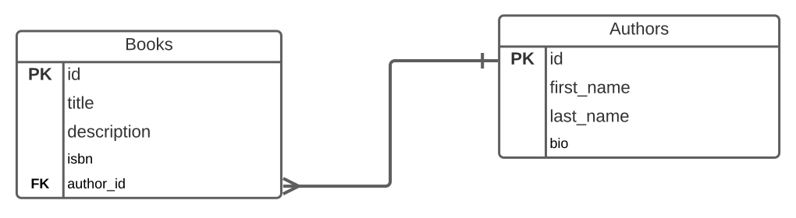
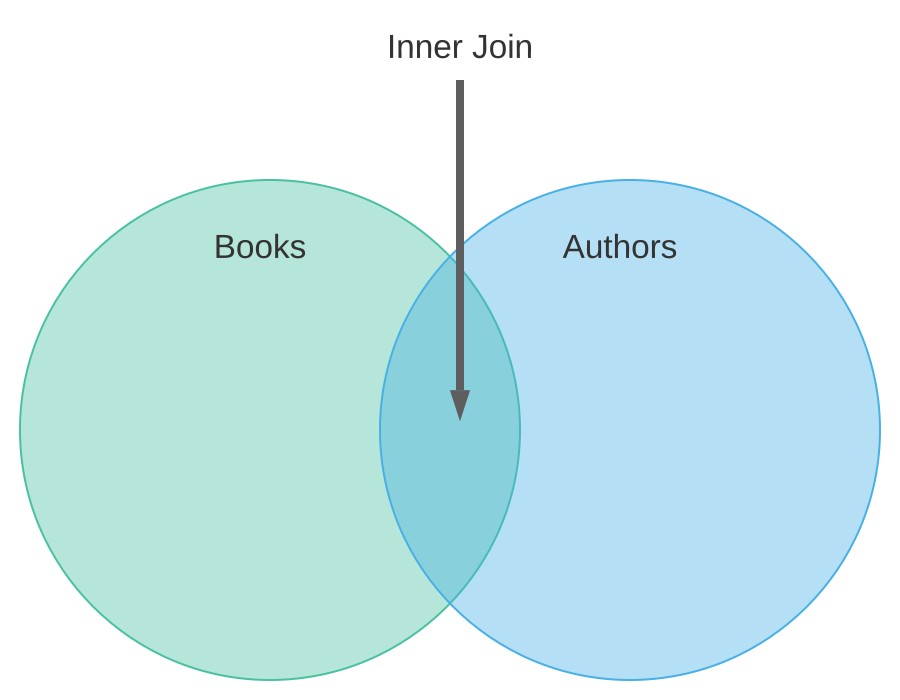
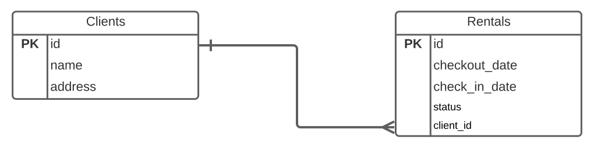
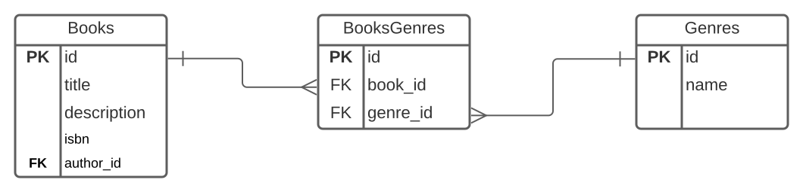

# Database Joins

<!-- TODO:  Remove this note

I'm only teaching Inner Joins here just to teach the concept.  

 -->

## Goals

- Explain how `SELECT` statements with joins retrieve related data
- Write `SELECT` Statements with joins to combine data from different, related tables

## Introduction

We have database tables connected through foreign keys.  Now we need to use this connection to pull information using that connection.

What if, using this erd, for example we need to retrieve Book titles and the names of their authors?



To do this we need to *join* the table rows based on the matching columns.  In this lesson we will learn to use `SELECT` statements with `JOIN` clauses to combine data from multiple tables.

## Vocabulary and Synonyms

| Vocab           | Definition                                                                                                            | Synonyms             | How to Use in a Sentence                                                                                                                                                                                                                              |
| --------------- | --------------------------------------------------------------------------------------------------------------------- | -------------------- | ----------------------------------------------------------------------------------------------------------------------------------------------------------------------------------------------------------------------------------------------------- |
| Join | A *join* is an SQL operation which combines columns from one or more tables in a relational database.  It creates a set that can be saved as a table or returned to the requestor.  | | I needed to get a information particular student and all of their classrooms, so I wrote a *join* query. |

## Revisiting SELECT

We have seen `SELECT` statements involving one table.  For example if we wanted to get the titles of all the books by the author with id 42 we could write.

```sql
SELECT title
FROM books
WHERE author_id = 42;
```

However tables can be related through foreign key fields.  We often want to get related information which resides in disparate tables.


For example given the above ERD, we might want to get the titles of all books written by Kaja Howell.  We could get information on Kaja with:

```sql
SELECT * 
FROM authors
WHERE first_name = 'Kaja' AND last_name = 'Howell';
```

We can can retrieve book titles with the following query on books.

```sql
SELECT title
FROM books;
```

We need a way to combine or *join* the queries.

### SELECT With Join

To write a select which joins two tables together our SQL looks like this replacing content inside [] with the names of our tables and columns:

```sql
SELECT [fields]
FROM [table_a]
INNER JOIN [table_b]
  ON [table_a.column_name] = [table_b.column_name]
/* Optional WHERE clause */
```

In the query:

* `INNER JOIN [Table Name]` - Specifies which table is being combined with the table in the `FROM` clause
* `ON [condition]`  - Specifies which field(s) to use in combining the two tables

Using this template to combine information in the books and authors tables, we can find all the book titles by Kaja Howell with the following query:

```sql
SELECT books.title, authors.first_name, authors.last_name
FROM books
INNER JOIN authors
  ON books.author_id = authors.id;
```

In this query we performed an *inner join*.  An inner join will combine (join) and return all the rows in both tables which possess matching keys.  In this case we will get all the books and their authors by combining rows from the two tables when the `author_id` in the `books` table matches the `id` field in the `authors` table.

You can picture it like this.


*Fig. Venn Diagram illustrating Inner Join*

If we wanted to narrow this down further and limit the query to books written by Kaja Howell we can add a `WHERE` clause. 

```sql
SELECT books.title, authors.first_name, authors.last_name
FROM books
INNER JOIN authors
  ON books.author_id = authors.id
WHERE authors.first_name = 'Kaja' and
  last_name = 'Howell';
```

This kind of query works for one to one relationships and one to many relationships.



We could also write a query to get all the clients and their check in dates with the following query.

```sql
SELECT clients.name, rentals.check_in_date
FROM clients
INNER JOIN rentals
  ON rentals.client_id = clients.id;
```

<!-- available callout types: info, success, warning, danger, secondary  -->
### !callout-info

## TABLE_NAME.COLUMN_NAME Syntax

We are using the syntax TABLE_NAME.COLUMN_NAME to differentiate between columns in the `clients` table and columns in the `rentals` table.  In cases where the column names do not conflict, this is optional, but explicitly refering the table is more readable.

### !end-callout


### Example With Data

If we had the following data:

| id | first_name | last_name | bio |
|--- |--- |--- |--- |
| 1  | Nisha | Blanchard | ... |
| 2  | Kaja | Howell | ... |
| 3  | Josef | Cannon | ... |
| 4  | Avery | Lim | ... |
*Fig. Authors Table Data*

| id | title | description | isbn | author_id |
|--- |--- |--- |--- |--- |
| 1  | The Snow Oracle | ... | ... | 1 |
| 2  | Sign of the Absent Hand | ... | ... | 1 |
| 3  | Before the Storm | ... | ... | 2 | 
| 4  | Case of the Webbed Baboon | ... | ... | 3 |
| 1  | Blade of Dawn | ... | ... | 2 |
| 1  | Electric Touch | ... | ... | 1 |
*Fig. Books Table Data*

The following SQL Query:

```sql
SELECT books.title, authors.first_name, authors.last_name
FROM books
INNER JOIN authors
  ON authors.id = books.author_id
WHERE authors.first_name = 'Kaja' AND 
  authors.last_name = 'Howell';
```

Results in:

| title | first_name | last_name |
|--- |--- |--- |
| Before the Storm | Kaja | Howell |
| Blade of Dawn | Kaja | Howell |
*Table: Result of Query*


### !callout-info

## Outer Joins

Yes there are other kinds of joins including *outer joins*, *left joins* and *right joins*.  However we will not need these queries at Ada, but students are welcome to research them independently.

### !end-callout

### Many to many Join

We combined columns from two tables with a `SELECT` using a single `JOIN` clause.  If we wanted to combine rows of two tables in a many to many relationship like the one below we can use a `SELECT` statement with two `JOIN` clauses.




```sql
SELECT books.title, genres.name
FROM books
INNER JOIN booksgenres
  ON booksgenres.book_id = books.id
INNER JOIN genres
  ON booksgenres.genre_id = genres.id;
```

If the data in our tables is:

| id | title                   | description | isbn |
|----|-------------------------|-------------|------|
| 1  | Raven Of The River      | ...         | ...  |
| 2  | Cat Of Rainbows         | ...         | ...  |
| 3  | Criminals Without Glory | ...         | ...  |
| 4  | Gods Without Direction  | ...         | ...  |
| 5  | Agents And Priests      | ...         | ...  |

*Fig. Books Table*

| id | name       |
|----|------------|
| 1  | Sci-Fi     |
| 2  | Fiction    |
| 3  | Fantasy    |
| 4  | Suspense   |
| 5  | Nonfiction |

*Fig. Genres Table*

| book_id | genre_id |
|---------|----------|
| 1       | 3        |
| 1       | 2        |
| 2       | 5        |
| 3       | 1        |
| 3       | 2        |
| 4       | 5        |
| 5       | 3        |
| 5       | 2        |
| 5       | 4        |

*Fig. BooksGenres Table*

Then our above query will generate:

| title | name |
|---------|----------|
| Raven Of The River        | Fantasy       |
| Raven Of The River        | Suspense      |
| Cat Of Rainbows           | Nonfiction    |
| Criminals Without Glory   | Sci-Fi        |
| Criminals Without Glory   | Fiction       |
| Gods Without Direction    | Nonfiction    |
| Agents And Priests        | Fantasy       |
| Agents And Priests        | Fiction       |
| Agents And Priests        | Suspense      |

*Fig. Result of Multi-join query*


## Check for Understanding

<!-- TODO:  Reorder question with a SELECT-Join -->

<!-- >>>>>>>>>>>>>>>>>>>>>> BEGIN CHALLENGE >>>>>>>>>>>>>>>>>>>>>> -->
<!-- Replace everything in square brackets [] and remove brackets  -->

### !challenge

* type: ordering
* id: 640d100c-e24f-41b6-ae70-41411711e709
* title: SQL SELECT JOIN Reordering
* points: 1
* topics: sql, sql-join, sql-select

##### !question

The following are lines in an SQL SELECT query with a JOIN clause.  Put them in the proper order.

##### !end-question

##### !answer

1. SELECT employees.name
2. FROM employees
3. INNER JOIN departments
4.   ON departments.id = employees.department_id
5. WHERE departments.name = 'Accounting';

##### !end-answer

### !end-challenge

<!-- ======================= END CHALLENGE ======================= -->

<!-- TODO:  SQL Question involving a SELECT-Join -->

<!-- >>>>>>>>>>>>>>>>>>>>>> BEGIN CHALLENGE >>>>>>>>>>>>>>>>>>>>>> -->
<!-- Replace everything in square brackets [] and remove brackets  -->

### !challenge

* type: code-snippet
* language: sql
* id: ae7b2f5b-1baf-4711-929d-fe0d6355ce20
* title: 
* data_path: /intermediate-sql/sql/database-joins.sql
<!-- * points: [1] (optional, the number of points for scoring as a checkpoint) -->
<!-- * topics: [python, pandas] (optional the topics for analyzing points) -->

##### !question

[markdown, your question]

##### !end-question

##### !placeholder

[the code below is the starting code in the web editor]
```sql
-- write a statement to select...
```

##### !end-placeholder

##### !tests

[the code below is the sql statement that returns the correct answer]
```sql
SELECT these
FROM that
JOIN other
WHERE this
GROUP BY logic
ORDER BY something
```

##### !end-tests

<!-- other optional sections -->
<!-- !hint - !end-hint (markdown, hidden, students click to view) -->
<!-- !rubric - !end-rubric (markdown, instructors can see while scoring a checkpoint) -->
<!-- !explanation - !end-explanation (markdown, students can see after answering correctly) -->

### !end-challenge

<!-- ======================= END CHALLENGE ======================= -->

<!-- TODO:  Question on key takeaway -->