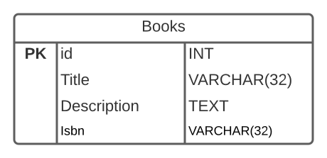

# Database Relationships

<!-- TODO:  Remove this note

Note:  I'm uncertain if I should separate ERD diagrams and this lesson, but ERD diagrams are great at illustrating relationships so...

 -->

## Goals

- Explain how relational databases establish relationships
- Describe the types of data relationships including:
  - One to one
  - One to many
  - Many to many
- Draw database relationships using an ERD Diagram

## Introduction

Databases such as Postgres are termed *relational databases*.  This is because we can establish relationships between tabes in our database.  This allows developers to selectively pull related information out of our datastore with specially crafted `SELECT` statements.

We have created database tables like the following.

| id | title | author | price | isbn |
|--- |--- |--- |--- |--- |
| 37 | Becoming | Michelle Obama. | 9.99 | '978-3-16-148410-0' |

| id | first_name | last_name | bio |
|--- |--- |--- |--- |
| 14 | Michelle | Obama | Becoming is the memoir of former First Lady of the United States Michelle Oba... |

With these tables users can access information about books and about authors, but they cannot directly access the biographical information about the author from a particular book.

By establishing a relationship between the tables relational databases can provide that functionality.

## Vocabulary and Synonyms

| Vocab           | Definition                                                                                                            | Synonyms             | How to Use in a Sentence                                                                                                                                                                                                                              |
| --------------- | --------------------------------------------------------------------------------------------------------------------- | -------------------- | ----------------------------------------------------------------------------------------------------------------------------------------------------------------------------------------------------------------------------------------------------- |
| One to Many Relationship        | A relationship between two tables in a database where one record in a table can be associated with one or more records in another table                                                     |                    | "Because each student has many advisors and each advisor my support multiple students, I established a one to many relationship between the two tables."                                                                |
| Many to Many Relationship        | A relationship between two tables in a database where one record in either table can relate to many records in the other table.                                                    |                    | "Because each student can take multiple classes and each class has many students I established a many to many relationship in the database."                                                                |
| One to One Relationship        | A relationship between two tables in a database where one record in either table can relate to at most one row in the other table.                                                    |                    | "Because each student can only have at most one school computer account, the user_accounts and students table have a one to one relationship."                                                                |
| Join Table        | A table used to connect two other tables in order to establish a many to many relationship.                                                    |                   | "Each product can be in multiple orders and each order can have multiple products so our shopping cart needs a join table called `orderproducts`."                                                                |
| Entity Relationship Diagram        | a graphical representation of a data model using entities, their attributes and relationships between those entities. It has a form of a diagram.           |      Database Diagram              | "I can't make sense of this SQL text.  I need to draw an entity relationship diagram."                                                                |
## ERD Diagrams

Staring at hundreds of lines of SQL code or textual tables of data can confuse and frustrate the hardiest of database administrator.  To make a database schema, or design easier to understand we use a type of diagram known as an *entity relationship diagram (ERD)*.  

An ERD diagram consists of rectangles representing each table in the database; listing each column optionally including information about each field such as data types as well as indicating special characteristics like the primary key.

*Fig. Books Table*

The **PK** indicates the primary key.  We may also often see ERD diagrams including each column's data type.

*Fig. Books Table with Data Types*

As we examine the types of relationships possible in relational databases we will illustrate each type of relationship with ERD diagrams.

## Establishing Relationships With Foreign Keys

We establish relationships between tables in databases by connecting fields.  For example we may have a `books` table and an `authors` table.  Each book should belong to an author, so we can add an `author_id` field to the `books` table.  The `author_id` field is used to reference the `id` primary key field of the `authors` table.  So we can find the author of a specific book by finding the author with an `id` which matches the book's `author_id` field.

We can illustrate the relationship with this diagram.

*Fig. Books and authors connected by the `author_id` field*

## Types of Relationships

### One to One

In a one to one relationship each record in one table, Table A, can relate to at most one record in another, Table B, and each record in Table B can relate to at most one record in Table A.  One example of a one to one relationship is an author to a royalty account, or an employee to their company 401K retirement account.  Each author would likely have one account to deposity royalty payments and an employee at a company would have one and only one retirement account.

[Author related 1-1 with a royalty account](intermediate-sql__database-relationships__author-to-royalty-account.svg)
*Fig. Author to royalty account*

We indicate the number of rows involved in the relationship with the following symbols

[ERD 1-1 connection symbols](intermediate-sql__database-relationships__erd-connection-symbols.png)
*Fig. 1-1 ERD Symbols*

So in the diagram above each row in the authors table is connected to one and only one row in the royalty account.

### One to Many

A more common type of relationship is called one to many.  In a one to many relationship each record in one table can relate to zero, one or many records in the other table.  We often call this type of relationship a *has-many* relationship.

For example an author can have (write) many books, and we can illustrate that relationship with the following diagram.

[One to many relationship between books and authors](intermediate-sql__database-relationships__books-authors.svg)
*Fig. A one to many relationship between books and authors.*

In a one to many relationship the table, called the child table contains a field which references the primary key of the other table, called the parent.  Each row in the child table references one row in the parent table, but each row in the parent table may be referenced multiple times.

Notice the "crow's feet" where the line connects to the `books` table.

This indicates "many" in the relationship.  So one author in this relationship can connect to many different books.

We can see this illustrated in an example with the following tables.

| id | first_name | last_name | bio | 
|--- |--- |--- |---
| 1  | Maayan | Ramesha | ... |
| 2  | Dinah  | Banu    | ... |

*Fig. Authors Table*

| id | title | description | isbn | author_id |
|--- |--- |--- |--- |--- |
| 1  | Tree Of Dawn | ... | ... | 1 |
| 2  | Faction Of The Night | ... | ... | 2 |
| 3  | Delaying The Dungeons | ... | ... | 2 |
| 4  | Signs At The Future | ... | ... | 2 |

*Fig. Books Table*

In the above two tables Maayan Ramesha has one book, and Dinah Banu has three books.

### Many to Many

The one to many relationship works in many situations.  However there are scenarios where each row in one table is related to many rows in another and the reverse is also true.  However a column in a table can reference at most one row in another table.  To support a many to many relationship we need to create a special kind of table called a join table. 

*Fig. Many to many relationship*

In the above diagram each row in the `books` table is related to 0 to many rows in the `genres` table *through* the `booksgenres` table.  This connecting table is a join table.  This table contains the two common fields from the `books` and `genres` tables and so each table has a one to many relationship with the join table.

We can see this relationship with the following tables.

| id | title                   | description | isbn |
|----|-------------------------|-------------|------|
| 1  | Raven Of The River      | ...         | ...  |
| 2  | Cat Of Rainbows         | ...         | ...  |
| 3  | Criminals Without Glory | ...         | ...  |
| 4  | Gods Without Direction  | ...         | ...  |
| 5  | Agents And Priests      | ...         | ...  |

*Fig. Books Table*

| id | name       |
|----|------------|
| 1  | Sci-Fi     |
| 2  | Fiction    |
| 3  | Fantasy    |
| 4  | Suspense   |
| 5  | Nonfiction |

*Fig. Genres Table*

| book_id | genre_id |
|---------|----------|
| 1       | 3        |
| 1       | 2        |
| 2       | 5        |
| 3       | 1        |
| 3       | 2        |
| 4       | 5        |
| 5       | 3        |
| 5       | 2        |
| 5       | 4        |

*Fig. BooksGenres Table*

By stepping through the `BooksGenres` table we can find all the genres a particular book belongs to.

### ERD Connection Symbols

The following are the connection symbols used to indicate the relationships between tables in an ERD diagram.

*Fig. ERD Connection Symbols*

## Check for Understanding

<!-- TODO:  Question on foreign keys -->

<!-- TODO:  Question on what type of relationship is being illustrated -->

<!-- TODO:  Question on key takeaway -->