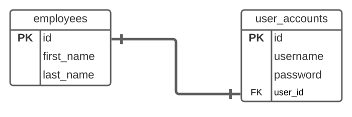
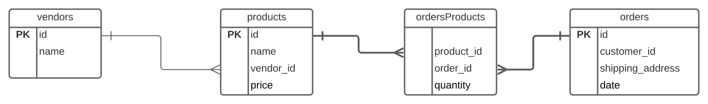

# Problem Set:  Intermediate SQL

## Answer the following Questions

<!--
MC: Question on Comments
 -->

<!--
MC:  Question on 1-1 Relationship with ERD Diagram
 -->

<!-- >>>>>>>>>>>>>>>>>>>>>> BEGIN CHALLENGE >>>>>>>>>>>>>>>>>>>>>> -->
<!-- Replace everything in square brackets [] and remove brackets  -->

### !challenge

* type: multiple-choice
* id: 6dd59fbf-a760-45cf-ac67-84f28e732c10
* title: Relationships & ERDs #1
* points: 1
* topics: sql, erd

##### !question

What kind of relationship is illustrated by the following ERD diagram?



##### !end-question

##### !options

* One to One
* One to Many
* Many to Many

##### !end-options

##### !answer

* One to One

##### !end-answer

##### !hint

What does this mean?

)

##### !end-hint

### !end-challenge

<!-- ======================= END CHALLENGE ======================= -->

<!-- >>>>>>>>>>>>>>>>>>>>>> BEGIN CHALLENGE >>>>>>>>>>>>>>>>>>>>>> -->
<!-- Replace everything in square brackets [] and remove brackets  -->

### !challenge

* type: multiple-choice
* id: 25047b64-ddf1-46ca-840e-ebb3aaea30b9
* title: Relationships & ERDs #2
* points: 1
* topics: sql, erd

##### !question

What kind of relationship is illustrated by the following ERD diagram?


##### !end-question

##### !options

* One to One
* One to Many
* Many to Many

##### !end-options

##### !answer

* One to Many

##### !end-answer

##### !hint

What purpose does the table in the middle serve?

##### !end-hint

### !end-challenge

<!-- ======================= END CHALLENGE ======================= -->


<!-- >>>>>>>>>>>>>>>>>>>>>> BEGIN CHALLENGE >>>>>>>>>>>>>>>>>>>>>> -->
<!-- Replace everything in square brackets [] and remove brackets  -->

### !challenge

* type: multiple-choice
* id: 009d4a6f-ad48-4bd1-aeec-4c207f79e93c
* title: Relationships & ERDs #3
* points: 1
* topics: sql, erd

##### !question

What kind of relationship is illustrated by the following ERD diagram?


##### !end-question

##### !options

* One to One
* One to Many
* Many to Many

##### !end-options

##### !answer

* Many to Many

##### !end-answer

##### !hint

What purpose does the table in the middle serve?

##### !end-hint

### !end-challenge

<!-- ======================= END CHALLENGE ======================= -->

<!-- >>>>>>>>>>>>>>>>>>>>>> BEGIN CHALLENGE >>>>>>>>>>>>>>>>>>>>>> -->
<!-- Replace everything in square brackets [] and remove brackets  -->

### !challenge

* type: ordering
* id: 63869fc6-1c28-4ac3-bb95-4c123732359d
* title: Reordering SQL Select
* points: 1
* topics: sql, sql-select, sql-join

##### !question

We want to select credit card number and expiration dates for a customer named "Shiloh Ahmad".  Reorder the SQL Query to complete the query.

##### !end-question

##### !answer

1. SELECT payment_methods.card_number, payment_methods.expr_date
1. FROM payments
1. INNER JOIN customers
1.   ON customers.id = payments.customer_id
1. WHERE customers.first_name = 'Shiloh' AND
1.   customers.last_name = 'Ahmad'
1. ;

##### !end-answer

### !end-challenge

<!-- ======================= END CHALLENGE ======================= -->

<!-- >>>>>>>>>>>>>>>>>>>>>> BEGIN CHALLENGE >>>>>>>>>>>>>>>>>>>>>> -->
<!-- Replace everything in square brackets [] and remove brackets  -->

### !challenge

* type: code-snippet
* language: sql
* id: 3a3158ed-032e-4d53-b27e-c0351003c67a
* title: Join Question #1
* data_path: /intermediate-sql/sql/problem-set.sql
* points: 1
* topics: sql, sql-select, sql-join

##### !question

You have the following database.  Write a SELECT statement which uses a JOIN clause to combines the vendors and products tables.




##### !end-question

##### !placeholder


```sql
-- write a statement to select...
```

##### !end-placeholder

##### !tests


```sql
SELECT *
FROM products
INNER JOIN vendors
ON products.vendor_id = vendors.id
```

##### !end-tests

##### !hint

If we look the `products` table has a foreign key, `vendor_id`.  Could you use that in the join clause.
##### !end-hint

### !end-challenge

<!-- ======================= END CHALLENGE ======================= -->

<!--
SQL Question on Select with Join and where
 -->


<!-- >>>>>>>>>>>>>>>>>>>>>> BEGIN CHALLENGE >>>>>>>>>>>>>>>>>>>>>> -->
<!-- Replace everything in square brackets [] and remove brackets  -->

### !challenge

* type: code-snippet
* language: sql
* id: 9f961b35-f00b-4718-bb7c-32dadd803236
* title: Join Question #2
* data_path: /intermediate-sql/sql/problem-set.sql
* points: 1
* topics: sql, sql-select, sql-join

##### !question

You have the following database.  Write a SELECT statement which uses a JOIN clause to find the name of vendors who have products which cost less than 20.0.


##### !end-question

##### !placeholder


```sql
-- write a statement to select...
```

##### !end-placeholder

##### !tests


```sql
SELECT vendors.name
FROM products
INNER JOIN vendors
ON products.vendor_id = vendors.id
WHERE products.price < 20
```

##### !end-tests

##### !hint

If we look the `products` table has a foreign key, `vendor_id`.  Could you use that in the join clause?  Can you also use a `where` clause to limit the returned list to vendors with products costing less than 20.0?

##### !end-hint

### !end-challenge

<!-- ======================= END CHALLENGE ======================= -->


<!-- >>>>>>>>>>>>>>>>>>>>>> BEGIN CHALLENGE >>>>>>>>>>>>>>>>>>>>>> -->
<!-- Replace everything in square brackets [] and remove brackets  -->

### !challenge

* type: code-snippet
* language: sql
* id: c4d98bad-cfa8-4dfc-ab52-45d38da44488
* title: Join Question #3
* data_path: /intermediate-sql/sql/problem-set.sql
* points: 1
* topics: sql, sql-select, sql-join

##### !question

You have the following database.  Write a SELECT statement which uses a JOIN clause to list the order ids for all the orders which include the product named `'Widget Tsunami'`.


##### !end-question

##### !placeholder


```sql
-- write a statement to select...
```

##### !end-placeholder

##### !tests


```sql
SELECT orders.id
FROM products
INNER JOIN ordersProducts
ON products.id = ordersProducts.product_id
INNER JOIN orders
ON ordersProducts.order_id = orders.id
WHERE products.name = 'Widget Tsunami';
```

##### !end-tests

##### !hint

The database listed here has a join table `ordersProducts`.  Take a look at the section in [database joins](./database-joins.md) which gives an example of a many-to-many relationship.

##### !end-hint

### !end-challenge

<!-- ======================= END CHALLENGE ======================= -->

