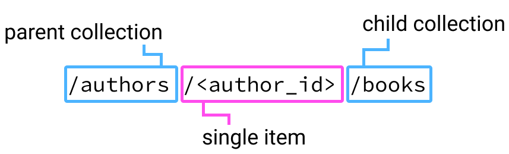

# Nested Routes in Flask

## Goals

Our goal for this lesson is to use it as a reference for defining a new endpoint with a nested route that connects a parent model to its child model instances.

This lesson covers:

- Defining a new endpoint with a nested route to create and connect one model to another in a database
- Utilizing documentation and problem solving to find missing information

### Before This Lesson

This lesson uses the Hello Books API.

<br />

<details>
    <summary>
        Before beginning this lesson, the Hello Books API should have the following.
    </summary>

- A `hello_books_development` database
- A `book` table defined
- A `Book` model defined
- An `author` table defined
- An `Author` model defined

- Endpoints defined for these RESTful routes:
  - `GET` to `/books`
  - `POST` to `/books`
  - `GET` to `/books/<book_id>`
  - `PUT` to `/books/<book_id>`
  - `DELETE` to `/books/<book_id>`

- Endpoints defined for these RESTful routes:
  - `GET` to `/authors`
  - `POST` to `/authors`

The `Book` model and table should have the following columns:

- `id`
- `title`
- `description`
- `author_id`
- `author` (model only)

The `Author` model and table should have the following columns:

- `id`
- `name`
- `books` (model only)

</details>


## `POST`ing a Book to an Author

Let's consider this feature:

> As a client, I want to send a request to create a new book and connect it to an author already found in the database.

What information do we need to accomplish this? We need to know _which_ author, along with the new book's `title` and `description`. To specify the author, we can use the author's `id`. This will refer to one and only one author, even if there are multiple authors with the same name.

### !callout-info

## More Than One Right Answer

There's more than one way to implement the relationship between our book and author. For our curriculum we will stick with RESTful routing naming conventions and implement a *nested route* to describe this relationship.

### !end-callout


## Nested Routes

Nested routes (also called nested resources) describes the parent-child relationship between (at least) two models in our API. By nesting resources in a route, it allows the client to retrieve only the data they require. For example, not _all_ books or _all_ authors, but books from a particular author based on the author's `id`.


  
*Fig.  A diagram of a nested route*

The nested route starts with the _parent_ model. In this case, `authors`. Then we specify the appropriate author record's `id` we want our new _child_ model record to belong to, indicated by the `<author_id>` placeholder. Finally, we list the name of the child collection, in this case, `books`.

## Creating Our Endpoint

Our nested route `/authors/<author_id>/books` will be grouped within our `authors_bp` blueprint. Here is an example of how it might look with a couple of missing lines:

```python
@authors.route("/<author_id>/books", methods=["GET", "POST"])
def handle_authors_books(author_id):
    if request.method == "POST":
        request_body = request.get_json()

        # refer to the documentation and try
        # completing this endpoint yourself

        db.session.add(new_book)
        db.session.commit()

        return make_response(f"Book {new_book.title} by {new_book.author.name} successfully created", 201)
```

Try puzzling this out yourself with the [Flask-SQLAlchemy documentation](https://flask-sqlalchemy.palletsprojects.com/en/2.x/quickstart/#simple-relationships), then check out our solution below. Remember: there's more than one way to do this!

<br/>

<details>
    <summary>Finished <code>POST</code> endpoint example</summary>

``` python
@authors.route("/<author_id>/books", methods=["GET", "POST"])
def handle_authors_books(author_id):
    author = Author.query.get(id=author_id)
    if author is None:
        return make_response("Author not found", 404)

    if request.method == "POST":
        request_body = request.get_json()
        new_book = Book(
            title=request_body["title"],
            description=request_body["description"],
            author=requested_author
            )
        db.session.add(new_book)
        db.session.commit()
        return make_response(f"Book {new_book.title} by {new_book.author.name} successfully created", 201)
```
</details>


## `GET`ting All Books from an Author

Once we've successfully created a few new books belonging to an author, we can use this route to retrieve all the books from a specific author. Let's now query our author by `id` and start constructing the response body.

``` python
# inside the handle_authors_books function

author = Author.query.get(id=author_id)

# POST route code here

elif request.method == "GET":
    books_response = []
```

How do we access the `books` from the `author` record and add them to our response body? Try puzzling this out yourself with trial and error, as well as your search engine, then check out our solution below. _Hint: `print` statements will still appear in the terminal output, so they can be helpful to use during our investigation._

<br/>

<details>
    <summary>Updated <code>GET</code> endpoint example</summary>

``` python
elif request.method == "GET":
    books_response = []
    for book in author.books:
        books_response.append(
            {
            "id": book.id,
            "title": book.title,
            "description": book.description
            }
        )
    return jsonify(books_response)
```
</details>

## Check for Understanding

<!-- Question Takeaway -->
<!-- prettier-ignore-start -->
### !challenge
* type: paragraph
* id: 496c3633-4d11-4215-b03c-d8b859854554
* title: Nested Routes in Flask
##### !question

What was your biggest takeaway from this lesson? Feel free to answer in 1-2 sentences, draw a picture and describe it, or write a poem, an analogy, or a story.

##### !end-question
##### !placeholder

My biggest takeaway from this lesson is...

##### !end-placeholder
### !end-challenge
<!-- prettier-ignore-end -->