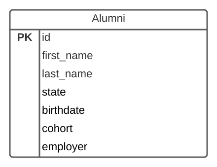

# Grouping Results

## Goals

- Explain how `SELECT` statements can divide rows into groups by using the `GROUP BY` clause
- Write `SELECT` statements using `Group BY` clauses and aggregate functions to calculate aggregate values on groups of rows

## Introduction

We can write queries to discover the maximum and minimum values for the entire query, but this can be quite limiting.  Consider if we are building an online store and want to know how many products each vendor is setting?  What if we want to find the most expensive product each vendor sells?  

In these queries we want to group up a set of rows by a specific criterea and then run an aggregate query like `COUNT`, `MAX` or `MIN` on each group.


## GROUP BY To Get Distinct Entries

A `GROUP BY` query when used alone will retrieve a resultset of distinct rows by the field(s) being grouped by.  This allows us to remove duplicate rows from the rows returned.  

Consider this Ada Alumni table:


*Fig. Ada Alumni Table*


We could retrieve a list of distinct cohort names with:

```sql
SELECT cohort
FROM alumni
GROUP BY cohort;
```

This would return something like this:

| cohort |
|---     |
| Cohort 3 |
| Cohort 5 |
| Cohort 10 |
| Cohort 6 |
| Cohort 7 |
| Cohort 2 |
| Cohort 15 |
| Cohort 12 |
| Cohort 8 |
| Cohort 4 |
| Cohort 9 |
| Cohort 11 |
| Cohort 13 |
| Cohort 1 |
| Cohort 14 |

## GROUP BY With Aggregate Functions

With a query using a `GROUP BY` clause we identify a set of columns that a group of rows will have in common and another column we can run an aggregate function like `COUNT` or `MAX`.  The database will then divide the rows into groups which match on all the specified columns.  Lastly the database will run the aggregate function on each group of rows returning the aggregate result on each group.

```sql
SELECT 
   column_desired_1,
   column_desired_2,
   ...,
   aggregate_function(column_to_aggregate)
FROM 
   table_name
GROUP BY 
   column_desired_1,
   column_desired_2,
   ...;
```

For example given this books table:

| title | price | author_id |
|--- |--- |--- |
| Death of the Webbed Boa | 10 | 1 |
| Groomsday | 5 | 1 |
| Beyond the Truth | 6 | 2 |
| The Way of the Eight | 12 | 3 |
| Mask of Exile | 11 | 2 |
| 2938 Destiny | 2 | 2 |
| Mystery of the Crispy Tourist | 16 | 3 |
| Clue of the Painted Pendant | 25 | 3 |
*Fig. Example Books Table*

We could write the following query:

```sql
SELECT author_id, MAX(price)
FROM BOOKS
GROUP BY author_id
ORDER BY author_id;
```

This query will find the most expensive price for each author id.

| author_id | max |
|---        |---   |
| 1         |  10  |
| 2         |  11  |
| 3         |  25  |
*Fig. Most expensive book price for each author id*

We could also write a query to find the number of alumni at Ada by state.

If our `alumni` table had the following schema.


*Fig. Ada Alumni Table*

We could find the number of alumni from each state with:

```sql
SELECT state, count(*)
FROM alumni
GROUP BY state;
```

We could get a resultset back like the following:

| state | count |
|---    |---    |
| Texas      | 10  |
| Oregon     | 4   |
| Washington | 230 |
| New York   | 6   |
| California | 15  |


## Check for Understanding

<!-- Question on SELECTING distinct Column entries -->

<!-- SQL Question to SELECT the most recent birthdate by cohort -->