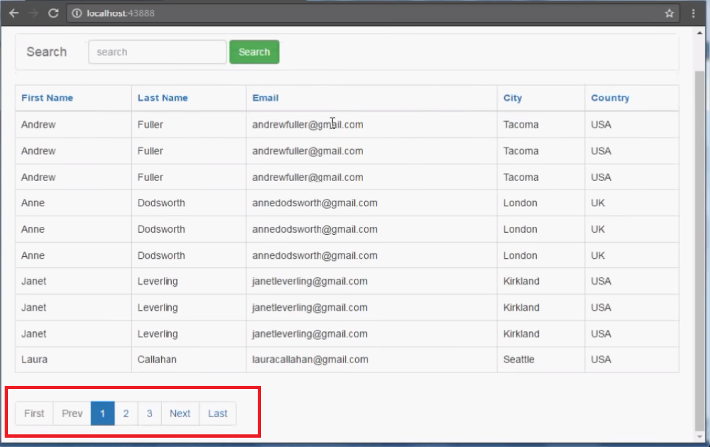

# Selecting With Limit

## Goals

- Explain how `SELECT` statements can be used with `LIMIT` to select a subset of the result
- Write `SELECT` Statements with `LIMIT` to retrive a subset of a query

## Introduction

Databases can store many millions of records.  Often on a specific query, you only want to retrieve a small subset of the returned rows from a query.  To do so we can use the `limit` clause.  By limiting our queries to only the number of records we want to retrieve we can speed up our applications and reduce demand on the database.

## Limiting Syntax

The syntax of the `limit` clause looks like this:

```sql
SELECT columns_desired 
FROM table_name
[Optional clauses]
LIMIT row_count;
```

The syntax is the same as a generic select query ending with a `LIMIT` clause which defines the number of rows returned.

For example if we wanted to retrieve only 10 books in the sci-fi genre we could write the following:

```sql
SELECT title
FROM books
WHERE genre = 'sci-fi'
LIMIT 10;
```

## Offset

We can use `LIMIT` to retrieve the first *x* rows from a select, but what if we want to retrieve the 11th through 20th records.  We can see this if we look at websites which perform pagination presenting a subset of data with buttons to select the next *x* records. 



We can add an offset to the `LIMIT` clause to retrieve records bypassing the first *x* records.

```SELECT title
FROM books
WHERE genre = 'sci-fi'
LIMIT 10 OFFSET 11;
```

The above query selects rows 11-20.

## Check for Understanding

