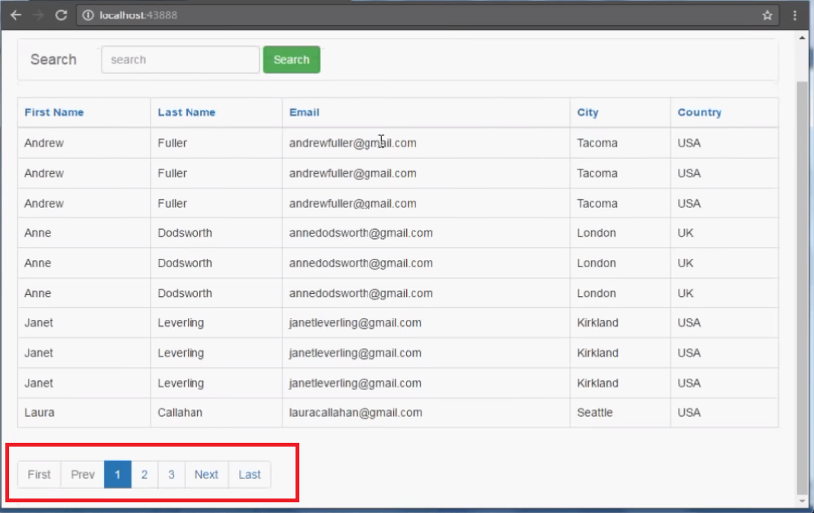

# Limit

<iframe src="https://adaacademy.hosted.panopto.com/Panopto/Pages/Embed.aspx?id=389ec201-3b94-4464-8e62-ad1000ea2ab5&autoplay=false&offerviewer=true&showtitle=true&showbrand=false&start=0&interactivity=all" height="405" width="720" style="border: 1px solid #464646;" allowfullscreen allow="autoplay"></iframe>

## Goals

- Explain how `SELECT` statements can be used with `LIMIT` to select a subset of the result
- Write `SELECT` Statements with `LIMIT` to retrive a subset of a query

## Introduction

Databases can store many millions of records. Even when we restrict our results by using `WHERE` clauses, we might get back more results than we can work with meaningfully at once. Imagine we are using our query results to build a web page. Can we reasonably display a thousand search results? A million? Would a user want that much information all at once?

In situations where we know that we'd only like to get back up to a certain number of results at once, we can use the `LIMIT` clause. By limiting our queries to only the quantity of records we want to retrieve, we can both speed up our applications, and reduce demand on the database.

## LIMIT Syntax

The `LIMIT` clause can be added to any `SELECT` statement as follows:

```sql
SELECT columns_desired
FROM table_name
(additional optional clauses)
LIMIT row_count;
```

The syntax is the same as for any other `SELECT` query, except we add the keyword `LIMIT` followed by the number of rows to return.

For example, if we wanted to retrieve only 10 books from the sci-fi genre, we could write the following:

```sql
SELECT title
FROM books
WHERE genre = 'sci-fi'
LIMIT 10;
```

## OFFSET Syntax

We can use `LIMIT` to retrieve the first _n_ rows from a `SELECT` query. `LIMIT 10` restricts the query to the first 10 rows. But what if we want to retrieve rows 11 through 20? This might be useful for websites which allow the user to page through a list of results using buttons that present the next _n_ records.



We can use the `OFFSET` keyword to add an offset to a `LIMIT` clause, bypassing the first _n_ records.

```sql
SELECT title
FROM books
WHERE genre = 'sci-fi'
LIMIT 10 OFFSET 10;
```

The above query selects rows 11-20.

`OFFSET` can also be used on its own, without `LIMIT`, to essentially skip the first _n_ records in a result.

We could skip the first 10 results of our sci-fi query, still returning the entire remaining set with:

```sql
SELECT title
FROM books
WHERE genre = 'sci-fi'
OFFSET 10;
```

## Combining ORDER BY and LIMIT

We can combine `ORDER BY` and `LIMIT` to sort our records and then retrieve a subset of those sorted records.

For example:

```sql
SELECT title, price
FROM books
ORDER BY price DESC
LIMIT 5;
```

The above query will retrieve the 5 **most** expensive books.

Similarly we could find the first 10 book titles alphabetically.

```sql
SELECT title
FROM books
ORDER BY title
LIMIT 10;
```

## Check for Understanding

<!-- Question 1 -->
<!-- prettier-ignore-start -->
### !challenge
* type: ordering
* id: 6duSMq
* title: Limit
##### !question

Imagine building a feature where a user is online shopping, and the products are listed in pages. The user needs to see the products on page 4. Each page shows 50 products.

Arrange the following syntax into a valid statement.

##### !end-question
##### !answer

1. `SELECT *`
1. `FROM products`
1. `LIMIT`
1. `50`
1. `OFFSET`
1. `150`
1. `;`

##### !end-answer
### !end-challenge
<!-- prettier-ignore-end -->

<!-- Question Takeaway -->
<!-- prettier-ignore-start -->
### !challenge
* type: paragraph
* id: 5c703e48
* title: Selecting With Limit
##### !question

What was your biggest takeaway from this lesson? Feel free to answer in 1-2 sentences, draw a picture and describe it, or write a poem, an analogy, or a story.

##### !end-question
##### !placeholder

My biggest takeaway from this lesson is...

##### !end-placeholder
### !end-challenge
<!-- prettier-ignore-end -->
