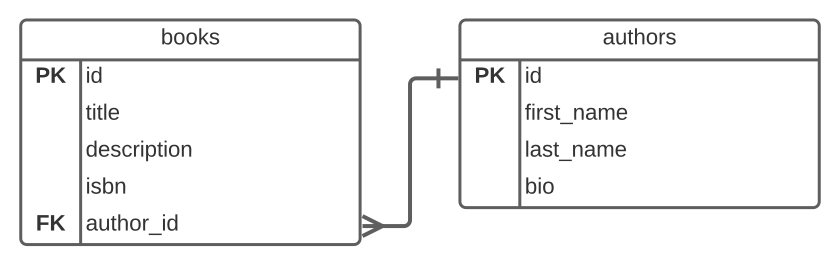
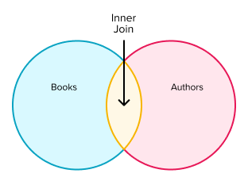
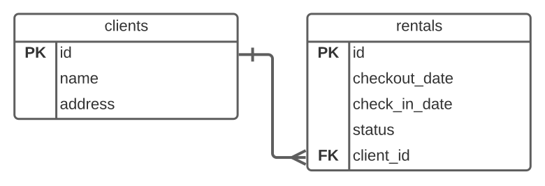
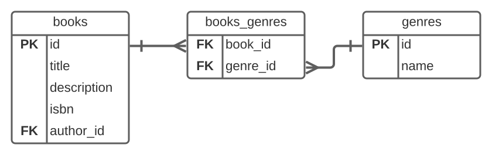
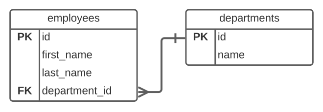

# Database Joins

<iframe src="https://adaacademy.hosted.panopto.com/Panopto/Pages/Embed.aspx?pid=5d712913-4397-4659-a7fc-ad080100a025&autoplay=false&offerviewer=true&showtitle=true&showbrand=false&start=0&interactivity=all" height="405" width="720" style="border: 1px solid #464646;" allowfullscreen allow="autoplay"></iframe>

## Goals

- Explain how `SELECT` statements with joins retrieve related data
- Write `SELECT` statements with joins to combine data from different, related tables

## Introduction

We have seen how to establish connections between tables using foreign keys. Using those connections, we have also manually answered questions about entities in our database with related data. Now we would like to write SQL queries using those connections to retrieve that related data for us!

Let's revisit our example database that has a relationship between authors and their books.

  
*Fig. Books and authors connected by the `author_id` field*

What if we need to retrieve the titles of our books, along with the full name of the related author.

To do this we need to *join* the table rows based on the matching columns.  In this lesson we will learn to use `SELECT` statements with `JOIN` clauses to combine data from multiple tables.

## Vocabulary and Synonyms

| Vocab | Definition                                                                               | How to Use in a Sentence                                                                                   |
| ----- | ---------------------------------------------------------------------------------------- | ---------------------------------------------------------------------------------------------------------- |
| Join  | A SQL operation which combines columns from one or more tables in a relational database. | I needed to get information for particular student and all of their classrooms, so I wrote a *join* query. |

## Revisiting SELECT

We have seen `SELECT` statements involving one table.  For example if we wanted to get the titles of all the books by the author with id 42 we could write.

```sql
SELECT title
FROM books
WHERE author_id = 42;
```

However, needing to know an author's id in order to look up their books is a little inconvenient. It's usually easier for us to refer to an author by their name.


Returning to our books and authors ERD, we might want to get the titles of all books written by Kaja Howell.  We can get information about Kaja with:

```sql
SELECT * 
FROM authors
WHERE first_name = 'Kaja' AND last_name = 'Howell';
```

We can can retrieve book titles with the following query on books.

```sql
SELECT title
FROM books;
```

What we need is a way to combine or *join* the queries.

### SELECT With Join

To write a `SELECT` which joins two tables together we use the following syntax:

```sql
SELECT field1, field2, field3, ...
FROM table_name_a
INNER JOIN table_name_b
  ON condition
/* Optional WHERE clause */
```

| <div style="min-width:200px;"> Piece of Code </div> | Notes                                                                                                                                                                                                                                |
| --------------------------------------------------- | ------------------------------------------------------------------------------------------------------------------------------------------------------------------------------------------------------------------------------------ |
| `SELECT`                                            | The same SQL keyword that we use to start regular data retrieval commands                                                                                                                                                            |
| `field1, field2, field3, ...`                       | **Replace this** with a list of the desired field names. Field names should be comma-separated, and often take the form of `table_name.column_name` to help us tell which table and column are providing a particular piece of data. |
| `FROM`                                              | The same SQL keyword used in regular data retrieval commands to name the starting table of the query                                                                                                                                 |
| `table_name_a`                                      | **Replace this** with the name of the correct starting table for the query                                                                                                                                                           |
| `INNER JOIN`                                        | A SQL keyword that indicates how we would like to combine our tables. There are a number of other options, mentioned later in this lesson.                                                                                           |
| `table_name_b`                                      | **Replace this** with the name of the correct table to which we want to join the starting table                                                                                                                                      |
| `ON`                                                | A SQL keyword that marks the start of the join condition                                                                                                                                                                             |
| `condition`                                         | **Replace this** with an expression that specifies the field(s) to use to combine the two tables                                                                                                                                     |

We can use this style of query to retrieve the combined information from both the `books` and `authors` tables.

```sql
SELECT books.title, authors.first_name, authors.last_name
FROM books
INNER JOIN authors
  ON books.author_id = authors.id;
```

In this `SELECT` query we use `INNER JOIN` to combine (join) and return all the rows in both tables which possess matching keys. Here, the `INNER JOIN` combines the `books` and `authors` tables by comparing the `author_id` in the `books` table to the `id` in the `authors` table. From the combined data, we specifically retrieve the title of each book, and the first and last names of each book's author.

We can picture it like this.

  
*Fig. Venn diagram illustrating `INNER JOIN`*

If we wanted to narrow this down further and limit the query to books written by Kaja Howell we can add a `WHERE` clause. 

```sql
SELECT books.title, authors.first_name, authors.last_name
FROM books
INNER JOIN authors
  ON books.author_id = authors.id
WHERE authors.first_name = 'Kaja' and
  authors.last_name = 'Howell';
```

This kind of query works for one to one relationships and one to many relationships.

Let's consider another small example.

  
*Fig. Diagram describing the relationship between a client and their outstanding rentals.*

With this data layout, we could write a query that gets all the clients and their check in dates with the following SQL.

```sql
SELECT clients.name, rentals.check_in_date
FROM clients
INNER JOIN rentals
  ON rentals.client_id = clients.id;
```

<!-- available callout types: info, success, warning, danger, secondary  -->
### !callout-info

## `table_name.column_name` Syntax

We are using the syntax `table_name.column_name` to differentiate between columns in the `clients` table and columns in the `rentals` table. In cases where the column names do not conflict, this is optional, but explicitly referring to the table can help remind us what the source of the data is.

### !end-callout


### Example With Data

If we have the following data:

| id | first_name | last_name | bio |
|--- |--- |--- |--- |
| 1  | Nisha | Blanchard | ... |
| 2  | Kaja | Howell | ... |
| 3  | Josef | Cannon | ... |
| 4  | Avery | Lim | ... |

*Fig. `authors` table*

| id | title | description | isbn | author_id |
|--- |--- |--- |--- |--- |
| 1  | The Snow Oracle | ... | ... | 1 |
| 2  | Sign of the Absent Hand | ... | ... | 1 |
| 3  | Before the Storm | ... | ... | 2 | 
| 4  | Case of the Webbed Baboon | ... | ... | 3 |
| 5  | Blade of Dawn | ... | ... | 2 |
| 6  | Electric Touch | ... | ... | 1 |

*Fig. `books` table*

The following SQL query:

```sql
SELECT books.title, authors.first_name, authors.last_name
FROM books
INNER JOIN authors
  ON authors.id = books.author_id
WHERE authors.first_name = 'Kaja' AND 
  authors.last_name = 'Howell';
```

Results in:

| title | first_name | last_name |
|--- |--- |--- |
| Before the Storm | Kaja | Howell |
| Blade of Dawn | Kaja | Howell |


### !callout-info

## Outer Joins

There are other kinds of joins including *[full] outer joins*, *left [outer] joins* and *right [outer] joins*. We won't cover them here, but they can be useful in certain situations. Follow your curiosity!

### !end-callout

### Using `JOIN` With Many to Many Relationships

We have seen how we can use `INNER JOIN` in a `SELECT` query to combine the rows of two tables into a single result. But we also know that describing a many to many relationship requires three tables.

Consider the following many to many relationship:


  
*Fig. A many to many relationship involving books and genres. Three tables are required to express this.*

If we want to retrieve a list of all books and the genres in which they are classified, we need to involve three tables. How can we do this?

We can include more than one `INNER JOIN` clause in our `SELECT` query! The first combines `books` with `books_genres`, while the second combines `books_genres` to `genres`. Putting it all together walks us all the way from `books` to `genres`.

Consider the following query.

```sql
SELECT books.title, genres.name
FROM books
INNER JOIN books_genres
  ON books_genres.book_id = books.id
INNER JOIN genres
  ON books_genres.genre_id = genres.id;
```

If the data in our tables is:

| id | title                   | description | isbn |
|----|-------------------------|-------------|------|
| 1  | Raven Of The River      | ...         | ...  |
| 2  | Cat Of Rainbows         | ...         | ...  |
| 3  | Criminals Without Glory | ...         | ...  |
| 4  | Gods Without Direction  | ...         | ...  |
| 5  | Agents And Priests      | ...         | ...  |

*Fig. `books` table*

| id | name       |
|----|------------|
| 1  | Sci-Fi     |
| 2  | Fiction    |
| 3  | Fantasy    |
| 4  | Suspense   |
| 5  | Nonfiction |

*Fig. `genres` table*

| book_id | genre_id |
|---------|----------|
| 1       | 3        |
| 1       | 2        |
| 2       | 5        |
| 3       | 1        |
| 3       | 2        |
| 4       | 5        |
| 5       | 3        |
| 5       | 2        |
| 5       | 4        |

*Fig. books_genres table*

Then our above query will generate the following result.

| title | name |
|---------|----------|
| Raven Of The River        | Fantasy       |
| Raven Of The River        | Fiction      |
| Cat Of Rainbows           | Nonfiction    |
| Criminals Without Glory   | Sci-Fi        |
| Criminals Without Glory   | Fiction       |
| Gods Without Direction    | Nonfiction    |
| Agents And Priests        | Fantasy       |
| Agents And Priests        | Fiction       |
| Agents And Priests        | Suspense      |


## Check for Understanding

<!-- TODO:  Reorder question with a SELECT-Join -->

<!-- >>>>>>>>>>>>>>>>>>>>>> BEGIN CHALLENGE >>>>>>>>>>>>>>>>>>>>>> -->
<!-- Replace everything in square brackets [] and remove brackets  -->

### !challenge

* type: ordering
* id: 640d100c-e24f-41b6-ae70-41411711e709
* title: Database Joins
* points: 1
* topics: sql, sql-join, sql-select

##### !question

The following are lines in an SQL SELECT query with a JOIN clause.  Put them in the proper order.

##### !end-question

##### !answer

1. SELECT employees.name
2. FROM employees
3. INNER JOIN departments
4.   ON departments.id = employees.department_id
5. WHERE departments.name = 'Accounting';

##### !end-answer

### !end-challenge

<!-- ======================= END CHALLENGE ======================= -->

<!-- TODO:  SQL Question involving a SELECT-Join -->

<!-- >>>>>>>>>>>>>>>>>>>>>> BEGIN CHALLENGE >>>>>>>>>>>>>>>>>>>>>> -->
<!-- Replace everything in square brackets [] and remove brackets  -->

### !challenge

* type: code-snippet
* language: sql
* id: ae7b2f5b-1baf-4711-929d-fe0d6355ce20
* title: Database Joins
* data_path: /relationships-in-sql/sql/database-joins.sql
* points: 1
* topics: sql, sql-select, sql-join

##### !question

Given the table relationship shown below, select from the employee table:

* first_name
* last_name 

for all employees in the department named 'Accounting'.



##### !end-question

##### !placeholder


```sql
-- write a statement to select...
```

##### !end-placeholder

##### !tests


```sql
SELECT first_name, last_name
FROM employees
INNER JOIN departments
    ON departments.id = employees.department_id
WHERE departments.name = 'Accounting';
```

##### !end-tests

<!-- other optional sections -->
##### !hint

How are the `employees` table and `departments` table connected?

##### !end-hint


### !end-challenge

<!-- ======================= END CHALLENGE ======================= -->

<!-- >>>>>>>>>>>>>>>>>>>>>> BEGIN CHALLENGE >>>>>>>>>>>>>>>>>>>>>> -->
<!-- Replace everything in square brackets [] and remove brackets  -->

### !challenge

* type: paragraph
* id: 5ccd897b-a0ab-4959-9a30-cef8702fe6de
* title: Database Joins

##### !question

What was your biggest takeaway from this lesson? Feel free to answer in 1-2 sentences, draw a picture and describe it, or write a poem, an analogy, or a story.

##### !end-question
##### !placeholder

My biggest takeaway from this lesson is...

##### !end-placeholder
### !end-challenge

<!-- ======================= END CHALLENGE ======================= -->
