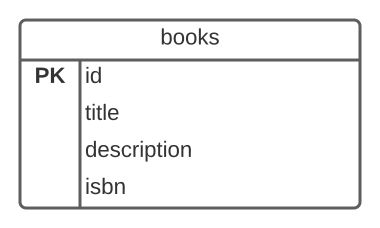
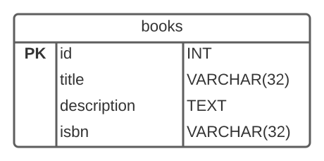
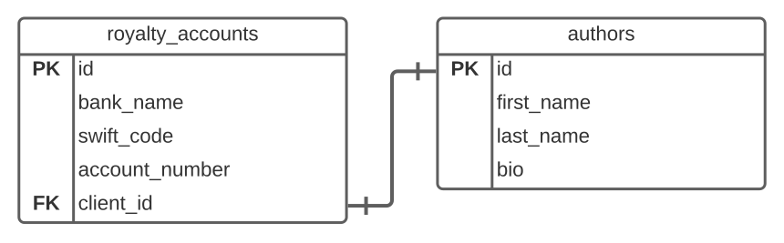
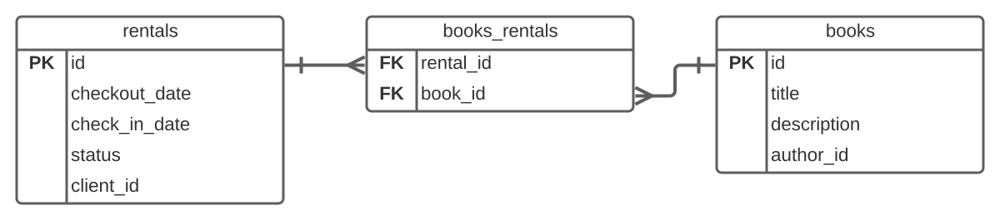

# Database Relationships

<iframe src="https://adaacademy.hosted.panopto.com/Panopto/Pages/Embed.aspx?pid=175a6822-42d6-47ad-8c0f-ad08006b50ac&autoplay=false&offerviewer=true&showtitle=true&showbrand=false&start=0&interactivity=all" height="405" width="720" style="border: 1px solid #464646;" allowfullscreen allow="autoplay"></iframe>

## Goals

- Explain how relational databases establish relationships
- Describe the types of data relationships including:
  - One to one
  - One to many
  - Many to many
- Draw database relationships using an ERD Diagram

## Introduction

Databases such as Postgres are termed *relational databases*. Relational databases let us establish relationships between the tables in our database.

Recall that in a database, we store information about different kinds of entities in separate tables. By establishing the relationships between our tables, we are also describing the relationships of our entities. And we can use these relationships to retrieve information about related entities using SQL queries!

In previous lessons and activities we created database tables like the following.

| id | title | author | price | isbn |
|--- |--- |--- |--- |--- |
| 37 | Becoming | Michelle Obama | 9.99 | 978-3-16-148410-0 |

*Fig. `books` table*

| id | first_name | last_name | bio |
|--- |--- |--- |--- |
| 14 | Michelle | Obama | Becoming is the memoir of former First Lady of the United States Michelle Oba... |

*Fig. `authors` table*

With these tables, users can access information about books and about authors, but they cannot directly access the biographical information about the author from a particular book.

Relational databases solve that problem by letting us establish a relationship between the 'books' and 'authors' tables. 

## Vocabulary and Synonyms

| Vocab           | Definition                                                                                                            | Synonyms             | How to Use in a Sentence                                                                                                                                                                                                                              |
| --------------- | --------------------------------------------------------------------------------------------------------------------- | -------------------- | ----------------------------------------------------------------------------------------------------------------------------------------------------------------------------------------------------------------------------------------------------- |
| One to Many Relationship        | A relationship between two tables in a database where one record in a table can be associated with one or more records in another table                                                     |                    | "Because each advisor may support multiple students, while each student has only one advisor, I established a one to many relationship between advisors and students."                                                                |
| Many to Many Relationship        | A relationship between two tables in a database where one record in either table can relate to many records in the other table.                                                    |                    | "Because each student can take multiple classes and each class has many students I established a many to many relationship between students and classes."                                                                |
| One to One Relationship        | A relationship between two tables in a database where one record in either table can relate to at most one record in the other table.                                                    |                    | "Because each student can only have at most one school computer account, the user accounts and students tables have a one to one relationship."                                                                |
| Join Table        | A table used to connect two other tables in order to establish a many to many relationship.                                                    |                   | "Each product can be in multiple orders and each order can have multiple products so our shopping cart needs a join table called `order_products`."                                                                |
| Entity Relationship Diagram        | A graphical representation of a data model using entities, their attributes, and relationships between those entities.           |      Database Diagram              | "I can't make sense of this SQL text.  I need to draw an entity relationship diagram."                                                                |
## ERD Diagrams

Staring at hundreds of lines of SQL code or textual tables of data can confuse and frustrate the hardiest of database administrators.  To make a database schema, or design, easier to understand we use a type of diagram known as an *entity relationship diagram (ERD)*.  

An ERD diagram consists of rectangles, each one representing a table in the database. Within each rectangle, we list each column name. We can choose to include additional information about each field, such as its data type, or whether it has any special constraints, like being the primary key.

  
*Fig. Possible ERD for the 'books` table*

The **PK** indicates the primary key.

ERD diagrams often include each column's data type.

  
*Fig. 'books' table with data types*

As we examine the types of relationships possible in relational databases we will illustrate each type of relationship with ERD diagrams.

## Establishing Relationships With Foreign Keys

We establish relationships between tables in databases by connecting fields.  For example we may have a `books` table and an `authors` table.  Each book should belong to an author, so we can add an `author_id` field to the `books` table.  The `author_id` field is used to reference the `id` primary key field of the `authors` table.  We can find the author of a specific book by finding the author with an `id` field which matches the book's `author_id` field.

Similarly we can find all the books written by a specific author by finding all the rows in the `books` table with an `author_id` field which matches the given author's `id`.

We can illustrate the relationship with this diagram.

  
*Fig. Books and authors connected by the `author_id` field*

The lines connecting the tables link the matching columns.

## Types of Relationships

### One to One

In a one to one relationship, each record in one table, Table A, can relate to at most one record in another, Table B, and each record in Table B can relate to at most one record in Table A.  One example of a one to one relationship is an author to a royalty account, or an employee to their company 401K retirement account.  Each author would likely have one account to deposit royalty payments and an employee at a company would have one and only one retirement account.

  
*Fig. Author to royalty account*

We indicate the number of rows involved in the relationship with the following symbols

![ERD connection symbols. One is denoted by a stroke through the line. Many is denoted by a crow's foot, a three-way split of lines radiating out. One and only one is denoted by two strokes slight separated. Zero or one is denoted by a circle and a stroke, slightly separated. One or many is denoted by a combination of the crow's foot and a stroke, with the stroke at the origin of the radiating lines. Zero or many is denoted by a combination of a circle and a crow's foot, with the circle at the origin of the radiating lines.](../assets/intermediate-sql_database-relationships_erd-connection-symbols.png)  
*Fig. ERD symbols used to indicate the number of records involved on each side of a relationship*

So in the diagram above each row in the authors table is connected to one and only one row in the royalty account.

### !callout-info

## No need for flash cards here!
The above key of relationship symbols is a key engineers often need to look up when reading or writing a diagram like this. It's important to know these symbols exist but not important to memorize them.

### !end-callout

### One to Many

Another common type of relationship is called one to many.  In a one to many relationship each record in one table can relate to zero, one or many records in the other table.  We often call this type of relationship a *has-many* relationship.

For example, an author can have (write) many books, and we can illustrate that relationship with the following diagram.

*Fig. A one to many relationship between books and authors.*

In a one to many relationship, the table on the many side of the relationship, called the child table, contains a field which references the primary key of the table on the one side of the relationship, called the parent.  Each row in the child table references one row in the parent table, but each row in the parent table may be referenced multiple times.

Notice the "crow's foot" where the line connects to the `books` table.

  
*Fig. The so called crow's foot indicating __many__ in an ERD diagram*

This indicates "many" in the relationship.  So one author in this relationship can be related to many different books.

We can see this illustrated in an example with the following tables.

| id | first_name | last_name | bio | 
|--- |--- |--- |---
| 1  | Maayan | Ramesha | ... |
| 2  | Dinah  | Banu    | ... |

*Fig. `authors` table*

| id | title | description | isbn | author_id |
|--- |--- |--- |--- |--- |
| 1  | Tree Of Dawn | ... | ... | 1 |
| 2  | Faction Of The Night | ... | ... | 2 |
| 3  | Delaying The Dungeons | ... | ... | 2 |
| 4  | Signs At The Future | ... | ... | 2 |

*Fig. `books` table*

In the above two tables Maayan Ramesha has one book, and Dinah Banu has three books. We can determine this by noticing that the `id` for Maayan Ramesha is 1, and there is one book with an `author_id` of 1. Similarly, the `id` for Dinah Banu is 2, and there are three books with an `author_id` of 2.

### Many to Many

One to many relationships work in many situations! But what about other situations?

There are scenarios where _each row in one table_ is related to _many rows in another_, and the reverse is also true. This is a many to many relationship.

However, a column in a table can store at most one id of a row in another table. What can we do?

To support a many to many relationship, we need to create a special kind of table where each row itself represents a relationship between two other tables. We call such a table a *join table*.

*Fig. Many to many relationship*

In the above diagram each row in the `books` table is related to 0 or many rows in the `genres` table *through* the `books_genres` table. This connecting table is the join table.  It contains ids from the key fields of the `books` and `genres` tables, establishing a one to many relationship between each of our primary tables and the join table, and a many to many relationship over all.

We can see this relationship with the following tables.

| id | title                   | description | isbn |
|----|-------------------------|-------------|------|
| 1  | Raven Of The River      | ...         | ...  |
| 2  | Cat Of Rainbows         | ...         | ...  |
| 3  | Criminals Without Glory | ...         | ...  |
| 4  | Gods Without Direction  | ...         | ...  |
| 5  | Agents And Priests      | ...         | ...  |

*Fig. `books` table*

| id | name       |
|----|------------|
| 1  | Sci-Fi     |
| 2  | Fiction    |
| 3  | Fantasy    |
| 4  | Suspense   |
| 5  | Nonfiction |

*Fig. `genres` table*

| book_id | genre_id |
|---------|----------|
| 1       | 3        |
| 1       | 2        |
| 2       | 5        |
| 3       | 1        |
| 3       | 2        |
| 4       | 5        |
| 5       | 3        |
| 5       | 2        |
| 5       | 4        |

*Fig. `books_genres` table*

By stepping through the `books_genres` table we can find all the genres a particular book belongs to.  

For example `Raven Of The River` has id 1, which maps to the first two entries in the `books_genres` table. These entries map the book to the genres with ids 2 and 3. So `Raven Of The River` has the genres `Fiction` and `Fantasy`.

The `Fiction` genre with `id` 2 is connected to books with ids 1, 3, 5.  So the fiction genre has the books `Raven Of The River`, `Criminals Without Glory` and `Agents And Priests`.

## Check for Understanding

<!-- >>>>>>>>>>>>>>>>>>>>>> BEGIN CHALLENGE >>>>>>>>>>>>>>>>>>>>>> -->
<!-- Replace everything in square brackets [] and remove brackets  -->

### !challenge

* type: multiple-choice
* id: bc02aab5-24ee-4e00-8198-ec82146100bd
* title: Database Relationships
* points: 1
* topics: sql, sql-relationships

##### !question

What type of relationship does this ERD illustrate?

##### !end-question

##### !options

* One to One
* Many to Many
* One to Many

##### !end-options

##### !answer

* One to Many

##### !end-answer

### !end-challenge

<!-- ======================= END CHALLENGE ======================= -->

<!-- >>>>>>>>>>>>>>>>>>>>>> BEGIN CHALLENGE >>>>>>>>>>>>>>>>>>>>>> -->
<!-- Replace everything in square brackets [] and remove brackets  -->

### !challenge

* type: multiple-choice
* id: e8f8ebe7-c598-4d39-8465-fdcb63f34028
* title: Database Relationships
* points: 1
* topics: sql, sql-relationships

##### !question

What type of relationship does this ERD illustrate between rentals and books?

##### !end-question

##### !options

* One to One
* Many to Many
* One to Many

##### !end-options

##### !answer

* Many to Many

##### !end-answer

### !end-challenge

<!-- ======================= END CHALLENGE ======================= -->

<!-- >>>>>>>>>>>>>>>>>>>>>> BEGIN CHALLENGE >>>>>>>>>>>>>>>>>>>>>> -->
<!-- Replace everything in square brackets [] and remove brackets  -->

### !challenge

* type: paragraph
* id: d4f57998-2aef-404d-98fa-c7237784c100
* title: Database Relationships

##### !question

What was your biggest takeaway from this lesson? Feel free to answer in 1-2 sentences, draw a picture and describe it, or write a poem, an analogy, or a story.

##### !end-question
##### !placeholder

My biggest takeaway from this lesson is...

##### !end-placeholder

### !end-challenge

<!-- ======================= END CHALLENGE ======================= -->
