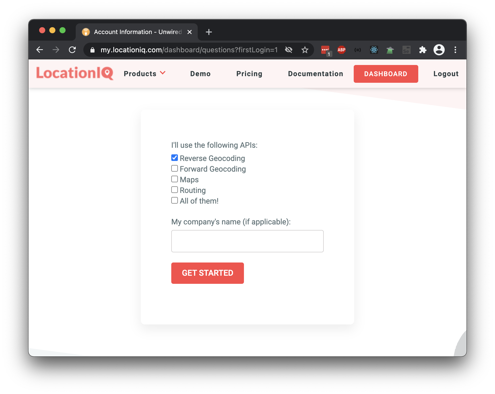
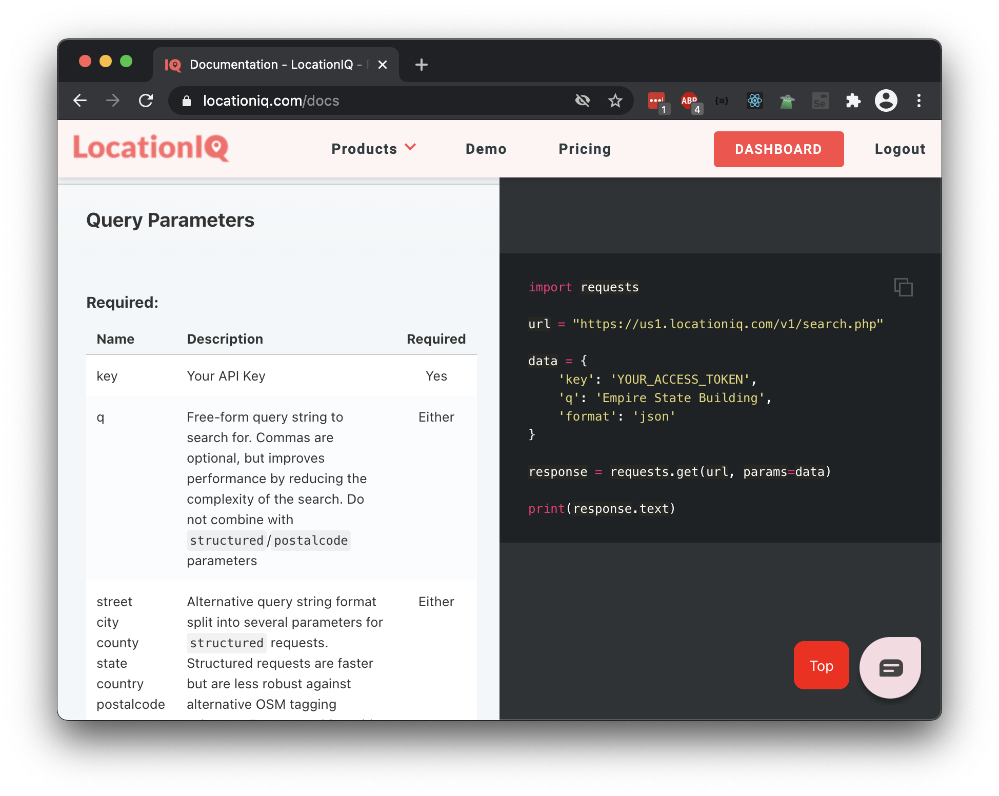

# API Keys

## Goals

Most web APIs require the use of API keys. The goal of this lesson is to learn about API keys to work with existing web APIs meaningfully.

We should walk away from this lesson:

- understanding that we may need to request an API key, depending on the API
- recognizing the security principle that we should never upload them onto GitHub or share them publicly
- using API keys in our requests in Postman
- defining API rate limits, because limits will affect our use of APIs

## Format: LocationIQ API

This lesson will take the following format:

1. Defining an API key
1. Introducing the LocationIQ API
1. Obtaining an API key from the LocationIQ API
1. Using the API key in a request made with Postman
1. Seeing the effects of not using an API key
1. Defining API rate limits

## API Keys

APIs are valuable pieces of software. Let's think about why! Whenever an API receives a request and gives back a response, we can consider the following things:

1. Handling requests, responses, and maintaining internet connectivity takes resources (money, labor, skill)
1. Running the web server takes resources (money, labor, skill)
1. The response that the API gives back has valuable data that the client wants

In order for the API service to...

1. Limit the number of requests that come in
1. Track which users make requests, how many, when, and what kind
1. Control the access that different users have

... some web APIs will require projects to use an API key.

**API keys** are strings that an API gives to a project which will uniquely identify the project. This API key will _authenticate_ the project (and the project's HTTP requests) to the web API.

An example API key may look something like `7888bcec6a8368afaf2e66100f4dafc4`.

The project code will use this API key with every HTTP request. Without this API key or the correct permissions, web APIs may respond with HTTP Status Code `401 Unauthorized`, or something similar.

### Using API Keys

We can include API keys in our HTTP requests in any of the following ways:

1. As a query parameter
1. As a request header
1. Inside a cookie

In this curriculum, we will prefer using query params when available.

### Keep API Keys Secret and Safe

API keys aren't secure; they're usually a single string of text sent with the request. It's relatively easy for people to "steal" API keys then.

Therefore, it's important for developers to keep their API keys secret and safe. At an extremely high-level, this means:

1. Don't post the API key on any public place, such as social media or your blog
1. Don't include any API keys inside any git commits that get pushed onto Github.com

If an API key is compromised, most APIs provide a way from the human to revoke or delete the stolen key.

There are many different methods and tools that programmers use to keep API keys secret and safe in their projects. This lesson will not focus on that.

## The LocationIQ API

This lesson will demo API keys with [LocationIQ's Forward Geocoding API](https://locationiq.com/geocoding).


LocationIQ describes its Forward Geocoding API as:

> Converts human-addresses to coordinates. Breaks down addresses into elements like Street, city, state etc. Supports multiple languages and allows filtering via query parameters

We will use this API to find the latitude and longitude coordinates of a given address, such as "Ada Developers Academy, Seattle, WA, US"

_Note: Written in March 2021._

## Obtaining an API Key from LocationIQ

1. Creating an account and logging in
1. Applying for an API key
1. Finding the dashboard/account information that lists the API key

### Creating an Account

Almost every API key will require the user to create an account.

If an API service asks for the purpose of the key, answer honestly. Commercial products that use the API and make money from it likely need to go through a special process.


### Applying for an API Key

Most API services will ask you to determine which APIs and endpoints you'll need access to. In our case, we should pick **forward geocoding**.



### Finding the API key

Every API service website will be different, but we'll need to _find_ the API key now. We can start by checking our account details.

For LocationIQ, we can check the [Dashboard](https://my.locationiq.com/dashboard), and then look for the tab "API Access Tokens."


Once we find our API key, we can copy/paste it wherever we need.

If we ever need to revoke or delete the API key, we can do so here.


## Using the API Key in Postman

Now that we have an API key, let's practice using the key by making an HTTP request.

### Reading Documentation and Making the Request

First, let's imagine the API call we'll make.

We can check the LocationIQ documentation by going to our dashboard and finding the [Documentation](https://locationiq.com/docs) link.

We need to find details about the Forward Geocoding endpoint. We can navigate this documentation by using the navigation menu...


or by scrolling down.


We can use the documentation to read the rules about how the HTTP request should be defined. We should use this section to determine:

1. What is the expected HTTP method and path?
1. What are any required query params? What are the keys named, what should their values be?
1. What are any optional query params?




From this documentation, we can predict that our request should look something like this:

| Part of the HTTP request    | Expected value                                                                               |
| --------------------------- | -------------------------------------------------------------------------------------------- |
| HTTP Method                 | `GET` (Stated in the description about the endpoint)                                         |
| Path                        | `https://us1.locationiq.com/v1/search.php?key=YOUR_ACCESS_TOKEN&q=SEARCH_STRING&format=json` |
| Required Query Param: `key` | The API key we will obtain                                                                   |
| Required Query Param: `q`   | A string location to search for. For example, "Ada Developers Academy, Seattle, WA, US"      |

In this request, we've decided to use `q` as the search param, and we did not list the optional params.

### Query Parameters in Postman

Let's make this request in Postman!

We can use the Query Params section to define all of the key-value pairs we want to send.


Recall that query params ultimately modify and affect the HTTP request path. When we paste the full path `https://us1.locationiq.com/v1/search.php?key=YOUR_ACCESS_TOKEN&q=SEARCH_STRING&format=json` into Postman, Postman will automatically detect that there were three query params: `key`, `q`, and `format`.

Let's replace the query params like so:

- `key`: Paste your LocationIQ API key here
- `q`: King Street Station, Seattle, WA


### Getting an Authenticated Response

Let's look at the response!


Does the response look like what you predicted from the documentation?

For those that are curious and would like to "check their answer," "King Street Station, Seattle, WA" has a latitude of `"47.59844335"`, and a longitude of `"-122.329897792763"`.

## Unauthenticated: Missing the API Key

If we are missing the API key in the request, or we've included an invalid API key, the web API may send back an error instead.

Let's observe this with our own eyes!

In Postman, "turn off" the `key` query parameter using the checkbox function, or by deleting the key-value pair. Then, send the response.


In this case, the API sent back a request with status `401 Unauthorized`, and with the response body:

```json
{
  "error": "Invalid key"
}
```

The actual response details will differ between web APIs, so it's best to check the API documentation.

If you're getting a `401 Unauthorized` error, we suggest beginning to debug by:

- double-checking that you're including the correct API key
- double-checking that you're using the correct and expected query param name
- asking someone to pair with you and see if they can recreate the error with the same API key

## API Rate Limits

APIs have rate limits. A **rate limit** is the number of HTTP requests that an app is allowed to make within a given time period. API services don't want apps and users to call an API too often.

Example API limits include:

- only allows 200 calls per day
- only allow 10 calls per minute

Making an API call over the rate limit may result in failed API calls, such as receiving a response with [HTTP status `429 Too Many Requests`](https://developer.mozilla.org/en-US/docs/Web/HTTP/Status/429).

## Check for Understanding

<!-- Question Takeaway -->
<!-- prettier-ignore-start -->
### !challenge
* type: paragraph
* id: bX1M09
* title: API Keys
##### !question

What was your biggest takeaway from this lesson? Feel free to answer in 1-2 sentences, draw a picture and describe it, or write a poem, an analogy, or a story.

##### !end-question
##### !placeholder

My biggest takeaway from this lesson is...

##### !end-placeholder
### !end-challenge
<!-- prettier-ignore-end -->
