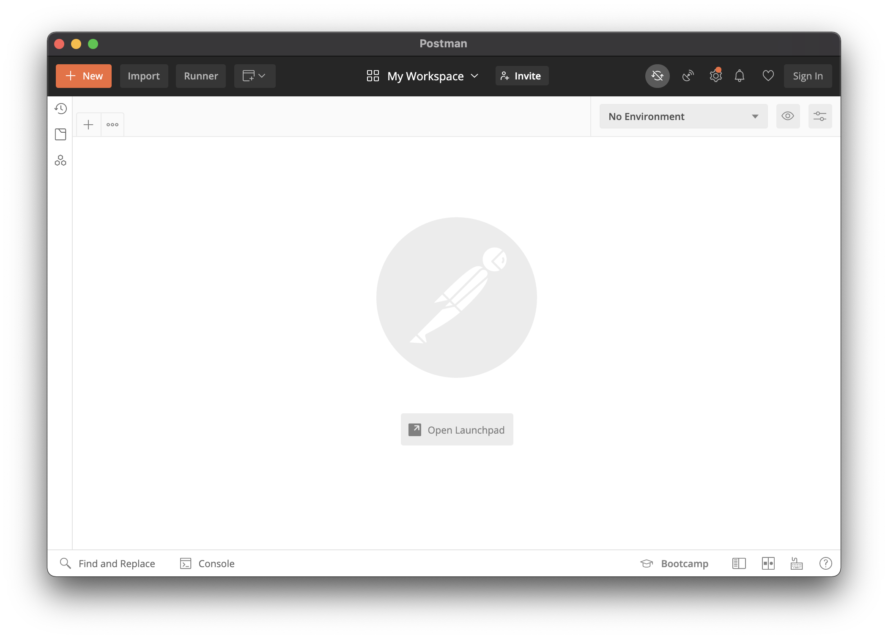

# Sending Requests From Postman

<iframe src="https://adaacademy.hosted.panopto.com/Panopto/Pages/Embed.aspx?pid=7d0fa5d5-031c-44e8-a8a2-ad1000265aaa&autoplay=false&offerviewer=true&showtitle=true&showbrand=false&start=0&interactivity=all" height="405" width="720" style="border: 1px solid #464646;" allowfullscreen allow="autoplay"></iframe>

## Goal

One goal for this lesson is to demonstrate the request-response cycle in action. We want to visualize what requests and responses look like.

Another goal is to gain familiarity with the tool Postman. Although there are many ways to make HTTP requests, there are a lot of benefits to learning how to use Postman. Postman is a well-known and well-used tool among web developers, so it has a lot of support online. Learning how to use it effectively will increase our development and debugging skills.

## Introduction

[Postman](https://www.postman.com/) is software that is designed to improve API development. The feature we care about the most is using Postman as an _API client_. This means that Postman will send any HTTP requests we design. Also, Postman will receive the HTTP responses that the server sends back.

Everyone should download and install [Postman's API Client](https://www.postman.com/product/api-client/).

### Format

This lesson will show a walkthrough of one example. Then, challenges will ask the reader to recreate the process. We, the education team, recommend reading through the walkthrough once, then following the walkthrough, and then moving onto the challenges.

_Note: Written and screenshots taken in March 2021._

### Example This Lesson: dog.ceo API

To witness the request-response cycle, we will use an existing web API: [the dog.ceo web API](https://dog.ceo/dog-api/).

Take a minute to become familiar with the dog.ceo API and their endpoints on [their documentation](https://dog.ceo/dog-api/documentation/).

In their documentation, for each endpoint, determine:

1. Details about the request:
   - The HTTP Method (for this API, all are assumed to be `GET`)
   - The path/endpoint
2. Details about the response:
   - The format (for this API, all are assumed to be in JSON)
   - The shape of the JSON

_Note: Written in March 2021._

## Anatomy of Postman

Postman is a tool that let's us make HTTP requests and see the responses that come back.

When we open Postman, we should see a number of welcome pages and launch pages, and inevitably see a blank screen.



We can create one or more tabs. Each tab will represent a different HTTP request we can define. Multiple tabs are useful during development, when we need to consider many different kinds of requests for our projects.


### HTTP Request Details

The top half of this window defines the details of an HTTP request to define. We can choose an HTTP request method from a dropdown.


We can insert our request URL (aka path) into the appropriate textbox


We can view the HTTP headers attached to this request. Postman will generate some HTTP headers that are great default values. Almost always, we'll keep these headers as-is.


However, if we need to, we can modify these headers, or hide them, using the form and checkboxes.


We can specify all the details about the HTTP request body as we'd like. There are a lot of ways to customize it. In this curriculum, most HTTP request bodies will benefit from us choosing the radio button labeled "raw," and the dropdown option "JSON."


### HTTP Response Details

After we send the HTTP request by pressing the "Send" button, we'll see details about the HTTP response that the server sent back.

We can see the response status and response body.


We can also see the details about the response headers.


## Making a Request

To make a request, let's first imagine the request we want to make. Let's pick the dog.ceo endpoint for [getting a random image](https://dog.ceo/dog-api/documentation/random)

| HTTP Method | Path                                      | Body                                |
| ----------- | ----------------------------------------- | ----------------------------------- |
| `GET`       | `https://dog.ceo/api/breeds/image/random` | - (Nothing documented as necessary) |

Let's create a Postman tab to hold this details of this request:

- HTTP Method is `GET`
- The request URL is `https://dog.ceo/api/breeds/image/random`
- We won't add any query params


Keep all of the default request headers that Postman provides, and add no additional ones


When we press the `SEND` button, the Postman client will _at that moment, actually_ send the request.


Then, we should wait for the response.

## Seeing the Response

Before we view the response in Postman, let's make a prediction about what the response will be based on the documentation:

Example Response Status and Message:

- `200 OK` (Assumed as default, not clearly documented)

Example Response Body

```json
{
  "message": "https://images.dog.ceo/breeds/airedale/n02096051_6570.jpg",
  "status": "success"
}
```

Now, let's see if we can observe those details in Postman.

We should see the status code and message state `200 OK`:


We can view all of the headers that came with this HTTP response:


We should see the response body, which automatically detects that it's in the JSON format:


### !callout-secondary

## "Pretty" and "Raw" Formatting

Take advantage of Postman's features and play around with the tools! The buttons "Pretty" and "Raw" toggle the message body between different kinds of formatting, where "pretty" implies a more readable version of the response body, and "raw" implies raw text without additional formatting.

### !end-callout

We can observe the headers that came back with this HTTP response, too.

<!-- Question 1 -->
<!-- prettier-ignore-start -->
### !challenge
* type: tasklist
* id: 5UN8Fu
* title: Sending Requests from Postman
##### !question

Recreate this request and response in Postman. Check off each step as you progress.

##### !end-question
##### !options

- Construct the request with the correct HTTP method
- Construct the request with the correct request URL (path)
- Construct the request with the correct headers
- View the response's status code and message
- View the the response's headers
- View the response's body

##### !end-options
### !end-challenge
<!-- prettier-ignore-end -->

## Example #2: Seeing Another Request and Response

Let's make another request and see another response. This example should feel pretty similar to the example above.

Let's imagine an HTTP request for the dog.ceo endpoint for [listing all sub-breeds for hounds in the dog ceo databases](https://dog.ceo/api/breed/hound/list).

| HTTP Method | Path                                   | Body                                |
| ----------- | -------------------------------------- | ----------------------------------- |
| `GET`       | `https://dog.ceo/api/breed/hound/list` | - (Nothing documented as necessary) |

And let's predict the response:

Example Response Status and Message:

- `200 OK` (Assumed as default, not clearly documented)

Example Response Body

```json
{
  "message": [
    "afghan",
    "basset",
    "blood",
    "english",
    "ibizan",
    "plott",
    "walker"
  ],
  "status": "success"
}
```

Now, let's make this request and see this response in Postman:


<!-- Question 2 -->
<!-- prettier-ignore-start -->
### !challenge
* type: tasklist
* id: xaxAis
* title: Sending Requests from Postman
##### !question

Recreate this request and response in Postman. Check off each step as you progress.

##### !end-question
##### !options

- Construct the request with the correct HTTP method
- Construct the request with the correct request URL (path)
- Construct the request with the correct headers
- View the response's status code and message
- View the the response's headers
- View the response's body

##### !end-options
### !end-challenge
<!-- prettier-ignore-end -->

## Example #3: Seeing a 404 Error

Let's make yet another request and see yet another response. However, for this example, we will observe the response describe an error.

Imagine an HTTP request for a non-existing endpoint for dog ceo, `https://dog.ceo/api/random`

| HTTP Method | Path                         | Body |
| ----------- | ---------------------------- | ---- |
| `GET`       | `https://dog.ceo/api/random` | -    |

And let's predict the response:

Example Response Status and Message:

- `404 Not Found` (Assumed, based on the status code and message)

An example response body for this error is not documented.

After sending this request, we should notice that the response's status code is 404.


Now that we see the actual response body, we should see that the response body is actually this JSON:

```json
{
  "status": "error",
  "message": "No route found for \"GET /api/random\" with code: 0",
  "code": 404
}
```


<!-- Question 3 -->
<!-- prettier-ignore-start -->
### !challenge
* type: tasklist
* id: FxW4eE
* title: Sending Requests from Postman
##### !question

Recreate this request and response in Postman. Check off each step as you progress.

##### !end-question
##### !options

- Construct the request with the correct HTTP method
- Construct the request with the correct request URL (path)
- Construct the request with the correct headers
- View the response's status code and message
- View the the response's headers
- View the response's body

##### !end-options
### !end-challenge
<!-- prettier-ignore-end -->

## When to Use Postman

There are other ways to make HTTP requests and see HTTP responses. However, Postman is great at showing us requests and responses easily. There are so many occasions when this is beneficial:

- In the middle of Python coding, needing to manually test and confirm an API call
- Satisfying your curiosity
- Checking to see if something is possible with an API

### !callout-info

## More Postman Features

Postman has more features. There are two that we may use in the future:

1. Saving requests so that we can easily open them again and make those requests again
2. Using automated Postman tests, which will verify getting expected responses from specific requests

Follow your curiosity!

### !end-callout
