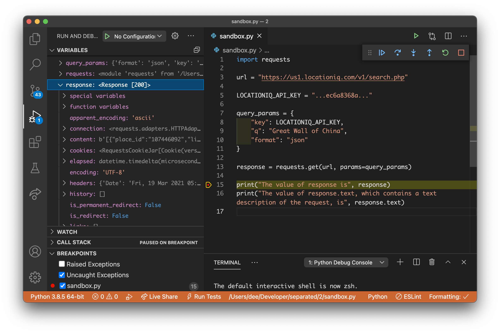

# Sending Requests With Python

<iframe src="https://adaacademy.hosted.panopto.com/Panopto/Pages/Embed.aspx?pid=26e9201d-6cac-4f5b-b749-ad1000629ee0&autoplay=false&offerviewer=true&showtitle=true&showbrand=false&start=0&interactivity=all" height="405" width="720" style="border: 1px solid #464646;" allowfullscreen allow="autoplay"></iframe>

## Goal

Our goal for this lesson is to:

1. demonstrate the request-response cycle in Python code
1. practice working with the `requests` package

## Introduction

Ebony is extremely interested in history. She takes notes on all of the landmarks in the world.

Ebony wants to find the [latitude](https://en.wikipedia.org/wiki/Latitude) and [longitude](https://en.wikipedia.org/wiki/Longitude) of all [seven wonders of the "New7Wonders of the World" list](https://en.wikipedia.org/wiki/New7Wonders_of_the_World).

She has an API key to the LocationIQ Forward Geocoding API. To get the latitudes and longitudes of the seven wonders, she could use Postman to make seven different HTTP requests, and then read through each HTTP response.

However, making seven manual HTTP requests in Postman takes plenty of effort. Imagine when Ebony wants to research hundreds of landmarks!

Luckily, Ebony is learning Python and can do this programmatically.

## Pre-Requisites for This Lesson: LocationIQ API Key

This lesson will use [LocationIQ's Forward Geocoding API](https://locationiq.com/geocoding). This lesson assumes that the reader has already obtained an API key for LocationIQ's Forward Geocoding API.


We will use this API to find the latitude and longitude coordinates of a given address, such as "Ada Developers Academy, Seattle, WA, US."

_Note: Written in March 2021._

## Vocabulary and Synonyms

| Vocab                                                                | Definition                                                                                                              | Synonyms | How to Use in a Sentence                                                                                 |
| -------------------------------------------------------------------- | ----------------------------------------------------------------------------------------------------------------------- | -------- | -------------------------------------------------------------------------------------------------------- |
| The [`requests` package](https://requests.readthedocs.io/en/master/) | A Python package. The package defines methods whose responsibility is to make HTTP requests and receive HTTP responses. | -        | "We must import the `requests` package before we use `requests.get()`, which will make a `GET` request." |

## The `requests` Package

The [`requests` package](https://requests.readthedocs.io/en/master/) is a popular package commonly used to make HTTP requests and receive HTTP responses in Python.

### Reading Documentation and Examples

When we take a minute to look through the [`requests` package documentation](https://requests.readthedocs.io/en/master/), we'll be able to find:

1. Instructions for how to install `requests`
1. A quickstart guide with examples for making requests
1. A quickstart guide with examples for working with JSON responses
1. Formal documentation for all of the seven methods that the package provides

... and so many more explanations and examples about how to use the package!

We can install `requests` with this command:

```bash
$ python3 -m pip install requests
```

## Designing Our HTTP Request

Using the [LocationIQ API Documentation](https://locationiq.com/docs), let's first determine what Ebony's first HTTP request is:

| Part of the HTTP request       | Expected value                                                                               |
| ------------------------------ | -------------------------------------------------------------------------------------------- |
| HTTP Method                    | `GET` (Stated in the description about the endpoint)                                         |
| Path                           | `https://us1.locationiq.com/v1/search.php?key=YOUR_ACCESS_TOKEN&q=SEARCH_STRING&format=json` |
| Required Query Param: `key`    | Ebony's API key                                                                              |
| Required Query Param: `q`      | Great Wall of China                                                                          |
| Optional Query Param: `format` | `json`                                                                                       |

In this request, we've decided to use `q` as the search param.

Also, we've chosen to include the query param `format: json`. Working with JSON and expecting the response to come back in JSON will be valuable experience as developers.

## Writing Python to Make Requests

Ebony will write this Python code in a new standalone file named `seven-wonders.py`

After considering either the [examples for making a request](https://requests.readthedocs.io/en/master/user/quickstart/#make-a-request), reading [the docs for `requests`](https://requests.readthedocs.io/en/master/api/), or looking up other resources online, we should come to code that resembles this:

```python
import requests

path = "https://us1.locationiq.com/v1/search.php"

LOCATIONIQ_API_KEY = "...ec6a8368a..."

query_params = {
    "key": LOCATIONIQ_API_KEY,
    "q": "Great Wall of China",
    "format": "json"
}

response = requests.get(path, params=query_params)

print("The value of response is", response)
print("The value of response.text, which contains a text description of the request, is", response.text)
```

| <div style="min-width:220px;">Piece of Code</div> | Notes                                                                                                                                                                    |
| ------------------------------------------------- | ------------------------------------------------------------------------------------------------------------------------------------------------------------------------ |
| `import requests`                                 | This file needs to import the `requests` package before it uses the `requests` functionality.                                                                            |
| `path = ...`                                      | Creates a local variable to hold the request URL. This URL does _not_ include any query params.                                                                          |
| `LOCATIONIQ_API_KEY = ...`                        | A constant variable that holds the LocationIQ API.                                                                                                                       |
| `query_params = { "key": ... }`                   | A dictionary that contains the query parameters as key-value pairs. In this example, we're including the query params `"key"`, `"q"`, and `"format"`                     |
| `response =`                                      | Sets up a local variable `response` that will be the return value of `requests.get()`                                                                                    |
| `requests.get( ... )`                             | Calls the `get` method that is defined in the `requests` package. This method makes one `GET` request. The details of this request are based on the arguments passed in. |
| `requests.get(path, ...)`                         | The method `requests.get()` has a positional argument. We need to pass in the request URL for this `GET` request, so we'll pass in `path`.                               |
| `requests.get(..., params=query_params)`          | The method `requests.get()` accepts the keyword argument `params`. This should be a dictionary that contains the query parameters of the request.                        |
| `print(..., response)`                            | For the purpose of observing the response data in the terminal, we can print `response` and see what we get.                                                             |
| `print(..., response.text)`                       | The Response object in `response` has an attribute `.text`, which is a text representation of the response body.                                                         |

### More About the `requests.get()` Method

We can learn more about what the `requests.get()` method does, what its parameters are, and what it returns with its [request.get documentation](https://requests.readthedocs.io/en/master/api/#requests.get).

The same documentation provides the details for the following `request` methods:

| Method               | Responsibility                     |
| -------------------- | ---------------------------------- |
| `requests.request()` | Creates and sends any HTTP request |
| `requests.head()`    | Creates and sends a HEAD request   |
| `requests.get()`     | Creates and sends a GET request    |
| `requests.post()`    | Creates and sends a POST request   |
| `requests.put()`     | Creates and sends a PUT request    |
| `requests.patch()`   | Creates and sends a PATCH request  |
| `requests.delete()`  | Creates and sends a DELETE request |

## Reading Responses

Our goal is to read the HTTP response and determine the latitude and longitude of the Great Wall of China. Let's learn how to read responses with the `requests` package with the following steps:

1. Observe the text version of the response
1. Inspect the response object using the debugging tool
1. Inspect the response's body as decoded JSON

### The Response Object

After replacing the `LOCATIONIQ_API_KEY` value with our own API key, we can run our Python script with `$ python3 seven-wonders.py`. Hopefully, we get output that is similar to this:

```
The value of response is <Response [200]>
The value of response.text, which contains a text description of the request, is [{"place_id":"107446092","licence":"https:\/\/locationiq.com\/attribution","osm_type":"way","osm_id":"89351141","boundingbox":["40.3580565","40.3595043","116.0134921","116.0137252"],"lat":"40.3587621","lon":"116.0136394","display_name":"Great Wall of China, Chadao, Yanqing District, Beijing, China","class":"highway","type":"pedestrian","importance":0.9795250073110269},{"place_id":"130630218","licence":"https:\/\/locationiq.com\/attribution","osm_type":"way","osm_id":"185534927","boundingbox":["40.3505516","40.3521179","116.0028801","116.0060956"],"lat":"40.3506903","lon":"116.0047861","display_name":"Great Wall of China, Chadao, Yanqing District, Beijing, China","class":"highway","type":"footway","importance":0.9795250073110269},{"place_id":"107862312","licence":"https:\/\/locationiq.com\/attribution","osm_type":"way","osm_id":"89380293","boundingbox":["40.3271494","40.3335223","115.9684191","115.9769041"],"lat":"40.3314137","lon":"115.9718567","display_name":"Great Wall of China, Badaling, Yanqing District, Beijing, China","class":"highway","type":"footway","importance":0.9795250073110269},{"place_id":"105187593","licence":"https:\/\/locationiq.com\/attribution","osm_type":"way","osm_id":"84335812","boundingbox":["40.360209","40.3602513","116.0136598","116.0137749"],"lat":"40.3602513","lon":"116.0137749","display_name":"Great Wall of China, Chadao, Yanqing District, Beijing, China","class":"highway","type":"steps","importance":0.9795250073110269}]
```

Why does printing `response.text` give us such a large block of text? The `requests.get()` method returns a [Response object, which is defined by the `requests` package](https://requests.readthedocs.io/en/master/api/#requests.Response). When we consider this documentation, we should be interested in at least these two members of the Response object:

1. [text](https://requests.readthedocs.io/en/master/api/#requests.Response.text), which is the content of the response body in text form
1. [json()](https://requests.readthedocs.io/en/master/api/#requests.Response.json), which is a method. If the request has JSON in its response body, this method returns the response body as Python dictionaries and/or lists.

### Using a Breakpoint to Inspect the Response

We can use a breakpoint and the debugger tool to run our code and inspect `response`. Inspecting `response` while using the debugger tool will be more effective, fun, and faster than printing a bunch of things!

With the debugger, we should see a lot of different members of `response`, including the `text` attribute.



### Using `.json()` on a Response Object

We can use `json()` to work with the response's JSON body better. Replace the `print` statements with this code below:

```python
response_body = response.json()
print("The value of response.json()", response_body)
```

After running this code, we should see input similar to this:

```
The value of response.json() [{'place_id': '107446092', 'licence': 'https://locationiq.com/attribution', 'osm_type': 'way', 'osm_id': '89351141', 'boundingbox': ['40.3580565', '40.3595043', '116.0134921', '116.0137252'], 'lat': '40.3587621', 'lon': '116.0136394', 'display_name': 'Great Wall of China, Chadao, Yanqing District, Beijing, China', 'class': 'highway', 'type': 'pedestrian', 'importance': 0.9795250073110269}, {'place_id': '130630218', 'licence': 'https://locationiq.com/attribution', 'osm_type': 'way', 'osm_id': '185534927', 'boundingbox': ['40.3505516', '40.3521179', '116.0028801', '116.0060956'], 'lat': '40.3506903', 'lon': '116.0047861', 'display_name': 'Great Wall of China, Chadao, Yanqing District, Beijing, China', 'class': 'highway', 'type': 'footway', 'importance': 0.9795250073110269}, {'place_id': '107862312', 'licence': 'https://locationiq.com/attribution', 'osm_type': 'way', 'osm_id': '89380293', 'boundingbox': ['40.3271494', '40.3335223', '115.9684191', '115.9769041'], 'lat': '40.3314137', 'lon': '115.9718567', 'display_name': 'Great Wall of China, Badaling, Yanqing District, Beijing, China', 'class': 'highway', 'type': 'footway', 'importance': 0.9795250073110269}, {'place_id': '105187593', 'licence': 'https://locationiq.com/attribution', 'osm_type': 'way', 'osm_id': '84335812', 'boundingbox': ['40.360209', '40.3602513', '116.0136598', '116.0137749'], 'lat': '40.3602513', 'lon': '116.0137749', 'display_name': 'Great Wall of China, Chadao, Yanqing District, Beijing, China', 'class': 'highway', 'type': 'steps', 'importance': 0.9795250073110269}]
```

_What data structure does `response.json()` return?_ _How do we get the latitude and longitude?_ We can either use another breakpoint to debug with the debugger, or we can replace the print statements with the following:

```python
print("The value of response.json():", response_body)
print("The length of the response_body list:", len(response_body))
print("The first item of response_body:", response_body[0])
print("The latitude of the first item of response_body:", response_body[0]['lat'])
```

Through either debugging or print statements in our Python code, we should determine:

- The length of `response_body` is `4`
- The first item of `response_body` is

```json
{
  "place_id": "107446092",
  "licence": "https://locationiq.com/attribution",
  "osm_type": "way",
  "osm_id": "89351141",
  "boundingbox": ["40.3580565", "40.3595043", "116.0134921", "116.0137252"],
  "lat": "40.3587621",
  "lon": "116.0136394",
  "display_name": "Great Wall of China, Chadao, Yanqing District, Beijing, China",
  "class": "highway",
  "type": "pedestrian",
  "importance": 0.9795250073110269
}
```

- In this item, the latitude value in the key `"lat"` is `"40.3587621"`.

## Working With Responses in Python

`response.json()` gives us back nested dictionaries and lists that match the response JSON body.

From there, we should use our regular Python skills on this data structure to accomplish our goals.

Consider the following prompts. Predict or write a solution, and then observe the example solution below. _For every prompt, use the **first** item in the response list_.

1. Print the value of `lat` and `lon` with this output: `The lat and lon of Great Wall of China is 40.3587621, 116.0136394`
1. Print the value of the `display_name` with this output: `The display name of Great Wall of China is Great Wall of China, Chadao, Yanqing District, Beijing, China`
1. Print the value of the `type` and `class` with this output: `Great Wall of China is a pedestrian highway`

### Example Solution

When we realize that the response body is a list of dictionaries, we can use indices and keys to access the values we need.

```python
import requests

path = "https://us1.locationiq.com/v1/search.php"
LOCATIONIQ_API_KEY = "...ec6a8368a..."
search_term = "Great Wall of China"
query_params = {
    "key": LOCATIONIQ_API_KEY,
    "q": search_term,
    "format": "json"
}

response = requests.get(path, params=query_params)
response_body = response.json()

print(
    f"The lat and lon of {search_term} is {response_body[0]['lat']}, {response_body[0]['lon']}")
print(
    f"The display name of {search_term} is {response_body[0]['display_name']}")
print(
    f"{search_term} is a {response_body[0]['type']} {response_body[0]['class']}")
```

### !callout-success

## Refactor

Consider two ways that we could refactor the solution above that would reduce repetition, reduce complexity, or increase readability.

### !end-callout

## Check for Understanding

<!-- Question 1 -->
<!-- prettier-ignore-start -->
### !challenge
* type: ordering
* id: f5PHgb
* title: Sending Requests with Python
##### !question

Arrange the following syntax.

Assume that each line would be indented correctly.

In places that contain `...`, assume that each line would be filled out correctly.

##### !end-question
##### !answer

1. `import requests`
1. `query_params = { ... }`
1. `response = requests.get("... valid path...", params=query_params)`
1. `response_body = response.json()`
1. `print("Here is the response body:", response_body)`

##### !end-answer
### !end-challenge
<!-- prettier-ignore-end -->
