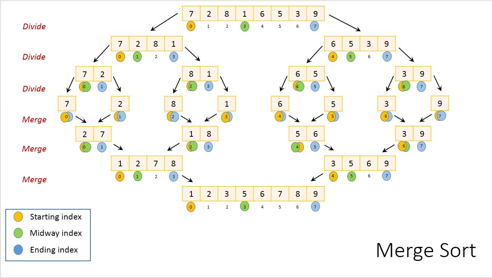

# Merge Sort

## Learning Goals

- Describe merge sort and its efficiency

## Vocabulary and Synonyms

| Vocab                        | Definition                                                                                                                                                         | Synonyms | How to Use in a Sentence |
| ---------------------------- | ------------------------------------------------------------------------------------------------------------------------------------------------------------------ | -------- | ------------------------ |
| Recursive Algorithm          | A method of solving a problem where the solution depends on solving smaller instances of the same problem. This approach can be applied to many types of problems. |
| Divide-And-Conquer Algorithm | A strategy of solving a big problem by breaking it into smaller more managable subproblems. It can also lead to recursive solutions.                               |

## Merge Sort

Merge sort is a _divide-and-conquer_ algorithm. It involves the following three stages:

1. **Divide** the array into two sub-arrays at each step until each sub-array is of size one.
1. **Sort** each sub-array. (An array of size one is sorted by default.)
1. **Merge** the sub-arrays into one array by combining two sub-arrays into one at each step.

## Divide

Let's reference this image to illustrate the divide step, starting at the top, original array.

In the first _divide_ step, the original array of size eight gets divided into two sub-arrays of size four each. The arrays are divided at a calculated halfway point.

In the next _divide_ step, we have two sub-arrays. Both of these arrays have four elements. They aren't of size one yet! So, the same action gets repeated. We calculate the halfway point, and divide the sub-arrays in half.

This _divide_ stage continues until the original array of size _n_ is reduced to sub-arrays of size _1_ each.

A sub-array of size one is trivially, and by default sorted.

## Sort and Merge

The _merge_ stage starts by combining two sub-arrays at a time.

While combining the sub-arrays containing `7` and `2` respectively, the values in each are compared and sorted. The merging process continues in this manner.

### Sorting in Detail

How does the merge sort algorithm merge and sort two sub-arrays into one? The algorithm compares an item from each sub-array, and uses a third, temporary, auxiliary array.

Consider the two sub-arrays `[1, 2, 7, 8]` and `[3, 5, 6, 9]` in the final merge step in our example image above.

- We start with comparing _1_ with _3_. The smaller value, _1_ gets written to the auxiliary array. (Auxiliary array: _[1]_)
- Next, we compare _2_ with _3_. _2_ gets written to the auxiliary array. (Auxiliary array: _[1, 2]_)
- Next, we compare _7_ with _3_. _3_ gets written to the auxiliary array. (Auxiliary array: _[1, 2, 3]_)
- Next, we compare _7_ with _5_. _5_ gets written to the auxiliary array. (Auxiliary array: _[1, 2, 3, 5]_)
- Next, we compare _7_ with _6_. _6_ gets written to the auxiliary array. (Auxiliary array: _[1, 2, 3, 5, 6]_)
- Next, we compare _7_ with _9_. _7_ gets written to the auxiliary array. (Auxiliary array: _[1, 2, 3, 5, 6, 7]_)
- Next, we compare _8_ with _9_. _8_ gets written to the auxiliary array. (Auxiliary array: _[1, 2, 3, 5, 6, 7, 8]_)
- At this point, all elements of the first sub-array have been merged. So, all remaining elements of the second sub-array get copied over linearly to the auxiliary array. In this case, only one element is left in the second sub-array. So, _9_ gets copied over to the auxiliary array. (Auxiliary array: _[1, 2, 3, 5, 6, 7, 8, 9]_)

This two-way merging continues until there are no more sub-arrays and the orignal array is completely soorted. Finally, the auxiliary array gets linearly copied back to the original array.

## Big(O) Complexity

The time complexity of merge sort is _O(n log n)_. Let's look closer to understand how we achieved this conclusion.

- **Divide**: Finding the midway index is a straightforward computation. This takes constant time regardless of the sub-array.
- **Merge**: Merging a total of _n_ elements takes _O(n)_ time. If there are two sub-arrays of size _n/2_ each, then we will compare one element from one sub-array with another element from the second sub-array and one of the two will get copied. This step will continue until all are copied, taking a total of _O(n)_ time.
- As the sub-problems get smaller, the number of sub-problems doubles at each level, but the merging time halves. The doubling and halving cancel each other out and so the merging takes _O(n)_ time at each level of the merge steps (as seen in the image above).
- **Base case**: In the base case, we have sub-arrays of size _1_ and a total of _n_ subarrays. It takes _O(1)_ time to sort an array of size one. Overall, merging at base level is _O(n)_ time, just like any other level.
- **Count of levels**: Starting with _n_ elements and reducing by half at each level, until we reach one element sized array takes _log n_ steps. Similarly, starting with sub-arrays of one element each and combining two sub-arrays at a time until we reach an array of _n_ elements also takes _log n_ steps.
  Overall, each level takes _O(n)_ time. There are _O(log n)_ such levels. Resulting in an overall time complexity of O(n log n) for merge sort.

### !callout-info

## Merge Sort Implementation Uses Recursion

Understanding how to implement merge sort is best paired with the topic of recursion.

### !end-callout

### Performance Considerations

For small arrays, insertion sort performs better than merge sort. However, as the size of the array grows, merge sort becomes much more performant.

There are other O(n log n) sorting algorithms, notably [Quick Sort](https://www.geeksforgeeks.org/quick-sort/), and [Heap Sort](https://www.geeksforgeeks.org/heap-sort/).
