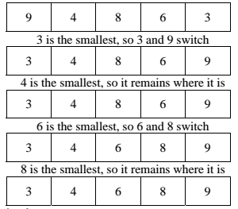

# Selection Sort

## Learning Goals

- Describe selection sort and its efficiency

## Overview

The selection sort works by selecting the smallest unsorted item in the list and swapping it with index 0, then finding the next smallest and placing it into index 1 and so on.

### Detailed Explanation



Here is a more detailed explanation of the bubble sort algorithm:

1. You look through the entire array for the smallest element.
1. Once you find it, you swap this smallest element found with the first element of the array.
1. Then you look for the smallest element in the remaining array (the sub-array without the first element) and swap this element found with the second element.
1. Then you look for the smallest element in the remaining array (the sub-array without the first and second elements) and swap that element with the third element, and so on.

## Example

Consider the initial unsorted array `[99, 45, 35, 40, 16, 50, 11, 7, 90]`. Here's what it looks like before and after each iteration of the outer loop.

- `i` is the index that starts at 0, and increments until the length of the array.
- `min_index` is a variable that holds the index of the smallest element in the sub-array.

| Iteration | Array                                       | `i` | `min_index` |
| --------- | ------------------------------------------- | --- | ----------- |
| 1.        | [**99**, 45, 35, 40, 16, 50, 11, **7**, 90] | 0   | 7           |
| 2.        | [7, **45**, 35, 40, 16, 50, **11**, 99, 90] | 1   | 6           |
| 3.        | [7, 11, **35**, 40, **16**, 50, 45, 99, 90] | 2   | 4           |
| 4.        | [7, 11, 16, **40**, **35**, 50, 45, 99, 90] | 3   | 4           |
| 5.        | [7, 11, 16, 35, **40**, 50, 45, 99, 90]     | 4   | 4           |
| 6.        | [7, 11, 16, 35, 40, **50**, **45**, 99, 90] | 5   | 6           |
| 7.        | [7, 11, 16, 35, 40, 45, **50**, 99, 90]     | 6   | 6           |
| 8.        | [7, 11, 16, 35, 40, 45, 50, **99**, **90**] | 7   | 8           |
| 9.        | [7, 11, 16, 35, 40, 45, 50, 90, 99]         | -   |             |

## Big(O) Complexity

The time complexity of Selection sort is _O(n<sup>2</sup>)_.

Each of the nested loops has an upper bound defined by the count of elements, _n_ in the list to be sorted.

## Example Implementation

Consider this example implementation of selection sort.

```python
def selection_sort(array):
    i = 0
    while i < len(array) - 1:
        min_index = i
        j = i + 1
        while j < len(array):
            if array[j] < array[min_index]:
                min_index = j
            j += 1
        if min_index != i:
            temp = array[min_index]
            array[min_index] = array[i]
            array[i] = temp
        i += 1
    return array
```

Compare this code with this detailed explanation of the algorithm:

- Finds the smallest element in the range of `i` and `min_index`
- Sets `min_index` to the index of the smallest item
- If `i` and `min_index` are not the same, then
  - Swap the elements at index `i` and index `min_index`
- Increases `i`
- Do this until `i` reaches the end of the list

## Check for Understanding

<!-- Question Takeaway -->
<!-- prettier-ignore-start -->
### !challenge
* type: paragraph
* id: WcmHej
* title: Selection Sort
##### !question

What was your biggest takeaway from this lesson? Feel free to answer in 1-2 sentences, draw a picture and describe it, or write a poem, an analogy, or a story.

##### !end-question
##### !placeholder

My biggest takeaway from this lesson is...

##### !end-placeholder
### !end-challenge
<!-- prettier-ignore-end -->
