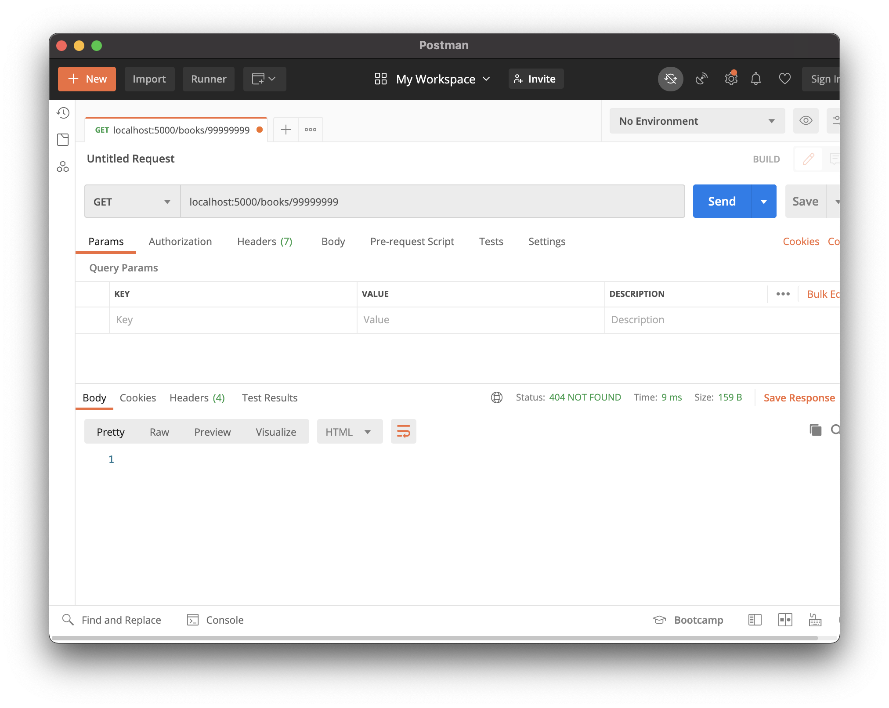
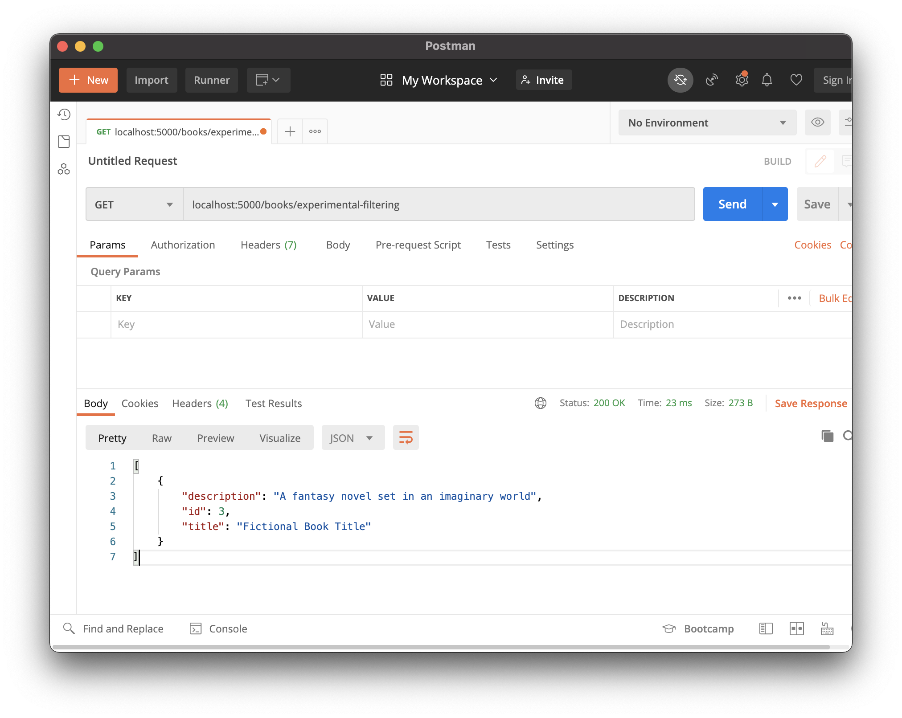

# 404s and More Queries

## Goals

Our goal for this lesson is to apply our learnings about edge cases from RESTful API design. We should walk away from this lesson understanding how to write more robust Flask code.

This lesson covers:

- Handling when a resource isn't found
- Exploring more query functionality available by Flask-SQLAlchemy

## Hello Books API

### Before This Lesson

This lesson uses the Hello Books API.

<details style="max-width: 700px; margin: auto;">
    <summary>
        Before beginning this lesson, the Hello Books API should have the following.
    </summary>

- A `hello_books_development` database
- A `book` table defined
- A `Book` model defined
- Endpoints defined for these RESTful routes:
- `GET` to `/books`
- `POST` to `/books`
- `GET` to `/books/<book_id>`
- `PUT` to `/books/<book_id>`
- `DELETE` to `/books/<book_id>`

The `Book` model and table should have the following columns:

- `id`
- `title`
- `description`

</details>

## `GET`ting a Missing Book: Preparation

Let's consider how to accomplish this feature:

> As a client, I want to send a request trying to get one invalid book and get a 404 response, so I know that the book resource was not found.

### Predict HTTP Requests, Responses, and Logic

Let's consider the endpoint to get a single book:

| HTTP Method | Endpoint          |
| ----------- | ----------------- |
| `GET`       | `/books/99999999` |

No request body.

The response we want to send back is:

| Response Status | Response Body |
| --------------- | ------------- |
| `404 Not Found` | -             |

During this method, we will need to:

1. Read the `book_id` in the request path
1. Retrieve the book with the matching `book_id` from the db
1. Discover that there is no matching book with `book_id` in the db
1. Send back a response

### Working More With `query`

We've been retrieving our `Book` instance with the line `Book.query.get(book_id)`. What does this method do when there is no matching book?

When `Model.query.get(primary key)` doesn't find a matching record, it returns `None`!

## `GET`ting a Missing Book: Code

For this feature, we must return to our `GET` `/<book_id>` endpoint and re-work it.

Let's look at this example code for one strategy:

```python
@books_bp.route("/<book_id>", methods=["GET", "PUT", "DELETE"])
def book(book_id):
    book = Book.query.get(book_id)

    if request.method == "GET":
        if book == None:
            return Response("", status=404)
        return {
            "id": book.id,
            "title": book.title,
            "description": book.description
        }
    # ... existing code for updating a single book
    # ... existing code for deleting a single book
```

| <div style="min-width:250px;"> Piece of Code </div> | Notes                                                                                       |
| --------------------------------------------------- | ------------------------------------------------------------------------------------------- |
| `if book == None:`                                  | This checks if `Book.query.get(book_id)` returned `None` because there was no matching book |
| `return Response("", status=404)`                   | We sent back an empty string as our empty response body                                     |

### Manually Testing in Postman

After writing this code, we can use Postman to test it. Let's make a `GET` request to `/books/99999999`.



We should see a `404` status and an empty response body.

## Countless Possible Refactorings

Handling a missing book and sending back a 404 happens to be the same response we want for all three endpoints:

- `GET` `/books/<book_id>`
- `PUT` `/books/<book_id>`
- `DELETE` `/books/<book_id>`

We can consider refactoring and then testing our API to this code:

```python
@books_bp.route("/<book_id>", methods=["GET", "PUT", "DELETE"])
def book(book_id):
    book = Book.query.get(book_id)
    if book == None:
        return Response("", status=404)

    if request.method == "GET":
        return {
            "id": book.id,
            "title": book.title,
            "description": book.description
        }
    # ... existing code for updating a single book
    # ... existing code for deleting a single book
```

### !callout-info

## Even More Refactoring

We could refactor our code to a number of different solutions that are more elegant. Feel free to refactor!

### !end-callout

<!-- prettier-ignore-start -->
### !challenge
* type: checkbox
* id: q4OxIs
* title: 404s and More Queries, GETing a Missing Book
##### !question

Consider handling `GET`ting a missing book.

Check off all the topics that we've briefly touched on so far.

##### !end-question
##### !options

* Checked if `Book.query.get()` returned `None`
* Sent back a response
* Tested this request in Postman
* Applied this to the "Update Book" functionality
* Applied this to the "Delete Book" functionality

##### !end-options
##### !answer

* Checked if `Book.query.get()` returned `None`
* Sent back a response
* Tested this request in Postman
* Applied this to the "Update Book" functionality
* Applied this to the "Delete Book" functionality

##### !end-answer
### !end-challenge
<!-- prettier-ignore-end -->

## More About Queries

[There's more to explore with querying](https://flask-sqlalchemy.palletsprojects.com/en/2.x/queries/#querying-records)! Let's touch on two topics.

### Filter By

We can use the method `filter_by()` in order to filter our search query. We can give keyword arguments to describe the attribute and value we're filtering on. Consider this example that filters `Book`s by title.

```python
Book.query.filter_by(title="Fictional Book Title")
```

### !callout-info

## Way More to Explore

There's way more to explore in filtering that is uncovered in this curriculum, so drive your own learning!

### !end-callout

### !callout-info

## Pro-Tip: Experiment in Flask With Experimental Endpoints

Take the time to experiment in your Flask API! Consider making a small experimental endpoint that will never be committed to Git.



### !end-callout

### Limits

We can limit the number of results in our queries by using `limit()`. Consider this example that gets the first 100 `Book` records.

```python
Book.query.limit(100).all()
```

## Check for Understanding

<!-- Question Takeaway -->
<!-- prettier-ignore-start -->
### !challenge
* type: paragraph
* id: Nn1Bb2
* title: 404s and More Queries
##### !question

What was your biggest takeaway from this lesson? Feel free to answer in 1-2 sentences, draw a picture and describe it, or write a poem, an analogy, or a story.

##### !end-question
##### !placeholder

My biggest takeaway from this lesson is...

##### !end-placeholder
### !end-challenge
<!-- prettier-ignore-end -->
