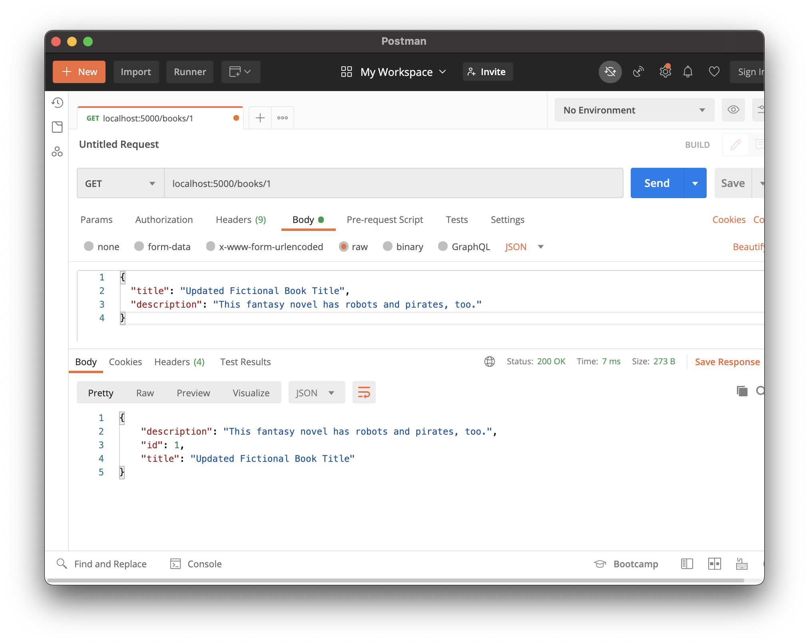
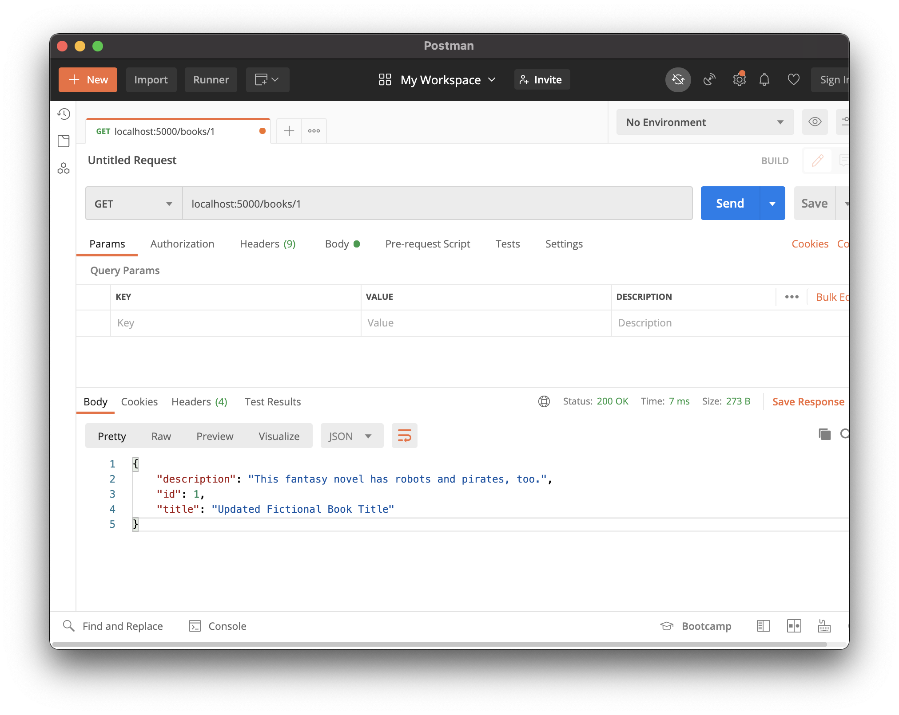
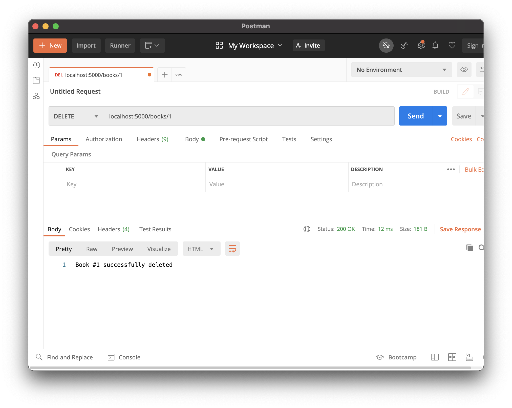
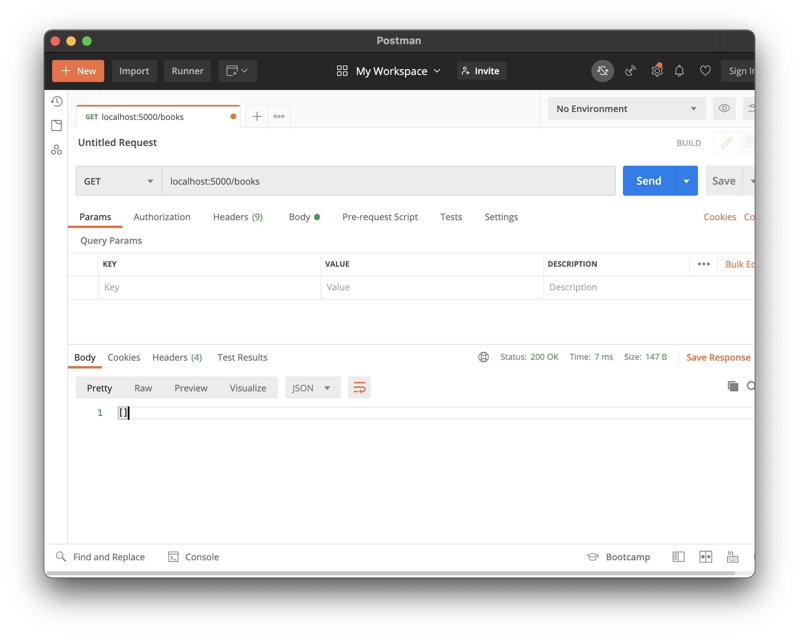

# Update and Delete

## Goals

- Practice defining routes that modify data in an API
- Practice defining routes that delete data in an API
- Modify a database record from the back-end layer

## Format

This lesson is a walk-through and syntax explanation for how to build several features inside a Flask API. We **highly recommend** reading or watching through this first fully, before repeating on your own machine.

This lesson has a large amount of new information. It may be better to think about this lesson as a resource to be familiar with, rather than committing all the new knowledge to memory at once.

### !callout-danger

## Read-through First, Repeat Second

We **highly suggest** reading or watching through this lesson fully, before repeating on your own machine.

### !end-callout

### !callout-danger

## Prioritize Familiarity

It may be better to think about this lesson as a resource to be familiar with, rather than committing all the new knowledge to memory at once.

### !end-callout

## Hello Books API

### Before This Lesson

This lesson uses the Hello Books API. Before beginning this lesson, the Hello Books API should have:

- A `hello_books_development` database
- A `book` table defined
- A `Book` model defined
- Endpoints defined for these RESTful routes:
  - `GET` to `/books`
  - `POST` to `/books`
  - `GET` to `/books/<book_id>`

The `Book` model and table should have the following columns:

- `id`
- `title`
- `description`

### This Lesson's Work

We want to build our Hello Books API to fulfill these features:

1. As a client, I want to send a request with valid book data to update one existing book and get a success response, so that I know the API updated the book data.
1. As a client, I want to send a request to delete one existing book and get a success response, so that I know the API deleted the book data.

## Updating a Book Endpoint: Preparation

Let's consider how to accomplish this feature:

> As a client, I want to send a request with valid book data to update one existing book and get a success response, so that I know the API updated the book data.

### Planning HTTP Requests, Responses, and Logic

As we did for our create and read endpoints, we should think about the typical HTTP verb and endpoint used to replace the data for a particular model record.

For this feature, we should make a `PUT` request to the `/books` path. We also need to include the `id` of the record to replace as part of the endpoint, as we did when _reading_ a particular record.

| HTTP Method | Endpoint   |
| ----------- | ---------- |
| `PUT`       | `/books/1` |

We are replacing the data associated with the specified record. As a result, the request body will consist of a JSON document with all the same fields as were required to create the resource in the first place. For our `Book` model, an example request body would be:

```json
{
  "title": "Updated Fictional Book Title",
  "description": "This fantasy novel has robots and pirates, too."
}
```

This assumes that there is a `book` table with at least the following row:

| <div style="min-width:40px;">`id`</div> | `title`                | `description`                               |
| ---- | ---------------------- | ------------------------------------------- |
| `1`  | `Fictional Book Title` | `A fantasy novel set in an imaginary world` |

When the record is successfully updated, we should return the appropriate status code, which is `200 OK`. As with other endpoints, we may choose our response body from a variety of possibilities, but for simplicity, we will return a brief status message.

| Response Status | Response Body                  |
| --------------- | ------------------------------ |
| `200 OK`        | `Book #1 successfully updated` |

Now that we have an idea of what our endpoint should look like, we can turn our attention to how to implement it.

Our endpoint will need to:

1. Read the `book_id` in the request path
1. Retrieve the `Book` instance with the matching `book_id` from the database
1. Read the new, updated book data from the HTTP request
1. Update the instance of `Book` with the new data
1. Save the updated `Book` in the database
1. Send back a response

## Updating a Book Endpoint: Code

This endpoint uses the same path as our existing route for reading a `Book` record, `"/<book_id>"`. We can refactor and expand on this same function.

### !callout-info

## Reminder: Refactor ≠ Edit

Refactoring means more than just making changes. When we say that we are refactoring some code, that means we are restructuring some code without altering its functionality. In this case, we still want our `GET` verb to be handled, but we also want to support `PUT` requests. To prepare for this expansion in functionality, we start by refactoring the existing `GET` logic into an `if` condition. All previous `GET` requests would still work, so the functionality hasn't changed. But now we've laid a foundation that lets us expand the functionality to also support `PUT` requests.

### !end-callout

Let's modify our endpoint code to support the update feature.

```python
@books_bp.route("/<book_id>", methods=["GET", "PUT"])
def handle_book(book_id):
    book = Book.query.get(book_id)

    if request.method == "GET":
        # ... existing code that returned a dictionary
    elif request.method == "PUT":
        form_data = request.get_json()

        book.title = form_data["title"]
        book.description = form_data["description"]

        db.session.commit()

        return make_response(f"Book #{book.id} successfully updated")
```

| <div style="min-width:250px;"> Piece of Code </div> | Notes                                                                                                                                      |
| --------------------------------------------------- | ------------------------------------------------------------------------------------------------------------------------------------------ |
| `methods=["GET", "PUT"]`                            | This route's matching methods now need to be updated to handle `PUT` requests                                                              |
| `book = Book.query.get(book_id)`                    | Both the `GET` and `PUT` actions need to find the `Book` instance based on `book_id`, so we'll declare `book` at the beginning             |
| `if request.method == "GET": ...`                   | We can refactor our existing `GET` functionality into this conditional                                                                     |
| `elif request.method == "PUT":`                     | We can begin our update functionality inside of a conditional for `PUT` requests                                                           |
| `... = request.get_json()`                          | This endpoint relies on reading the HTTP request body. We'll use `request.get_json()` to parse the JSON body into a Python dictionary. |
| `form_data`                                         | A local variable to hold the body of the HTTP request. More about the meaning of the name below!                                                                                                |
| `book.title = form_data["title"]`                   | We'll use our OOP skills to update `book`'s `title` attribute                                                                              |
| `book.description = ...`                            | We'll use our OOP skills to update `book`'s `description` attribute                                                                        |
| `db.session.commit()`                               | Every time a SQLAlchemy model has been updated, and we want to commit the change to the database, we'll execute `db.session.commit()`.     |
| `return make_response( ... )`                            | This is one of many ways we can return our appropriate HTTP response. Since we didn't supply a status code, Flask will default to `200 OK`.                                                                      |

### !callout-info

## Naming `form_data`

We've named the variable that holds our HTTP request body `form_data`. This name helps evoke the story of this endpoint; it's likely that a client makes this request because a user filled out an update form. Other names are appropriate, though, such as `request_body`.

### !end-callout

### Manually Testing with Postman

We can use Postman to check our update functionality.

It may help to first make a request to `GET /books/1` before updating it.


Then, make a request to `PUT /books/1` with our proper JSON request body.


We can send another request to `GET /books/1` to confirm the updates worked.



### Manually Testing with `psql`

We can also check if our book was updated in the database using `psql`, just as we did when creating new records!

Let's try it out on our own! We can refer back to the Intro to SQL lessons if we need a reminder about how to write a query like this.

<!-- prettier-ignore-start -->
### !challenge
* type: checkbox
* id: pe3GBP
* title: Update and Delete, Updating a Book Endpoint
##### !question

Think about the "Updating a Book Endpoint."

Check off all the topics that we've briefly touched on so far.

##### !end-question
##### !options

* Planned the HTTP response, request, and logic for this endpoint
* Refactored our `"/books/<book_id>"` endpoint to accept `PUT` requests
* Used `Book.query.get(book_id)` to get an instance of `Book` matching `book_id`
* Refactored our code to conditionally check the request's method
* Read the HTTP request body using `request.get_json()`
* Updated the instance of `Book` in the database
* Returned a response
* Tested this request in Postman

##### !end-options
##### !answer

* Planned the HTTP response, request, and logic for this endpoint
* Refactored our `"/books/<book_id>"` endpoint to accept `PUT` requests
* Used `Book.query.get(book_id)` to get an instance of `Book` matching `book_id`
* Refactored our code to conditionally check the request's method
* Read the HTTP request body using `request.get_json()`
* Updated the instance of `Book` in the database
* Returned a response
* Tested this request in Postman

##### !end-answer
### !end-challenge
<!-- prettier-ignore-end -->

### !callout-warning

## What About Error Handling?

There are many cases that weren't covered in this lesson, even though they are relevant to creating and reading `Book`s. For example, what happens if we make a `PUT` request to `/books/this-book-doesnt-exist`? We are intentionally not covering these cases at the moment, to limit this lesson. However, hypothesize and research how to handle erroneous HTTP requests. Follow your curiosity!

### !end-callout

## Deleting a Book Endpoint: Preparation

Let's consider how to accomplish this feature:

> As a client, I want to send a request to delete one existing book and get a success response, so that I know the API deleted the book data.

### Planning HTTP Requests, Responses, and Logic

We should think about the typical HTTP verb and endpoint used for requests that delete a particular model record.

For this feature, we should make a `DELETE` request to the `/books` path, and we'll need to include the `id` of the record to delete as part of the endpoint.

| HTTP Method | Endpoint   |
| ----------- | ---------- |
| `DELETE`    | `/books/1` |

`DELETE` requests do not generally include a request body, so no additional planning around the request body is needed.

This assumes that there is a `book` table with at least the following row:

| <div style="min-width:40px;">`id`</div> | `title`                | `description`                               |
| ---- | ------------------------------ | ------------------------------------------------- |
| `1`  | `Updated Fictional Book Title` | `This fantasy novel has robots and pirates, too.` |

When the record is successfully updated, we should return the appropriate status code, which is `200 OK`. Some APIs return the the record that was just deleted as the response body, but for simplicity, we will return a brief status message.

| Response Status | Response Body                  |
| --------------- | ------------------------------ |
| `200 OK`        | `Book #1 successfully deleted` |

Now that we have an idea of what our endpoint should look like, we can turn our attention to how to implement it.

Our endpoint will need to:

1. Read the `book_id` in the request path
1. Retrieve the `Book` instance with the matching `book_id` from the database
1. Tell the database to delete this instance of `Book`
1. Save this change in the database
1. Send back a response

## Deleting a Book Endpoint: Code

This endpoint uses the same path as our existing parameterized route, `"/<book_id>"`, so we can refactor and expand on the same function.

Let's modify our endpoint code to support the delete feature.

```python
@books_bp.route("/<book_id>", methods=["GET", "PUT", "DELETE"])
def handle_book(book_id):
    book = Book.query.get(book_id)

    if request.method == "GET":
        # ... existing code for getting a single book
    elif request.method == "PUT":
        # ... existing code for updating a single book
    elif request.method == "DELETE":
        db.session.delete(book)
        db.session.commit()
        return make_response(f"Book #{book.id} successfully deleted")
```

| <div style="min-width:250px;"> Piece of Code </div> | Notes                                                                                                                                                 |
| --------------------------------------------------- | ----------------------------------------------------------------------------------------------------------------------------------------------------- |
| `methods=["GET", "PUT", "DELETE"]`                  | We must update this endpoint so it accepts `DELETE` requests                                                                                          |
| `book = Book.query.get(book_id)`                    | This feature will need to find our matching `Book` instance, so we still need the lookup code using `book_id` and store the found book in `book`                                                           |
| `elif request.method == "DELETE":`                  | We can add a new conditional branch for `DELETE` requests                                                                                             |
| `db.session.delete(book)`                           | We can use SQLAlchemy's functions to tell the database to prepare to delete our `book` with `db.session.delete(book)`                                                                 |
| `db.session.commit()`                               | We use this function to actually apply our database changes                                                                                           |
| `return make_response(...)`                              | This is one of many ways to return an HTTP response. Since we didn't supply a status code, Flask will default to `200 OK`.                                                                                                   |
| `f"Book #{book.id} successfully deleted"`           | We can still access `book.id` because the variable itself is still in scope in our app, even if the `book` _was_ successfully deleted in the database. The object stored in memory and referenced by `book` does not automatically update in response to changes in the database. |

### Manually Testing in Postman

After writing this code, we can use Postman to test our delete functionality.

First, let's make a `GET` request to `/books/1` to confirm that a book with ID 1 exists.



Then, let's make our `DELETE` request to `/books/1` and check the response.



Afterwards, let's even make a `GET` request to `/books`. We see that there are no more books that exist! Our book was successfully deleted.



### Manually Testing with `psql`

We can also check if our book was deleted from the database using `psql`.

Let's try it out on our own!

<!-- prettier-ignore-start -->
### !challenge
* type: checkbox
* id: wYm5yT
* title: Update and Delete, Deleting a Book Endpoint
##### !question

Think about the "Deleting a Book Endpoint."

Check off all the topics that we've briefly touched on so far.

##### !end-question
##### !options

* Planned the HTTP response, request, and logic for this endpoint
* Refactored our `"/books/<book_id>"` endpoint to accept `DELETE` requests
* Used `Book.query.get(book_id)` to get an instance of `Book` matching `book_id`
* Refactored our code to conditionally check the request's method
* Deleted the `book` from the database
* Committed these changes in the database
* Returned a response
* Tested this request in Postman

##### !end-options
##### !answer

* Planned the HTTP response, request, and logic for this endpoint
* Refactored our `"/books/<book_id>"` endpoint to accept `DELETE` requests
* Used `Book.query.get(book_id)` to get an instance of `Book` matching `book_id`
* Refactored our code to conditionally check the request's method
* Deleted the `book` from the database
* Committed these changes in the database
* Returned a response
* Tested this request in Postman

##### !end-answer
### !end-challenge
<!-- prettier-ignore-end -->

## Check for Understanding

<!-- Question Takeaway -->
<!-- prettier-ignore-start -->
### !challenge
* type: paragraph
* id: dZYkxW
* title: Update and Delete
##### !question

What was your biggest takeaway from this lesson? Feel free to answer in 1-2 sentences, draw a picture and describe it, or write a poem, an analogy, or a story.

##### !end-question
##### !placeholder

My biggest takeaway from this lesson is...

##### !end-placeholder
### !end-challenge
<!-- prettier-ignore-end -->
